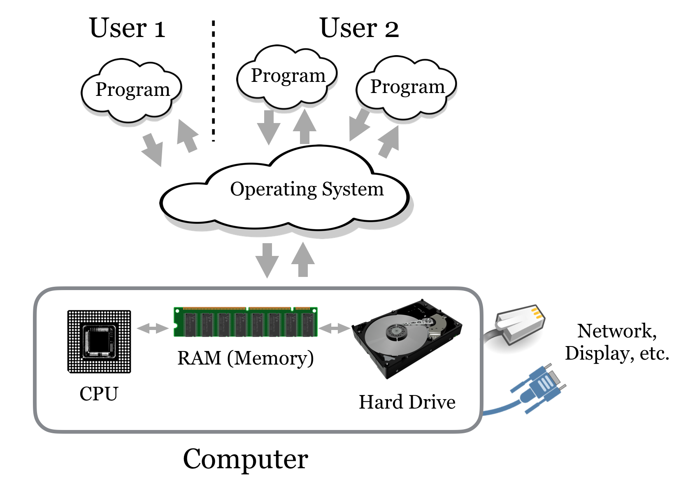

# (PART\*) Part 1: The UNIX/Linux Command-Line {-}

# Context

### Command Lines and Operating Systems {-}

Many operating systems, including Microsoft Windows and MacOS, include a command line interface (CLI) as well as the standard graphical user interface (GUI). In this book, we are interested mostly in command line interfaces included as part of an operating system derived from the historically natural environment for scientific computing, Unix, including the various Linux distributions (e.g., Ubuntu Linux and Red Hat Linux), BSD Unix, and MacOS.

Even so, an understanding of modern computer operating systems and how they interact with the hardware and other software is useful. An operating system is loosely taken to be the set of software that manages and allocates the underlying hardware—divvying up the amount of time each user or program may use on the central processing unit (CPU), for example, or saving one user’s secret files on the hard drive and protecting them from access by other users. When a user starts a program, that program is “owned” by the user in question. If a program wishes to interact with the hardware in any way (e.g., to read a file or display an image to the screen), it must funnel that request through the operating system, which will usually handle those requests such that no one program may monopolize the operating system’s attention or the hardware.

  

The figure above illustrates the four main “consumable” resources available to modern computers:

###### {- #hardware_defs} 
1. The CPU. Some computers have multiple CPUs, and some CPUs have multiple processing “cores.” Generally, if there are $n$ total cores and $k$ programs running, then each program may access up to $n/k$ processing power per unit time. The exception is when there are many processes (say, a few thousand); in this case, the operating system must spend a considerable amount of time just switching between the various programs, effectively reducing the amount of processing power available to all processes.
2. Hard drives or other “persistent storage.” Such drives can store ample amounts of data, but access is quite slow compared to the speed at which the CPU runs. Persistent storage is commonly made available through remote drives “mapped in” over the network, making access even slower (but perhaps providing much more space).

###### {- #swapping} 

3. RAM, or random access memory. Because hard drives are so slow, all data must be copied into the “working memory” RAM to be accessed by the CPU. RAM is much faster but also much more expensive (and hence usually provides less total storage). When RAM is filled up, many operating systems will resort to trying to use the hard drive as though it were RAM (known as “swapping” because data are constantly being swapped into and out of RAM). Because of the difference in speed, it may appear to the user as though the computer has crashed, when in reality it is merely working at a glacial pace.
4. The network connection, which provides access to the outside world. If multiple programs wish to access the network, they must share time on the connection, much like for the CPU.

Because the software interfaces we use every day — those that show us our desktop icons and allow us to start other programs — are so omnipresent, we often think of them as part of the operating system. Technically, however, these are programs that are run by the user (usually automatically at login or startup) and must make requests of the operating system, just like any other program. Operating systems such as Microsoft Windows and MacOS are in reality operating systems bundled with extensive suites of user software.

### A Brief History {-}

The complete history of the operating systems used by computational researchers is long and complex, but a brief summary and explanation of several commonly used terms and acronyms such as BSD, “open source,” and GNU may be of interest. (Impatient readers may at this point skip ahead, though some concepts in this subsection may aid in understanding the relationship between computer hardware and software.)

Foundational research into how the physical components that make up computing machinery should interact with users through software was performed as early as the 1950s and 1960s. In these decades, computers were rare, room-sized machines and were shared by large numbers of people. In the mid-1960s, researchers at Bell Labs (then owned by AT&T), the Massachusetts Institute of Technology, and General Electric developed a novel operating system known as Multics, short for Multiplexed Information and Computing Service. Multics introduced a number of important concepts, including advances in how files are organized and how resources are allocated to multiple users.

In the early 1970s, several engineers at Bell Labs were unhappy with the size and complexity of Multics, and they decided to reproduce most of the functionality in a slimmed-down version they called UNICS—this time short for Uniplexed Information and Computing Service—a play on the Multics name but not denoting a major difference in structure. As work progressed, the operating system was renamed Unix. Further developments allowed the software to be easily translated (or ported) for use on computer hardware of different types. These early versions of Multics and Unix also pioneered the automatic and simultaneous sharing of hardware resources (such as CPU time) between users, as well as protected files belonging to one user from others—important features when many researchers must share a single machine. (These same features allow us to multitask on modern desktop computers.)

During this time, AT&T and its subsidiary Bell Labs were prohibited by antitrust legislation from commercializing any projects not directly related to telephony. As such, the researchers licensed, free of cost, copies of the Unix software to any interested parties. The combination of a robust technology, easy portability, and free cost ensured that there were a large number of interested users, particularly in academia. Before long, many applications were written to operate on top of the Unix framework (many of which we’ll use in this book), representing a powerful computing environment even before the 1980s.

In the early 1980s, the antitrust lawsuit against AT&T was settled, and AT&T was free to commercialize Unix, which they did with what we can only presume was enthusiasm. Unsurprisingly, the new terms and costs were not favorable for the largely academic and research-focused user base of Unix, causing great concern for many so heavily invested in the technology.

Fortunately, a group of researchers at the University of California (UC), Berkeley, had been working on their own research with Unix for some time, slowly reengineering it from the inside out. By the end of AT&T’s antitrust suit, they had produced a project that looked and worked like AT&T’s Unix: BSD (for Berkeley Systems Distribution) Unix. BSD Unix was released under a new software license known as the BSD license: anyone was free to copy the software free of charge, use it, modify it, and redistribute it, so long as anything redistributed was also released under the same BSD license and credit was given to UC Berkeley (this last clause was later dropped). Modern versions of BSD Unix, while not used heavily in academia, are regarded as robust and secure operating systems, though they consequently often lack cutting-edge or experimental features.

In the same year that AT&T sought to commercialize Unix, computer scientist Richard Stallmann responded by founding the nonprofit Free Software Foundation (FSF), which was dedicated to the idea that software should be free of ownership, and that users should be free to use, copy, modify, and redistribute it. He also initiated the GNU operating system project, with the goal of re-creating the Unix environment under a license similar to that of BSD Unix. (GNU stands for GNU’s Not Unix: a recursive, self-referencing acronym exemplifying the peculiar humor of computer scientists.)

The GNU project implemented a licensing scheme that differed somewhat from the BSD license. GNU software was to be licensed under terms created specifically for the project, called the GPL, or GNU Public License. The GPL allows anyone to use the software in any way they see fit (including distributing for free or selling any program built using it), provided they also make available the human-readable code that they’ve created and license it under the GPL as well (the essence of “open source”^[Modern software is initially written using human-readable “source code,” then compiled into machine-readable software. Given source code, it is easy to produce software, but the reverse is not necessarily true. The distinctions between the BSD and GPL licenses are thus significant.]). It’s as if the Ford Motor Company gave away the blueprints for a new car, with the requirement that any car designed using those blueprints also come with its own blueprints and similar rules. For this reason, software written under the GPL has a natural tendency to spread and grow. Ironically and ingeniously, Richard Stallmann and the BSD group used the licensing system, generally intended to protect the spread of intellectual property and causing the Unix crisis of the 1980s, to ensure the perpetual freedom of their work (and with it, the Unix legacy).

While Stallmann and the FSF managed to re-create most of the software that made up the standard Unix environment (the bundled software), they did not immediately re-create the core of the operating system (also called the kernel). In 1991, computer science student Linus Torvalds began work on this core GPL-licensed component, which he named Linux (pronounced “lin-ucks,” as prescribed by the author himself). Many other developers quickly contributed to the project, and now Linux is available in a variety of “distributions,” such as Ubuntu Linux and Red Hat Linux, including both the Linux kernel and a collection of Unix-compatible GPL (and occasionally non-GPL) software. Linux distributions differ primarily in what software packages come bundled with the kernel and how these packages are installed and managed.

Today, a significant number of software projects are issued under the GPL, BSD, or similar “open” licenses. These include both the Python and R projects, as well as most of the other pieces of software covered in this book. In fact, the idea has caught on for noncode projects as well, with many documents (including this one) published under open licenses like Creative Commons, which allow others to use materials free of charge, provided certain provisions are followed.
