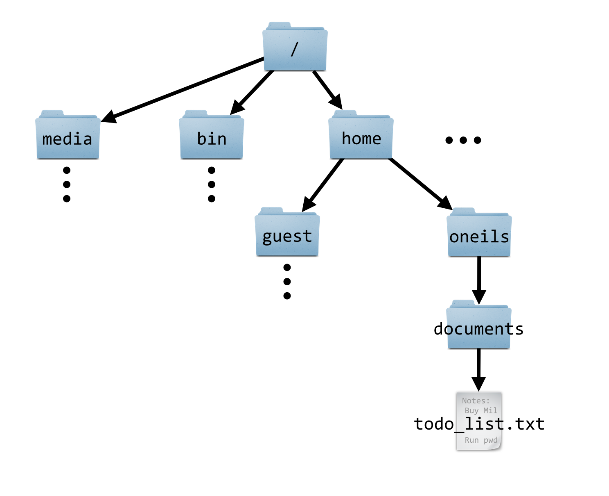

# The Command Line and Filesystem

Computer users are used to interacting with a “user interface.” On many computers, this interface displays the desktop or task bar, icons, file previews, and so on. It takes input from the user in the form of keystrokes, mouse movements, and in some cases voice commands, and presents the results of the user’s actions. Perhaps most importantly, the user interface is itself a *program* (it is software running on a computer, after all) we interact with to *execute other programs*.

###### {- #shell} 
###### {- #command_prompt} 
The same thing happens when we use SSH to log in to a remote machine, or open up the Terminal application on a Linux or OS X desktop. In this case, however, instead of interacting with a GUI (Graphical User Interface), we interact with a CLI (Command-Line Interface), or *shell*, which does the job of displaying the command prompt. The shell is the software we interact with on the command line. In some sense it is the command line, as it displays the command prompt, accepts input via typed text, runs other programs on our behalf, and displays the results textually. A *command prompt* is a line of status information provided in a text-based interface, indicating that commands are to be entered and run by pressing Enter. Command prompts often include information about what computer or network one is logged in to, the username one is logged in with, and an indication of the “present working directory” (discussed below).

The first command that we’ll learn for the Linux command line is `echo`, which prints the parameters we give it.

<pre id=part1-03-echo-example
     class="language-txt 
            line-numbers 
            linkable-line-numbers">
<code>
[oneils@mbp ~]$ <b>echo hello there</b>
hello there
</code></pre>

Let’s break down the command prompt and the program that we ran, which consisted of a program name and several parameters, separated by spaces. In the figure below, the command prompt consists of `oneils@mpb ~$`.

<pre id=part1-03-export-echo
     class="language-txt 
            line-numbers 
            linkable-line-numbers">
<code>
[oneils@mbp ~]$ <b>export GREETING='hello $USER'</b>
[oneils@mbp ~]$ <b>echo $GREETING</b>
hello $USER
[oneils@mbp ~]$ <b>export GREETING="hello $USER"</b>
[oneils@mbp ~]$ <b>echo $GREETING</b>
hello oneils
</code></pre>

###### {- #environment_variable}

The `echo` program might seem absurdly simple, as it just prints its parameters. But it is quite useful in practice and as a learning tool. For example, we can use `echo` to print not only simple strings, but also the contents of an *environment variable*, which is a variable bit of information (usually holding strings of text) that is accessible by the shell and other programs the user runs. Accessing the contents of an environment variable requires prefixing it with a `$`.

The shell (and other programs) commonly uses environment variables to store information about your login session, much like how, in a GUI interface, a "variable" remembers the wallpaper picture for the desktop. Environment variables control many aspects of the command-line environment, and so they are quite important. Many of these are set automatically when we log in. For example, `$USER`.

<pre id=part1-03-$USER
     class="language-txt 
            line-numbers 
            linkable-line-numbers">
<code>
[oneils@mbp ~]$ <b>echo $USER</b>
oneils
</code></pre>

### Setting Environment Variables, Dealing with Spaces {-}

Setting environment variables is something we’ll have to know how to do eventually, but learning now will give us an opportunity to discuss some of the finer points of how the shell interprets our commands. In `bash`, the most commonly used shell, setting environment variables is done with the `export` command, taking as the first parameter what the variable name should be (without the `$`) and what it should be set to.

<pre id=part1-03-export-greeting
     class="language-txt 
            line-numbers 
            linkable-line-numbers">
<code>
[oneils@mbp ~]$ <b>export GREETING=hello</b>
[oneils@mbp ~]$ <b>echo $GREETING</b>
hello
</code></pre>

Because `export` expects as its first parameter the variable description, we’ll get an odd result if we include a space in our greeting, as the shell uses spaces to separate parameters.

<pre id=part1-03-export-greeting-space
     class="language-txt 
            line-numbers 
            linkable-line-numbers">
<code>
[oneils@mbp ~]$ <b>export GREETING=hello everyone</b>
[oneils@mbp ~]$ <b>echo $GREETING</b>
hello
</code></pre>

In the above, `GREETING=hello` was taken to be first parameter, and the second, `everyone`, was ignored by the `export` command. There are at least two ways to get around this problem. The first is to prefix any character that the shell deems special (like spaces) with a backslash, or `\`, thereby “escaping” it so that it is ignored by the shell as a special character. Alternatively, we can wrap a string in quotation marks to have it treated literally by the shell.

<pre id=part1-03-export-greeting-excape
     class="language-txt 
            line-numbers 
            linkable-line-numbers">
<code>
[oneils@mbp ~]$ <b>export GREETING=hello\ everyone</b>
[oneils@mbp ~]$ <b>echo $GREETING</b>
hello everyone
[oneils@mbp ~]$ <b>export GREETING='hello everyone'</b>
[oneils@mbp ~]$ <b>echo $GREETING</b>
hello everyone
</code></pre>

The primary difference between using single and double quotation marks is whether variables inside the string are expanded to their contents or not.

<pre id=part1-03-export-quotes
     class="language-txt 
            line-numbers 
            linkable-line-numbers">
<code>
[oneils@mbp ~]$ <b>export GREETING='hello $USER'</b>
[oneils@mbp ~]$ <b>echo $GREETING</b>
hello $USER
[oneils@mbp ~]$ <b>export GREETING="hello $USER"</b>
[oneils@mbp ~]$ <b>echo $GREETING</b>
hello oneils
</code></pre>

Note that when setting an environment variable, we do not use the `$`. By convention, environment variable names contain only capital letters.^[There is another type of variable known as a "shell variable", which operates similar to environment variables. There are some differences: (1) by convention, these have lowercase names; (2) they are set differently, in `bash` by using `declare` instead of `export`; and (3) they are available only to the shell, not other programs that you might run. The distinction between these two types can cause headaches on occasion, but it isn’t crucial enough to worry about now.] Further, this expansion (from environment variables to their contents) is done by the shell; the command itself is changed from `export GREETING="hello $USER"` to `export GREETING="hello oneils"`.

### Alternative Shells {-}

There is a special environment variable, `$0`, that generally holds the name of the currently running program. In the case of our interaction with the command line, this would be the name of the interface program itself, or shell.

<pre id=part1-03-$0
     class="language-txt 
            line-numbers 
            linkable-line-numbers">
<code>
[oneils@mbp ~]$ <b>echo $0</b>
-bash
</code></pre>

The above command illustrates that we are running `bash`, the most commonly used shell.^[Because `$0` holds the name of the currently running program, one might expect `echo $0` to result in `echo` being reported, but this isn’t the case. As mentioned previously, the shell replaces the environment variables with their contents *before* the command is executed.]

Depending on the system you are logged in to, running `echo $0` may not report `bash`. The reason is (although it may seem odd) that there are a variety of shells available, owing to the long history of Unix and Linux. In the beginning, the interfaces were quite simple, but over time better interfaces/shells were developed that included new features (consider how the "Start" menu has changed over the years on Microsoft Windows versions). We can run a different shell, if it is installed, by simply running it like any other program. The `tcsh` shell, itself an outgrowth of the `csh` shell, is sometimes the default instead of `bash`. (Both `csh` and `tcsh` are older than `bash`.)

<pre id=part1-03-tcsh
     class="language-txt 
            line-numbers 
            linkable-line-numbers">
<code>
[oneils@mbp ~]$ <b>tcsh</b>
172:~> <b>echo $0</b>
tcsh
</code></pre>

When running `tcsh`, the `setenv` command takes the place of `export`, and the syntax is slightly different.

<pre id=part1-03-tcsh-setenv
     class="language-txt 
            line-numbers 
            linkable-line-numbers">
<code>
172:~> <b>setenv GREETING "hello $USER"</b>
172:~> <b>echo $GREETING</b>
hello oneils
</code></pre>

Although `bash` and similar shells like `dash` and `zsh` are most commonly found (and recommended), you might find yourself needing to use a shell like `csh` or its successor, `tcsh`. In this book, the assumption is that you are using `bash`, but when different commands would be needed to accomplish the same thing in the older `tcsh` or `csh`, a footnote will explain.

To get back to `bash` from `tcsh`, a simple `exit` will suffice.

<pre id=part1-03-tcsh-exit
     class="language-txt 
            line-numbers 
            linkable-line-numbers">
<code>
172:~> <b>exit</b>
exit
[oneils@mbp ~]$ <b>echo $0</b>
-bash
</code></pre>

In general, it can be difficult to determine which shell is running on the basis of the look of the command prompt; using `echo $0` right on the command line is the most reliable way.

### Files, Directories, and Paths {-}

With some of the more difficult concepts of the shell out of the way, let’s turn to something a bit more practical: understanding how directories (also known as folders) and files are organized.

###### {- #root}

Most filesystems are hierarchical, with files and directories stored inside other directories. In Unix-like operating systems, the “top level” directory in which everything can be found is known as `/` (a forward slash). This top-level directory is sometimes called the *root* of the filesystem, as in the root of the filesystem tree. Within the root directory, there are commonly directories with names like `bin`, `etc`, `media`, and `home`; the last of these is often where users will store their own individual data.^[Computer scientists and mathematicians usually draw trees upside down. One theory is that trees are easier to draw upside down when working on a blackboard, the traditional (and still considered by many the best) medium of exposition for those fields. Our language reflects this thinking: when we move a file, we move it “down” into a subdirectory, or “up” into a directory “above” the current one.]

  

###### {- #absolute_path}

Each file and directory in the filesystem can be uniquely identified by its *absolute path*, a unique locator for a file or directory in the filesystem, starting with the root folder `/` and listing each directory on the way to the file. In the figure above, the absolute path to the `todo_list.txt` file is `/home/oneils/documents/todo_list.txt`.

Note that an absolute path must start with the leading forward slash, indicating that the path starts at the root folder `/`, and contain a valid path of folder names from there. (If you prefer to consider `/` as a folder name itself, an absolute path can also be specified like `//home/oneils/documents/todo_list.txt`, though using two forward slashes is considered redundant.)

###### {- #home_directory}

Every user normally has a *home directory*, serving as a personal storage locker for files and directories. (Often the amount of space available this location is not as much as users would like.) The shell and other programs can find out the absolute path to your home directory via the environment variable `$HOME`; try running `echo $HOME` to see the absolute path to your own home directory.

What about special devices like CD-ROM drives and network drives? On a Windows operating system, these would get their own “root” directory with names like `D:` and `E:` (with the main hard drive usually having the name `C:`). On Unix-based operating systems, there is only ever one filesystem hierarchy, and the top level is always `/`. Special devices like CD-ROM drives and network drives are mounted somewhere in the filesystem. It may be that the directory `/media` remains empty, for example, but when a CD-ROM is inserted, a new directory may appear inside that directory, perhaps with the absolute path `/media/cdrom0`, and the files on the CD-ROM will appear in that location.

Determining how and where such devices are mounted is the job of the system administrator. On OS X machines, inserted devices appear in `/Volumes`. If you are logged in to a large computational infrastructure, your home directory likely isn’t located on the internal hard drive of the remote computer, but rather mounted from a network drive present on yet another remote computer. This configuration allows users to “see” the same filesystem hierarchy and files no matter which remote computer they happen to log in to, if more than one is available. (For example, even `/home` might be a network mount, and so all users’ home directories might be available on a number of machines.)

### Getting around the Filesystem {-}

###### {- #present_working_directory}

It is vitally important to understand that, as we are working in the command-line environment, we always have a “place”, a directory (or folder) in which we are working called the *present working directory*, or PWD. The shell keeps track of the present working directory in an environment variable, `$PWD`.

When you first log in, your present working directory is set to your home directory; `echo $PWD` and `echo $HOME` will likely display the same result. There is also a dedicated program for displaying the present working directory, called `pwd`.

<pre id=part1-03-pwd
     class="language-txt 
            line-numbers 
            linkable-line-numbers">
<code>
[oneils@mbp ~]$ <b>echo $HOME</b>
/home/oneils
[oneils@mbp ~]$ <b>echo $PWD</b>
/home/oneils
[oneils@mbp ~]$ <b>pwd</b>
/home/oneils
</code></pre>

We can list the files and directories that are stored in the present working directory by using the `ls` command.

<pre id=part1-03-ls
     class="language-txt 
            line-numbers 
            linkable-line-numbers">
<code>
[oneils@mbp ~]$ <b>ls</b>
apcb     Documents  Music     Public     todo_list.txt
Desktop  Downloads  Pictures  Templates  Videos
</code></pre>

This command reveals that I have a number of directories in my home directory (`/home/oneils`) with names like `Music` and `Pictures` (helpfully colored blue) and a file called `todo_list.txt`.

We can change the present working directory—that is, move to another directory—by using the `cd` command, giving it the path that we’d like to move to.

<pre id=part1-03-pwd
     class="language-txt 
            line-numbers 
            linkable-line-numbers">
<code>
[oneils@mbp ~]$ <b>cd /home</b>
[oneils@mbp /home]$ <b>echo $PWD</b>
/home
[oneils@mbp /home]$ <b>ls</b>
lost+found    oneils
</code></pre>

###### {- #tilda}

Notice that the command prompt has changed to illustrate the present working directory: now it shows `oneils@mpb /home$`, indicating that I am in `/home`. This is a helpful reminder of where I am in the filesystem as I work. Previously, it showed only `~`, which is actually a shortcut for `$HOME`, itself a shortcut for the absolute path to my home directory. Consequently, there are a number of ways to go back to my home directory: `cd /home/oneils`, or `cd $HOME`, or `cd ~`, or even just `cd` with no arguments, which defaults to moving to `$HOME`.

<pre id=part1-03-home
     class="language-txt 
            line-numbers 
            linkable-line-numbers">
<code>
[oneils@mbp /home]$ <b>cd $HOME</b>
[oneils@mbp ~]$ <b>pwd</b>
/home/oneils
</code></pre>

### Relative Paths, Hidden Files, and Directories {-}

###### {- #relative_path}

It isn’t always necessary to specify the full, absolute path to locate a file or directory; rather, we can use a *relative path*. A relative path locates a file or directory *relative* to the present working directory. If the present working directory is `/home/oneils`, for example, a file located at the absolute path `/home/oneils/Pictures/profile.jpg` would have relative path P`ictures/profile.jpg`. For the file `/home/oneils/todo_list.txt`, the relative path is just `todo_list.txt`. If the present working directory was `/home`, on the other hand, the relative paths would be `oneils/Pictures/profile.jpg` and `oneils/todo_list.txt`.

Because relative paths are always relative to the present working directory (rather than the root directory `/`), they *cannot* start with a forward slash, whereas absolute paths *must* start with a leading forward slash. This distinction occasionally confuses new users.

We can use the `cd` command with relative paths as well, and this is most commonly done for directories present in the current working directory, as reported by `ls`. In fact, both relative and absolute paths are allowed wherever a file or directory needs to be specified.

<pre id=part1-03-ls-paths
     class="language-txt 
            line-numbers 
            linkable-line-numbers">
<code>
[oneils@mbp ~]$ <b>ls</b>
apcb      Documents   Music     Public      todo_list.txt
Desktop   Downloads   Pictures  Templates   Videos
[oneils@mbp ~]$ <b>cd Pictures</b>
[oneils@mbp ~/Pictures]$ <b>ls</b>
profile.jpg
</code></pre>

A few notes about moving around directories: (1) Unix-like operating systems are nearly always case sensitive, for commands, parameters, and file and directory names. (2) Because of the way spaces are treated on the command line, it is uncommon to see spaces in file or directory names. The command `cd mydocuments` is much easier to type than `cd my\ documents` or `cd 'my documents'`. (3) If you forget to specify `cd` before specifying a path, a cryptic `permission denied` error will occur, rather than an error specific to the lack of `cd` command.

###### {- #hidden}

By default, when running the `ls` program to list the contents of the present working directory, all files and directories that start with a `.` are *hidden*. To see everything including the hidden files, we can add the `-a` flag to `ls`.

<pre id=part1-03-ls-a
     class="language-txt 
            line-numbers 
            linkable-line-numbers">
<code>
[oneils@mbp ~/Pictures]$ <b>cd $HOME</b>
[oneils@mbp ~]$ <b>ls -a</b>
.             .config     .gstreamer-0.10   .profile      .vim
..            .dbus       .gvfs             Public        .viminfo
apcb          Desktop     .ICEauthority     .pulse        .vimrc
.bash_history Documents   .local            .pulse-cookie .vnc
.bash_login   Downloads   Music             .ssh     .Xauthority
.bash_logout  .gconf      .netrc            Templates             .Xdefaults
.bashrc       .gnome2      Pictures         Todo_list.txt        .xscreensaver
.cache        .gnupg      .pip              Videos                .xsession-errors
</code></pre>

It turns out there are quite a few hidden files here! Many of those starting with a `.`, like `.bash_login`, are actually configuration files used by various programs. We’ll spend some time with those in later chapters.

On the topic of `ls`, there are many additional parameters we can give to `ls`: include `-l` to show “long” file information including file sizes, and `-h` to make those file sizes “human readable” (e.g., 4K versus 4,196 bytes). For `ls`, we can specify this combination of options as `ls -l -a -h` (where the parameters may be given in any order), or with a single parameter as `ls -lah`, though not all utilities provide this flexibility.

<pre id=part1-03-ls-lah
     class="language-txt 
            line-numbers 
            linkable-line-numbers">
<code>
[oneils@mbp ~]$ <b>ls -lah</b>
total 168K
drwxr-xr-x  25  oneils  iplant-everyone 4.0K  Sep 23 22:40 .
drwxr-xr-x   4  root    root            4.0K  Sep 15 09:48 ..
drwxr-xr-x   4  oneils  iplant-everyone 4.0K  Sep 15 11:19 apcb
-rw-------   1  root    root            2.2K  Sep 15 10:49 .bash_history
-rw-r--r--   1  oneils  iplant-everyone   61  Sep 16 19:46 .bash_login
-rw-r--r--   1  oneils  iplant-everyone  220  Apr  3  2012 .bash_logout
-rw-r--r--   1  oneils  iplant-everyone 3.6K  Sep 15 09:48 .bashrc
drwx------   7  oneils  iplant-everyone 4.0K  Sep 15 09:52 .cache
</code></pre>

Some of these columns of information are describing the permissions associated with the various files and directories; we’ll look at the permissions scheme in detail in later chapters.

  

###### {- #dot}
###### {- #dot_dot}

When using `ls -a`, we see two “special” directories: `.` and `..` are their names. These directories don’t really exist per se but are instead shortcuts that refer to special locations relative to the directory they are contained in. The `.` directory is a shortcut for the same directory it is contained in. Colloquially, it means “here.” The `..` directory is a shortcut for the directory *above* the directory containing it. Colloquially, it means “up.”

Every directory has these “virtual” links, and they can be used as relative paths themselves or in relative or absolute paths. Here, for example, we can `cd .` to stay where we are, or `cd ..` to go up one directory:

<pre id=part1-03-cd
     class="language-txt 
            line-numbers 
            linkable-line-numbers">
<code>
[oneils@mbp ~]$ <b>echo $PWD</b>
/home/oneils
[oneils@mbp ~]$ <b>cd .</b>
[oneils@mbp ~]$ <b>echo $PWD</b>
/home/oneils
[oneils@mbp ~]$ <b>cd ..</b>
[oneils@mbp /home]$ <b>echo $PWD</b>
/home
</code></pre>

If we like, we can go up two directories with `cd ../..`:

<pre id=part1-03-cd..
     class="language-txt 
            line-numbers 
            linkable-line-numbers">
<code>
[oneils@mbp /home]$ <b>cd $HOME</b>
[oneils@mbp ~]$ <b>echo $PWD</b>
/home/oneils
[oneils@mbp ~]$ <b>cd ../..</b>
[oneils@mbp /$ <b>echo $PWD</b>
/
</code></pre>

We can even use `.` and `..` in longer relative or absolute paths (number 2 in the figure below illustrates the relatively odd path of `/media/./cdrom0`, which is identical to `/media/cdrom0`).

  

#### Exercises {-}

1. Practice moving about the filesystem with `cd` and listing directory contents with `ls`, including navigating by relative path, absolute path, `.` and `..`. Use `echo $PWD` and `pwd` frequently to list your present working directory. Practice navigating home with `cd ~`, `cd $HOME`, and just `cd` with no arguments. You might find it useful to draw a “map” of the filesystem, or at least the portions relevant to you, on a piece of paper.

2. Without explicitly typing your username, create another environment variable called `$CHECKCASH`, such that when `echo $CHECKCASH` is run, a string like `oneils has $20` is printed (except that `oneils` would be your username and should be set by reading from `$USER`).

3. The directory `/etc` is where many configuration files are stored. Try navigating there (using `cd`) using an absolute path. Next, go back home with `cd $HOME` and try navigating there using a relative path.

4. What happens if you are in the top-level directory `/` and you run `cd ..`?

5. Users’ home directories are normally located in `/home`. Is this the case for you? Are there any other home directories belonging to other users that you can find, and if so, can you `cd` to them and run `ls`?

