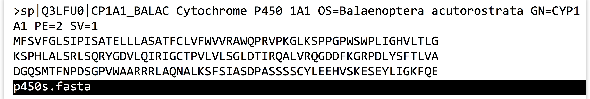

# Working with Files and Directories

Now that we know how to locate files and directories in the filesystem, let’s learn a handful of important tools for working with them and the system in general.

### Viewing the Contents of a (Text) File {-}

Although there are many tools to view and edit text files, one of the most efficient for viewing them is called `less`, which takes as a parameter a path to the file to view, which of course may just be a file name in the present working directory (which is a type of relative path).^[There is a similar program called `more`, originally designed to show “more” of a file. The `less` program was developed as a more full-featured alternative to `more`, and was so named because “less is more.”]

<pre id=part1-04-ls
     class="language-txt 
            line-numbers 
            linkable-line-numbers">
<code>
[oneils@mbp ~]$ <b>ls</b>
apcb    Documents Music       Pictures Templates  Videos
Desktop Downloads p450s.fasta Public   todo_list.txt
</code></pre>

The invocation of `less` on the file [`p450s.fasta`](data/p450s.fasta) opens an “interactive window” within the terminal window, wherein we can scroll up and down (and left and right) in the file with the arrow keys. (As usual, the mouse is not very useful on the command line.) We can also search for a pattern by typing `/` and then typing the pattern before pressing Enter.

  

When finished with `less`, pressing `q` will exit and return control to the shell or command line. Many of the text formats used in computational biology include long lines; by default, `less` will wrap these lines around the terminal so they can be viewed in their entirety. Using `less -S` will turn off this line wrapping, allowing us to view the file without any reformatting. Here’s what the file above looks like when viewed with `less -S p450s.fasta`:

  

Notice that the first long line has not been wrapped, though we can still use the arrow keys to scroll left or right to see the remainder of this line.

### Creating New Directories {-}

The `mkdir` command creates a new directory (unless a file or directory of the same name already exists), and takes as a parameter the path to the directory to create. This is usually a simple file name as a [relative path](#relative_path) inside the present working directory.

<pre id=part1-04-mkdir
     class="language-txt 
            line-numbers 
            linkable-line-numbers">
<code>
[oneils@mbp ~]$ <b>ls</b>
apcb    Documents Music       Pictures Templates  Videos
Desktop Downloads p450s.fasta Public   todo_list.txt
[oneils@mbp ~]$ <b>mkdir projects</b>
[oneils@mbp ~]$ <b>ls</b>
apcb    Documents Music       Pictures  Public    todo_list.txt
Desktop Downloads p450s.fasta projects  Templates Videos
</code></pre>

### Move or Rename a File or Directory {-}

The `mv` utility serves to both move and rename files and directories. The simplest usage works like `mv <source_path> <destination_path>`, where `<source_path>` is the path (absolute or relative) of the file/directory to rename, and `<destination_path>` is the new name or location to give it.

In this example, we’ll rename `p450s.fasta` to `p450s.fa`, move it into the `projects` folder, and then rename the `projects` folder to `projects_dir`.

<pre id=part1-04-mv
     class="language-txt 
            line-numbers 
            linkable-line-numbers">
<code>
[oneils@mbp ~]$ <b>mv p450s.fasta p450s.fa</b>
[oneils@mbp ~]$ <b>mv p450s.fa projects</b>
[oneils@mbp ~]$ <b>mv projects projects_dir</b>
[oneils@mbp ~]$ <b>ls</b>
apcb    Documents Music    projects_dir Templates     Videos
Desktop Downloads Pictures Public       todo_list.txt
</code></pre>

Because `mv` serves a dual role, the semantics are important to remember:

  - If `<destination_path>` doesn’t exist, it is created (so long as all of the containing folders exist).
  - If `<destination_path>` does exist:
    - If `<destination_path>` is a directory, the source is moved inside of that location.
    - If `<destination_path>` is a file, that file is overwritten with the source.

Said another way, `mv` attempts to guess what it should do, on the basis of whether the destination already exists. Let’s quickly undo the moves above:

<pre id=part1-04-mv-dir
     class="language-txt 
            line-numbers 
            linkable-line-numbers">
<code>
[oneils@mbp ~]$ <b>mv projects_dir/p450s.fa p450s.fasta</b>
[oneils@mbp ~]$ <b>mv projects_dir/ projects</b>
</code></pre>

A few other notes: First, when specifying a path that is a directory, the trailing `/` is optional: `mv projects_dir/ projects` is the same as `mv projects_dir projects` if `projects_dir` is a directory (similarly, `projects` could have been specified as `projects/`). Second, it is possible to move multiple files into the same directory, for example, with `mv p450s.fasta todo_list.txt projects`. Third, it is quite common to see [`.`](#dot) referring to the present working directory as the destination, as in `mv ../file.txt .` for example, which would move `file.txt` from the directory *above* the present working directory ([`..`](#dot_dot)) *into* the present working directory (`.`, or “here”).

### Copy a File or Directory {-}

Copying files and directories is similar to moving them, except that the original is not removed as part of the operation. The command for copying is `cp`, and the syntax is `cp <source_path> <destination_path>`. There is one caveat, however: `cp` will not copy an entire directory and all of its contents unless you add the `-r` flag to the command to indicate the operation should be recursive.

<pre id=part1-04-cp
     class="language-txt 
            line-numbers 
            linkable-line-numbers">
<code>
[oneils@mbp ~]$ <b>cp todo_list.txt todo_copy.txt</b>
[oneils@mbp ~]$ <b>cp -r projects projects_dir_copy</b>
</code></pre>

Forgetting the `-r` when attempting to copy a directory results in an `omitting directory` warning.

It is possible to simultaneously copy and move (and remove, etc.) many files by specifying multiple sources. For example, instead of `cp ../todo_list.txt .`, we could have copied both the to-do list and the `p450s.fasta` file with the same command:

<pre id=part1-04-cp-mult-files
     class="language-txt 
            line-numbers 
            linkable-line-numbers">
<code>
[oneils@mbp ~/projects]$ <b>cp ../todo_list.txt ../p450s.fasta .</b>
</code></pre>

### Remove (Delete) a File or Directory {-}

Files may be deleted with the `rm` command, as in `rm <target_file>`. If you wish to remove an entire directory and everything inside, you need to specify the `-r` flag for recursive, as in `rm -r <target_dir>`. Depending on the configuration of your system, you may be asked “are you sure?” for each file, to which you can reply with a y. To avoid this checking, you can also specify the `-f` (force) flag, as in `rm -r -f <target_dir>` or `rm -rf <target_dir>`. Let’s create a temporary directory alongside the file copies from above, inside the `projects` folder, and then remove the `p450s.fasta` file and the `todo_list.txt` file as well as the temporary folder.

<pre id=part1-04-rm
     class="language-txt 
            line-numbers 
            linkable-line-numbers">
<code>
[oneils@mbp ~/projects]$ <b>mkdir tempdir</b>
[oneils@mbp ~/projects]$ <b>ls</b>
p450s.fasta   tempdir   todo_list.txt
[oneils@mbp ~/projects]$ <b>rm todo_list.txt</b>
[oneils@mbp ~/projects]$ <b>rm -rf tempdir</b>
[oneils@mbp ~/projects]$ <b>ls</b>
p450s.fasta
</code></pre>

Beware! *Deleted files are gone forever*. There is no undo, and there is no recycle bin. Whenever you use the `rm` command, double-check your syntax. There’s a world of difference between `rm -rf project_copy` (which deletes the folder project_copy) and `rm -rf project _copy` (which removes the folders `project` and `_copy`, if they exist). If you're nervous about using `rm`, consider utilizing the `-i` option, which will ask for confirmation before removing each file.

### Checking the Size of a File or Directory {-}

Although `ls -lh` can show the sizes of files, this command will not summarize how much disk space a directory and all of its contents take up. To find out this information, there is the `du` (disk usage) command, which is almost always combined with the `-s` (summarize) and `-h` (show sizes in human-readable format) options.

<pre id=part1-04-du
     class="language-txt 
            line-numbers 
            linkable-line-numbers">
<code>
[oneils@mbp ~/projects]$ <b>cd $HOME</b>
[oneils@mbp ~/]$ <b>ls</b>
apcb    Documents Music       Pictures  Public    todo_list.txt
Desktop Downloads p450s.fasta projects  Templates Videos
[oneils@mbp ~/]$ <b>du -sh p450s.fastq</b>
16K  p450s.fasta
[oneils@mbp ~/]$ <b>du -sh projects</b>
4.0K  projects/
[oneils@mbp ~/]$ <b>du -sh .</b>
11M  .
</code></pre>

As always, `.` is a handy target, here helping to determine the file space used by the present working directory.

### Editing a (Text) File {-}

There is no shortage of command-line text editors, and while some of them—like `vi` and `emacs`—are powerful and can enhance productivity in the long run, they also take a reasonable amount of time to become familiar with. (Entire books have been written about each of these editors.)

In the meantime, a simple text editor available on most systems is `nano`; to run it, we simply specify a file name to edit:

<pre id=part1-04-nano
     class="language-txt 
            line-numbers 
            linkable-line-numbers">
<code>
[oneils@mbp ~/]$ <b>nano todo_list.txt</b>
</code></pre>

If the file doesn’t exist already, it will be created when it is first saved, or “written out.” The `nano` editor opens up an interactive window much like `less`, but the file contents can be changed. When done, the key sequence `Control-o` will save the current edits to the file specified (you’ll have to press Enter to confirm), and then `Control-x` will exit and return control to the command prompt. This information is even presented in a small help menu at the bottom.

  

Although `nano` is not as sophisticated as `vi` or `emacs`, it does support a number of features, including editing multiple files, cut/copy/paste, find and replace by pattern, and syntax highlighting of code files.

Code files are the types of files that we will usually want to edit with `nano`, rather than essays or short stories. By default, on most systems, `nano` automatically “wraps” long lines (i.e., automatically presses Enter) if they would be longer than the screen width. Unfortunately, this feature would cause an error for most lines of code! To disable it, `nano` can be started with the `-w` flag, as in `nano -w todo_list.txt`.

### Command-Line Efficiency {-}

While the shell provides a powerful interface for computing, it is certainly true that the heavy reliance on typing can be tedious and prone to errors. Fortunately, most shells provide a number of features that dramatically reduce the amount of typing needed.

First, wildcard characters like `*` (which matches any number of arbitrary characters) and `?` (which matches any single arbitrary character) allow us to refer to a group of files. Suppose we want to move three files ending in `.temp` into a `temp` directory. We could run `mv` listing the files individually:

<pre id=part1-04-mv-individually
     class="language-txt 
            line-numbers 
            linkable-line-numbers">
<code>
[oneils@mbp ~/apcb/intro]$ <b>ls</b>
fileAA.temp fileA.temp  fileB.temp  temp
[oneils@mbp ~/apcb/intro]$ <b>mv fileAA.temp fileA.temp fileB.temp temp/</b>
</code></pre>

Alternatively, we could use `mv file*.temp temp`; the shell will expand `file*.temp` into the list of files specified above *before* passing the expanded list to `mv`.^[This is important to consider when combining `rm` with wildcards; the commands `rm -rf *.temp` and `rm -rf * .temp` are very different! The latter will remove all files in the present directory, while the former will only remove those ending in `.temp`.]

<pre id=part1-04-mv-wildcard
     class="language-txt 
            line-numbers 
            linkable-line-numbers">
<code>
[oneils@mbp ~/apcb/intro]$ <b>ls</b>
fileAA.temp fileA.temp  fileB.temp  temp
[oneils@mbp ~/apcb/intro]$ <b>mv file*.temp temp/</b>
</code></pre>

Similarly, we could move only `fileA.temp` and `fileB.temp` (but not `fileAA.temp`) using `mv file?.tmp temp`, because the `?` wildcard will only match one of any character. These wildcards may be used anywhere in an absolute or relative path, and more than one may be used in a single path. For example, `ls /home/*/*.txt` will inspect all files ending in `.txt` in all users’ home directories (if they are accessible for reading).

Second, if you want to rerun a command, or run a command similar to a previously run command, you can access the command history by pressing the up arrow. Once you’ve identified which command you want to run or modify, you can modify it using the left and right arrows, backspace or delete, and then typing and pressing Enter again when you are ready to execute the modified command. (You don’t even need to have the cursor at the end of the line to press Enter and execute the command.) For a given login session, you can see part of your command history by running the `history` command.

Finally, one of the best ways to navigate the shell and the filesystem is by using *tab completion*. When typing a path (either absolute or relative), file or directory name, or even a program name, you can press Tab, and the shell will autocomplete the portion of the path or command, up until the autocompletion becomes ambiguous. When the options are ambiguous, the shell will present you with the various matching options so that you can inspect them and keep typing. (If you want to see all options even if you haven’t started typing the next part of a path, you can quickly hit Tab twice.) You can hit Tab as many times as you like while entering a command. Expert command-line users use the Tab key many times a minute!

### Getting Help on a Command or Program {-}

Although we’ve discussed a few of the options(also known as arguments, or flags) for programs like `ls`, `cp`, `nano`, and others, there are many more you might wish to learn about. Most of these basic commands come with “man pages,” short for “manual pages,” that can be accessed with the `man` command.

<pre id=part1-04-man-ls
     class="language-txt 
            line-numbers 
            linkable-line-numbers">
<code>
[oneils@mbp ~]$ <b>man ls</b>
</code></pre>

This command opens up a help page for the command in question (usually in `less` or a program similar to it), showing the various parameters and flags and what they do, as well as a variety of other information such as related commands and examples. For some commands, there are also “info” pages; try running `info ls` to read a more complete overview of `ls`. Either way, as in less, pressing `q` will exit the help page and return you to the command prompt.

### Viewing the Top Running Programs {-}

The `top` utility is invaluable for checking what programs are consuming resources on a machine; it shows in an interactive window the various processes (running programs) sorted by the percentage of [CPU](#hardware_defs) time they are consuming, as well as which user is running them and how much [RAM](#hardware_defs) they are consuming. Running `top` produces a window like this:

  

From a users’ perspective, the list of processes below the dark line is most useful. In this example, no processes are currently using a significant amount of CPU or memory (and those processes that are running are owned by the administrator `root`). But if any user were running processes that required more than a tiny bit of CPU, they would likely be shown. To instead sort by RAM usage, use the key sequence `Control-M`. When finished, `q` will quit `top` and return you to the command prompt.

Of particular importance are the `%CPU` and `%MEM` columns. The first may vary from 0 up to 100 (percent) *times the number* of CPU cores on the system; thus a value of 3200 would indicate a program using 100% of 32 CPU cores (or perhaps 50% of 64 cores). The `%MEM` column ranges from 0 to 100 (percent). It is generally a bad thing for the system when the total memory used by all process is near or over 100%—this indicates that the system doesn’t have enough “working memory” and it may be attempting to use the much slower hard drive as working memory. This situation is known as [swapping](#swapping), and the computer may run so slowly as to have effectively crashed.

### Killing Rogue Programs {-}

It sometimes happens that programs that should run quickly, don’t. Perhaps they are in an internal error state, looping forever, or perhaps the data analysis task you had estimated to take a minute or two is taking much longer. Until the program ends, the command prompt will be inaccessible.

There are two ways to stop such running programs: the “soft” way and the “hard” way. The soft way consists of attempting to run the key combination `Control-c`, which sends a stop signal to the running process so that it should end.

But if the rogue program is in a particularly bad error state, it won’t stop even with a `Control-c`, and a “hard” kill is necessary. To do this requires logging in to the same machine with another terminal window to regain some command-line access. Run `top`, and note the `PID` (process ID) of the offending process. If you don’t see it in the `top` window, you can also try running `ps augx`, which prints a table of all running processes. Suppose the PID for the process to kill is `24516`; killing this process can be done by running `kill -9 24156`. The `-9` option specifies that the operating system should stop the process in its tracks and immediately clean up any resources used by it. Processes that don’t stop via a `kill -9` are rare (though you can’t kill a process being run by another user), and likely require either a machine reboot or administrator intervention.

#### Exercises {-}
1. Create the following directories inside your home directory, if you don’t already have them: `downloads`, `local`, and `projects`. Inside of `local`, create a directory called `bin`. These folders are a common and useful set to have in your home directory—we’ll be using them in future chapters to work in, download files to, and install software to.
2. Open not one but *two* login windows, and log in to a remote machine in each. This gives you two present working directories, one in each window. You can use one to work, and another to make notes, edit files, or watch the output of `top`.

Create a hidden directory inside of your home directory called `.hidden`. Inside of this directory, create a file called `notes`. Edit the file to contain tricks and information you fear you might forget.^[You might also consider keeping a paper notebook, or something in a Wiki or other text document. If you prefer to keep digital notes, try to use a simple text editor like `nano`, TextEdit on OS X, or Notepad on Windows. Rich-text editors like Microsoft Word will often automatically replace things like simple quote characters with serif quotes, which don’t work on the command line, leading to headaches.]
3. Spend a few minutes just practicing tab completion while moving around the filesystem using absolute and relative paths. Getting around efficiently via tab-completion is a surprisingly necessary skill.
4. Skim the man page for `ls`, and try out a few of the options listed there. Read a bit of the `info` page for `nano`.

