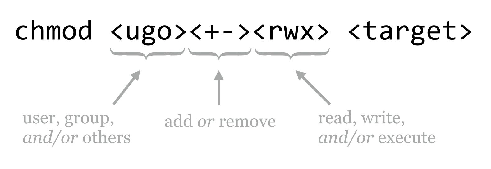
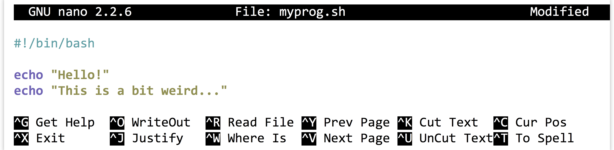

# Permissions and Executables

As mentioned previously, the administrator `root` configures most things on the system, like where network drives are mounted and how access to the system is granted.^[The administrator, or `root` user, is sometimes also called the “superuser.” This has been known to go to some administrators’ heads.] Most of the files that are important for these configurations are “owned” by root, and for security purposes, other users can’t tamper with them. In fact, all users of the system usually own the files in their own home directory, and these files can’t be tampered with by other users (except for root, who has access to everything). These security settings are controlled via *permissions* associated with every file and directory.

Root can also put users together into *groups*, allowing users in the same group to share files with each other but not outsiders, if they so choose. Groups may have more than one user, and a single user may be part of more than one group, as in the following example illustrating three groups and eight users.

  

The `groups` command shows the groups to which a user belongs; in the above example, `groups oneilst` would report `emrichlab` and `hellmannlab`. To see your own groups, you can always use something like `groups $USER` (relying on the shell to replace `$USER` with your username).

Unfortunately, there’s no surefire or easy way to list all the members of a particular group—at least not without some deep knowledge of how the system is configured or some programming expertise. On some systems, a command like `getent group <groupname>` will provide the answer; `getent group faculty` would report `emrichs`, `schmidtj`, and `hellmannj` for the example above.

If you are unsure of a person’s username, the `finger` command may come to the rescue. You can supply `finger` with either a first name or last name to search for (or even the username, if known), and it will return information—if entered by the system administrator—about that user.

<pre id=part1-05-finger
     class="language-txt 
            line-numbers 
            linkable-line-numbers">
<code>
[oneils@mbp ~]$ <b>finger Shawn</b>
Login: oneils           Name: Shawn O'neil
Directory: /home/oneils     Shell: /bin/bash
On since Mon Oct 20 16:52 (MST) on pts/0 from 8-169.ptpg.oregonstate.edu
No mail.
No Plan.
</code></pre>

Each file and directory is associated with one user (the owner) and one group; unfortunately, in normal Unix-like permissions, one and only one group may be associated with a file or directory. Each file and directory also has associated with it permissions describing:

  1. what the owner can do,
  2. what members of the group can do, and
  3. what everyone else (others) can do.

This information is displayed when running `ls -l`, and is represented by a combination of `r` (read), `w` (write), and `x` (execute). Where one of these three is absent, it is replaced by a `-`. Here’s an example, showing two entries owned by `oneils` and in the `iplant-everyone` group; one has permissions `rwxrwxrwx` (an insecure permission set, allowing anyone to do anything with the file), and the other has `rwxr-xr-x` (a much more reasonable permission set).

<pre id=part1-05-permissions
     class="language-txt 
            line-numbers 
            linkable-line-numbers">
<code>
[oneils@mbp ~/apcb/intro]$ <b>ls -l</b>
total 20
-rwxrwxrwx  1   oneils  iplant-everyone 15891 Oct 20  17:42 p450s.fasta
drwxr-xr-x  2   oneils  iplant-everyone  4086 Oct 20  17:40 temp
</code></pre>

There is an extra entry in the first column; the first character describes the type of the entry, `-` for a regular file and `d` for directory. Let’s break down these first few columns for one of the entries:

  

Each file or directory may have some combination of `r`, `w`, and `x` permissions, applied to either the user, the group, or others on the system. For files, the meanings of these permissions are fairly straightforward.

<table>
  <tr>
    <th style="text-align:left">Code</th>
    <th style="text-align:left">Meaning for Files</th>
  </tr>
  <tr>
    <td>`r`</td>
    <td>Can read file contents</td>
  </tr>
  <tr>
    <td>`w`</td>
    <td>Can write to (edit) the file</td>
  </tr>
  <tr>
    <td>`x`</td>
    <td>Can (potentially) "execute" the file</td>
  </tr>
</table>

We’ll cover what it means for a file to be executable in a bit. For directories, these permissions take on different meanings.

<table>
  <tr>
    <th style="text-align:left">Code</th>
    <th style="text-align:left">Meaning for Directories</th>
  </tr>
  <tr>
    <td>`r`</td>
    <td>Can read contents of the directory (e.g., run `ls`)</td>
  </tr>
  <tr>
    <td>`w`</td>
    <td>Can modify contents of the directory (create or remove files/directories)</td>
  </tr>
  <tr>
    <td>`x`</td>
    <td>Can `cd` to the directory, and potentially access subdirectories</td>
  </tr>
</table>

The `temp` directory above gives the user all permissions (`rwx`), but members of the group and others can only `cd` to the directory and view the files there (`r-x`); they can’t add or remove files or directories. (They may be able to *edit* files in `temp`, however, depending on those files’ permissions.)

The `chmod` (change mode) utility allows us to add or remove permissions. There are two types of syntax, the simpler “character” syntax and the numeric “octal” syntax. We’ll describe the simpler syntax and leave discussion of the octal syntax for those brave enough to read the manual page (`man chmod`).

  

To clarify, here are some examples of modifying permissions for the `p450s.fasta file`.
<table>
  <tr>
    <th style="text-align:left">Command</th>
    <th style="text-align:left">Effect</th>
  </tr>
  <tr>
    <td>`chmod go-w p450s.fasta`</td>
    <td>Remove write for group and others</td>
  </tr>
  <tr>
    <td>`chmod ugo+r p450s.fasta`</td>
    <td>Add read for user, group, and others</td>
  </tr>
  <tr>
    <td>`chmod go-rwx p450s.fasta`</td>
    <td>Remove read, write, and execute for group and others</td>
  </tr>
  <tr>
    <td>`chmod ugo+x p450s.fasta`</td>
    <td>Add execute for user, group, and others</td>
  </tr>
  <tr>
    <td>`chmod +x p450s.fasta`</td>
    <td>Same as `chmod ugo+x p450s.fasta`</td>
  </tr>
</table>

If you wish to modify a directory and everything inside, you can add the `-R` flag (capital R this time for recursive) to `chmod`. To share a `projects` directory and everything inside for read access with group members, for example, you can use `chmod -R g+r projects`.

There are a few small things to note about file and directory permissions. The first is that while it is possible to change the group of a file or directory, you can only do so with the `chgrp` command if you are a member of that group.

<pre id=part1-05-chgrp
     class="language-txt 
            line-numbers 
            linkable-line-numbers">
<code>
[oneils@mbp ~/apcb/intro]$ <b>groups $USER</b>
oneils : iplant-everyone users community de-preview-access atmo-user dnasubway-users myplant-users
[oneils@mbp ~/apcb/intro]$ <b>cgrp community p450s.fasta</b>
</code></pre>

Second, you own the files that you create, but generally only the root user has access to the `chown` utility that changes the owner of an existing file (it wouldn’t be very nice to “gift” another user a nefarious program).

Third, while it is convenient to be able to open up a directory for reading by group members, doing so is only useful if all of the directories above it are also minimally accessible. In particular, all the directories in the path to a shared directory need to have at least `x` for the group if they are to be accessed in any way by group members.

### Executables and $PATH {-}

What is a “program?” On a Unix-like system, it’s a file that has executable permissions for some user or users. (It also helps if that file contains some instructions that make sense to execute!) Often these are encoded in a “binary” format—simply long strings of `0`’s and `1`’s representing machine code that the CPU can interpret—but they may in some contexts also be human-readable text files. Many of the programs we’ve been using, like `echo` and `ls`, are executable files that live in the `/bin` directory along with many others, including `bash`, our shell program.

<pre id=part1-05-executable
     class="language-txt 
            line-numbers 
            linkable-line-numbers">
<code>
[oneils@mbp ~]$ <b>cd /bin</b>
[oneils@mbp ~/bin]$ <b>ls -l</b>
total 273840
-rwxr-xr-x  1   root  root 959120 Mar 28  2013  bash
-rwxr-xr-x  1   root  root  31112 Dec 14  2011  bunzip2
-rwxr-xr-x  1   root  root  31112 Dec 14  2011  bzcat
...
</code></pre>

If we like, we can even attempt to take a look at one of these with `less`. For example, we can try to examine the contents of the `bash` program with `less /bin/bash`; even though `less` reports a warning that the file is binary encoded, it won’t hurt to try.

  

A binary-encoded file doesn’t look like much when we attempt to convert it to text and view it with `less`. In any case, here’s an “execution rule” we’re going to break almost immediately: *to get the shell to run a program (executable file), we specify the absolute or relative path to it*.

In this case, our execution rule would indicate that to run the `echo` program, we would specify the absolute path `/bin/echo hello`, as the echo program lives in `/bin`, or `../../../../bin/echo hello` for the relative path (because `/bin` is four folders above our present working directory `~/apcb/intro`).

<pre id=part1-05-execution-rule
     class="language-txt 
            line-numbers 
            linkable-line-numbers">
<code>
[oneils@mbp ~/apcb/intro]$ <b>/bin/echo hello</b>
hello
[oneils@mbp ~/apcb/intro]$ <b>../../../../bin/echo hello</b>
hello
</code></pre>

Now for the rule-breaking part: we already know that we can just run `echo` *without* specifying a path to the program. This means that when we attempt to run a program, the shell must be able to find the executable file somehow. How is this done?

The answer, as with so many questions involving the shell, is an [environment variable](#environment_variable) called `$PATH`. Let’s check the contents of this variable:^[The `tcsh` and `csh` shells do not use the `$PATH` environment variable. Instead, they look in a shell variable called `$path`.]

<pre id=part1-05-$PATH
     class="language-txt 
            line-numbers 
            linkable-line-numbers">
<code>
[oneils@mbp ~/apcb/intro]$ <b>echo $PATH</b>
/usr/local/sbin:/usr/local/bin:/usr/sbin:/usr/bin:/sbin:/usr/games
</code></pre>

The `$PATH` environment variable contains a simple string, describing a list of absolute paths separated by `:` characters. When we specify what looks to the shell like the name of a program, it searches this list of paths, in order, for an executable file of that name. When we type `echo`, it tries `/usr/local/sbin/echo`, then `/usr/local/bin/echo`, and so on, until it finds it in `/bin/echo`.

The first matching executable file the shell finds in the directories listed in `$PATH` is the one that is executed. This could lead to some mischief: if a coworker with a penchant for practical jokes could modify your `$PATH` variable, they could add their own home directory as the first entry. From there, they could create an executable file called, say, `ls` that did whatever they wanted, and you would unknowingly be running that! It is possible for anyone with access to your account to modify your `$PATH`, so it’s a good idea not to leave your terminal window open around anyone with a dastardly sense of humor.

If there are multiple executable files with the same name in this list of paths, can we discover which one the shell will execute? Yes: in `bash` we can make this determination using the `which` command.^[In `tcsh` and `csh`, the closest approximation to `which` is `where`, though `which` may also work.]

<pre id=part1-05-which-echo
     class="language-txt 
            line-numbers 
            linkable-line-numbers">
<code>
[oneils@mbp ~/apcb/intro]$ <b>which echo</b>
/bin/echo
</code></pre>

What about a command like `cd`? We can try to use `which` to locate a program called `cd`, but we’ll find that nothing is reported.

<pre id=part1-05-which-cd
     class="language-txt 
            line-numbers 
            linkable-line-numbers">
<code>
[oneils@mbp ~/apcb/intro]$ <b>which cd</b>
[oneils@mbp ~/apcb/intro]$
</code></pre>

This is because `cd` is not a program (executable file), but rather a “command,” meaning the shell notices that it’s a special keyword it should handle, rather than searching for an executable file of that name. Said another way, `bash` is performing the action, rather than calling an external executable program. Knowing about the difference between commands handled by the shell and programs that are executable files is a minor point, but one that could be confusing in cases like this.

### Making Files Executable {-}

Let’s do something decidedly weird, and then come back and explain it. First, we’ll use `nano` to create a new file called `myprog.sh`, using the `-w` flag for `nano` to ensure that long lines are not automatically wrapped (`nano -w myprog.sh`). In this file, we’ll make the first two characters `#!`, followed immediately by the absolute path to the `bash` executable file. On later lines, we’ll put some commands that we might run in `bash`, like two `echo` calls.

  

Although it looks like the `#!` (pronounced “shebang,” rhyming with “the bang”) line starts on the second line, it is actually the first line in the file. This is important. Notice that `nano` has realized we are writing a file that is a bit odd, and has turned on some coloring. Your `nano` may not be configured for this syntax highlighting. If not, don’t worry: we are creating a simple text file.

After we save the file (`Control-o`, then Enter confirm the file name to write) and exit `nano` (`Control-x`), we can add execute permissions to the file (for everyone, perhaps) with `chmod +x myprog.sh`.

<pre id=part1-05-chmod-myprog
     class="language-txt 
            line-numbers 
            linkable-line-numbers">
<code>
[oneils@mbp ~/apcb/intro]$ <b>ls</b>
myprog.sh   p450s.fa  temp
[oneils@mbp ~/apcb/intro]$ <b>chmod +x myprog.sh</b>
[oneils@mbp ~/apcb/intro]$ <b>ls -l</b>
total 24
-rwxr-xr-x  1   oneils  iplant-everyone    57 Oct 20  20:49 myprog.sh
-rw-rw-rw-  1   oneils  community       15891 Oct 20  17:42 p450s.fasta
drwxr-xr-x  2   oneils  iplant-everyone  4086 Oct 20  17:40 temp
</code></pre>

It would appear that we might have created a program—we do have an executable file, and you might have guessed that the special syntax we’ve used makes the file executable in a meaningful way. Let’s try it out: according to our execution rule, we can specify the absolute path to it to run it.

<pre id=part1-05-execute-myprog
     class="language-txt 
            line-numbers 
            linkable-line-numbers">
<code>
[oneils@mbp ~/apcb/intro]$ <b>pwd</b>
/home/oneils/apcb/intro
[oneils@mbp ~/apcb/intro]$ <b>/home/oneils/apcb/intro/myprog.sh</b>
Hello!
This is a bit weird...
</code></pre>

It ran! What we’ve created is known as a script to be run by an interpreter; in this case, the interpreter is `bash`. A script is a text file with execute permissions set, containing commands that may be run by an interpreter, usually specified through the absolute path at the top of the script with a `#!` line. An interpreter is a program that can execute commands, sometimes specified in a script file.

What is happening here is that the shell has noticed that the user is attempting to run an executable file, and passes the execution off to the operating system. The operating system, in turn, notices the first two bytes of the file (the `#!` characters), and rather than having the CPU run the file as binary machine code, executes the program specified on the `#!` line, passing to that program the contents of the file as “code” to be run by that program. Because in this case the interpreting program is `bash`, we can specify any commands that we can send to our shell, bash. Later, we’ll see that we can create scripts that use much more sophisticated interpreters, like `python`, to run more sophisticated code.

According to our execution rule, we can also run our program by specifying a relative path to it, like `./myprog.sh` (which specifies to run the `myprog.sh` file found in the present working directory).

<pre id=part1-05-execute-myprog-relative
     class="language-txt 
            line-numbers 
            linkable-line-numbers">
<code>
[oneils@mbp ~/apcb/intro]$ <b>./myprog.sh</b>
Hello!
This is a bit weird...
</code></pre>

This is the most common way to run files and programs that exist in the present working directory.

If we change to another present working directory, like our home directory, then in order to run the program according to the execution rule, we have to again specify either the absolute or relative path.

<pre id=part1-05-execute-myprog-from-home
     class="language-txt 
            line-numbers 
            linkable-line-numbers">
<code>
[oneils@mbp ~/apcb/intro]$ <b>cd $HOME</b>
[oneils@mbp ~]$ <b>/home/oneils/apcb/intro/myprog.sh</b>
Hello!
This is a bit weird...
[oneils@mbp ~]$ <b>apcb/intro/myprog.sh</b>
Hello!
This is a bit weird...
</code></pre>

This process is tedious; we’d like to be able to specify the name of the program, but because the location of our program isn’t specified in a directory listed in `$PATH`, we’ll get an error.

<pre id=part1-05-execute-error
     class="language-txt 
            line-numbers 
            linkable-line-numbers">
<code>
[oneils@mbp ~]$ <b>myprog.sh</b>
-bash: myprog.sh: command not found
</code></pre>

### Installing a Program {-}

To add our own programs to the system so that we can run them at will from any location, we need to:

  1. Obtain or write an executable program or script.
  2. Place it in a directory.
  3. Ensure the absolute path to that directory can be found in `$PATH`.

Traditionally, the location to store one’s own personal executables is in one’s home directory, inside a directory called `local`, inside a directory called `bin`. Let’s create these directories (creating them was also part of a previous exercise, so you may not need to), and move our `myprog.sh` file there.

<pre id=part1-05-local-bin
     class="language-txt 
            line-numbers 
            linkable-line-numbers">
<code>
[oneils@mbp ~]$ <b>cd $HOME</b>
[oneils@mbp ~]$ <b>mkdir local</b>
[oneils@mbp ~]$ <b>mkdir local/bin</b>
[oneils@mbp ~]$ <b>ls</b>
apcb    Documents local  Pictures Templates     Videos
Desktop Downloads Music  Public   todo_list.txt
[oneils@mbp ~]$ <b>mv apcb/intro/myprog.sh local/bin</b>
</code></pre>

This accomplishes steps 1 and 2. For step 3, we need to make sure that our `local/bin` directory can be found in `$PATH`. Because `$PATH` is an environment variable, we can set it with `export`, making use of the fact that environment variables inside of double quotes (but not single quotes) are expanded to their contents.

<pre id=part1-05-export-path
     class="language-txt 
            line-numbers 
            linkable-line-numbers">
<code>
[oneils@mbp ~]$ <b>export PATH="$HOME/local/bin:$PATH"</b>
[oneils@mbp ~]$ <b>echo $PATH</b>
/home/oneils/local/bin:/usr/local/sbin:/usr/local/bin:/usr/sbin:/usr/bin:/sbin:/usr/games
</code></pre>

Because the right-hand side of the `=` is evaluated before the assignment happens, the `$PATH` variable now contains the full path to the `~/local/bin` directory, followed by the previous contents of `$PATH`.^[The corresponding command to set the `tcsh` or `csh` `$path` variable is: `set path = ("$HOME/local/bin" $path)`.] If we type a program name without specifying a path to it, the shell will search our own install location first!

<pre id=part1-05-myprog-in-path
     class="language-txt 
            line-numbers 
            linkable-line-numbers">
<code>
[oneils@mbp ~]$ <b>myprog.sh</b>
Hello!
This is a bit weird...
</code></pre>

There’s only one problem: every time we log out and log back in, modifications of environment variables that we’ve made are forgotten. Fortunately, `bash` looks for two important files when it starts:^[The corresponding files for `tcsh` and `csh` shells are `.login` and `.cshrc`, respectively.] (1) commands in the `.bash_login` file (in your home directory) are executed whenever `bash` starts as a consequence of a login session (e.g., when entering a password causes `bash` to start), and (2) commands in the `.bashrc` file (in your home directory) are executed whenever `bash` starts (e.g., on login *and* when `bash` is executed via a `#!` script).

If you want to see a friendly greeting every time you log in, for example, you might add the line echo `"Hello $USER, nice to see you again!"` to your `.bash_login` file. Because we want our `$PATH` to be modified even if `bash` somehow starts without our logging in, we’ll add the `export` command to the `.bashrc` file.

The `.bashrc` file may have information in it already, representing a default shell configuration placed there when the administrator created the account. While we can add our own commands to this file, we should do so at the end, and we should be careful to not disturb the other configuration commands that are likely there for a good reason. Also, the commands in this file should be free of errors and typos—some errors are bad enough to prevent you from logging in! Using the `-w` when editing the file with `nano` will help ensure that the editor does not attempt to autowrap long commands that shouldn’t be broken over multiple lines.

<pre id=part1-05-ls-a
     class="language-txt 
            line-numbers 
            linkable-line-numbers">
<code>
[oneils@mbp ~]$ <b>ls -a</b>
.             .config     .gstreamer-0.10   .profile      .vim
..            .dbus       .gvfs             Public        .viminfo
apcb          Desktop     .ICEauthority     .pulse        .vimrc
.bash_history Documents   .local            .pulse-cookie .vnc
.bash_login   Downloads   Music             .ssh     .Xauthority
.bash_logout  .gconf      .netrc            Templates             .Xdefaults
.bashrc       .gnome2      Pictures         Todo_list.txt        .xscreensaver
.cache        .gnupg      .pip              Videos                .xsession-errors
[oneils@mbp ~]$ <b>nano -w .basrc</b>
</code></pre>

At the bottom of this file, we’ll add the `export` line:

  

Because lines starting with `#` are “comments” (unexecuted, aside from the `#!` line, of course), we can use this feature to remind our future selves how that line got in the file. Because commands in these files are only executed when the shell starts, in order to activate the changes, it suffices to log out and log back in.

#### Exercises {-}

1. Suppose a file has the following permissions listed by `ls -l`: `-rwxrw-r--`. What does this permission string indicate the about the file?

2. What is the difference between `export PATH="$HOME/local/bin:$PATH"` and `export PATH="$PATH:$HOME/local/bin"`? In what situations might the former be preferred over the latter?

3. Carefully add the line export `PATH="$HOME/local/bin:$PATH"` to your `.bashrc` (assuming you have a `local/bin` directory in your home directory, and your default shell is `bash`). Be sure not to alter any lines already present, or to create any typos that might prevent you from logging in.

4. Create an executable script in your `~/local/bin directory` called `myinfo.sh`, which runs `echo` on the `$HOME`, `$PWD`, and `$USER` environment variables, and also runs the `date` utility. Try running it by just running `myinfo.sh` from your home directory (you may need to log out and back in first, to get the shell to recognize the change in the contents of paths listed in `$PATH` if you modified your `.bashrc`).

5. Executable `bash` scripts that start with `#!/bin/bash` will work fine, provided that the `bash` program lives in the `/bin` directory. On any system where this isn’t the case (probably a rare occurrence), it won’t.  
Try creating a bash script where the first line is `#!/usr/bin/env bash`. The `env` program uses the `$PATH` variable to locate the `bash` executable, and passes off interpretation of the script to the located bash interpreter. This poses the same problem: what if `env` is not located in `/usr/bin`? Fortunately, this has been an agreed-upon location for the env program for decades, so scripts written in this manner are portable across more machines.

