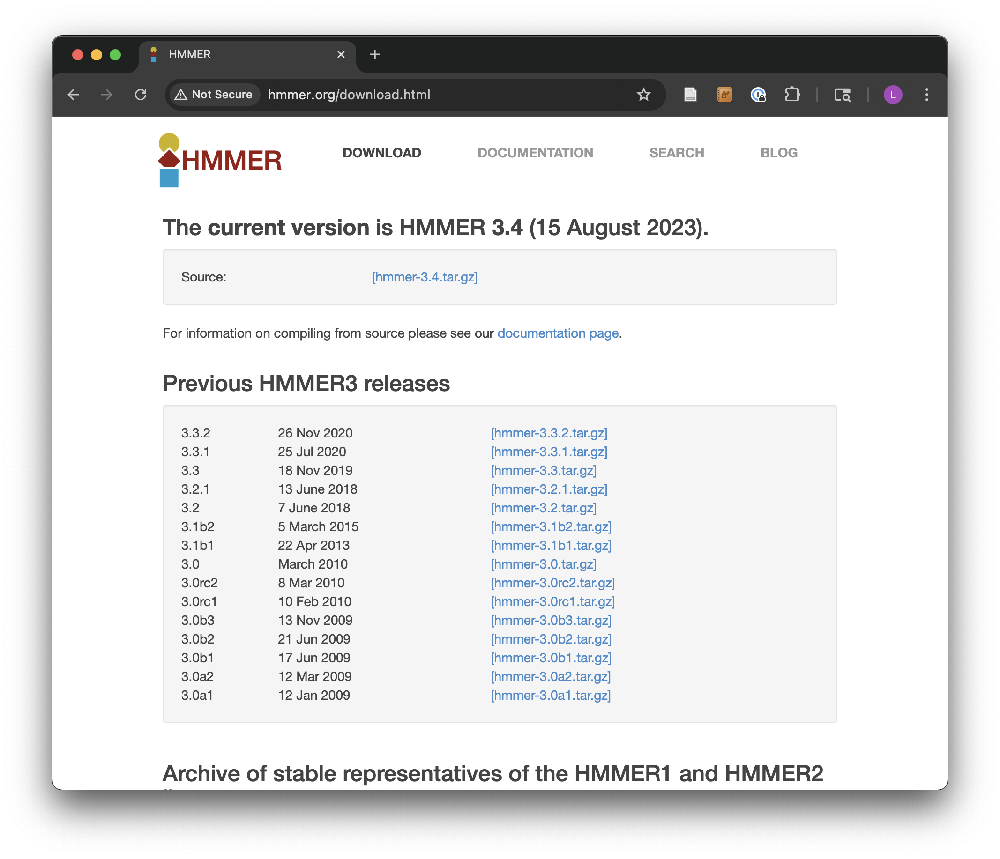
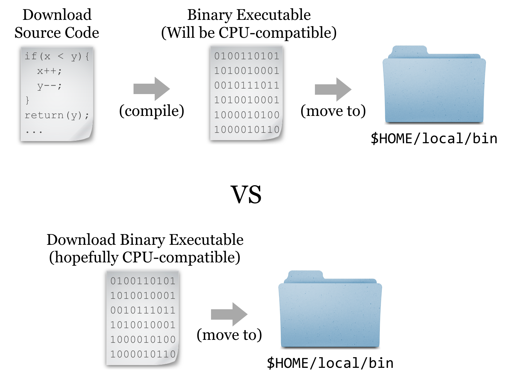
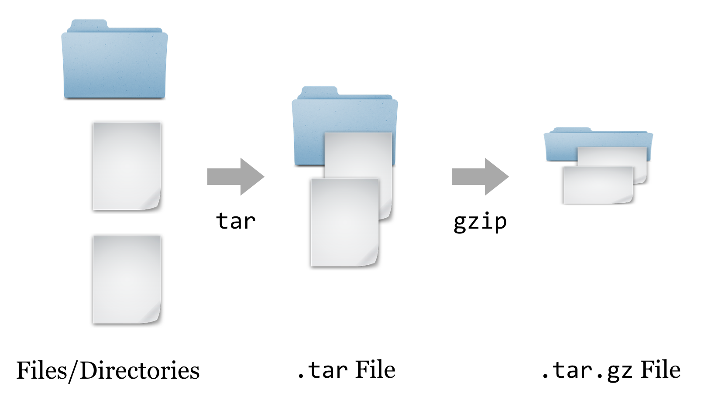
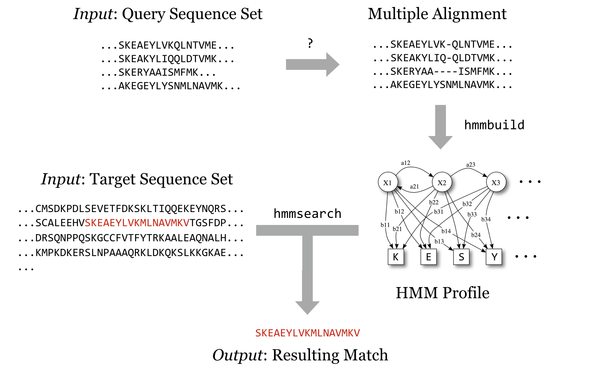
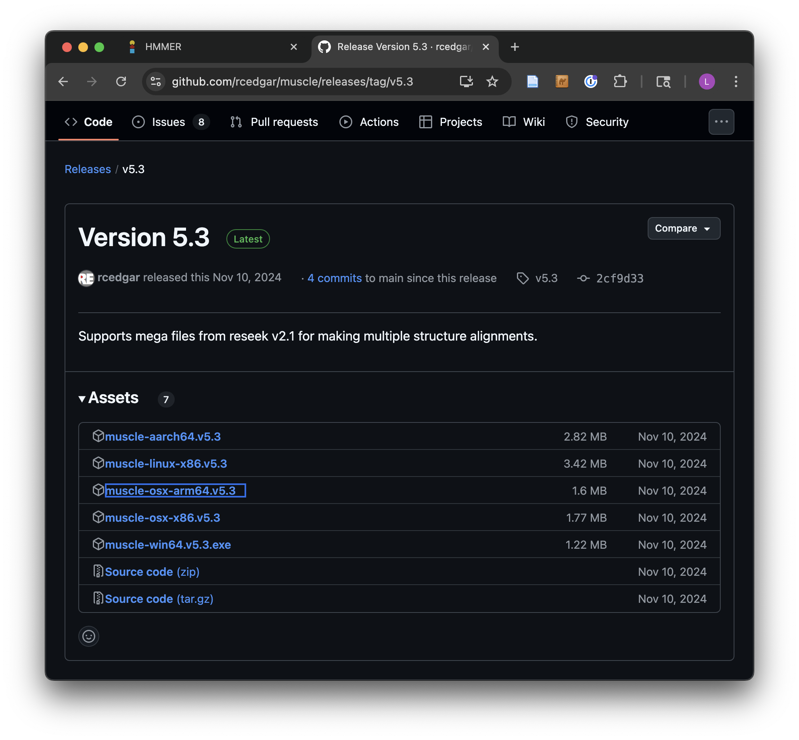

# Installing (Bioinformatics) Software

Ideally, the computational infrastructure to which you have access already includes a host of specialized software packages needed for your work, and the software installations are kept up to date as developers make improvements. If this isn't the case, you might consider bribing your local system administrator with sweets and caffeine. Failing that, you're likely to have to install the software you need yourself.

Installing more sophisticated software than the simple scripts described in chapter 5, "[Permissions and Executables](#permissions-and-executables)," will follow the same basic pattern: 

1. obtain executable files, 
2. get them into `$HOME/local/bin`, and 
3. ensure that `$HOME/local/bin` is present in the `$PATH` environment variable. 

Chapter 5 covered step 3, which needs to be done only once for our account. Steps 1 and 2, however, are often quite different depending on how the software is distributed.

In this chapter, we're going to run through an example of installing a bioinformatics suite known as HMMER. This software searches for protein sequence matches (from a set of sequences) based on a probabilistic hidden Markov model (HMM) of a set of similar protein sequences, as in orthologous proteins from different species. The motivation for choosing this example is not so we can learn about HMM modeling or this software suite specifically, but rather that it is a representative task requiring users to download files, install software in different ways, and obtain data from public repositories.

### Using a Package Manager {-}

Arguably, one of the fastest and easiest ways to install software is to use a package manager. Here we'll be discussing mamba, but there are many options.

Of course, to *use* a package manager, one must first *install* a package manager. We'll installing mamba by following the directions on the [Miniforge site](https://conda-forge.org/download/). On the command line, we will first download the installation script using `curl` and then run it.

<pre id=part1-06-curl_miniforge
     class="language-txt 
            line-numbers 
            linkable-line-numbers">
<code>
[oneils@mbp ~]$ <b>cd $HOME</b>
[oneils@mbp ~]$ <b>curl -L -O "https://github.com/conda-forge/miniforge/releases/latest/download/Miniforge3-$(uname)-$(uname -m).sh"</b>
[oneils@mbp ~]$ <b>bash Miniforge3-$(uname)-$(uname -m).sh</b>
</code></pre>

Observe that the `uname` command is used to get information about your operating system so that the above commands *should* work for any Unix-like system (MacOS, WSL, and Linux). During the execution of the install script, it will probably ask you to agree to the license agreement. Additionally, installing into the default location is typically fine. The final question to respond to during installation asks if you want to update your shell profile to automatically initialize conda - be sure to answer `yes` to this question and verify that mamba got added to your `.bash_profile`.

Now that we have our package manager installed, we're ready to install [HMMER](https://bioconda.github.io/recipes/hmmer/README.html). Notice that after we successfully installed and initialized mamba, our command prompt changed:

<pre id=part1-06-base
     class="language-txt 
            line-numbers 
            linkable-line-numbers">
<code>
(base) [oneils@mbp ~]$
</code></pre>

The `(base)` notation in front of our prompt lets us know that we are in our `base` environment. Generally, it's not recommended to install packages (besides conda/mamba) into your base environment. We'll make a "APCB" environment and install things there. As you become more advanced, you should consider creating an environment for each project you work on, to improve reproducibility and minimize the possibility of package incompatability.

<pre id=part1-06-env
     class="language-txt 
            line-numbers 
            linkable-line-numbers">
<code>
(base) [oneils@mbp ~]$ <b>mamba create -n APCB bioconda::hmmer</b>
</code></pre>

This command creates a new environment called `APCB` and installs hmmer into it. During the process `mamba` will tell you what packages will be installed/upgraded/downgraded/etc. and you can confirm the changes it will make. This is one of the benifits of using a package manager - all the necessary dependancies are checked and installed (or updated) for you.

We can then activate the `APCB` environment and we're ready to use our new installation!

<pre id=part1-06-env
     class="language-txt 
            line-numbers 
            linkable-line-numbers">
<code>
(base) [oneils@mbp ~]$ <b>mamba activate APCB</b>
(APCB) [oneils@mbp ~]$ 
</code></pre>

Notice that `base` changes to `APCB` so we can see what environment we're using. You might consider making a `main` environment that will serve as a default environment to work in.

### Installing Software without a Package Manager {-}

The first step to installing HMMER without a package manager is to find it online. A simple web search takes us to the homepage:

  

Conveniently, we see a nice large "Download" button, but the button indicates that the download is made for MacOS/Intel, the operating system running on my personal laptop. If we are remotely logged in to a Linux computer, simply clicking this button won't work for us. Clicking the "archived older versions" link reveals all our options.

  

In this screenshot, we see a number of interesting download options, including one for the current "Source," and many previous releases.

### Source or Binary? {-}

Some bioinformatics software is created as a simple script of the kind discussed in chapter 5: a text file with a `#!` line referencing an interpreting program (that is hopefully installed on the system) and made executable with `chmod`.

But it turns out that such interpreted programs are slow owing to the extra layer of execution, and for some applications, the convenience and relative ease aren't worth the loss in speed. In these cases, software may be written in a *compiled* language, meaning that the program code starts as human-readable "source code" but is then processed into machine-readable binary code. The trick is that the process of compilation needs to be independently performed for each type of CPU. Although there are fewer CPU types in common use than in days past, both 32- and 64-bit x86 CPU architectures are still common, and software compiled for one won't work on the other. If the developer has made available compiled binaries compatible with our system, then so much the better: we can download them, ensure they are executable, and place them in `$HOME/local/bin`. Alternatively, we may need to download the source code files and perform the compilation ourselves. In some cases, developers distribute binaries, but certain features of the program can be customized in the compilation process.

  

For the sake of completeness, we'll do a source install of HMMER; later, we'll get some other software as binaries.^[If you have administrator privileges on the machine, software repositories curated with many packages are also available. Depending on the system, if you log in as root, installing HMMER may be as simple as running `apt-get install hmmer` or `yum install hmmer`.]

### Downloading and Unpacking {-}

For the following examples, I'll be working on the University of Oregon's compute cluster: Talapas.

We're going to download the source files for HMMER; first, we are going to create a new directory to store downloads, called `downloads`, in our home directory (you may already have such a directory).

<pre id=part1-06-downloads
     class="language-txt 
            line-numbers 
            linkable-line-numbers">
<code>
[coonrod@login1 ~]$ <b>cd $HOME</b>
[coonrod@login1 ~]$ <b>mkdir downloads</b>
[coonrod@login1 ~]$ <b>cd downloads</b>
[coonrod@login1 ~/downloads]$
</code></pre>

If we were to click on the link in the HMMER download page, the web browser would attempt to download the file located at the corresponding URL (http://eddylab.org/software/hmmer/hmmer.tar.gz at the time of this writing) to the local system. If we want the file downloaded to a remote system, clicking on the download button won't work. What we need is a tool called `wget`, which can download files from the Internet on the command line.^[A similar tool called `curl` can be used for the same purpose. The feature sets are slightly different, so in some cases `curl` is preferred over `wget` and vice versa. For the simple downloading tasks in this book, either will suffice, UNLESS you are working on a Mac - `wget` is not included by default, so `curl` will be more straightforward to use.] The `wget` utility takes at least one important parameter, the URL, to download. It's usually a good idea to put URLs in quotes, because they often have characters that confuse the shell and would need to be escaped or quoted. Additionally, we can specify `-O <filename>`, where `<filename>` is the name to use when saving the file. Although not required in this instance, it can be useful for URLs whose ending file names aren't reasonable (like `index.php?query=fasta&search=drosophila`).

<pre id=part1-06-wget
     class="language-txt 
            line-numbers 
            linkable-line-numbers">
<code>
[coonrod@login1 ~/downloads]$ <b>wget 'http://eddylab.org/software/hmmer/hmmer.tar.gz' -O hmmer-3.4.tar.gz</b>
</code></pre>

At this point, we have a file ending in `.tar.gz`, known as a "gzipped tarball," representing a collection of files that have first been combined into a single file (a tarball), and then compressed (with the `gzip` utility).

  

To get the contents out, we have to reverse this process. First, we'll un-gzip the file with `gunzip hmmer-3.4.tar.gz`^[Alternatively, `gzip -d hmmer-3.4.tar.gz`.], which will replace the file with the un-gzipped `hmmer-3.4.tar`.^[The `gzip` utility is one of the few programs that care about file extensions. While most programs will work with a file of any extension, `gzip` requires a file that ends in `.gz`. If you are unsure of a file's type, the `file` utility can help; for example, `file hmmer-3.4.tar.gz` reports that the file is gzip-compressed data, and would do so even if the file did not end in `.gz`.] From there, we can un-tar the tarball with `tar -xf hmmer-3.4.tar` (the `-x` indicates extract, and the `f` indicates that the data will be extracted from the specified file name).^[Note that it is not strictly necessary to unzip and then un-tar in two separate steps. We can unzip and un-tar with the single command `tar -xfz hmmer-3.4.tar.gz`, where `z` will filter the file through gzip.]

<pre id=part1-06-untar
     class="language-txt 
            line-numbers 
            linkable-line-numbers">
<code>
[coonrod@login1 ~/downloads]$ <b>ls</b>
hmmer-3.4.tar.gz
[coonrod@login1 ~/downloads]$ <b>gunzip -d hmmer-3.4.tar.gz</b>
[coonrod@login1 ~/downloads]$ <b>ls</b>
hmmer-3.4.tar
[coonrod@login1 ~/downloads]$ <b>tar -xf hmmer-3.4.tar</b>
[coonrod@login1 ~/downloads]$ <b>ls</b>
hmmer-3.4  hmmer-3.4.tar
</code></pre>

It looks like the gzipped tarball contained a directory, called `hmmer-3.4`.

### Other Download and Compression Methods {-}

Before continuing to work with the downloaded source code, there are a couple of things to note regarding compressed files and downloading. First, although gzipped tarballs are the most commonly used compression format for Unix-like systems, other compression types may also be found. They can usually be identified by the file extension. Different tools are available for each type, though there is also a generic `uncompress` utility that can handle most common types.

<table>
    <tr>
        <th style="text-align:left">Extension</th>
        <th style="text-align:left">Decompress Command</th>
    </tr>
    <tr>
        <td>`file.bz2`</td>
        <td>`bunzip2 file.bz2`</td>
    </tr>
    <tr>
        <td>`file.zip`</td>
        <td>`unzip file.zip`</td>
    </tr>
    <tr>
        <td>`file.tgz`</td>
        <td>`tar -xfz file.tgz` (same as `.tar.gz`)</td>
    </tr>
</table>

The most common syntax for creating a gzipped tarball uses the `tar` utility, which can do both jobs of tarring and gzipping the inputs. As an example, the command `tar -cvzf hmmer_compress_copy.tar.gz hmmer-3.4` would create (`c`), with verbose output (`v`), a gzipped (`z`) tarball in a file (`f`) called `hmmer_compress_copy.tar.gz` from the input `directory hmmer-3.4`.

Traditionally, zipped files of source code were the most common way to distribute software. More recently, version control systems (used by developers to track changes to their software over time) have become web-enabled as a way to distribute software to end-users. One such system is `git`, which allows users to download entire directories of files using a "clone URL" over the web. GitHub is a similarly popular page for hosting these projects (see chapter 14, ["Version Control with git"](#version-control-with-git), for more information on `git` and GitHub).

### Compiling the Source {-}

Having downloaded and unpacked the HMMER source code, the first step is to check the contents of the directory and look for any `README` or `INSTALL` files. Such files are often included and contain important information from the software developer.

<pre id=part1-06-dir-content
     class="language-txt 
            line-numbers 
            linkable-line-numbers">
<code>
[coonrod@login1 ~/downloads]$ <b>cd hmmer-3.4</b>
[coonrod@login1 ~/hmmer-3.4]$ <b>ls</b>
config.guess   documentation   libdivsufsort   profmark         test-speed
config.sub     easel           LICENSE         README.md        testsuite
configure      INSTALL         Makefile.in     RELEASE-3.4.md   tutorial
configure.ac   install-sh      makeTAGS.sh     src              Userguide.pdf
</code></pre>

Taking a look at the contents of the `hmmer-3.4` directory, there is an `INSTALL` file, which we should read with `less`.

<pre id=part1-06-INSTALL
     class="language-txt">
<code><b>Brief installation instructions 
HMMER 3.4 (Aug 2023)

Starting from a source distribution, hmmer-3.4.tar.gz:
   uncompress hmmer-3.4.tar.gz  
   tar xf hmmer-3.4.tar
   cd hmmer-3.4
   ./configure
   make
   make check                        # optional: automated tests
   make install                      # optional: install HMMER programs and man pages
   (cd easel; make install)          # optional: install Easel tools too

For more details including customization, supported platforms, and
troubleshooting, see the Installation chapter in the HMMER User's
Guide (Userguide.pdf).
</b></code></pre>

The installation documentation describes a number of commands, including many we've already run (for extracting the data from the gzipped tarball). There are also four more commands listed: `./configure`, `make`, `make check`, and `make install`. Three of these comprise the "canonical install process" — `make check` is an optional step to check the success of the process midway through. The three important steps are: (1) `./configure`, (2) `make`, and (3) `make install`.

1. The contents of the directory (above) include `configure` as an executable script, and the command `./configure` executes the script from the [present working directory](#present_working_directory). This script usually verifies that all of the prerequisite libraries and programs are installed on the system. More importantly, this step may set some environment variables or create a file called `Makefile`, within which will be instructions detailing how the compilation and installation process should proceed, customized for the system.
2. Actually, `make` is an interpreting program much like `bash` (`which make` is likely to return `/usr/bin/make` — it's a binary program). When running `make`, its default behavior is to look for a file called `Makefile` in the current directory, and run a default set of commands specified in the `Makefile` in the order specified. In this case, these default commands run the compilation programs that turn the source code into executable binaries.
3. The make `install command` again executes make, which looks for the `Makefile`, but this time we are specifying that the "install" set of commands in the `Makefile` should run. This step copies the binary executable files (and other supporting files, if necessary) to the install location.

This final step, `make install`, may lead us to ask: what is the install location? By default, it will be something like `/usr/bin` — a system-wide location writable to by only the administrator. So, unless we are logged in as `root` (the administrator), the final step in the process will fail. We must specify the install location, and although the install itself happens in the third step, the entire process is configured in the first step. There may be many options that we can specify in the `./configure` step, though the install location (known as the `PREFIX`) is by far the most commonly used. Running `./configure --help` prints a lot of information; here's the relevant section:

<pre id=part1-06-configure
     class="language-txt">
<code><b>Installation directories:
  --prefix=PREFIX         install architecture-independent files in PREFIX
                          [/usr/local]
  --exec-prefix=EPREFIX   install architecture-dependent files in EPREFIX
                          [PREFIX]
</b></code></pre>

The `--prefix` option is the one we'll use to determine where the binaries should be located. Although our executable **bin**aries will eventually go in `$HOME/local/bin`, for this option we're going to specify `$HOME/local`, because the `bin` portion of the path is implied (and other directories like `lib` and `share` might also be created alongside the `bin` directory). Finally, our modified canonical install process will consist of three steps: `./configure --prefix=$HOME/local`, `make`, and `make install`.

<pre id=part1-06-make
     class="language-txt 
            line-numbers 
            linkable-line-numbers">
<code>
[coonrod@login1 ~/downloads/hmmer-3.4]$ <b>./configure --prefix=$HOME/local</b>
configure: Configuring HMMER3 for your system.
checking build system type... x86_64-pc-linux-gnu
checking host system type... x86_64-pc-linux-gnu
...
[coonrod@login1 ~/downloads/hmmer-3.4]$ <b>make</b>
     SUBDIR easel
     CC easel.o
     CC esl_alloc.o
...
[coonrod@login1 ~/downloads/hmmer-3.4]$ <b>make install</b>
     SUBDIR easel
     SUBDIR miniapps
     SUBDIR libdivsufsort
...
</code></pre>

At this point, if we navigate to our `$HOME/local` directory, we will see the added directories and binary files.

<pre id=part1-06-local
     class="language-txt 
            line-numbers 
            linkable-line-numbers">
<code>
[coonrod@login1 ~/downloads/hmmer-3.4]$ <b>cd $HOME/local</b>
[coonrod@login1 ~/local]$ <b>ls</b>
bin     include     lib     share
[coonrod@login1 ~/local]$ <b>cd bin</b>
[coonrod@login1 ~/local/bin]$ <b>ls</b>
alimask   hmmconvert  hmmlogo        hmmpress   hmmsim     makehmmerdb  phmmer
hmmalign  hmmemit     hmmpgmd        hmmscan    hmmstat    nhmmer
hmmbuild  hmmfetch    hmmpgmd_shard  hmmsearch  jackhmmer  nhmmscan
</code></pre>

Because these executable files exist in a directory listed in the `$PATH` variable, we can, as always, type their names on the command prompt when working in any directory to run them. (Though, again, we may need to log out and back in to get the shell to see these new programs.^[t's not strictly necessary to log back out and back in; when working in `bash`, running `hash -r` will cause the shell to update its list of software found in `$PATH`.])

### Installation from Binaries {-}

Our objective is to run HMMER to search for a sequence-set profile in a larger database of sequences. For details, the HMMER documentation (available on the website) is highly recommended, particularly the "Tutorial" section, which describes turning a multiple alignment of sequences into a profile (with `hmmbuild`) and searching that profile against the larger set (with `hmmsearch`). It is also useful to read the peer-reviewed publication that describes the algorithms implemented by HMMER or any other bioinformatics software. Even if the material is outside your area of expertise, it will reveal the strengths and weaknesses of software.

  

We'll soon get to downloading query and target sequence sets, but we'll quickly come to realize that although the programs in the HMMER suite can produce the profile and search it against the target set, they cannot produce a multiple alignment from a set of sequences that are similar but not all the same length. Although there are many multiple-alignment tools with different features, we'll download the relatively popular `muscle`. This time, we'll install it from binaries.

It's worth discussing how one goes about discovering these sequences of steps, and which tools to use. The following strategies generally work well, though creativity is almost always rewarded.

1. Read the methods sections of papers with similar goals.
2. Ask your colleagues.
3. Search the Internet.
4. Read the documentation and published papers for tools you are already familiar with, as well as those publications that cite them.
5. Don't let the apparent complexity of an analysis prevent you from taking the first steps. Most types of analyses employ a number of steps and many tools, and you may not have a clear picture of what the final procedure will be. Experiment with alternative tools, and look for help when you get stuck. Be sure to document your work, as you will inevitably want to retrace your steps.

If we visit the [`muscle` homepage](https://www.drive5.com/muscle/), we'll see a variety of [download options](https://github.com/rcedgar/muscle/releases/tag/v5.3), including binaries for our system, Linux.

  

How do we know which of these we want? We can get a hint by running the `uname` program, along with the `-a` parameter to give as much information as possible.

<pre id=part1-06-uname
     class="language-txt 
            line-numbers 
            linkable-line-numbers">
<code>
[coonrod@login1 ~]$ <b>uname -a</b>
Linux login1.talapas.uoregon.edu 4.18.0-477.27.1.el8_8.x86_64 
     #1 SMP Thu Aug 31 10:29:22 EDT 2023 x86_64 x86_64 x86_64 GNU/Linux
</code></pre>

The `uname` program gives information about the operating system, which in this case appears to be GNU/Linux for a 64-bit, x86 CPU. If any of the binaries are likely to work, it will be the "linux-x86" option. (Yours will vary based upon `uname` output.) We'll `wget` that gzipped tarball in the `downloads` directory.

<pre id=part1-06-wget-muscle
     class="language-txt 
            line-numbers 
            linkable-line-numbers">
<code>
[coonrod@login1 ~]$ <b>cd downloads</b>
[coonrod@login1 ~/downloads]$ <b>wget 'https://github.com/rcedgar/muscle/releases/download/v5.3/muscle-linux-x86.v5.3'</b>
</code></pre>

Note that in this case we haven't used the `-O` option for `wget`, because the file name described by the URL (muscle3.8.31_i86linux64) is what we would like to call the file when it is downloaded anyway. Continuing on to unpack it, we find it contains only an executable that we can `chmod` and attempt to run.

<pre id=part1-06-untar-muscle
     class="language-txt 
            line-numbers 
            linkable-line-numbers">
<code>
[coonrod@login1 ~/downloads]$ <b>ls</b>
hmmer-3.4   hmmer-3.4.tar  muscle-linux-x86.v5.3
[coonrod@login1 ~/downloads]$ <b>chmod u+x muscle-linux-x86.v5.3</b>
[coonrod@login1 ~/downloads]$ <b>ls</b>
hmmer-3.4   hmmer-3.4.tar    muscle3.8.31_i86linux64
[coonrod@login1 ~/downloads]$ <b>./muscle3.8.31_i86linux64</b>

muscle 5.3.linux64 [d9725ac]  131Gb RAM, 48 cores
Built Nov 10 2024 22:58:59
(C) Copyright 2004-2021 Robert C. Edgar.
https://drive5.com

Align FASTA input, write aligned FASTA (AFA) output:
    muscle -align input.fa -output aln.afa
...
</code></pre>

Because it didn't report an execution error, we can install it by copying it to our `$HOME/local/bin` directory. While doing so, we'll give it a simpler name, `muscle`.

<pre id=part1-06-install-muscle
     class="language-txt 
            line-numbers 
            linkable-line-numbers">
<code>
[coonrod@login1 ~/downloads]$ <b>cp muscle-linux-x86.v5.3 $HOME/local/bin/muscle</b>
[coonrod@login1 ~/downloads]$
</code></pre>

Now our multiple aligner, `muscle`, is installed!

#### Exercises {-}

1. Follow the steps above to install the HMMER suite (from source) as well as `muscle` (from binaries) in your `$HOME/local/bin` directory. Ensure that you can run them from anywhere (including from your home directory) by running `muscle --help` and `hmmsearch --help`. Both commands should display help text instead of an error. Further, check that the versions being found by the shell are from your home directory by running `which hmmsearch` and `which muscle`.

2. Determine whether you have the "NCBI Blast+" tools installed by searching for the `blastn` program. If they are installed, where are they located? If they are not installed, find them and install them, either from binaries or using a package manager.

3. Install `sickle` from the `git` repo at https://github.com/najoshi/sickle. To install it, you will need to follow the custom instructions inside of the `README.md` file. If you don't have the `git` program, it is available for binary and source install at http://git-scm.com (or by installing developer tools on a Mac).

