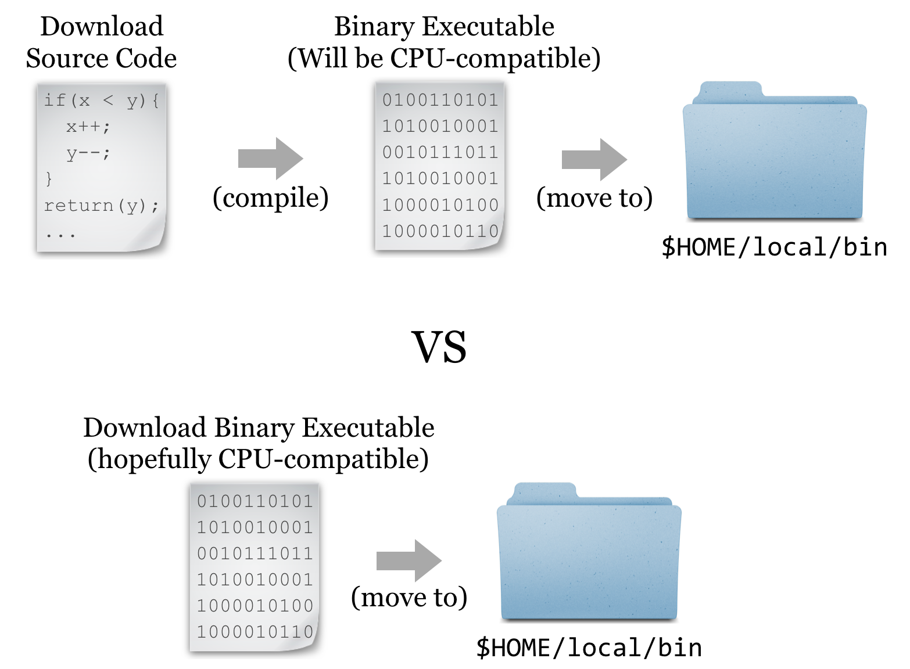
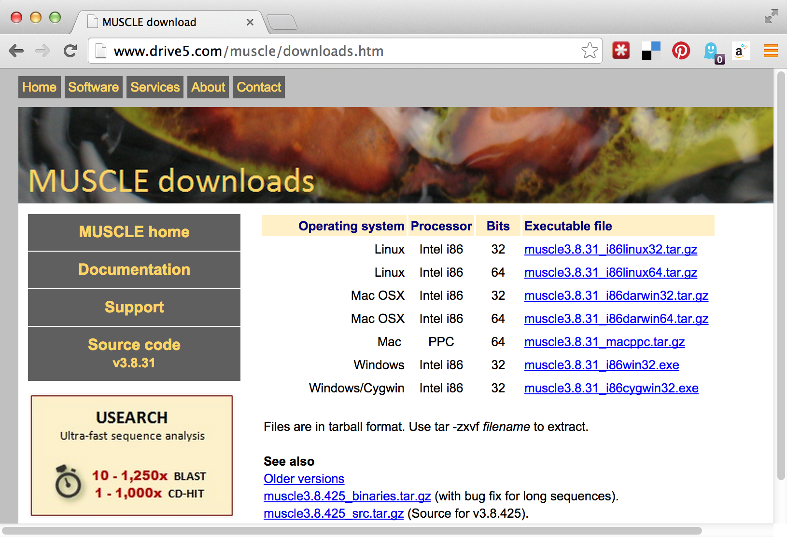

# Installing (Bioinformatics) Software

Ideally, the computational infrastructure to which you have access already includes a host of specialized software packages needed for your work, and the software installations are kept up to date as developers make improvements. If this isn’t the case, you might consider bribing your local system administrator with sweets and caffeine. Failing that, you’re likely to have to install the software you need yourself.

Installing more sophisticated software than the simple scripts described in chapter 5, “[Permissions and Executables](#permissions-and-executables),” will follow the same basic pattern: (1) obtain executable files, (2) get them into `$HOME/local/bin`, and (3) ensure that `$HOME/local/bin` is present in the `$PATH` environment variable. Chapter 5 covered step 3, which needs to be done only once for our account. Steps 2 and 3, however, are often quite different depending on how the software is distributed.

In this chapter, we’re going to run through an example of installing and running a bioinformatics suite known as HMMER. This software searches for protein sequence matches (from a set of sequences) based on a probabilistic hidden Markov model (HMM) of a set of similar protein sequences, as in orthologous proteins from different species. The motivation for choosing this example is not so we can learn about HMM modeling or this software suite specifically, but rather that it is a representative task requiring users to download files, install software in different ways, and obtain data from public repositories.

### Using a Package Manager {-}

### Installing Software without a Package Manager {-}

The first step to installing HMMER without a package manager is to find it online. A simple web search takes us to the homepage:

  

Conveniently, we see a nice large “Download” button, but the button indicates that the download is made for MacOS X/Intel, the operating system running on my personal laptop. Because we are remotely logged in to a Linux computer, this download won’t work for us. Clicking the “Alternative Download Options” link reveals options that might work for the Linux system we’re using.

  

In this screenshot, we see a number of interesting download options, including one for “Source,” two for “Linux binaries,” and below a suggestion of some documentation, to which we’ll return later.

### Source or Binary? {-}

Some bioinformatics software is created as a simple script of the kind discussed in chapter 5: a text file with a `#!` line referencing an interpreting program (that is hopefully installed on the system) and made executable with `chmod`.

But it turns out that such interpreted programs are slow owing to the extra layer of execution, and for some applications, the convenience and relative ease aren’t worth the loss in speed. In these cases, software may be written in a *compiled* language, meaning that the program code starts as human-readable “source code” but is then processed into machine-readable binary code. The trick is that the process of compilation needs to be independently performed for each type of CPU. Although there are fewer CPU types in common use than in days past, both 32- and 64-bit x86 CPU architectures are still common, and software compiled for one won’t work on the other. If the developer has made available compiled binaries compatible with our system, then so much the better: we can download them, ensure they are executable, and place them in `$HOME/local/bin`. Alternatively, we may need to download the source code files and perform the compilation ourselves. In some cases, developers distribute binaries, but certain features of the program can be customized in the compilation process.

  

For the sake of completeness, we’ll do a source install of HMMER; later, we’ll get some other software as binaries.^[If you have administrator privileges on the machine, software repositories curated with many packages are also available. Depending on the system, if you log in as root, installing HMMER may be as simple as running `apt-get install hmmer` or `yum install hmmer`.]

### Downloading and Unpacking {-}

We’re going to download the source files for HMMER; first, we are going to create a new directory to store downloads, called `downloads`, in our home directory (you may already have such a directory).

<pre id=part1-06-downloads
     class="language-txt 
            line-numbers 
            linkable-line-numbers">
<code>
[oneils@mbp ~]$ <b>cd $HOME</b>
[oneils@mbp ~]$ <b>mkdir downloads</b>
[oneils@mbp ~]$ <b>cd downloads</b>
[oneils@mbp ~/downloads]$
</code></pre>

If we were to click on the link in the HMMER download page, the web browser would attempt to download the file located at the corresponding URL (http://eddylab.org/software/hmmer3/3.1b2/hmmer-3.1b2.tar.gz) to the local desktop. Because we want the file downloaded to the remote system, clicking on the download button won’t work. What we need is a tool called `wget`, which can download files from the Internet on the command line.^[A similar tool called `curl` can be used for the same purpose. The feature sets are slightly different, so in some cases `curl` is preferred over `wget` and vice versa. For the simple downloading tasks in this book, either will suffice.] The `wget` utility takes at least one important parameter, the URL, to download. It’s usually a good idea to put URLs in quotes, because they often have characters that confuse the shell and would need to be escaped or quoted. Additionally, we can specify `-O <filename>`, where `<filename>` is the name to use when saving the file. Although not required in this instance, it can be useful for URLs whose ending file names aren’t reasonable (like `index.php?query=fasta&search=drosophila`).

<pre id=part1-06-wget
     class="language-txt 
            line-numbers 
            linkable-line-numbers">
<code>
[oneils@mbp ~/downloads]$ <b>wget 'http://eddylab.org/software/hmmer3/3.1b1/h
mmer-3.1b1.tar.gz' -O hmmer-3.1b1.tar.gz</b>
</code></pre>

At this point, we have a file ending in `.tar.gz`, known as a “gzipped tarball,” representing a collection of files that have first been combined into a single file (a tarball), and then compressed (with the `gzip` utility).

  

To get the contents out, we have to reverse this process. First, we’ll un-gzip the file with `gunzip hmmer-3.1b1.tar.gz`^[Alternatively, `gzip -d hmmer-3.1b1.tar.gz`.], which will replace the file with the un-gzipped `hmmer-3.1b1.tar`.^[The `gzip` utility is one of the few programs that care about file extensions. While most programs will work with a file of any extension, `gzip` requires a file that ends in `.gz`. If you are unsure of a file’s type, the `file` utility can help; for example, `file hmmer-3.1b1.tar.gz` reports that the file is gzip-compressed data, and would do so even if the file did not end in `.gz`.] From there, we can un-tar the tarball with `tar -xf hmmer-3.1b1.tar` (the `-x` indicates extract, and the `f` indicates that the data will be extracted from the specified file name).^[Note that it is not strictly necessary to unzip and then un-tar in two separate steps. We can unzip and un-tar with the single command `tar -xfz hmmer-3.1b1.tar.gz`, where `z` will filter the file through gzip.]

<pre id=part1-06-untar
     class="language-txt 
            line-numbers 
            linkable-line-numbers">
<code>
[oneils@mbp ~/downloads]$ <b>ls</b>
hmmer-3.1b1.tar.gz
[oneils@mbp ~/downloads]$ <b>gunzip -d hmmer-3.1b1.tar.gz</b>
[oneils@mbp ~/downloads]$ <b>ls</b>
hmmer-3.1b1.tar
[oneils@mbp ~/downloads]$ <b>tar -xf hmmer-3.1b1.tar</b>
[oneils@mbp ~/downloads]$ <b>ls</b>
hmmer-3.1b1  hmmer-3.1b1.tar
</code></pre>

It looks like the gzipped tarball contained a directory, called `hmmer-3.1b1`.

### Other Download and Compression Methods {-}

Before continuing to work with the downloaded source code, there are a couple of things to note regarding compressed files and downloading. First, although gzipped tarballs are the most commonly used compression format for Unix-like systems, other compression types may also be found. They can usually be identified by the file extension. Different tools are available for each type, though there is also a generic `uncompress` utility that can handle most common types.

<table>
    <tr>
        <th style="text-align:left">Extension</th>
        <th style="text-align:left">Decompress Command</th>
    </tr>
    <tr>
        <td>`file.bz2`</td>
        <td>`bunzip2 file.bz2`</td>
    </tr>
    <tr>
        <td>`file.zip`</td>
        <td>`unzip file.zip`</td>
    </tr>
    <tr>
        <td>`file.tgz`</td>
        <td>`tar -xfz file.tgz` (same as `.tar.gz`)</td>
    </tr>
</table>

The most common syntax for creating a gzipped tarball uses the `tar` utility, which can do both jobs of tarring and gzipping the inputs. As an example, the command `tar -cvzf hmmer_compress_copy.tar.gz` hmmer-3.1b1 would create (`c`), with verbose output (`v`), a gzipped (`z`) tarball in a file (`f`) called `hmmer_compress_copy.tar.gz` from the input `directory hmmer-3.1b1`.

Traditionally, zipped files of source code were the most common way to distribute software. More recently, version control systems (used by developers to track changes to their software over time) have become web-enabled as a way to distribute software to end-users. One such system is `git`, which allows users to download entire directories of files using a “clone URL” over the web. GitHub is a similarly popular page for hosting these projects (see Chapter XXXXXXXX for more information on `git` and GitHub).

### Compiling the Source {-}

Having downloaded and unpacked the HMMER source code, the first step is to check the contents of the directory and look for any `README` or `INSTALL` files. Such files are often included and contain important information from the software developer.

<pre id=part1-06-dir-content
     class="language-txt 
            line-numbers 
            linkable-line-numbers">
<code>
[oneils@mbp ~/downloads]$ <b>cd hmmer-3.1b1</b>
[oneils@mbp ~/hmmer-3.1b1]$ <b>ls</b>
aclocal.m4    configure.ac   INSTALL        Makefile.in    src
config.guess  COPYRIGHT      install-sh     profmark       testsuite
config.sub    documentation  libdivsufsort  README         tutorial
configure     easel          LICENSE        RELEASE-NOTES  Userguide.pdf
</code></pre>

Taking a look at the contents of the `hmmer-3.1b1` directory, there is an `INSTALL` file, which we should read with `less`. Here’s the top part of the file:

<pre id=part1-06-INSTALL
     class="language-txt">
<code><b>Brief installation instructions 
HMMER 3.1b1; May 2013
-------------------------------------------------------------

These are quick installation instructions. For complete documentation,
including customization and troubleshooting, please see the
Installation chapter in the HMMER User's Guide (Userguide.pdf).

Starting from a source distribution, hmmer-3.1b1.tar.gz:
 uncompress:                uncompress hmmer-3.1b1.tar.gz  
 unpack:                    tar xf hmmer-3.1b1.tar
 move into new directory:   cd hmmer-3.1b1
 configure:                 ./configure
 build:                     make
 automated tests:           make check
 automated install:         make install
</b></code></pre>

The installation documentation describes a number of commands, including many we’ve already run (for extracting the data from the gzipped tarball). There are also four more commands listed: `./configure`, `make`, `make check`, and `make install`. Three of these comprise the “canonical install process”—`make check` is an optional step to check the success of the process midway through. The three important steps are: (1) `./configure`, (2) `make`, and (3) `make install`.

<ol>
    <li>The contents of the directory (above) include `configure` as an executable script, and the command `./configure` executes the script from the [present working directory](#present_working_directory). This script usually verifies that all of the prerequisite libraries and programs are installed on the system. More importantly, this step may set some environment variables or create a file called `Makefile`, within which will be instructions detailing how the compilation and installation process should proceed, customized for the system.</li>
    <li>Actually, `make` is an interpreting program much like `bash` (`which make` is likely to return `/usr/bin/make`—it’s a binary program). When running `make`, its default behavior is to look for a file called `Makefile` in the current directory, and run a default set of commands specified in the `Makefile` in the order specified. In this case, these default commands run the compilation programs that turn the source code into executable binaries.</li>
    <li>The make `install command` again executes make, which looks for the `Makefile`, but this time we are specifying that the “install” set of commands in the `Makefile` should run. This step copies the binary executable files (and other supporting files, if necessary) to the install location.</li>
</ol>

This final step, `make install`, may lead us to ask: what is the install location? By default, it will be something like `/usr/bin`—a system-wide location writable to by only the administrator. So, unless we are logged in as `root` (the administrator), the final step in the process will fail. We must specify the install location, and although the install itself happens in the third step, the entire process is configured in the first step. There may be many options that we can specify in the `./configure` step, though the install location (known as the `PREFIX`) is by far the most commonly used. Running `./configure --help` prints a lot of information; here’s the relevant section:

<pre id=part1-06-configure
     class="language-txt">
<code><b>Installation directories:
  --prefix=PREFIX         install architecture-independent files in PREFIX
                          [/usr/local]
  --exec-prefix=EPREFIX   install architecture-dependent files in EPREFIX
                          [PREFIX]
</b></code></pre>

The `--prefix` option is the one we’ll use to determine where the binaries should be located. Although our executable **bin**aries will eventually go in `$HOME/local/bin`, for this option we’re going to specify `$HOME/local`, because the `bin` portion of the path is implied (and other directories like `lib` and `share` might also be created alongside the `bin` directory). Finally, our modified canonical install process will consist of three steps: `./configure --prefix=$HOME/local`, `make`, and `make install`.

<pre id=part1-06-make
     class="language-txt 
            line-numbers 
            linkable-line-numbers">
<code>
[oneils@mbp ~/downloads/hmmer-3.1b1]$ <b>./configure --prefix=$HOME/local</b>
configure: Configuring HMMER for your system.
checking build system type... x86_64-unknown-linux-gnu
checking host system type... x86_64-unknown-linux-gnu
...
[oneils@mbp ~/hmmer-3.1b1]$ <b>make</b>
     SUBDIR easel
make[1]: Entering directory `/home/oneils/downloads/hmmer-3.1b1/easel'
     CC easel.o
     CC esl_alphabet.o
...
[oneils@mbp ~/hmmer-3.1b1]$ <b>make install</b>
/usr/bin/install -c -d /home/oneils/local/bin
/usr/bin/install -c -d /home/oneils/local/lib
/usr/bin/install -c -d /home/oneils/local/include
...
</code></pre>

At this point, if we navigate to our $HOME/local directory, we will see the added directories and binary files.

<pre id=part1-06-local
     class="language-txt 
            line-numbers 
            linkable-line-numbers">
<code>
[oneils@mbp ~/downloads/hmmer-3.1b1]$ <b>cd $HOME/local</b>
[oneils@mbp ~/hmmer-3.1b1]$ <b>ls</b>
bin  include  lib  share
[oneils@mbp ~/hmmer-3.1b1]$ <b>cd bin</b>
[oneils@mbp ~/hmmer-3.1b1]$ <b>ls</b>
alimask   hmmc2       hmmfetch  hmmpress   hmmsim     myprog.sh  phmmer
hmmalign  hmmconvert  hmmlogo   hmmscan    hmmstat    nhmmer
hmmbuild  hmmemit     hmmpgmd   hmmsearch  jackhmmer  nhmmscan
</code></pre>

Because these executable files exist in a directory listed in the `$PATH` variable, we can, as always, type their names on the command prompt when working in any directory to run them. (Though, again, we may need to log out and back in to get the shell to see these new programs.^[t's not strictly necessary to log back out and back in; when working in `bash`, running `hash -r` will cause the shell to update its list of software found in $`PATH`.])

### Installation from Binaries {-}

Our objective is to run HMMER to search for a sequence-set profile in a larger database of sequences. For details, the HMMER documentation (available on the website) is highly recommended, particularly the “Tutorial” section, which describes turning a multiple alignment of sequences into a profile (with `hmmbuild`) and searching that profile against the larger set (with `hmmsearch`). It is also useful to read the peer-reviewed publication that describes the algorithms implemented by HMMER or any other bioinformatics software. Even if the material is outside your area of expertise, it will reveal the strengths and weaknesses of software.

  

We’ll soon get to downloading query and target sequence sets, but we’ll quickly come to realize that although the programs in the HMMER suite can produce the profile and search it against the target set, they cannot produce a multiple alignment from a set of sequences that are similar but not all the same length. Although there are many multiple-alignment tools with different features, we’ll download the relatively popular `muscle`. This time, we’ll install it from binaries.

It’s worth discussing how one goes about discovering these sequences of steps, and which tools to use. The following strategies generally work well, though creativity is almost always rewarded.

<ol>
<li>Read the methods sections of papers with similar goals.</li>
<li>Ask your colleagues.</li>
<li>Search the Internet.</li>
<li>Read the documentation and published papers for tools you are already familiar with, as well as those publications that cite them.</li>
<li>Don’t let the apparent complexity of an analysis prevent you from taking the first steps. Most types of analyses employ a number of steps and many tools, and you may not have a clear picture of what the final procedure will be. Experiment with alternative tools, and look for help when you get stuck. Be sure to document your work, as you will inevitably want to retrace your steps.</li>
</ol>

If we visit the `muscle` homepage, we’ll see a variety of download options, including binaries for our system, Linux.

  

Unfortunately, there appear to be two options for Linux binaries: 32-bit and 64-bit. How do we know which of these we want? We can get a hint by running the `uname` program, along with the `-a` parameter to give as much information as possible.

<pre id=part1-06-uname
     class="language-txt 
            line-numbers 
            linkable-line-numbers">
<code>
[oneils@mbp ~]$ <b>uname -a</b>
Linux 172.31.88.3 3.2.0-37-virtual #58-Ubuntu SMP Thu Jan 24 15:48:03 UTC 2013
x86_64 x86_64 x86_64 GNU/Linux
</code></pre>

The `uname` program gives information about the operating system, which in this case appears to be GNU/Linux for a 64-bit, x86 CPU. If any of the binaries are likely to work, it will be the “i86linux64” set. We’ll `wget` that gzipped tarball in the `downloads` directory.

<pre id=part1-06-wget-muscle
     class="language-txt 
            line-numbers 
            linkable-line-numbers">
<code>
[oneils@mbp ~]$ <b>cd downloads</b>
[oneils@mbp ~/downloads]$ <b>wget'http://www.drive5.com/muscle/downloads3.8.31/muscle3.8.31_i86linux64.tar.gz'</b>
</code></pre>

Note that in this case we haven’t used the `-O` option for `wget`, because the file name described by the URL (muscle3.8.31_i86linux64.tar.gz) is what we would like to call the file when it is downloaded anyway. Continuing on to unpack it, we find it contains only an executable that we can attempt to run.

<pre id=part1-06-untar-muscle
     class="language-txt 
            line-numbers 
            linkable-line-numbers">
<code>
[oneils@mbp ~/downloads]$ <b>ls</b>
hmmer-3.1b1  hmmer-3.1b1.tar  muscle3.8.31_i86linux64.tar.gz
[oneils@mbp ~/downloads]$ <b>tar -xfz muscle3.8.31_i86linux64.tar.gz</b>
[oneils@mbp ~/downloads]$ <b>ls</b>
hmmer-3.1b1      muscle3.8.31_i86linux64
hmmer-3.1b1.tar  muscle3.8.31_i86linux64.tar.gz
[oneils@mbp ~/downloads]$ <b>./muscle3.8.31_i86linux64</b>

MUSCLE v3.8.31 by Robert C. Edgar

http://www.drive5.com/muscle
This software is donated to the public domain.
...
</code></pre>

Because it didn’t report an execution error, we can install it by copying it to our `$HOME/local/bin` directory. While doing so, we’ll give it a simpler name, `muscle`.

<pre id=part1-06-install-muscle
     class="language-txt 
            line-numbers 
            linkable-line-numbers">
<code>
[oneils@mbp ~/downloads]$ <b>cp muscle3.8.31_i86linux64 $HOME/local/bin/muscle</b>
[oneils@mbp ~/downloads]$
</code></pre>

Now our multiple aligner, `muscle`, is installed!

#### Exercises {-}

1. Follow the steps above to install the HMMER suite (from source) as well as `muscle` (from binaries) in your `$HOME/local/bin` directory. Ensure that you can run them from anywhere (including from your home directory) by running `muscle --help` and `hmmsearch --help`. Both commands should display help text instead of an error. Further, check that the versions being found by the shell are from your home directory by running `which hmmsearch` and `which muscle`.

2. Determine whether you have the “NCBI Blast+” tools installed by searching for the `blastn` program. If they are installed, where are they located? If they are not installed, find them and install them from binaries.

3. Install `sickle` from the `git` repo at https://github.com/najoshi/sickle. To install it, you will need to follow the custom instructions inside of the `README.md` file. If you don’t have the `git` program, it is available for binary and source install at http://git-scm.com.

### Getting Data {-}

Now that we’ve got the software installed for our example analysis, we’ll need to get some data. Supposing we don’t have any novel data to work with, we’ll ask the following question: can we identify, using HMMER and `muscle`, homologues of P450-1A1 genes in the *Drosophila melanogaster* protein data set? (This is a trivial example, as the *D. melanogaster* genome is already well annotated.)

The first step will be to download the *D. melanogaster* data set, which we can find on http://flybase.org, the genome repository for *Drosophila* genomes. Generally, genome repositories like FlyBase provide full data sets for download, but they can be difficult to find. To start, we’ll navigate to “Files,” then “Releases (FTP).”

  

From there, we’ll navigate to a recent release, like FB2014_05. Because genomic information is often being updated as better information becomes available, newer versions are indicated by newer releases.

  

Next we’ll see links for specific species; we’ll work with `dmel_r6.02`. It is often a good idea to note specific release numbers or release dates for data sets you download, for eventual description in the methods sections of any papers you write that are based on those data.

  

The most common format for sequence information is known as FASTA and is the format we want, so the next step is to navigate to the `fasta` directory. Other potentially interesting options include the `gff` and `gtf` directories, which hold text-based annotation files describing the location and function of genes in the genome. (These formats are often useful for RNA-seq analysis.)

  

Finally, we see a variety of gzipped files we can `wget` on the command line. Because we are interested in the full protein data set for this species, we will use the URL for `dmel-all-translation-r6.02.fasta.gz`.

  

Before running `wget` on the file, we’ll create a `projects` directory in our home directory, and a `p450s` directory inside there to work in.

<pre id=part1-06-mkdir-proj
     class="language-txt 
            line-numbers 
            linkable-line-numbers">
<code>
[oneils@mbp ~/downloads]$ <b>cd $HOME</b>
[oneils@mbp ~]$ <b>mkdir projects</b>
[oneils@mbp ~]$ <b>cd projects</b>
[oneils@mbp ~/projects]$ <b>mkdir p450s</b>
[oneils@mbp ~/projects]$ <b>cd p450s</b>
[oneils@mbp ~/projects/p450s]$ <b>wget 'ftp://ftp.flybase.net/releases/FB2014_05/dmel_r6.02/fasta/dmel-all-translation-r6.02.fasta.gz'</b>
</code></pre>

Because the file is gzipped, we can use `gunzip` to decompress it, and then use `less -S` to view the results without the long lines wrapped in the terminal window.

<pre id=part1-06-gunzip
     class="language-txt 
            line-numbers 
            linkable-line-numbers">
<code>
[oneils@mbp ~/projects/p450s]$ <b>gunzip dmel-all-translation-r6.02.fasta.gz</b>
[oneils@mbp ~/projects/p450s]$ <b>less -S dmel-all-translation-r6.02.fasta</b>
</code></pre>

The result illustrates the standard format for a FASTA file. Each sequence record begins with line starting with a `>` character, and the first non-whitespace-containing word following that is considered the sequence ID.

  

This line might then contain whitespace characters and metadata. Whitespace comprises a sequence of one or more spaces, tabs (represented in Unix/Linux as a special character sometimes written as `\t`), or newlines (represented in Unix/Linux as a special character sometimes written as `\n`) in a row.

Lines following the header line contain the sequence information, and there is no specific format for the number of lines over which the sequence may be broken, or how long those lines should be. After the last sequence line for a record, a new sequence record may start.

Depending on the source of the FASTA file, the IDs or metadata may represent multiple pieces of data; in this example, the metadata are separated by spaces and have a `<label>=<value>`; format that is specific to protein sequences from FlyBase.

For our next trick, we’ll download some P450-1A1 protein sequences from Uniprot.org. Uniprot.org is a well-known protein database, and it is composed of the “TrEMBL” database and the subset of TrEMBL, known as “Swiss-Prot.” While the former contains many sequences with annotations, many of those annotations have been assigned by automated homology searches and have not been reviewed. The latter, Swiss-Prot, contains only sequences whose annotations have been manually reviewed.

For the download, we’ll enter “p450 1A1” into the search field, and we’ll filter the results to only those in Swiss-Prot by clicking on the “Reviewed” link, resulting in 28 matches. Next, we can click on the “Download” button to download a “FASTA (canonical)” (rather than with all isoforms included) file.

  

The Uniprot website recently underwent a redesign, such that the downloaded file is transferred directly to the web browser, rather than presented as a URL that could be accessed with `wget`. This isn’t a problem, as it gives us a chance to discuss how to transfer files between the remote system and local desktop via SFTP.

Like SSH, SFTP is a common client/server protocol. Provided the server is running on the remote computer (in fact, it uses the same port as SSH, port 22, because SSH provides the secure connection), we just need to install and run an SFTP client on our desktop. There are many SFTP clients available for Microsoft Windows (e.g., Core-FTP), OS X (e.g., Cyberduck), and Linux systems (e.g., `sftp` on the command line or the graphical FileZilla). The client discussed here is called FireFTP, and it is available as an extension for the Mozilla Firefox web browser (itself available for Windows, OS X, and Linux). To get it requires installing and running Firefox, navigating to Tools → Addons, and searching for “FireFTP.”

  

Once the plugin is installed (which requires a restart of Firefox), we can access it from the Tools → Developer submenu. Connecting the client to a remote computer requires that we first configure the connection by selecting “Create an account.” The basic required information includes an account name, the host to connect to (e.g., an IP address like `128.196.64.120` or a host name like `files.institution.edu`), as well as our login name and password.

  

We also need to tell the client which protocol to connect with, which is done on the “Connection” tab; we want SFTP on port 22.

  

With that accomplished, we can transfer any file back and forth using the green arrows in the interface, where the remote filesystem is shown on the right and the local filesystem is shown on the left. Here’s the result after transferring our `p450s.fasta` file.

  

> ####  DOS/Windows and Unix/Linux Newlines {-}
> For the most part, the way text is encoded on Microsoft operating systems (like DOS and Windows) and on Unix-like systems (like Linux and OS X) is similar. But there is one difference: how the ends of lines, or “newline characters” are represented. In Unix-like systems, a newline is represented by a single 8-bit byte (the “Line Feed” (NF) character): `00001010`. On Microsoft systems, they are represented by a pair of 8-bit bytes (“Carriage Return” (CR) followed by NF): `0000110100001010`. This means that text files created on Microsoft operating files may not be readable on Unix-like systems, and vice versa.
>
> Fortunately, there are utilities available for converting between these formats. On the command line, the utilities `dos2unix` and `unix2dos` convert to and from Unix-like format, respectively. This isn’t often an issue, as most file transfer programs (FireFTP included) automatically perform the appropriate conversion. The command-line utility `file` can also be used to determine the type of a file, including its newline type.

### Putting It All Together {-}

At this point, we’ve obtained the data we wish to process, and we’ve successfully installed the software we intend to run on that data.

<pre id=part1-06-together
     class="language-txt 
            line-numbers 
            linkable-line-numbers">
<code>
[oneils@mbp ~/projects/p450s]$ <b>ls</b>
dmel-all-translation-r6.02.fasta  p450s.fasta
[oneils@mbp ~/projects/p450s]$ <b>which muscle</b>
/home/oneils/local/bin/muscle
[oneils@mbp ~/projects/p450s]$ <b>which hmmbuild</b>
/home/oneils/local/bin/hmmbuild
[oneils@mbp ~/projects/p450s]$ <b>which hmmsearch</b>
/home/oneils/local/bin/hmmsearch
</code></pre>

The first step is to run `muscle` on the `p450s.fasta` file to produce a multiple alignment. One quick way to identify how a program like `muscle` should be run (what parameters it takes) is to run it without any parameters. Alternatively, we could try the most common options for getting help: `muscle -h`, `muscle --help`, `muscle --h`, or `muscle -help`.

<pre id=part1-06-muscle-help
     class="language-txt 
            line-numbers 
            linkable-line-numbers">
<code>
[oneils@mbp ~/projects/p450s]$ <b>muscle</b>

MUSCLE v3.8.31 by Robert C. Edgar

http://www.drive5.com/muscle
This software is donated to the public domain.
Please cite: Edgar, R.C. Nucleic Acids Res 32(5), 1792-97.

Basic usage

    muscle -in &lt;inputfile&gt; -out &lt;outputfile&gt;

Common options (for a complete list please see the User Guide):

    -in &lt;inputfile&gt;    Input file in FASTA format (default stdin)
    -out &lt;outputfile&gt;  Output alignment in FASTA format (default stdout)
    -diags             Find diagonals (faster for similar sequences)
    -maxiters &lt;n&gt;      Maximum number of iterations (integer, default 16)
    -maxhours &lt;h&gt;      Maximum time to iterate in hours (default no limit)
    -html              Write output in HTML format (default FASTA)
...
</code></pre>

The most important line of this help text is the usage information: `muscle -in <inputfile> -out <outputfile>`; parameters in angle brackets indicate that the parameter is required (nonrequired parameters often appear in straight brackets). Further help text indicates other parameters that we could opt to add. Presumably, they could be placed before or after the input or output specifiers. So, we’ll run `muscle` on our `p450s.fasta` file, and produce a file whose file name indicates its pedigree in some way:

<pre id=part1-06-run-muscle
     class="language-txt 
            line-numbers 
            linkable-line-numbers">
<code>
[oneils@mbp ~/projects/p450s]$ <b>muscle -in p450s.fasta -out p450s.fasta.aln</b>
</code></pre>

Once the command has finished executing, we can view the alignment file with `less -S p450s.fasta.aln`.

<pre id=part1-06-less-result
     class="language-txt 
            line-numbers 
            linkable-line-numbers">
<code>
<b>>sp|P05176|CP1A1_RABIT Cytochrome P450 1A1 OS=Oryctolagus cuniculus GN=CYP1A1 PE
------------------------------------------------------------
---------------------------------------------------MVSDFGLPT
FISATELLLASAVFCLVFWVAGASKPRVPKGLKRLPGPWGWPLLGHVLTLGK---NPHV-
---ALARLSRRYGDVFQIRLGSTPVVVLSGLDTIKQALVRQGDDFKGRPDLYSFSFVTK-
-----------------------------GQSMIFGSDSGPV---------WAARRRLAQ
NALNSFSVAS--------------------------------------------------
----------------DPASSSSCYLEEHV---SQEAENLISK-FQELMAAVGH------</b>
</code></pre>

With further inspection, we’d see that the sequences have been made the same length by the insertion of gap characters. The next step is to run `hmmbuild` to produce the HMM profile. Again, we’ll run `hmmbuild` without any options to get information on what parameters it needs.

<pre id=part1-06-hmmbuild-help
     class="language-txt 
            line-numbers 
            linkable-line-numbers">
<code>
[oneils@mbp ~/projects/p450s]$ <b>hmmbuild</b>
Incorrect number of command line arguments.
Usage: hmmbuild [-options] &lt;hmmfile_out&gt; &lt;msafile&gt;

where basic options are:
  -h     : show brief help on version and usage
  -n &lt;s&gt; : name the HMM &lt;s&gt;
  -o &lt;f&gt; : direct summary output to file &lt;f&gt;, not stdout
  -O &lt;f&gt; : resave annotated, possibly modified MSA to file &lt;f&gt;

To see more help on other available options, do:
  hmmbuild -h
</code></pre>

The help output for `hmmbuild` is shorter, though the command also notes that we could run `hmmbuild -h` for more detailed information. The usage line, `hmmbuild [-options] <hmmfile_out> <msafile>`, indicates that the last two parameters are required, and are the name of the output file (for the profile HMM) and the multiple sequence alignment input file. The brackets indicate that, before these last two parameters, a number of optional parameters may be given, described later in the help output. In this case, `<hmmfile_out>` and `<msafile>` are positional: the second-to-last argument must specify the output, and the last must specify the input.

<pre id=part1-06-hmmbuild
     class="language-txt 
            line-numbers 
            linkable-line-numbers">
<code>
[oneils@mbp ~/projects/p450s]$ <b>hmmbuild p450s.fasta.aln.hmm p450s.fasta.aln</b>
</code></pre>

After this operation finishes, it may be interesting to take a look at the resulting HMM file with `less -S p450s.fasta.aln.hmm`. Here’s a snippet:

<pre id=part1-06-hmmbuild-less
     class="language-txt 
            line-numbers 
            linkable-line-numbers">
<code>
<b>CKSUM 797170701
STATS LOCAL MSV      -12.2089  0.69650
STATS LOCAL VITERBI  -13.2160  0.69650
STATS LOCAL FORWARD   -6.4971  0.69650
HMM          A        C        D        E        F        G        H        I   
            m->m     m->i     m->d     i->m     i->i     d->m     d->d
  COMPO   2.56763  4.18442  2.94826  2.71355  3.22576  2.92226  3.70840  2.94423
          2.68504  4.42336  2.77569  2.73176  3.46465  2.40496  3.72606  3.29362
          0.66606  1.72211  1.17901  3.05405  0.04832  0.00000        *
      1   3.15916  4.51751  4.70912  4.16707  3.23103  4.39232  4.76778  1.44083</b>
</code></pre>

With some documentation reading, we may even be able to decode how the probabilistic profile is represented in this matrix of letters and numbers. As a reminder, our project directory now contains the original sequence file, a multiple-alignment file, and the HMM profile file, as well as the *D. melanogaster* protein file in which we wish to search for the profile.

<pre id=part1-06-ls
     class="language-txt 
            line-numbers 
            linkable-line-numbers">
<code>
[oneils@mbp ~/projects/p450s]$ <b>ls</b>
dmel-all-translation-r6.02.fasta  p450s.fasta.aln
p450s.fasta                       p450s.fasta.aln.hmm
</code></pre>

At this point, we are ready to search for the profile in the *D. melanogaster* protein set with `hmmsearch`. As usual, we’ll first inspect the usage for `hmmsearch`.

<pre id=part1-06-hmmsearch-help
     class="language-txt 
            line-numbers 
            linkable-line-numbers">
<code>
[oneils@mbp ~/projects/p450s]$ <b>hmmsearch</b>
Incorrect number of command line arguments.
Usage: hmmsearch [options] &lt;hmmfile&gt; &lt;seqdb&gt;

where most common options are:
  -h : show brief help on version and usage

To see more help on available options, do hmmsearch -h
</code></pre>

This brief help text indicates that `hmmsearch` may take a number of optional parameters (and we’d have to run `hmmsearch -h` to see them), and the last two parameters are required. These last two parameters constitute the HMM profile file we are searching for, as well as the `<seqdb>` in which to search. It doesn’t say what format `<seqdb>` should be, so we’ll try it on our *D. melanogaster* FASTA file and hope for the best (if it fails, we’ll have to read more help text or documentation).

<pre id=part1-06-hmmsearch
     class="language-txt 
            line-numbers 
            linkable-line-numbers">
<code>
[oneils@mbp ~/projects/p450s]$ <b>hmmsearch p450s.fasta.aln.hmm dmel-all-trans
lation-r6.02.fasta</b>
</code></pre>

Note that there was no required option for an output file. Running this command causes quite a lot of information to be printed to the terminal, including lines like:

<pre id=part1-06-hmmsearch-out
     class="language-txt 
            line-numbers 
            linkable-line-numbers">
<code><b>...
  Alignments for each domain:
  == domain 1  score: 2.4 bits;  conditional E-value: 0.19
  p450s.fasta 433 sdekivpivndlfganfdtisvalswslpylvaspeigkklkke 476
                  + +++       f a+f+ is  l++   +l  +p ++ +l++e
  FBpp0086933 305 TADDLLAQCLLFFFAGFEIISSSLCFLTHELCLNPTVQDRLYEE 348
                  555566666667899***************************99 PP
...</b>
</code></pre>

And, when we run ls, we find that no output file has been created.

<pre id=part1-06-ls-no-out
     class="language-txt 
            line-numbers 
            linkable-line-numbers">
<code>
[oneils@mbp ~/projects/p450s]$ <b>ls</b>
dmel-all-translation-r6.02.fasta  p450s.fasta.aln
p450s.fasta                       p450s.fasta.aln.hmm
</code></pre>

###### {- #standard-output}

It seems that `hmmsearch`, by default, prints all of its meaningful output to the terminal. Actually, `hmmsearch` is printing its output to the *standard output* stream. Standard output is the primary output mechanism for command-line programs (other than writing files directly). By default, standard output, also known as “standard out” or “stdout,” is printed to the terminal.

###### {- #redirect}

Fortunately, it is possible to *redirect* the standard output stream into a file by indicating this to our shell with a `>` redirect operator, and specifying a file name or path. In this case, we’ll redirect the output of standard out to a file called `p450s_hmmsearch_dmel.txt`.

<pre id=part1-06-hmmsearch-redirect
     class="language-txt 
            line-numbers 
            linkable-line-numbers">
<code>
[oneils@mbp ~/projects/p450s]$ <b>hmmsearch p450s.fasta.aln.hmm dmel-all-trans
lation-r6.02.fasta  > p450s_hmmsearch_dmel.txt</b>
</code></pre>

When this command executes, nothing is printed, and instead our file is created. When using the `>` redirect, the file will be overwritten if it already exists. If, instead, we wished to append to an existing file (or create a new file if there is no file to append to), we could have used the `>>` redirect.

Here are the contents of our final analysis, a simple text file with quite a bit of information, including some nicely formatted row and column data, as displayed by `less -S p450s_hmmsearch_dmel.txt`.

<pre id=part1-06-hmmsearch-output
     class="language-txt 
            line-numbers 
            linkable-line-numbers">
<code>
<b>Query:       p450s.fasta  [M=730]
Scores for complete sequences (score includes all domains):
   --- full sequence ---   --- best 1 domain ---    -#dom-
    E-value  score  bias    E-value  score  bias    exp  N  Sequence    Descript
    ------- ------ -----    ------- ------ -----   ---- --  --------    --------
    1.2e-98  332.1   0.1      2e-98  331.3   0.1    1.2  1  FBpp0081483  type=pr
    1.2e-98  332.1   0.1      2e-98  331.3   0.1    1.2  1  FBpp0307731  type=pr
      7e-67  227.0   0.0      7e-67  227.0   0.0    1.5  1  FBpp0082768  type=pr
    9.5e-67  226.6   0.0    9.5e-67  226.6   0.0    2.1  1  FBpp0297168  type=pr</b>
</code></pre>

### Reproducibility with Scripts {-}

It is highly unlikely that an analysis of this type is performed only once. More often than not, we’ll wish to adjust or replace the input files, compare to different protein sets, or adjust the parameters for the programs ran. Thus it make sense to capture the analysis we just performed as an executable script, perhaps called `runhmmer.sh`.

  

Note in the above that we’ve broken the long `hmmsearch` line into two by ending it midway with a backslash and continuing it on the next line. The backslash lets `bash` know that more of the command is to be specified on later lines. (The backslash should be the last character on the line, with no spaces or tabs following.) After making this script executable with `chmod`, we could then rerun the analysis by navigating to this directory and running `./runhmmer.sh`.

What if we wanted to change the input file, say, to `argonase-1s.fasta` instead of `p450s.fasta`? We could create a new project directory to work in, copy this script there, and then change all instances of `p450s.fasta` in the script to `argonase-1s.fasta`.

Alternatively, we could use the power of [environment variables](#environment_variable) to architect our script in such a way that this process is easier.

  

Now the file names of interest are specified only once, near the top of the script, and from then on the script uses its own identifiers (as environment variables) to refer to them. Reusing this script would be as simple as changing the file names specified in three lines.

We can go a step further. It turns out that shell scripts can take parameters from the command line. The first parameter given to a script on the command line will be automatically stored in a variable accessible to the script called `$1`, the second parameter will be stored in `$2`, and so on. We can thus further generalize our script:

  

We could have replaced all instances of `$query` with `$1`, but this organization makes our script easier to read in the future, an important consideration when programming. Now we can run a full analysis by specifying the three relevant file names on the command line, as in: `./runhmmer.sh p450s.fasta dmel-all-translation-r6.02.fasta p450s_hmmsearch_dmel.txt`.

This [`runhmmer.sh`](data/runhmmer.sh) is a good candidate for inclusion in our `$HOME/local/bin` so that we can run it from anywhere, though we may want to add lines immediately following the `#!` line, to provide some help text for anyone who attempts to run the script without providing the correct inputs:

  

The “if block” above will only execute if the number of parameters given (`$#`) is not equal to 3. Although languages like Python provide much nicer facilities for this sort of logic-based execution, the ability to conditionally provide usage information for scripts is important. As usual for `bash`, the interpreter ignores lines that start with `#`.

#### Exercises {-}

1. Create a new folder in your `projects` folder called `c_elegans`. Locate the FASTA file for the reference genome of *Caenorhabditis elegans* from http://wormbase.org, and download it to this folder using `wget`. The file you are searching for will be named something like `c_elegans.PRJNA13758.WS244.genomic.fa.gz`. After it is downloaded, decompress it and view it with `less -S`.

2. Install an SFTP client on your desktop, like FireFTP or CyberDuck, and attempt to connect to the same machine you log in to via SFTP. Download a FASTA file of some potentially homologous sequences from Uniprot to your local desktop, and transfer it to your remote `c_elegans` directory.

3. Try running `muscle` and `HMMER` on the sequences you downloaded from uniprot.org against the *C. elegans* genome.

4. If you have access to more than one Unix-based machine (such as an OS X desktop and a remote Linux computer, or two remote Linux computers), read the man page for `scp` with `man scp`, and also read about it online. Try to transfer a file and a directory between machines using `scp` on the command line.

5. Write an executable `bash` script that automates a process of some kind, and install it in your `$HOME/local/bin`. Test it after logging out and back in.

