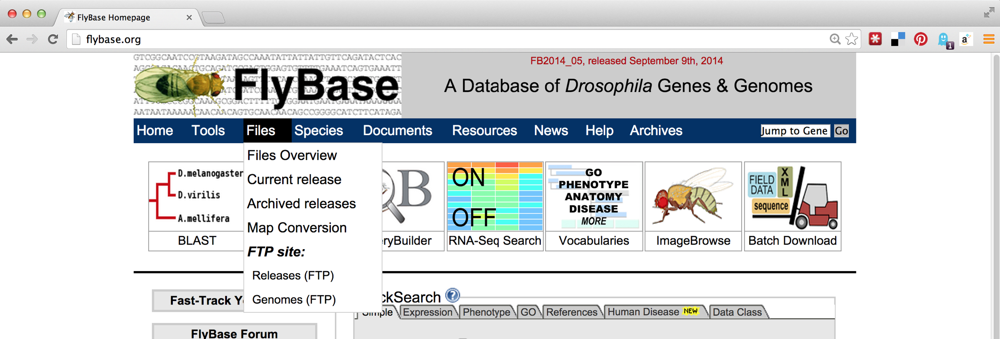
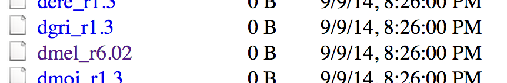
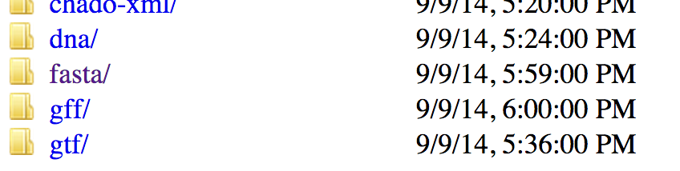
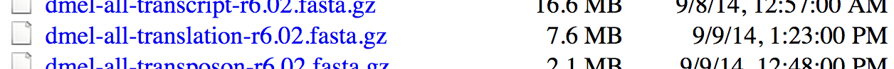
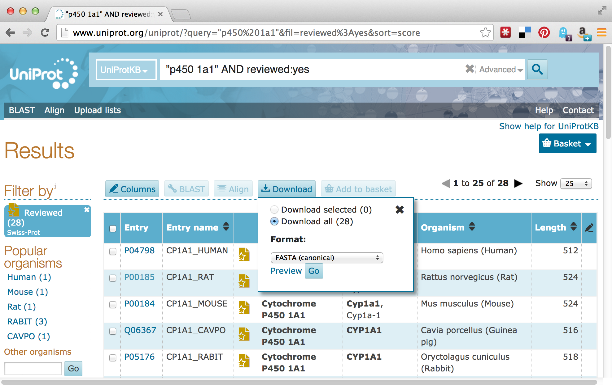
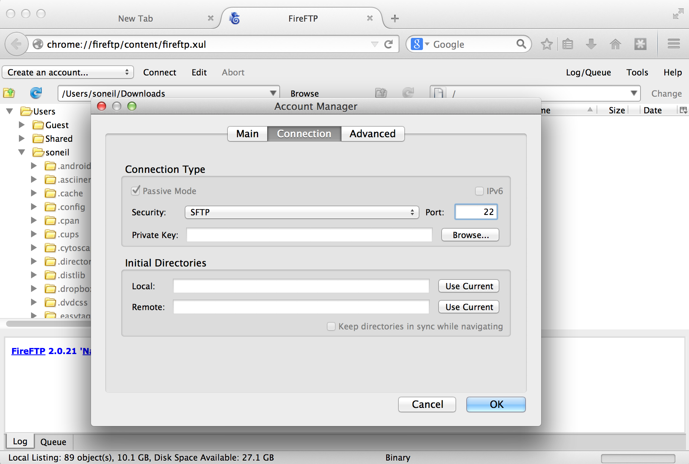
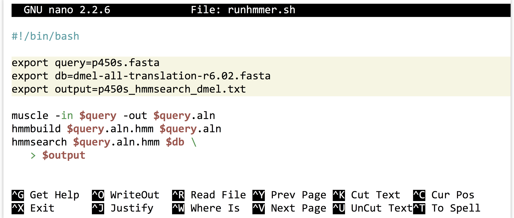

# Using (Bioinformatics) Software

Now that we’ve got the software installed for our example analysis, we’ll need to get some data. Supposing we don’t have any novel data to work with, we’ll ask the following question: can we identify, using HMMER and `muscle`, homologues of P450-1A1 genes in the *Drosophila melanogaster* protein data set? (This is a trivial example, as the *D. melanogaster* genome is already well annotated.)

### Getting Data {-}

The first step will be to download the *D. melanogaster* data set, which we can find on http://flybase.org, the genome repository for *Drosophila* genomes. Generally, genome repositories like FlyBase provide full data sets for download, but they can be difficult to find. To start, we’ll navigate to “Files,” then “Releases (FTP).”

  

From there, we’ll navigate to a recent release, like FB2014_05. Because genomic information is often being updated as better information becomes available, newer versions are indicated by newer releases.

  

Next we’ll see links for specific species; we’ll work with `dmel_r6.02`. It is often a good idea to note specific release numbers or release dates for data sets you download, for eventual description in the methods sections of any papers you write that are based on those data.

  

The most common format for sequence information is known as FASTA and is the format we want, so the next step is to navigate to the `fasta` directory. Other potentially interesting options include the `gff` and `gtf` directories, which hold text-based annotation files describing the location and function of genes in the genome. (These formats are often useful for RNA-seq analysis.)

  

Finally, we see a variety of gzipped files we can `wget` on the command line. Because we are interested in the full protein data set for this species, we will use the URL for `dmel-all-translation-r6.02.fasta.gz`.

  

Before running `wget` on the file, we’ll create a `projects` directory in our home directory, and a `p450s` directory inside there to work in.

<pre id=part1-07-mkdir-proj
     class="language-txt 
            line-numbers 
            linkable-line-numbers">
<code>
[oneils@mbp ~/downloads]$ <b>cd $HOME</b>
[oneils@mbp ~]$ <b>mkdir projects</b>
[oneils@mbp ~]$ <b>cd projects</b>
[oneils@mbp ~/projects]$ <b>mkdir p450s</b>
[oneils@mbp ~/projects]$ <b>cd p450s</b>
[oneils@mbp ~/projects/p450s]$ <b>wget 'ftp://ftp.flybase.net/releases/FB2014_05/dmel_r6.02/fasta/dmel-all-translation-r6.02.fasta.gz'</b>
</code></pre>

Because the file is gzipped, we can use `gunzip` to decompress it, and then use `less -S` to view the results without the long lines wrapped in the terminal window.

<pre id=part1-07-gunzip
     class="language-txt 
            line-numbers 
            linkable-line-numbers">
<code>
[oneils@mbp ~/projects/p450s]$ <b>gunzip dmel-all-translation-r6.02.fasta.gz</b>
[oneils@mbp ~/projects/p450s]$ <b>less -S dmel-all-translation-r6.02.fasta</b>
</code></pre>

The result illustrates the standard format for a FASTA file. Each sequence record begins with line starting with a `>` character, and the first non-whitespace-containing word following that is considered the sequence ID.

  

This line might then contain whitespace characters and metadata. Whitespace comprises a sequence of one or more spaces, tabs (represented in Unix/Linux as a special character sometimes written as `\t`), or newlines (represented in Unix/Linux as a special character sometimes written as `\n`) in a row.

Lines following the header line contain the sequence information, and there is no specific format for the number of lines over which the sequence may be broken, or how long those lines should be. After the last sequence line for a record, a new sequence record may start.

Depending on the source of the FASTA file, the IDs or metadata may represent multiple pieces of data; in this example, the metadata are separated by spaces and have a `<label>=<value>`; format that is specific to protein sequences from FlyBase.

For our next trick, we’ll download some P450-1A1 protein sequences from Uniprot.org. Uniprot.org is a well-known protein database, and it is composed of the “TrEMBL” database and the subset of TrEMBL, known as “Swiss-Prot.” While the former contains many sequences with annotations, many of those annotations have been assigned by automated homology searches and have not been reviewed. The latter, Swiss-Prot, contains only sequences whose annotations have been manually reviewed.

For the download, we’ll enter “p450 1A1” into the search field, and we’ll filter the results to only those in Swiss-Prot by clicking on the “Reviewed” link, resulting in 28 matches. Next, we can click on the “Download” button to download a “FASTA (canonical)” (rather than with all isoforms included) file.

  

The Uniprot website recently underwent a redesign, such that the downloaded file is transferred directly to the web browser, rather than presented as a URL that could be accessed with `wget`. This isn’t a problem, as it gives us a chance to discuss how to transfer files between the remote system and local desktop via SFTP.

Like SSH, SFTP is a common client/server protocol. Provided the server is running on the remote computer (in fact, it uses the same port as SSH, port 22, because SSH provides the secure connection), we just need to install and run an SFTP client on our desktop. There are many SFTP clients available for Microsoft Windows (e.g., Core-FTP), OS X (e.g., Cyberduck), and Linux systems (e.g., `sftp` on the command line or the graphical FileZilla). The client discussed here is called FireFTP, and it is available as an extension for the Mozilla Firefox web browser (itself available for Windows, OS X, and Linux). To get it requires installing and running Firefox, navigating to Tools → Addons, and searching for “FireFTP.”

  

Once the plugin is installed (which requires a restart of Firefox), we can access it from the Tools → Developer submenu. Connecting the client to a remote computer requires that we first configure the connection by selecting “Create an account.” The basic required information includes an account name, the host to connect to (e.g., an IP address like `128.196.64.120` or a host name like `files.institution.edu`), as well as our login name and password.

  

We also need to tell the client which protocol to connect with, which is done on the “Connection” tab; we want SFTP on port 22.

  

With that accomplished, we can transfer any file back and forth using the green arrows in the interface, where the remote filesystem is shown on the right and the local filesystem is shown on the left. Here’s the result after transferring our `p450s.fasta` file.

  

> ####  DOS/Windows and Unix/Linux Newlines {-}
> For the most part, the way text is encoded on Microsoft operating systems (like DOS and Windows) and on Unix-like systems (like Linux and OS X) is similar. But there is one difference: how the ends of lines, or “newline characters” are represented. In Unix-like systems, a newline is represented by a single 8-bit byte (the “Line Feed” (NF) character): `00001010`. On Microsoft systems, they are represented by a pair of 8-bit bytes (“Carriage Return” (CR) followed by NF): `0000110100001010`. This means that text files created on Microsoft operating files may not be readable on Unix-like systems, and vice versa.
>
> Fortunately, there are utilities available for converting between these formats. On the command line, the utilities `dos2unix` and `unix2dos` convert to and from Unix-like format, respectively. This isn’t often an issue, as most file transfer programs (FireFTP included) automatically perform the appropriate conversion. The command-line utility `file` can also be used to determine the type of a file, including its newline type.

### Putting It All Together {-}

At this point, we’ve obtained the data we wish to process, and we’ve successfully installed the software we intend to run on that data.

<pre id=part1-07-together
     class="language-txt 
            line-numbers 
            linkable-line-numbers">
<code>
[oneils@mbp ~/projects/p450s]$ <b>ls</b>
dmel-all-translation-r6.02.fasta  p450s.fasta
[oneils@mbp ~/projects/p450s]$ <b>which muscle</b>
/home/oneils/local/bin/muscle
[oneils@mbp ~/projects/p450s]$ <b>which hmmbuild</b>
/home/oneils/local/bin/hmmbuild
[oneils@mbp ~/projects/p450s]$ <b>which hmmsearch</b>
/home/oneils/local/bin/hmmsearch
</code></pre>

The first step is to run `muscle` on the `p450s.fasta` file to produce a multiple alignment. One quick way to identify how a program like `muscle` should be run (what parameters it takes) is to run it without any parameters. Alternatively, we could try the most common options for getting help: `muscle -h`, `muscle --help`, `muscle --h`, or `muscle -help`.

<pre id=part1-07-muscle-help
     class="language-txt 
            line-numbers 
            linkable-line-numbers">
<code>
[oneils@mbp ~/projects/p450s]$ <b>muscle</b>

MUSCLE v3.8.31 by Robert C. Edgar

http://www.drive5.com/muscle
This software is donated to the public domain.
Please cite: Edgar, R.C. Nucleic Acids Res 32(5), 1792-97.

Basic usage

    muscle -in &lt;inputfile&gt; -out &lt;outputfile&gt;

Common options (for a complete list please see the User Guide):

    -in &lt;inputfile&gt;    Input file in FASTA format (default stdin)
    -out &lt;outputfile&gt;  Output alignment in FASTA format (default stdout)
    -diags             Find diagonals (faster for similar sequences)
    -maxiters &lt;n&gt;      Maximum number of iterations (integer, default 16)
    -maxhours &lt;h&gt;      Maximum time to iterate in hours (default no limit)
    -html              Write output in HTML format (default FASTA)
...
</code></pre>

The most important line of this help text is the usage information: `muscle -in <inputfile> -out <outputfile>`; parameters in angle brackets indicate that the parameter is required (nonrequired parameters often appear in straight brackets). Further help text indicates other parameters that we could opt to add. Presumably, they could be placed before or after the input or output specifiers. So, we’ll run `muscle` on our `p450s.fasta` file, and produce a file whose file name indicates its pedigree in some way:

<pre id=part1-07-run-muscle
     class="language-txt 
            line-numbers 
            linkable-line-numbers">
<code>
[oneils@mbp ~/projects/p450s]$ <b>muscle -in p450s.fasta -out p450s.fasta.aln</b>
</code></pre>

Once the command has finished executing, we can view the alignment file with `less -S p450s.fasta.aln`.

<pre id=part1-07-less-result
     class="language-txt 
            line-numbers 
            linkable-line-numbers">
<code>
<b>>sp|P05176|CP1A1_RABIT Cytochrome P450 1A1 OS=Oryctolagus cuniculus GN=CYP1A1 PE
------------------------------------------------------------
---------------------------------------------------MVSDFGLPT
FISATELLLASAVFCLVFWVAGASKPRVPKGLKRLPGPWGWPLLGHVLTLGK---NPHV-
---ALARLSRRYGDVFQIRLGSTPVVVLSGLDTIKQALVRQGDDFKGRPDLYSFSFVTK-
-----------------------------GQSMIFGSDSGPV---------WAARRRLAQ
NALNSFSVAS--------------------------------------------------
----------------DPASSSSCYLEEHV---SQEAENLISK-FQELMAAVGH------</b>
</code></pre>

With further inspection, we’d see that the sequences have been made the same length by the insertion of gap characters. The next step is to run `hmmbuild` to produce the HMM profile. Again, we’ll run `hmmbuild` without any options to get information on what parameters it needs.

<pre id=part1-07-hmmbuild-help
     class="language-txt 
            line-numbers 
            linkable-line-numbers">
<code>
[oneils@mbp ~/projects/p450s]$ <b>hmmbuild</b>
Incorrect number of command line arguments.
Usage: hmmbuild [-options] &lt;hmmfile_out&gt; &lt;msafile&gt;

where basic options are:
  -h     : show brief help on version and usage
  -n &lt;s&gt; : name the HMM &lt;s&gt;
  -o &lt;f&gt; : direct summary output to file &lt;f&gt;, not stdout
  -O &lt;f&gt; : resave annotated, possibly modified MSA to file &lt;f&gt;

To see more help on other available options, do:
  hmmbuild -h
</code></pre>

The help output for `hmmbuild` is shorter, though the command also notes that we could run `hmmbuild -h` for more detailed information. The usage line, `hmmbuild [-options] <hmmfile_out> <msafile>`, indicates that the last two parameters are required, and are the name of the output file (for the profile HMM) and the multiple sequence alignment input file. The brackets indicate that, before these last two parameters, a number of optional parameters may be given, described later in the help output. In this case, `<hmmfile_out>` and `<msafile>` are positional: the second-to-last argument must specify the output, and the last must specify the input.

<pre id=part1-07-hmmbuild
     class="language-txt 
            line-numbers 
            linkable-line-numbers">
<code>
[oneils@mbp ~/projects/p450s]$ <b>hmmbuild p450s.fasta.aln.hmm p450s.fasta.aln</b>
</code></pre>

After this operation finishes, it may be interesting to take a look at the resulting HMM file with `less -S p450s.fasta.aln.hmm`. Here’s a snippet:

<pre id=part1-07-hmmbuild-less
     class="language-txt 
            line-numbers 
            linkable-line-numbers">
<code>
<b>CKSUM 797170701
STATS LOCAL MSV      -12.2089  0.69650
STATS LOCAL VITERBI  -13.2160  0.69650
STATS LOCAL FORWARD   -6.4971  0.69650
HMM          A        C        D        E        F        G        H        I   
            m->m     m->i     m->d     i->m     i->i     d->m     d->d
  COMPO   2.56763  4.18442  2.94826  2.71355  3.22576  2.92226  3.70840  2.94423
          2.68504  4.42336  2.77569  2.73176  3.46465  2.40496  3.72606  3.29362
          0.66606  1.72211  1.17901  3.05405  0.04832  0.00000        *
      1   3.15916  4.51751  4.70912  4.16707  3.23103  4.39232  4.76778  1.44083</b>
</code></pre>

With some documentation reading, we may even be able to decode how the probabilistic profile is represented in this matrix of letters and numbers. As a reminder, our project directory now contains the original sequence file, a multiple-alignment file, and the HMM profile file, as well as the *D. melanogaster* protein file in which we wish to search for the profile.

<pre id=part1-07-ls
     class="language-txt 
            line-numbers 
            linkable-line-numbers">
<code>
[oneils@mbp ~/projects/p450s]$ <b>ls</b>
dmel-all-translation-r6.02.fasta  p450s.fasta.aln
p450s.fasta                       p450s.fasta.aln.hmm
</code></pre>

At this point, we are ready to search for the profile in the *D. melanogaster* protein set with `hmmsearch`. As usual, we’ll first inspect the usage for `hmmsearch`.

<pre id=part1-07-hmmsearch-help
     class="language-txt 
            line-numbers 
            linkable-line-numbers">
<code>
[oneils@mbp ~/projects/p450s]$ <b>hmmsearch</b>
Incorrect number of command line arguments.
Usage: hmmsearch [options] &lt;hmmfile&gt; &lt;seqdb&gt;

where most common options are:
  -h : show brief help on version and usage

To see more help on available options, do hmmsearch -h
</code></pre>

This brief help text indicates that `hmmsearch` may take a number of optional parameters (and we’d have to run `hmmsearch -h` to see them), and the last two parameters are required. These last two parameters constitute the HMM profile file we are searching for, as well as the `<seqdb>` in which to search. It doesn’t say what format `<seqdb>` should be, so we’ll try it on our *D. melanogaster* FASTA file and hope for the best (if it fails, we’ll have to read more help text or documentation).

<pre id=part1-07-hmmsearch
     class="language-txt 
            line-numbers 
            linkable-line-numbers">
<code>
[oneils@mbp ~/projects/p450s]$ <b>hmmsearch p450s.fasta.aln.hmm dmel-all-trans
lation-r6.02.fasta</b>
</code></pre>

Note that there was no required option for an output file. Running this command causes quite a lot of information to be printed to the terminal, including lines like:

<pre id=part1-07-hmmsearch-out
     class="language-txt 
            line-numbers 
            linkable-line-numbers">
<code><b>...
  Alignments for each domain:
  == domain 1  score: 2.4 bits;  conditional E-value: 0.19
  p450s.fasta 433 sdekivpivndlfganfdtisvalswslpylvaspeigkklkke 476
                  + +++       f a+f+ is  l++   +l  +p ++ +l++e
  FBpp0086933 305 TADDLLAQCLLFFFAGFEIISSSLCFLTHELCLNPTVQDRLYEE 348
                  555566666667899***************************99 PP
...</b>
</code></pre>

And, when we run ls, we find that no output file has been created.

<pre id=part1-07-ls-no-out
     class="language-txt 
            line-numbers 
            linkable-line-numbers">
<code>
[oneils@mbp ~/projects/p450s]$ <b>ls</b>
dmel-all-translation-r6.02.fasta  p450s.fasta.aln
p450s.fasta                       p450s.fasta.aln.hmm
</code></pre>

###### {- #standard-output}

It seems that `hmmsearch`, by default, prints all of its meaningful output to the terminal. Actually, `hmmsearch` is printing its output to the *standard output* stream. Standard output is the primary output mechanism for command-line programs (other than writing files directly). By default, standard output, also known as “standard out” or “stdout,” is printed to the terminal.

###### {- #redirect}

Fortunately, it is possible to *redirect* the standard output stream into a file by indicating this to our shell with a `>` redirect operator, and specifying a file name or path. In this case, we’ll redirect the output of standard out to a file called `p450s_hmmsearch_dmel.txt`.

<pre id=part1-07-hmmsearch-redirect
     class="language-txt 
            line-numbers 
            linkable-line-numbers">
<code>
[oneils@mbp ~/projects/p450s]$ <b>hmmsearch p450s.fasta.aln.hmm dmel-all-trans
lation-r6.02.fasta  > p450s_hmmsearch_dmel.txt</b>
</code></pre>

When this command executes, nothing is printed, and instead our file is created. When using the `>` redirect, the file will be overwritten if it already exists. If, instead, we wished to append to an existing file (or create a new file if there is no file to append to), we could have used the `>>` redirect.

Here are the contents of our final analysis, a simple text file with quite a bit of information, including some nicely formatted row and column data, as displayed by `less -S p450s_hmmsearch_dmel.txt`.

<pre id=part1-07-hmmsearch-output
     class="language-txt 
            line-numbers 
            linkable-line-numbers">
<code>
<b>Query:       p450s.fasta  [M=730]
Scores for complete sequences (score includes all domains):
   --- full sequence ---   --- best 1 domain ---    -#dom-
    E-value  score  bias    E-value  score  bias    exp  N  Sequence    Descript
    ------- ------ -----    ------- ------ -----   ---- --  --------    --------
    1.2e-98  332.1   0.1      2e-98  331.3   0.1    1.2  1  FBpp0081483  type=pr
    1.2e-98  332.1   0.1      2e-98  331.3   0.1    1.2  1  FBpp0307731  type=pr
      7e-67  227.0   0.0      7e-67  227.0   0.0    1.5  1  FBpp0082768  type=pr
    9.5e-67  226.6   0.0    9.5e-67  226.6   0.0    2.1  1  FBpp0297168  type=pr</b>
</code></pre>

### Reproducibility with Scripts {-}

It is highly unlikely that an analysis of this type is performed only once. More often than not, we’ll wish to adjust or replace the input files, compare to different protein sets, or adjust the parameters for the programs ran. Thus it make sense to capture the analysis we just performed as an executable script, perhaps called `runhmmer.sh`.

  

Note in the above that we’ve broken the long `hmmsearch` line into two by ending it midway with a backslash and continuing it on the next line. The backslash lets `bash` know that more of the command is to be specified on later lines. (The backslash should be the last character on the line, with no spaces or tabs following.) After making this script executable with `chmod`, we could then rerun the analysis by navigating to this directory and running `./runhmmer.sh`.

What if we wanted to change the input file, say, to `argonase-1s.fasta` instead of `p450s.fasta`? We could create a new project directory to work in, copy this script there, and then change all instances of `p450s.fasta` in the script to `argonase-1s.fasta`.

Alternatively, we could use the power of [environment variables](#environment_variable) to architect our script in such a way that this process is easier.

  

Now the file names of interest are specified only once, near the top of the script, and from then on the script uses its own identifiers (as environment variables) to refer to them. Reusing this script would be as simple as changing the file names specified in three lines.

We can go a step further. It turns out that shell scripts can take parameters from the command line. The first parameter given to a script on the command line will be automatically stored in a variable accessible to the script called `$1`, the second parameter will be stored in `$2`, and so on. We can thus further generalize our script:

  

We could have replaced all instances of `$query` with `$1`, but this organization makes our script easier to read in the future, an important consideration when programming. Now we can run a full analysis by specifying the three relevant file names on the command line, as in: `./runhmmer.sh p450s.fasta dmel-all-translation-r6.02.fasta p450s_hmmsearch_dmel.txt`.

This [`runhmmer.sh`](data/runhmmer.sh) is a good candidate for inclusion in our `$HOME/local/bin` so that we can run it from anywhere, though we may want to add lines immediately following the `#!` line, to provide some help text for anyone who attempts to run the script without providing the correct inputs:

  

The “if block” above will only execute if the number of parameters given (`$#`) is not equal to 3. Although languages like Python provide much nicer facilities for this sort of logic-based execution, the ability to conditionally provide usage information for scripts is important. As usual for `bash`, the interpreter ignores lines that start with `#`.

#### Exercises {-}

1. Create a new folder in your `projects` folder called `c_elegans`. Locate the FASTA file for the reference genome of *Caenorhabditis elegans* from http://wormbase.org, and download it to this folder using `wget`. The file you are searching for will be named something like `c_elegans.PRJNA13758.WS244.genomic.fa.gz`. After it is downloaded, decompress it and view it with `less -S`.

2. Install an SFTP client on your desktop, like FireFTP or CyberDuck, and attempt to connect to the same machine you log in to via SFTP. Download a FASTA file of some potentially homologous sequences from Uniprot to your local desktop, and transfer it to your remote `c_elegans` directory.

3. Try running `muscle` and `HMMER` on the sequences you downloaded from uniprot.org against the *C. elegans* genome.

4. If you have access to more than one Unix-based machine (such as an OS X desktop and a remote Linux computer, or two remote Linux computers), read the man page for `scp` with `man scp`, and also read about it online. Try to transfer a file and a directory between machines using `scp` on the command line.

5. Write an executable `bash` script that automates a process of some kind, and install it in your `$HOME/local/bin`. Test it after logging out and back in.

