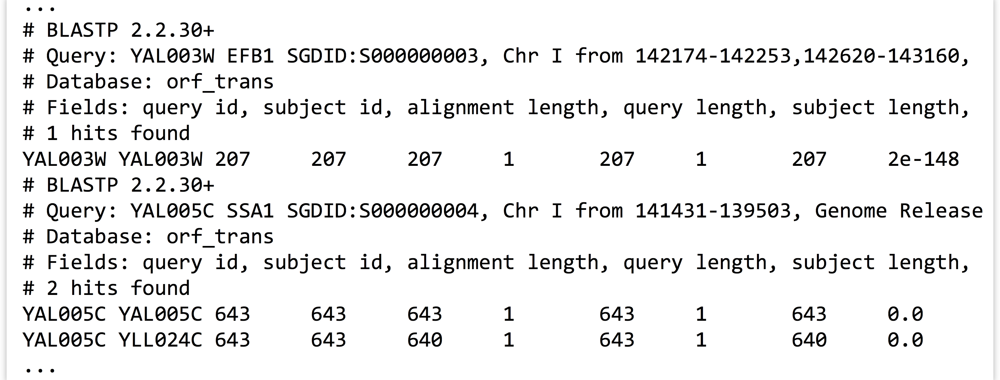

# Command Line BLAST

While the previous chapters covered installing and using a few bioinformatics tools as examples of the process, there is one nearly ubiquitous tool: BLAST, or Basic Local Alignment Search Tool.^[The original BLAST paper is by Stephen F. Altschul, Warren Gish, Webb Miller, Eugene W. Myers, and David J. Lipman, “Basic Local Alignment Search Tool,” *Journal of Molecular Biology* 215 (1990): 403–404. I’m convinced that naming bioinformatics tools exciting verbs like BLAST and HMMER results in greater usage.]

Given one or more *query* sequences (usually in FASTA format), BLAST looks for matching sequence regions between them and a *subject* set.

  

A sufficiently close match between subsequences (denoted by arrows in the figure above, though matches are usually longer than illustrated here) is called a high-scoring pair (HSP), while a query sequence is said to hit a target sequence if they share one or more HSPs. Sometimes, however, the term “hit” is used loosely, without differentiating between the two. Each HSP is associated with a “bitscore” that is based on the similarity of the subsequences as determined by a particular set of rules. Because in larger subject sets some good matches are likely to be found by chance, each HSP is also associated with an “E value,” representing the expected number of matches one might find by chance in a subject set of that size with that score or better. For example, an E value of 0.05 means that we can expect a match by chance in 1 in 20 similar searches, whereas an E value of 2.0 means we can expect 2 matches by chance for each similar search.

BLAST is not a single tool, but rather a suite of tools (and the suite grows over the years as more features and related tools are added). The most modern version of the software, called BLAST+, is maintained by the National Center for Biotechnology Information (NCBI) and may be downloaded in binary and source forms at [ftp://ftp.ncbi.nlm.nih.gov/blast/executables/blast+/LATEST/].

This chapter only briefly covers running BLAST on the command line in simple ways. Reading the help information (e.g., with `blastn --help`) and the NCBI BLAST Command Line Applications User Manual at http://www.ncbi.nlm.nih.gov/books/NBK1763/ is highly recommended. The NCBI manual covers quite a few powerful and handy features of BLAST on the command line that this book does not.

### BLAST Types {-}

The programs in the BLAST+ suite can search for and against sequences in protein format (as we did for the HMMER example) and in nucleotide format (A’s, C’s, T’s, and G’s). Depending on what type the query and subject sets are, different BLAST programs are used.

  

While two nucleotide sequences (N comparisons in the figure above) may be compared directly (as may two protein sequences, represented by P), when we wish to compare a nucleotide sequence to a protein sequence, we need to consider which reading frame of the nucleotide sequence corresponds to a protein. The `blastx` and `tblastn` programs do this by converting nucleotide sequences into protein sequences in all six reading frames (three on the forward DNA strand and three on the reverse) and comparing against all of them. Generally such programs result in six times as much work to be done. The `tblastx` program compares nucleotide queries against nucleotide subjects, but it does so in protein space with all six conversions compared to all six on both sides.

Other more exotic BLAST tools include `psiblast`, which produces an initial search and tweaks the scoring rules on the basis of the results; these tweaked scoring rules are used in a second search, generally finding even more matches. This process is repeated as many times as the user wishes, with more dissimilar matches being revealed in later iterations. The `deltablast` program considers a precomputed database of scoring rules for different types of commonly found (conserved) sequences. Finally, `rpsblast` searches for sequence matches against sets of profiles, each representing a collection of sequences (as in HMMER, though not based on hidden Markov models).

All this talk of scoring rules indicates that the specific scoring rules are important, especially when comparing two protein sequences. When comparing protein sequences from two similar species, for example, we might wish to give a poor score to the relatively unlikely match of a nonpolar valine (V) to a polar tyrosine (Y). But for dissimilar species separated by vast evolutionary time, such a mismatch might not be as bad relative to other possibilities. Scoring matrices representing these rule sets with names like BLOSUM and PAM have been developed using a variety of methods to capture these considerations. A discussion of these details can be found in other publications.

Each of the various programs in the BLAST suite accepts a large number of options; try running `blastn -help` to see them for the `blastn` program. Here is a summary of a few parameters that are most commonly used for `blastn` et al.:

<ul style="list-style-type:none;">
<li>`-subject <fasta file>`</li>
<ul style="list-style-type:none;"><li>The name (or path) of the FASTA-formatted file to search in as subject sequences.</li></ul>

<li>`-evalue <real number>`</li>
<ul style="list-style-type:none;"><li>Only HSPs with E values smaller than this should be reported. For example: `-evalue 0.001` or `-evalue 1e-6`.</li></ul>

<li>`-outfmt <integer>`</li>
<ul style="list-style-type:none;"><li>How to format the output. The default, `0`, provides a human-readable (but not programmatically parseable) text file. The values `6` and `7` produce tab-separated rows and columns in a text file, with `7` providing explanatory comment lines. Similarly, a value of `10` produces comma-separated output; `11` produces a format that can later be quickly turned into any other with another program called `blast_formatter`. Options `6`, `7`, and `10` can be highly configured in terms of what columns are shown.</li></ul>

<li>`-max_target_seqs <integer>`</li>
<ul style="list-style-type:none;"><li>When the output format is `6`, `7`, or `10` for each query sequence, only report HSPs for the first `<integer>` different subject sequences.</li></ul>

<li>`-max_hsps <integer>`</li>
<ul style="list-style-type:none;"><li>For each query/target pair, only report the best `<integer>` HSPs.</li></ul>

<li>`-out <output file>`</li>
<ul style="list-style-type:none;"><li>Write the output to `<output file>` as opposed to the default of [standard output](#standard_output).</li></ul>

### BLAST Databases {-}

No doubt readers familiar with BLAST have been curious: aren’t there *databases* of some kind involved in BLAST searches? Not necessarily. As we’ve seen, simple FASTA files will suffice for both the query and subject set. It turns out, however, that from a computational perspective, simple FASTA files are not easily searched. Thus BLAST+ provides a tool called `makeblastdb` that converts a subject FASTA file into an indexed and quickly searchable (but not human-readable) version of the same information, stored in a set of similarly named files (often at least three ending in `.pin`, `.psq`, and `.phr` for protein sequences, and `.nin`, `.nsq`, and `.nhr` for nucleotide sequences). This set of files represents the “database,” and the database name is the shared file name prefix of these files.

  

Running `makeblastdb` on a FASTA file is fairly simple: `makeblastdb -in <fasta file> -out <database name> -dbtype <type> -title <title> -parse_seqids`, where `<type>` is one of `prot` or `nucl`, and `<title>` is a human-readable title (enclosed in quotes if necessary). The `-parse_seqids` flag indicates that the sequence IDs from the FASTA file should be included in the database so that they can be used in outputs as well as by other tools like `blastdbcmd` (discussed below).

Once a BLAST database has been created, other options can be used with `blastn` et al.:

<ul style="list-style-type:none;">
<li>`-db <database name>`</li>
<ul style="list-style-type:none;"><li>The name of the database to search against (as opposed to using `-subject`).</li></ul>

<li>`-num_threads <integer>`</li>
<ul style="list-style-type:none;"><li>Use `<integer>` CPU cores on a multicore system, if they are available.</li></ul></ul>

When using the `-db` option, the BLAST tools will search for the database files in three locations: (1) the [present working directory](#present_working_directory), (2) your [home directory](#home_directory), and (3) the paths specified in the $BLASTDB [environment variable](#environment_variable).

The tool `blastdbcmd` can be used to get information about BLAST databases—for example, with `blastdbcmd -db <database name> -info`—and can show the databases in a given path with `blastdbcmd -list <path>` (so, `blastdbcmd -list $BLASTDB` will show the databases found in the default search paths). This tool can also be used to extract sequences or information about them from databases based on information like the IDs reported in output files. As always, reading the help and documentation for software like BLAST is highly recommended.

### Running a Self-BLAST {-}

To put these various tools and options to use, let’s consider using `blastp` to look for proteins that are similar in sequence to other proteins in the yeast exome. First, we’ll need to use `wget` to download the protein data set (after locating it at http://yeastgenome.org), and then `gzip -d` to decompress it, calling it [orf_trans.fasta](data/orf_trans.fasta).

<pre id=part1-08-wget
     class="language-txt 
            line-numbers 
            linkable-line-numbers">
<code>
[oneils@mbp ~/apcb/intro/blast]$ <b>wget 'http://downloads.yeastgenome.org/sequence/S288C_reference/orf_protein/orf_trans.fasta.gz' -O orf_trans.fasta.gz</b>
...
[oneils@mbp ~/apcb/intro/blast]$ <b>gzip -d orf_trans.fasta.gz</b>
[oneils@mbp ~/apcb/intro/blast]$ <b>ls</b>
orf_trans.fasta
</code></pre>

In order to find sequences that are similar to others, we’re going to want to `blastp` this file against itself. So, we’ll start by creating a database of these sequences.

<pre id=part1-08-makeblastdb
     class="language-txt 
            line-numbers 
            linkable-line-numbers">
<code>
[oneils@mbp ~/apcb/intro/blast]$ <b>makeblastdb -in orf_trans.fasta -out orf_trans -dbtype prot -title "Yeast Open Reading Frames" -parse_seqids</b>
...
[oneils@mbp ~/apcb/intro/blast]$ <b>ls</b>
orf_trans.fasta  orf_trans.pin  orf_trans.psd  orf_trans.psq
orf_trans.phr    orf_trans.pog  orf_trans.psi
</code></pre>

Now we need to determine what options we will use for the `blastp`. In particular, do we want to limit the number of HSPs and target sequences reported for each query? Because we’re mostly interested in determining which proteins match others, we probably only need to keep one hit. But each protein’s best hit will likely be to itself! So we’d better keep the top two with `-max_target_seqs 2` and only the best HSP per hit with `-max_hsps 1`. We’ll also use an `-evalue 1e-6`, a commonly used cutoff.^[Using an E-value cutoff of `1e-6` may not be the best choice; as with all analyses, some evaluations or literature guidance may be necessary, depending on the task at hand.]

For the output, we’ll create a tab-separated output with comment lines (`-outfmt 7`), creating columns for the query sequence ID, subject sequence ID, HSP alignment length, percentage identity of the alignment, subject sequence length, query sequence length, start and end positions in the query and subject, and the *E* value. (The coded names—`qseqid`, `sseqid`, `length`, etc.—can be found by running `blastp -help`.) Finally, we’ll call the output file [`yeast_blastp_yeast_top2.txt`](data/yeast_blastp_yeast_top2.txt) and use four processors to speed the computation (which will only really help if the machine we are logged in to has at least that many).

<pre id=part1-08-blastp
     class="language-txt 
            line-numbers 
            linkable-line-numbers">
<code>
[oneils@mbp ~/apcb/intro/blast]$ <b>blastp -query orf_trans.fasta -db orf_trans -max_target_seqs 2 -max_hsps 1 -evalue 1e-6 -outfmt '7 qseqid sseqid length qlen slen qstart qend sstart send evalue' -out yeast_blastp_yeast_top2.txt -num_threads 4</b>
</code></pre>

It’s a long command, to be sure! This operation takes several minutes to finish, even with `-num_threads 4` specified. When it does finish, we can see with `less` that the output file contains the columns we specified interspersed with the comment lines provided by `-outfmt 7`.

  

In the output snippet above, YAL0005C has an HSP with itself (naturally), but also one with YLL024C. We’ll consider basic analyses containing this sort of data—rows and columns stored in text files, interspersed with extraneous lines—in later chapters.

#### Exercises {-}

1. If you don’t already have the NCBI Blast+ tools installed, install them. Once you do, check the contents of the `$BLASTDB` environment variable. If it’s not empty, use `blastdbcmd` to determine whether you have the “nr” database available, and any information you can determine about it (when it was downloaded, how many sequences it has, etc.)

2. Create a new folder in your `projects` folder called `blast`. In this directory, download the [`p450s.fasta`](data/p450s.fasta) file and the yeast exome [`orf_trans.fasta`](orf_trans.fasta) from the book website. Create a database called `orf_trans` using `makeblastdb`, and use `blastp` to search the `p450s.fasta` file against it. When doing the search, use an *E*-value cutoff of `1e-6`, keep the top one target sequences, and produce an output file called `p450s_blastp_yeast_top1.blast` in output format `11`.

3. Use the `blast_formatter` tool to convert the output format `11` file above into an output format `6` called `p450s_blastp_yeast_top1.txt`, with columns for: (1) Query Seq-id, (2) Subject Seq-id, (3) Subject Sequence Length, (4) Percentage of Identical Matches, (5) E Value, (6) Query Coverage per Subject, and (7) Subject title. (You may find browsing the NCBI BLAST+ manual and the output of `blast_formatter -help` to be informative.) The output, when viewed with `less -S`, should look something like this: 

  

 

<ul style="list-style-type:none;">
<li>What do these various output columns represent?</li></ul>

4. The file [`yeast_selected_ids.txt`](data/yeast_selected_ids.txt) contains a column of 25 IDs identified as interesting in some way. Use `blastdbcmd` to extract just those sequence records from the `orf_trans` database as a FASTA file named `yeast_selected_ids.fasta`. (Again, browsing the BLAST+ manual and the output of `blastdbcmd -help` will be useful.)

