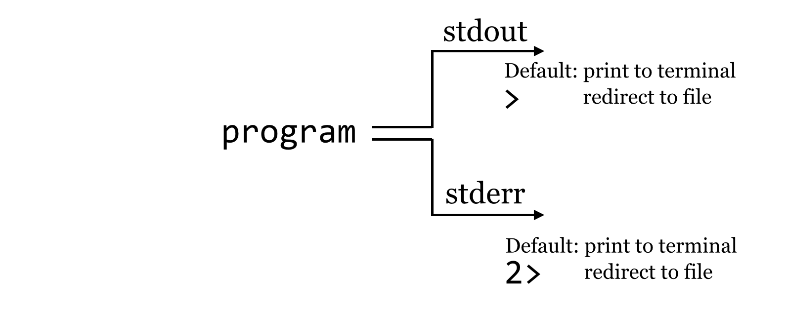
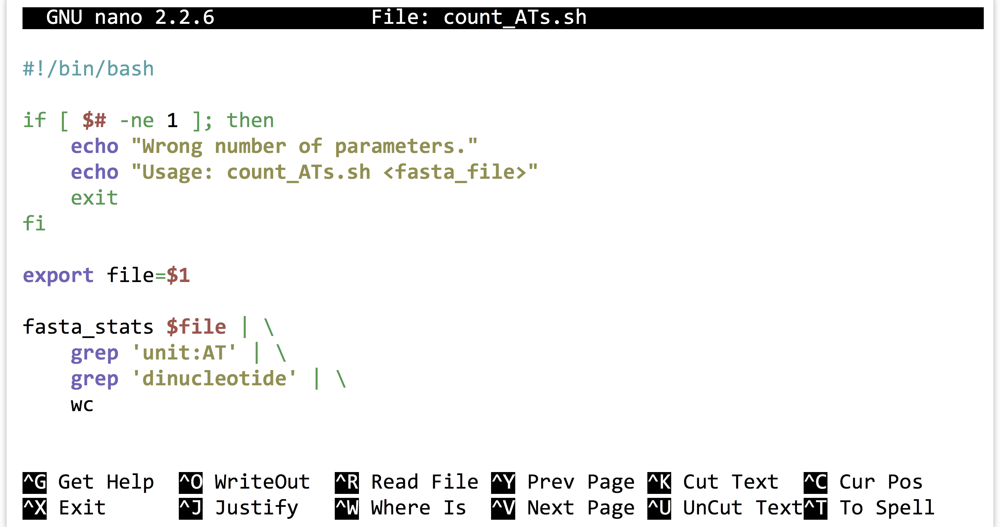

# The Standard Streams

In previous chapters, we learned that programs may produce output not only by writing to files, but also by printing them on the [standard output](#standard_output) stream. To further illustrate this feature, we’ve created a simple program called [`fasta_stats.py`](data/fasta_stats.py) that, given a FASTA file name as its first parameter, produces statistics on each sequence. We’ll also look at the file [`pz_cDNAs.fasta`](data/pz_cDNAs.fasta), which contains a set of 471 de novo assembled transcript sequences from *Papilio zelicaon*, and [`pz_cDNAs_sample.fasta`](data/pz_cDNAs_sample.fasta), which contains only the first two.

<pre id=part1-09-wget
     class="language-txt 
            line-numbers 
            linkable-line-numbers">
<code>
[oneils@mbp ~/apcb/intro]$ <b>mkdir fasta_stats</b>
[oneils@mbp ~/apcb/intro]$ <b>cd fasta_stats</b>
[oneils@mbp ~/apcb/intro/fasta_stats]$ <b>wget https://raw.githubusercontent.com/oneilsh/apcb_second_edition/master/data/fasta_stats.py</b>
--2021-09-28 09:23:59--  https://raw.githubusercontent.com/oneilsh/apcb_second_edition/master/data/fasta_stats.py
Resolving raw.githubusercontent.com (raw.githubusercontent.com)
...
[oneils@mbp ~/apcb/intro/fasta_stats]$ <b>chmod +x fasta_stats.py</b>
[oneils@mbp ~/apcb/intro/fasta_stats]$ <b>wget https://raw.githubusercontent.com/oneilsh/apcb_second_edition/master/data/pz_cDNAs.fasta</b>
...
[oneils@mbp ~/apcb/intro/fasta_stats]$ <b>wget https://raw.githubusercontent.com/oneilsh/apcb_second_edition/master/data/pz_cDNAs_sample.fasta</b>
...
[oneils@mbp ~/apcb/intro/fasta_stats]$ <b>ls</b>
fasta_stats.py  pz_cDNAs.fasta  pz_cDNAs_sample.fasta
</code></pre>

We can run the `fasta_stats.py` program (after making it executable) with `./fasta_stats.py pz_cDNAs_sample.fasta`.

<pre id=part1-09-fasta_stats
     class="language-txt 
            line-numbers 
            linkable-line-numbers">
<code>
[oneils@mbp ~/apcb/intro/fasta_stats]$ <b>./fasta_stats.py pz_cDNAs_sample.fasta</b>
# Column 1: Sequence ID
# Column 2: GC content
# Column 3: Length
# Column 4: Most common 5mer
# Column 5: Count of most common 5mer
# Column 6: Repeat unit of longest simple perfect repeat (2 to 10 chars)
# Column 7: Length of repeat (in characters)
# Column 8: Repeat type (dinucleotide, trinucleotide, etc.)
Processing sequence ID PZ7180000031590
PZ7180000031590 0.378 486 ACAAA 5 unit:ATTTA 10 pentanucleotide
Processing sequence ID PZ7180000000004_TX
PZ7180000000004_TX 0.279 1000 AAATA 12 unit:TAA 12 trinucleotide
</code></pre>

Based on the information printed, it appears that sequence `PZ7180000031590` has a GC content (percentage of the sequence composed of G or C characters) of 37.8%, is 486 base pairs long, the most common five-base-pair sequence is `ACAAA` (occurring 5 times), and the longest perfect repeat is 10 base pairs long, caused by the pentanucleotide `ATTTA`, occurring twice.

Much like `hmmsearch`, this program writes its output to [standard output](#standard_output). If we would like to save the results, we know that we can redirect the output of standard out with the `>` redirect.

<pre id=part1-09-redirect
     class="language-txt 
            line-numbers 
            linkable-line-numbers">
<code>
[oneils@mbp ~/apcb/intro/fasta_stats]$ <b>./fasta_stats.py pz_cDNAs_sample.fasta > pz_sample_stats.txt</b>
Processing sequence ID PZ7180000031590
Processing sequence ID PZ7180000000004_TX
[oneils@mbp ~/apcb/intro/fasta_stats]$ <b>ls</b>
fasta_stats.py  pz_cDNAs.fasta  pz_cDNAs_sample.fasta  pz_sample_stats.txt
</code></pre>

When we run this command, however, we see that even though the output file has been created, text is still printed to the terminal! If we use `less -S` to view the `pz_sample_stats.txt` file, we see that some of the output has gone to the file.

<pre id=part1-09-output
     class="language-txt 
            line-numbers 
            linkable-line-numbers">
<code>
<b># Column 1: Sequence ID
# Column 2: GC content
# Column 3: Length
# Column 4: Most common 5mer
# Column 5: Count of most common 5mer
# Column 6: Repeat unit of longest simple perfect repeat (2 to 10 chars)
# Column 7: Length of repeat (in characters)
# Column 8: Repeat type (dinucleotide, trinucleotide, etc.)
PZ7180000031590 0.378   486     ACAAA   5       unit:ATTTA      10      pentanuc
PZ7180000000004_TX      0.279   1000    AAATA   12      unit:TAA        12      </b>
pz_sample_stats.txt (END)
</code></pre>

###### {- #standard_error}

So what is going on? It turns out that programs can produce output (other than writing to files) on *two* streams. We are already familiar with the first, [standard output](#standard_output), which is by default printed to the terminal but can be redirected to a file with >. The second, called *standard error*, is also by default printed to the terminal but is not redirected with `>`.

By default, like standard output, standard error (also known as “standard err” or “stderr”) is printed to the terminal.

Because standard error usually contains diagnostic information, we may not be interested in capturing it into its own file. Still, if we wish, `bash` can redirect the standard error to a file by using the `2>` redirect.^[The `tcsh` and `csh` shells unfortunately cannot natively separately redirect stdout and stderr to files. A potential workaround looks like: `( ./fasta_stats pz_cDNAs_sample.fasta > pz_sample_stats.txt ) > & pz_sample_stats.err.txt`. This command runs two independent redirects; using parentheses causes the redirect of stdout to happen first, then the further redirect of stderr can occur next. How `bash`-compatible shells handle standard output and standard error is one of the primary reasons they are preferred over the older `csh`-compatible shells.]

<pre id=part1-09-stderr-redirect
     class="language-txt 
            line-numbers 
            linkable-line-numbers">
<code>
[oneils@mbp ~/apcb/intro/fasta_stats]$ <b>./fasta_stats.py pz_cDNAs_sample.fasta > pz_sample_stats.txt 2> pz_sample_stats.err.txt</b>
[oneils@mbp ~/apcb/intro/fasta_stats]$ <b>ls</b>
fasta_stats.py  pz_cDNAs.fasta  pz_cDNAs_sample.fasta  pz_sample_stats.txt  pz_sample_stats.err.txt
</code></pre>

We might pictorially represent programs and their output as alternative information flows:

  

### Filtering Lines, Standard Input {-}

###### {- #grep}

It can often be useful to extract lines from a file based on a pattern. For example, the `pz_sample_stats.txt` file contains information on what each column describes, as well as the data itself. If we want to extract all the lines that match a particular pattern, say, `unit:`, we can use the tool `grep` (for Global search for Regular Expression and Print), which prints to [standard output](#standard_output) lines that match a given pattern (or don’t match a given pattern, if using the `-v` flag): `grep '<pattern>' <file>`. To illustrate, we’ll first run fasta_stats on the full input file, redirecting the standard output to a file called `pz_stats.txt`.

<pre id=part1-09-pz_stats
     class="language-txt 
            line-numbers 
            linkable-line-numbers">
<code>
[oneils@mbp ~/apcb/intro/fasta_stats]$ <b>./fasta_stats.py pz_cDNAs.fasta > pz_stats.txt</b>
</code></pre>

Looking at the file with `less -S pz_stats.txt`, we can see that informational lines as well as data-containing lines are stored in the file:

<pre id=part1-09-pz-stats-output
     class="language-txt 
            line-numbers 
            linkable-line-numbers">
<code>
<b># Column 1: Sequence ID
# Column 2: GC content
# Column 3: Length
# Column 4: Most common 5mer
# Column 5: Count of most common 5mer
# Column 6: Repeat unit of longest simple perfect repeat (2 to 10 chars)
# Column 7: Length of repeat (in characters)
# Column 8: Repeat type (dinucleotide, trinucleotide, etc.)
PZ832049        0.321   218     CTTAA   4       unit:CGT        6       trinucle
PZ21878_A       0.162   172     ATTAA   8       unit:ATT        6       trinucle
PZ439397        0.153   111     TTAAT   5       unit:GAAAT      10      pentanuc
PZ16108_A       0.157   191     ATTAA   7       unit:ATT        6       trinucle
PZ21537_A       0.158   82      TTATT   3       unit:ATT        6       trinucle
PZ535325        0.108   120     AATTA   6       unit:TA 6       dinucleotide
...</b>
</code></pre>

To get rid of the informational lines, we can use `grep` to extract the other lines by searching for some pattern they have in common; in this case, the pattern `unit:` will do. Because grep prints its results to standard output, we will need to redirect the modified output to a file called, perhaps, `pz_stats.table` to indicate its tabular nature.

<pre id=part1-09-grep
     class="language-txt 
            line-numbers 
            linkable-line-numbers">
<code>
[oneils@mbp ~/apcb/intro/fasta_stats]$ <b>grep 'unit:' pz_stats.txt > pz_stats.table</b>
</code></pre>

This time, `less -S pz_stats.table` reveals only the desired lines.

<pre id=part1-09-pz-grep-output
     class="language-txt 
            line-numbers 
            linkable-line-numbers">
<code>
<b>PZ832049        0.321   218     CTTAA   4       unit:CGT        6       trinucle
PZ21878_A       0.162   172     ATTAA   8       unit:ATT        6       trinucle
PZ439397        0.153   111     TTAAT   5       unit:GAAAT      10      pentanuc
PZ16108_A       0.157   191     ATTAA   7       unit:ATT        6       trinucle
PZ21537_A       0.158   82      TTATT   3       unit:ATT        6       trinucle
PZ535325        0.108   120     AATTA   6       unit:TA 6       dinucleotide
...</b>
</code></pre>

Rather than viewing the file with `less`, we can also count the number of lines present in the file with the `wc` tool, which counts the number of lines, words, and characters of input: `wc <file>`.

Working with the cleaned data table reveals that our program produced 21,131 characters broken into 3,297 words among 471 lines of data output.

<pre id=part1-09-wc
     class="language-txt 
            line-numbers 
            linkable-line-numbers">
<code>
[oneils@mbp ~/apcb/intro/fasta_stats]$ <b>wc pz_stats.table</b>
  471  3297 21131 pz_stats.table
</code></pre>

###### {- #standard_input}

This sort of command-line-driven analysis can be quite powerful, particularly because many of these programs—like `less`, `grep`, and `wc`—can both print their results on standard output and read input from *standard input* rather than from a file. Standard input is the secondary input mechanism for command-line programs (other than reading from files directly). By default, standard input, or “stdin”, is unused.

How can we get input to a program on its standard input? It turns out that the easiest way to do so is to *redirect* the standard output of another program to it using the `|`, also known as the “pipe,” redirect (found above the Enter key on most keyboards). In this case, the data come in “on the left”:

  

To drive this home, we’ll first remove our `pz_stats.table` file, and then rerun our `grep` for `unit:` on the `pz_stats.txt` file, but rather than send the result of `grep` to a file with the `>` redirect, we’ll direct it straight to the standard input of `wc` with a `|` redirect.

<pre id=part1-09-pipe
     class="language-txt 
            line-numbers 
            linkable-line-numbers">
<code>
[oneils@mbp ~/apcb/intro/fasta_stats]$ <b>grep 'unit:' pz_stats.txt | wc</b>
    471    3297   21131
</code></pre>

In this example, we’ve neither created a new file nor specified a file for `wc` to read from; the data are stored in a temporary buffer that is handled automatically by the shell and operating system. The `less` program can also read from standard input, so if we wanted to see the contents of the `grep` without creating a new file, we could run `grep 'unit:' pz_stats.txt | less -S`.

Recall that the `fasta_stats` program wrote its output to standard out, and because `grep` can read from standard input as well, we can process the entire FASTA file without needing to create any new files by using multiple such buffers:

<pre id=part1-09-pipe-line
     class="language-txt 
            line-numbers 
            linkable-line-numbers">
<code>
[oneils@mbp ~/apcb/intro/fasta_stats]$ <b>./fasta_stats pz_cDNAs.fasta | grep 'unit:' | wc</b>
</code></pre>

When this command runs, the results printed by `fasta_stats` on standard error will still be printed to the terminal (as that is the default and we didn’t redirect standard error), but the standard output results will be filtered through `grep` and then filtered through `wc`, producing the eventual output of 471 lines.

At this point, the longish nature of the commands and the fact that our terminal window is only so wide are making it difficult to read the commands we are producing. So, we’ll start breaking the commands over multiple lines by ending partial commands with backslashes. Just as in the shell scripts we wrote at the end of chapter 7, “[Using (Bioinformatics) Software](using-bioinformatics-software.html)”, using backslashes will let the shell know that we aren’t finished entering the command. However, the `bash` shell indicates that a command spans multiple lines by showing us a `>`, which shouldn’t be confused with the redirect character that we might type ourselves. The following example shows the exact same command in a more readable form broken over multiple lines, but the highlighted characters have not been typed.

<pre id=part1-09-pipe-line
     class="language-txt 
            line-numbers 
            linkable-line-numbers">
<code>
[oneils@mbp ~/apcb/intro/fasta_stats]$ <b>./fasta_stats pz_cDNAs.fasta | \ </b>
> <b>grep 'unit:' | \ </b>
> <b>wc</b>
</code></pre>

A chain of commands like the above, separated by pipe characters, is often called a “pipeline.” More generally, though, a pipeline can describe any series of steps from input data to output data (as in the Muscle/HMMER series covered in chapter 7).

### Counting Simple AT Repeats {-}

Let’s expand on the small pipeline above to inspect just the “simple” AT repeats, that is, those that are the string “AT” repeated one or more times. We can start with what we have, but rather than just searching for `unit:`, we’ll modify the pattern to find `unit:AT`, and see what we get:

<pre id=part1-09-grep-AT
     class="language-txt 
            line-numbers 
            linkable-line-numbers">
<code>
[oneils@mbp ~/apcb/intro/fasta_stats]$ <b>./fasta_stats pz_cDNAs.fasta | \ </b>
> <b>grep 'unit:AT' | \ </b>
> <b>less -S</b>
</code></pre>

The resulting output is close to what we hoped for, but not quite complete, as this pattern also matches things like `unit:ATT` and `unit:ATG`.

<pre id=part1-09-AT-grep-output
     class="language-txt 
            line-numbers 
            linkable-line-numbers">
<code>
<b>PZ21878_A       0.162   172     ATTAA   8       unit:ATT        6       trinucle
PZ16108_A       0.157   191     ATTAA   7       unit:ATT        6       trinucle
PZ21537_A       0.158   82      TTATT   3       unit:ATT        6       trinucle
PZ7180000031590 0.378   486     ACAAA   5       unit:ATTTA      10      pentanuc
PZ7180000031597 0.287   403     ATTAT   6       unit:ATTTTG     12      hexanucl
PZ7180000025478 0.516   829     TGATG   18      unit:ATG        18      trinucle
...</b>
</code></pre>

We probably want to further filter the output, but based on what pattern? In this case, those lines that match not only `unit:AT`, but also the term `dinucleotide`. Rather than attempt to produce a single complicated pattern that does this job in a single `grep`, we can add another `grep` call into the pipeline.

<pre id=part1-09-grep-grep
     class="language-txt 
            line-numbers 
            linkable-line-numbers">
<code>
[oneils@mbp ~/apcb/intro/fasta_stats]$ <b>./fasta_stats pz_cDNAs.fasta | \ </b>
> <b>grep 'unit:AT' | \ </b>
> <b>grep 'dinucleotide' | \ </b>
> <b>less -S</b>
</code></pre>

This command results in the output we want:

<pre id=part1-09-grep-grep-output
     class="language-txt 
            line-numbers 
            linkable-line-numbers">
<code>
<b>PZ7180000031598 0.209   81      AATAT   5       unit:AT 6       dinucleotide
PZ463243        0.226   97      TTGTA   3       unit:AT 4       dinucleotide
PZ7180000000106_T       0.246   1044    AAAAA   22      unit:AT 10      dinucleo
PZ17593_A       0.157   76      ATTAA   5       unit:AT 4       dinucleotide
PZ492422        0.144   90      ATTAA   5       unit:AT 4       dinucleotide
PZ22453_A       0.267   269     ATTAA   8       unit:AT 4       dinucleotide
...</b>
</code></pre>

Rather than run the results through `less -S`, we could instead use `wc` to count the simple (dinucleotide) AT repeats. There is an important concept at play here, that of *iterative development*, the idea that as we get closer to a solution, we inspect the results and repeat as necessary. Iterative development is a good strategy for many areas in life, but it is essential and pervasive in computing.

Once we’ve decided that we like the small computational process we have created, we might decide to encapsulate it and make it repeatable as a shell [script](#script), perhaps called [`count_ATs.sh`](data/count_ATs.sh).

  

The above script will need to be made executable and placed in a location referenced by `$PATH`, as will the `fasta_stats` program.

#### Exercises {-}

1. Use `grep` and `wc` to determine how many sequences are in the file [`orf_trans.fasta`](data/orf_trans.fasta) without creating any temporary files.

2. How many sequence headers in the file [`orf_trans.fasta`](data/orf_trans.fasta) have the term “polymerase”?

3. Some of the sequence headers in [`orf_trans.fasta`](data/orf_trans.fasta) have the phrase “Verified ORF” to indicate that the open reading frame has been verified experimentally. Some also have the term “reverse complement” to indicate that the ORF (open reading frame) is present on the reverse complement sequence of the canonical genome description. How many sequences are verified ORFs *and* are not on the reverse complement?

4. The sequence headers in [`orf_trans.fasta`](data/orf_trans.fasta) have information on the chromosome from which they originate, such as `Chr I` or `Chr II`. How many sequences are present on chromosome I?

