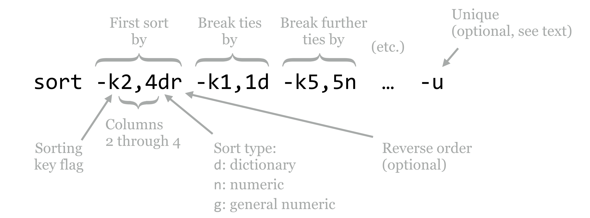

# Sorting, First and Last Lines

Continuing with the `fasta_stats` examples from chapter 9, [“The Standard Streams”](the-standard-streams.html), the seventh column of the output contains the length of the longest perfect repeat, in characters.

<pre id=part1-10-fasta_stats
     class="language-txt 
            line-numbers 
            linkable-line-numbers">
<code>
[oneils@mbp ~/apcb/intro/fasta_stats]$ <b>./fasta_stats pz_cDNAs_sample.fasta</b>
# Column 1: Sequence ID
# Column 2: GC content
# Column 3: Length
# Column 4: Most common 5mer
# Column 5: Count of most common 5mer
# Column 6: Repeat unit of longest simple perfect repeat (2 to 10 chars)
# Column 7: Length of repeat (in characters)
# Column 8: Repeat type (dinucleotide, trinucleotide, etc.)
Processing sequence ID PZ7180000031590
PZ7180000031590 0.378 486 ACAAA 5 unit:ATTTA 10 pentanucleotide
Processing sequence ID PZ7180000000004_TX
PZ7180000000004_TX 0.279 1000 AAATA 12 unit:TAA 12 trinucleotide
</code></pre>

Which sequence contains the longest perfect repeat? To answer this question, we could consider sorting the lines according to this seventh column. (First, we’ll have to remove the header lines themselves, which we can accomplish by filtering out lines matching `#` using the `-v` flag of [grep](#grep), or by grepping for `unit:`, as in chapter 9.) Enter `sort`, which sorts lines from a text file (or from [standard input](#standard_input)) by specified columns: `sort <file>` or `... | sort`.

By default, `sort` sorts by all columns, by comparing the entire lines in “dictionary,” or [lexicographic order](#lexicographic_order). To sort by specific columns, we need to use a rather sophisticated syntax. We’ll illustrate with a figure.

  

The `sort` utility takes many potential parameters, though the most important are the `-k` parameters that specify the columns by which to sort and how that sorting should be done, and occasionally the `-u` flag. The `-k` (key) parameters are considered in order; the above specifies that the sorting should be done on columns 2 through 4 (conglomerated into a single “column”), considering them in dictionary order, and sorting them in reverse. In the case of ties, only the first column is considered in normal dictionary order, and in the case of further ties, the fifth column is considered in numeric order.^[A word of caution: if a column contains an entry that cannot be interpreted as an integer or general number, it will be treated as `0` in the sorting order.] (The difference between `n` and `g` ordering is that `g` can handle entries in scientific notation like `1e-6`, but generally `n` is preferred because it is faster and not subject to small rounding errors.)

The optional `-u` flag (which may be specified before or after the keys, or even mixed in) specifies that after all the keys are considered, if there are still any ties between rows, then only the first row should be output. It outputs only “unique” lines according to the overall sorting order.

By default, `sort` uses [whitespace](#whitespace) as the column separator, though it can be changed (run `man sort` for more information). To view information about the longest perfect repeat, we will use `sort -k7,7nr`, indicating that we wish sort on the seventh column only, in reverse numeric order.

<pre id=part1-10-sort
     class="language-txt 
            line-numbers 
            linkable-line-numbers">
<code>
[oneils@mbp ~/apcb/intro/fasta_stats]$ <b>./fasta_stats pz_cDNAs.fasta | \</b>
> <b>grep -v '#' | \</b>
> <b>sort -k7,7nr | \</b>
> <b>less -S</b>
</code></pre>

The first few lines of output indicate that the longest perfect repeat is 94 bases long and occurs in sequence `PZ805359` (this sequence’s GC content is `0`, because it’s composed entirely of a long AT repeat).

<pre id=part1-10-sort-out
     class="language-txt 
            line-numbers 
            linkable-line-numbers">
<code>
<b>PZ805359        0.0     101     ATATA   47      unit:AT 94      dinucleotide
PZ796092        0.365   361     TACGT   9       unit:GTACGT     48      hexanucl
PZ7180000019700 0.375   564     GAGTG   12      unit:GAGTG      30      pentanuc
PZ7180000028921 0.31    561     TGTAA   8       unit:CTGTG      30      pentanuc
PZ851952        0.399   338     TATAT   12      unit:AT 24      dinucleotide
PZ7180000000664_B       0.3     652     TTTTT   18      unit:TAAAATTAT  18      
PZ7180000023622 0.31    687     TTAAT   9       unit:TGA        18      trinucle
PZ7180000023665_ATQ     0.401   508     ACTGA   5       unit:TGACACTGA  18      
PZ7180000025478 0.516   829     TGATG   18      unit:ATG        18      trinucle
PZ7180000030412 0.461   258     TGATG   8       unit:ATG        18      trinucle
PZ7180000036892 0.268   548     AATAA   16      unit:TAA        18      trinucle
PZ801814        0.262   255     TTACA   5       unit:TATTTACAT  18      enneanuc
...</b>
</code></pre>

The results also indicate that there are a number of ties; several sequences contain perfect repeats of length 18 base pairs. If we only wanted one sequence reported per different repeat length, we could try `sort -k7,7nr -u`. We could alternatively modify our sort to secondarily sort by GC content (second column), `sort -k7,7nr -k2,2g`.

A useful trick is to perform two sorts: one that initially sorts the data on whatever criteria are wanted, and a second that gets only the first line of a group based on secondary criteria. We may wish report only the highest GC content sequence per different repeat length, for example. We can initially use a `sort -k7,7nr -k2,2gr` to sort by repeat length and break ties by GC content, leaving the highest-GC-content sequences on top. From there, we can use a `sort -k7,7nr -u` to re-sort the data (even though they are already sorted!) by the seventh column, keeping only the top line per repeat length.

<pre id=part1-10-double-sort
     class="language-txt 
            line-numbers 
            linkable-line-numbers">
<code>
[oneils@mbp ~/apcb/intro/fasta_stats]$ <b>./fasta_stats pz_cDNAs.fasta | \</b>
> <b>grep -v '#' | \</b>
> <b>sort -k7,7nr -k2,2gr | \</b>
> <b>sort -k7,7nr -u | \</b>
> <b>> less -S</b>
</code></pre>

Output:

<pre id=part1-10-double-sort-out
     class="language-txt 
            line-numbers 
            linkable-line-numbers">
<code>
<b>PZ805359        0.0     101     ATATA   47      unit:AT 94      dinucleotide
PZ796092        0.365   361     TACGT   9       unit:GTACGT     48      hexanucl
PZ7180000019700 0.375   564     GAGTG   12      unit:GAGTG      30      pentanuc
PZ851952        0.399   338     TATAT   12      unit:AT 24      dinucleotide
PZ7180000025478 0.516   829     TGATG   18      unit:ATG        18      trinucle
PZ7180000000447_B       0.484   578     ATCCA   7       unit:TCCA       16      
...</b>
</code></pre>

There is one small concern, however: how can we be sure that our careful ordering by GC content wasn’t undone in the second sort? After all, the second sort would technically be free to reorder ties according to the seventh column, resulting in incorrect output. There is an additional flag for sort, the `-s` flag, indicating that stable sorting should be used. Stable sorting means that, in the case of ties, elements are left in their original order. So, to be safe, we could use a secondary sort of sort `-k7,7nr -u -s`, though a careful reading of the documentation for `sort` indicates that on most systems the `-u` flag implies the `-s` flag.

### First and Last Lines {-}

Often we wish to extract from a file (or from [standard input(#standard_input)]) the first or last few lines. The tools `head` and `tail` are designed to do exactly this, and in combination with other tools are surprisingly handy. The `head` tool extracts the first lines of a file or standard input: `head -n <number> <file>` or `... | head -n <number>`. The tail tool extracts the last lines of a file or standard input: `tail -n <number> <file>` or `... | tail -n <number>`.

The `head` and `tail` utilities, like the others covered previously, write their output to [standard output](#standard_output), and so they can be used within pipelines. They are often employed to inspect the beginning or end of a file (to check results or formatting). They also commonly extract test data sets. For example, `head -n 40000 input.fastq > test.fastq` would extract the first 10,000 sequence records from `input.fastq` and produce `test.fastq` (because every four lines of a FASTQ sequence file represents information for a single sequence).

<pre id=part1-10-fastq
     class="language-txt 
            line-numbers 
            linkable-line-numbers">
<code>
<b>@DB775P1:229:C1JDAACXX:3:1101:17936:7565 1:N:0:
CTATTACTGCCTGCAACAACATAAGGATACCATAAATTGTAATTCTTAACAAAGCAGAGATCGGAAGAGCGGTTCAGCAG
+
CCCFFFFFHHHHGJIJJJJJGGJJJJJJJIJIJJJJGIGIIIJJJJJJJJGIJJIIIJJIHIIIJJIJJIHHEDFCEEEE
@DB775P1:229:C1JDAACXX:3:1101:17888:7593 1:N:0:
TACATCAGCAAACCACCAGTGGTACGCAAATACATGGTGCTTCTTTAATCTTCAGTCCTCGGCTTTCCTCATATATCACT
+
CCCFFFFFHHHHHJJJJJJHIJHHIJJJJJJJJJJJJFHIJJJJJJJJJJJJJJJIJJJJIIJJJHHHHHHFFFFFFFEE
@DB775P1:229:C1JDAACXX:3:1101:17820:7597 1:N:0:
GTAACTGCACCATATGCTGGATTCTGGACAATGAATATCGAAGTAAATAAGAAAACCTCATACCTCATCTTTCTCAATGG
+
BCCDFFEFHHHHHJJJJJIJIJJIJJJJJIIGIIIDFIIJIJIFHIJGGIGIJJJIJHJIGHGDIJCEEGHIGIGCACEF
...</b>
</code></pre>

The above shows the first 12 lines of a FASTQ file generated on an Illumina HiSeq 2000. The first line in each set of four represents an identifier for the sequence read, the second line contains the sequence itself, the third line is often unused (containing only a `+`, though it may be followed by the identifier and other optional data), and the fourth line contains the “quality” of each base in the sequence encoded as a character. (The encoding has varied in the past, but in recent years, sequencing companies have standardized the encoding used by Sanger sequencing machines.)

With a bit of modified syntax, `tail` can also be used to extract all lines of a file starting at a given line. As an example, `tail -n +5 input.fastq > test.fastq` would result in `test.fastq` having all but the first sequence record of `input.fastq` (i.e., starting at the fifth line). This feature is especially useful for stripping off header lines of output or files before further processing, as in `./fasta_stats pz_cDNAs.fasta | tail -n +9`, rather than using g`rep -v '#'` above.

#### Exercises {-}

1. Running [fasta_stats.py](data/fasta_stats.py) on [pz_cDNAs.fasta](data/pz_cDNAs.fasta), the seventh column represents the length of the longest perfect repeat found in each sequence. Use only `grep`, `sort`, `wc`, `head`, and `tail` to determine the median value in this column. (You may need to run multiple commands or pipelines.)

2. Running [fasta_stats.py](data/fasta_stats.py) on [pz_cDNAs.fasta](data/pz_cDNAs.fasta), how many different perfect repeat units (column six) are found?

3. The file [pz_blastx_yeast_top10.txt](data/pz_blastx_yeast_top10.txt) is the result of running `blastx -query ../fasta_stats/pz_cDNAs.fasta -db orf_trans -evalue 1e-6 -max_target_seqs 10 -max_hsps 1 -outfmt 7 -out pz_blastx_yeast_top1.txt`. Aside from the “comment” lines that start with `#`, the first column is the query ID, the second the target (yeast) ID, the third the percentage identity of the HSP, the eleventh the E value, and the twelfth the “bitscore.” Which query ID had the largest bitscore? How many different query sequences (entries in the first column) had one or more HSPs against the database?

4. Extract from [pz_blastx_yeast_top10.txt](data/pz_blastx_yeast_top10.txt) a file called `pz_blastx_yeast_top1.txt` containing only the smallest *E*-valued HSP line per query ID. (You may remove comment lines starting with `#` altogether.)

