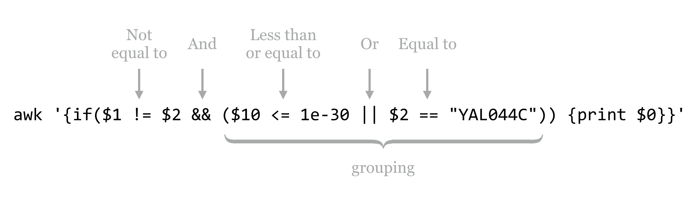

# Rows and columns

Let’s return to the output of the yeast proteins versus yeast proteins self-BLAST we performed previously, from the file [`yeast_blastp_yeast_top2.txt`](data/yeast_blastp_yeast_top2.txt).

<pre id=part1-11-yeast-top2
     class="language-txt 
            line-numbers 
            linkable-line-numbers">
<code>
<b># BLASTP 2.2.30+
# Query: YAL003W EFB1 SGDID:S000000003, Chr I from 142174-142253,142620-143160, 
# Database: orf_trans
# Fields: query id, subject id, alignment length, query length, subject length, 
# 1 hits found
YAL003W YAL003W 207     207     207     1       207     1       207     2e-148
# BLASTP 2.2.30+
# Query: YAL005C SSA1 SGDID:S000000004, Chr I from 141431-139503, Genome Release
# Database: orf_trans
# Fields: query id, subject id, alignment length, query length, subject length, 
# 2 hits found
YAL005C YAL005C 643     643     643     1       643     1       643     0.0
YAL005C YLL024C 643     643     640     1       643     1       640     0.0
...</b>
</code></pre>

Let’s ask the following: how many sequences in this data set had a match to some other sequence? To start with, we would probably use a `grep -v '#'` to remove all of the comment lines, but then what? We could try using `wc` to count the lines, but only after also removing the self-hits, where the ID in the first column is equal to the ID in the second column. None of the utilities we’ve seen so far—`grep`, `sort`, `head`, or `tail`—can perform this task. We need a new tool, `awk`, which is a line-by-line and column-by-column processing tool for text files: `awk '<program>' <file>` or `... | awk '<program>'`.

Written in the late 1970s and named after its authors (Alfred Aho, Peter Weinberger, and Brian Kernigan), `awk` provides a sophisticated programming language that makes it easy to parse tabular data like the BLAST results above. The syntax for `awk` can be fairly complex, but much of the complexity can be ignored in regular use.

First, let’s answer our specific question, of how many sequences had matches to other sequences, and then we’ll look at some `awk` syntax more generally. The `awk` command that we want, printing only those lines where the first two columns are not equal, is `awk '{if($1 != $2) {print $0}}'`.

<pre id=part1-11-awk
     class="language-txt 
            line-numbers 
            linkable-line-numbers">
<code>
oneils@mbp ~/apcb/intro/blast$ <b>cat yeast_blastp_yeast_top2.txt | \
> grep -v '#' | \
> awk '{if($1 != $2) {print $0}}' | \
> less -S
</b></code></pre>

Breaking down the `awk` command, the “program” that is executed is delimited by the single quotes (which collate their contents into a single command line parameter that is sent to the `awk` program). The code inside the outer pair of curly brackets is executed for each line. For each line, if the contents of the first column (represented by `$1`) are not equal to (`!=)` the second column (`$2`), then the code in the following pair of curly brackets is executed, and the line (`$0`) is printed (to [standard output](#standard_output)).

<pre id=part1-11-awk-output
     class="language-txt 
            line-numbers 
            linkable-line-numbers">
<code><b>
YDR534C YOR383C 134     529     205     1       129     1       134     7e-33
YDR536W YEL069C 525     570     565     21      532     50      553     6e-59
YDR541C YOL151W 342     345     343     4       345     2       343     6e-150
YDR542W YGL261C 121     121     121     1       121     1       121     3e-83
YDR545W YOR396W 1797    1797    1797    1       1797    1       1797    0.0
YDR545W YLR467W 1797    1797    1797    1       1797    1       1797    0.0
YEL006W YIL006W 330     336     374     15      330     41      365     4e-130
...
</b></code></pre>

In theory, at this point we should be able to replace the `less -S` with a `wc` to count the lines, and thus counting the number of sequences that had matches to other sequences. Unfortunately, in this case, theory doesn’t align with reality: inspecting the output above reveals that ID `YDR545W` is still represented by two lines, so this sequence would be counted twice.

Why? In the BLAST command, we requested the top two HSPs per query with `-max_target_seqs 2` and `-max_hsps 1`, so we expected that the best HSP would be to the sequence itself, with the second best (if it existed) to be to a non-self-hit. But in this case, `blastx` decided to report two non-self-hits. In fact, if we were to inspect `YDR545W`, `YOR396W`, and `YLR467W`, we’d find that their sequences are identical, and so BLAST needed to pick two HSPs out of the three-way tie.

In order to get the correct number of sequences that had matches to others, we need to remove any duplicates that might still be found in the first column. We can do this by adding a `sort -k1,1d -u`, for a final answer of 2,884.

<pre id=part1-11-awk-sort
     class="language-txt 
            line-numbers 
            linkable-line-numbers">
<code>
oneils@mbp ~/apcb/intro/blast$ <b>cat yeast_blastp_yeast_top2.txt | \
> grep -v '#' | \
> awk '{if($1 != $2) {print $0}}' | \
> sort -k1,1d -u | \
> wc</b>
   2884   28840  138048
</code></pre>

For any sufficiently complex data set, it is a good idea to check as many assumptions about it as possible when performing an analysis. In the above, using `wc` on the lines to count the number of sequences that had hits to others implied that in the first column no ID was listed twice. In this case, comparing the counts with and without the `sort -k1,1d -u` would serve to verify or reject this assumption. In later chapters, we’ll learn more techniques for this kind of “sanity checking.”

### Basic Syntax for awk {-}

Although `awk` can be used as a full-featured programming language (complete with loops, arrays, and so on), for sophisticated programming needs, other languages like Python and R are usually better suited. Let’s take a look at a practical subset of its syntax.

  

Statements in the `BEGIN` block are executed before any line of the input is processed, statements in the unadorned middle block are executed for every line, and statements in the `END` block are executed after the last line is processed. Each of these blocks is optional, though the middle “for each line” block is rarely omitted in practice.

When processing a line, a number of variables are available for use. Although many of them start with a `$`, they are not environment variables (because we’ve placed the “program” inside single quotes, they are sent to `awk` as unaltered strings, `$` signs intact).

<ul style="list-style-type:none;">
<li>`$0`</li>
<ul style="list-style-type:none;"><li>Holds the contents of the entire line that is being processed.</li></ul>
<li>`$1`,`$2`, etc.</li>
<ul style="list-style-type:none;"><li>`$1` holds the contents of the first column of the current line, $2 holds the contents of the second column of the current line, and so on. Like `sort`, `awk` by default assumes that columns are separated by [whitespace](#whitespace).</li></ul>
<li>`NF`</li>
<ul style="list-style-type:none;"><li>The special variable `NF` holds the number of columns (also known as fields) in the current line (`awk` does not require that all lines contain the same number of columns).</li></ul>
<li>`NR`</li>
<ul style="list-style-type:none;"><li>`NR` holds the number of lines that have been processed so far, including the current line. Thus in the `BEGIN` line, `NR` holds `0`; during the processing of the first line, `NR` holds `1`; and in the `END` block, `NR` holds the total number of lines in the input.</li></ul>
</ul></ul>

Note that both the `NF` and `NR` lack a `$` prefix. The text placed in the three blocks can consist of a wide variety of things, including conditionals, print statements, logic and mathematical manipulations, and so on. Perhaps a collection of examples will help illustrate the utility of `awk`. All of these examples are based on the BLAST output above, after filtering out comment lines with `grep -v '#'`.

This command prints only the first two columns of the table, separated by a space (the default when a comma is included in a `print` statement):

<pre id=part1-11-awk-print
     class="language-txt 
            line-numbers 
            linkable-line-numbers">
<code>
oneils@mbp ~/apcb/intro/blast$ <b>cat yeast_blastp_yeast_top2.txt | \
> grep -v '#' | \
> awk '{print $1,$2}'</b>
YAL001C YAL001C
YAL002W YAL002W
YAL003W YAL003W
...
</code></pre>

Instead of separating the two output columns by a space, we can instead separate them by a string like `:::`, producing only a single conglomerated column of output.

<pre id=part1-11-awk-sep
     class="language-txt 
            line-numbers 
            linkable-line-numbers">
<code>
oneils@mbp ~/apcb/intro/blast$ <b>cat yeast_blastp_yeast_top2.txt | \
> grep -v '#' | \
> awk '{print $1":::"$2}'</b>
YAL001C:::YAL001C
YAL002W:::YAL002W
YAL003W:::YAL003W
...
</code></pre>

If we’d like to add a new first column that simply contains the line number, we can use the `NR` variable in conjunction with the `$0` variable:

<pre id=part1-11-awk-NR
     class="language-txt 
            line-numbers 
            linkable-line-numbers">
<code>
oneils@mbp ~/apcb/intro/blast$ <b>cat yeast_blastp_yeast_top2.txt | \
> grep -v '#' | \
> awk '{print NR,$0}'</b>
1 YAL001C       YAL001C 1161    1161    1161    1       1161    1       1161    
2 YAL002W       YAL002W 1275    1275    1275    1       1275    1       1275    
3 YAL003W       YAL003W 207     207     207     1       207     1       207     
...
</code></pre>

If-statements allow `awk` to execute other statements conditionally; the syntax is `if( <logical expression> ) { <statements to execute> }`. Additionally, if a column contains numeric values, `awk` can work with them as such, and `awk` even understands scientific notation. Here’s an example where only lines with HSP E values (the tenth column in our example) of less than `1e-10` are printed.

<pre id=part1-11-awk-if
     class="language-txt 
            line-numbers 
            linkable-line-numbers">
<code>
oneils@mbp ~/apcb/intro/blast$ <b>cat yeast_blastp_yeast_top2.txt | \
> grep -v '#' | \
> awk '{if($10 < 1e-10) {print $0}}'</b>
YAL001C YAL001C 1161    1161    1161    1    1161    1     1161    0.0
YAL002W YAL002W 1275    1275    1275    1    1275    1     1275    0.0
YAL003W YAL003W 207     207     207     1    207     1     207     2e-148
...
</code></pre>

Notice that the organization of the curly brackets produces a nested block structure; although for this simple case the inside set of brackets could be omitted, it’s usually best practice to include them, as they illustrate exactly which statement is controlled by the preceding `if`.^[This nested construct, a controlled block inside of another block that is executed for each element of a set (in this case, for each line), is one of our first examples of programming! One hint for reducing confusion when producing such structures is to fill in their structure from the outside in, adding pairs of symbols and then “backing up” into them as needed. In this example, we might have started with `awk ''`, and then added the curly brackets to produce `awk '{}'`, next` awk '{if() {}}'`, and finally filled in the logic with `awk '{if($10 < 1e-10) {print $0}}'`.]

If-statements can control multiple conditions, and sometimes it helps to break `awk` programs over multiple lines to help with their readability, especially when they are included in executable scripts. This sophisticated statement adds a new first column that categorizes each HSP as either “great,” “good,” or “ok,” depending on the E value, printing only the two IDs and the E value (columns 1, 2, and 10):

<pre id=part1-11-awk-mult-line
     class="language-txt 
            line-numbers 
            linkable-line-numbers">
<code>
oneils@mbp ~/apcb/intro/blast$ <b>cat yeast_blastp_yeast_top2.txt | \
> grep -v '#' | \
> awk '{ \
> if($10 < 1e-30) {print "great",$1,$2,$10} \
> else if($10 < 1e-20) {print "good",$1,$2,$10} \
> else {print "ok",$1,$2,$10} \
> }'</b>
...
great YAL018C YAL018C 0.0
good YAL018C YOL048C 4e-25
great YAL019W YAL019W 0.0
great YAL019W YOR290C 1e-84
great YAL020C YAL020C 0.0
great YAL021C YAL021C 0.0
good YAL021C YOL042W 6e-27
great YAL022C YAL022C 0.0
...
</code></pre>

It is easy enough to determine whether a particular column is equal to a given string, for example, to pull out all lines where the first column is `YAL054C`:

<pre id=part1-11-awk-equal
     class="language-txt 
            line-numbers 
            linkable-line-numbers">
<code>
oneils@mbp ~/apcb/intro/blast$ <b>cat yeast_blastp_yeast_top2.txt | \
> grep -v '#' | \
> awk '{if($1 == "YAL054C") {print $0}}'</b>
YAL054C YAL054C 714     714     714     1       714     1       714     0.0
YAL054C YLR153C 645     714     684     73      712     37      674     0.0
</code></pre>

Mathematical computations are a nice feature of `awk`. For example, columns 4 and 5 contain the total length of the query sequence and subject sequence, respectively, so we might wish to print the ratio of these two as an additional column at the end.

<pre id=part1-11-awk-math
     class="language-txt 
            line-numbers 
            linkable-line-numbers">
<code>
oneils@mbp ~/apcb/intro/blast$ <b>cat yeast_blastp_yeast_top2.txt | \
> grep -v '#' | \
> awk '{print $1,$2,$4/$5}'</b>
...
YAL017W YAL017W 1
YAL017W YOL045W 1.2314
YAL018C YAL018C 1
YAL018C YOL048C 0.950437
YAL019W YAL019W 1
YAL019W YOR290C 0.664319
YAL020C YAL020C 1
...
</code></pre>

We could then pipe the result to a `sort -k3,3g | tail -n 5` to see the five HSPs with the largest ratios. Beware, however, that when performing mathematical operations or comparisons with columns, any contents that can’t be parsed as a number (`1.5` can be, as can `2` and `4e-4`, but not `i5` or `NA`) may be truncated (e.g., `10x1` is treated as just `10`) or treated as `0`. Using sort on columns with `-g` can reveal such potential problems, as the same underlying method is used for parsing.

There are a variety of mathematical functions built into `awk`. Here’s a sample:
<ul style="list-style-type:none;">
<li>`log()`</li>
<ul style="list-style-type:none;"><li>Returns the natural logarithm of its argument, as in `print $10 * log($3 * $4)` for printing the log of the multiplication of the third and fourth columns times the tenth column.^[If you are concerned about where spaces are allowed in `awk` statements, try not to be: for the most part, they are allowed anywhere, and you may feel free to use them to enhance the readability of your statements. They are not allowed in keywords and variables: `i f($ 1 > $2) {print N R}` would be an invalid expression because `i f`, `$ 1`, and `N R` have erroneous spaces.]</li></ul>
<li>`length()`</li>
<ul style="list-style-type:none;"><li>The `length()` function returns the number of characters in its argument, as in `length($1)` for the character length of the first column, and `length($0)` for the character length of the whole line (spaces and tab characters included).</li></ul>
<li>`**`</li>
<ul style="list-style-type:none;"><li>This operator returns the left-hand side raised to the power of the right-hand side, as in `$1**2` for the square of the first column.</li></ul>
<li>`%`</li>
<ul style="list-style-type:none;"><li>The modulus operator, returning the remainder after dividing the left-hand side by the right-hand side. For example, `NR%4` will be 1 on the first line, 2 on the second, 3 on the third, 0 on the fourth, 1 on the fifth, and so on.</li></ul>
<li>`exp()`</li>
<ul style="list-style-type:none;"><li>This function returns its argument raised to the natural power <i>e</i>. For example, `log(exp($1))` returns the first column’s value.</li></ul>
<li>`int()`</li>
<ul style="list-style-type:none;"><li>Returns the integer portion of its argument. For example, `int(6.8)` returns `6`, and `int(-3.6)` returns `-3`.</li></ul>
<li>`rand()`</li>
<ul style="list-style-type:none;"><li>When given no arguments, returns a random number between 0 (inclusive) and 1 (exclusive). By default, every time `awk` is run, the series of random numbers produced by multiple calls to `rand()` is the same. To get a “random” random series, run `srand()` (which “seeds” the random number generator) in the `BEGIN` block, as in `BEGIN{srand()}{print rand(),$0}`.</li></ul>
</ul></ul>

Logical expressions may be combined with Boolean operators, including `&&` for "and" and `||` for "or" (which produces true if either or both sides are true), and grouping can be accomplished with parentheses. For instance, we might wish to print only those lines where the first column is not equal to the second, and either the tenth column is less than `1e-30` or the second column is `YAL044C`.

  

Thus far, we haven’t made much use of the `BEGIN` or `END` blocks, which are especially handy when we define and update our own variables. We can accomplish this task with an `=` assignment (not to be confused with the `==` comparison). This command prints the average E values in our example BLAST result file.

<pre id=part1-11-awk-BEGIN-END
     class="language-txt 
            line-numbers 
            linkable-line-numbers">
<code>
oneils@mbp ~/apcb/intro/blast$ <b>cat yeast_blastp_yeast_top2.txt | \
> grep -v '#' | \
> awk 'BEGIN{sumeval = 0} {sumeval = sumeval + $10} END{print sumeval/NR}'</b>
3.00206e-09
</code></pre>

This command works because the right-hand side of an assignment to a variable with `=` is evaluated before the assignment happens. Thus, in the `BEGIN` block, the `sumeval` variable is initialized to `0`, then for each line the value of `sumeval` is added to the contents of the tenth column (the E value of that line), and the result is stored in `sumeval`. Finally, in the `END` block, `sumeval` contains the total sum of E values, and we can divide this result by the number of lines processed, `NR`.

We can execute multiple statements within a single block if we separate them with semicolons. In the above example, the average E value computed includes self-hits. We can filter them out with an if-statement before modifying `sumeval`, but then we won’t want to divide the result by `NR`, because that will include the self-hit counts as well. To solve this problem, we’ll need to keep <i>two</i> variables.

<pre id=part1-11-awk-2vars
     class="language-txt 
            line-numbers 
            linkable-line-numbers">
<code>
oneils@mbp ~/apcb/intro/blast$ <b>cat yeast_blastp_yeast_top2.txt | \
> grep -v '#' | \
> awk 'BEGIN{sumeval = 0; count = 0} \
> {if($1 != $2){sumeval = sumeval + $10; count = count + 1}} \
> END{print sumeval/count}'</b>
9.06228e-09
</code></pre>

As before, some IDs are still present more than one time in the first column with this solution, so it may make better sense to first filter the desired lines by using the `awk` and `sort -k1,1d -u` solution from above, and then use another `awk` for the average computation.

#### Exercises {-}

1. In the file [pz_blastx_yeast_top10.txt](data/pz_blastx_yeast_top10.txt), how many HSPs (lines) have an E value that is less than 1e-30 <i>or</i> have an identity value of greater than 50%? Use `awk`, `wc`, and `grep` if needed to compute the answer.

2. The file [contig_stats.txt](data/contig_stats.txt) describes statistics for contigs from a de novo genome assembly (a contig is an assembled “piece” of the genome). The fourth column describes the GC content of the various contigs. Other analyses indicate that the majority of correctly assembled genes have an average coverage (second column) of between 80.0 and 150.0. Use `awk` to determine the average GC content for contigs with coverage between 80.0 and 150.0. Then use another invocation of `awk` to determine the average GC content for all other contigs. (Do not count the header line in the file in your computations.)

3. The file [PZ.annot.txt](data/PZ.annot.txt) is the result of a gene ontology (GO) analysis for the full set of assembled <i>Papilio zelicaon</i> cDNA sequences. Owing to the incomplete nature of the annotation process, not all sequences were assigned GO terms. How many different sequence IDs are represented in this file?

4. Some versions of the sort program can sort lines in “random” order by using the `-R` flag. Rather than using this flag, however, use `grep`, `awk` (with the `rand()` feature), `sort` (without the `-R` flag), and `head` to select five random IDs from [pz_cDNAs.fasta](data/pz_cDNAs.fasta). An example output might look like: 
     

     
     

 The same command should produce a different list of five IDs each time it is run.

