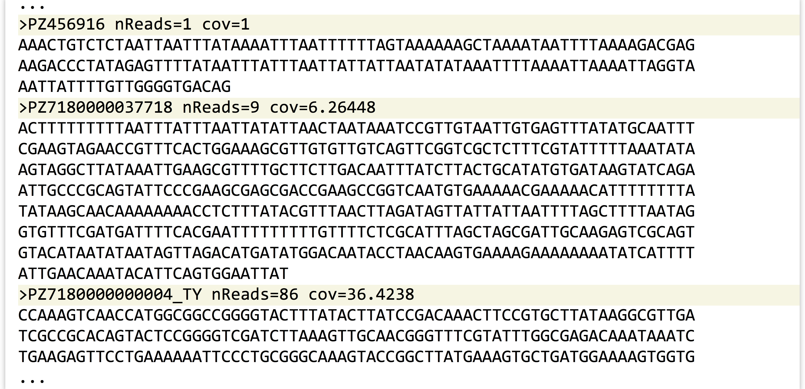
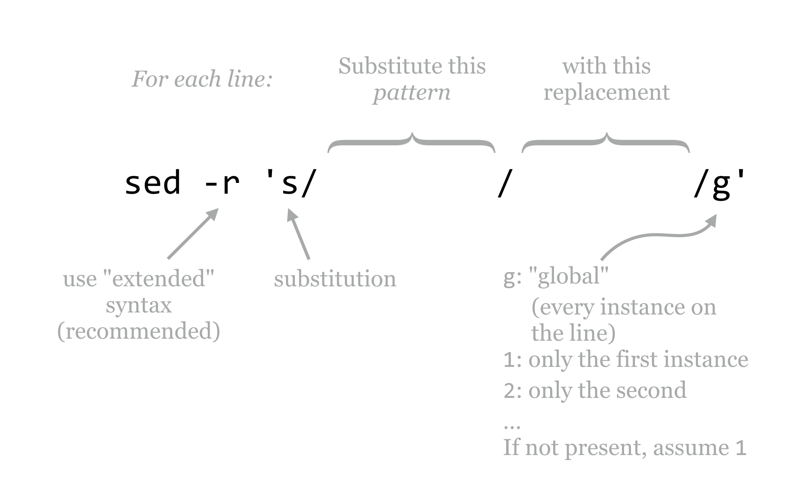
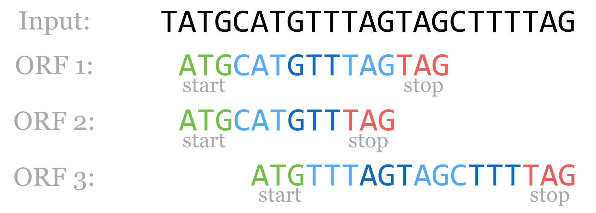
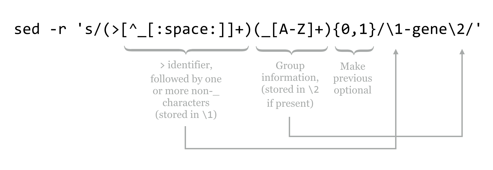
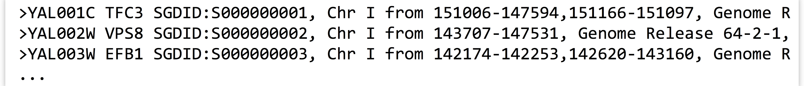

# Patterns (Regular Expressions)

In previous chapters, we used a simple [`fasta_stats`](data/fasta_stats.py) program to perform basic analyses on a FASTA file called [`pz_cDNAs.fasta`](data/pz_cDNAs.fasta), mostly as an excuse to learn about the standard streams and tools like `grep` and `sort`. It turns out that the information in the [`pz_cDNAs.fasta`](data/pz_cDNAs.fasta) file provides us with many potential questions to ponder.

The sequences in this file are actually a subset of putative transcripts, produced from a de novo transcriptome assembly for the butterfly *Papilio zelicaon*. Each sequence header line encodes a variety of information: the second and third columns of the header lines reveal the number of reads contributing to each assembled sequence and the average coverage of the sequence (defined as the total number of bases contributed by reads, divided by the assembled sequence length). Even the sequence IDs encode some information: they all start with a pseudorandom identifier, but some have a suffix like `_TY`.

  

Groups of sequences that share the same `_` suffix were previously identified as having shared matches using a self-BLAST. Sequence IDs without such a suffix had no matches. We might ask: how many sequences are in such a group? This could be easily answered by first using `grep` to extract lines that match `>` (the header lines), and then using another `grep` to extract those with the pattern `_` (those in a group) before sending the result to `wc`.

A more complex question would be to ask how many different groups are represented in the file. If the group information was stored in a separate column (say, the second column), this question could be answered with the same process as above, followed by a `sort -k2,2d -u` to remove duplicate group identifiers. But how can we coerce the group information into its own column? We could do this by *substituting* instances of `_` with spaces. The `sed` (Stream EDitor) tool can help us. Here’s the overall pipeline we’ll use:

<pre id=part1-12-sed
     class="language-txt 
            line-numbers 
            linkable-line-numbers">
<code>
[oneils@mbp ~/apcb/intro/fasta_stats]$ <b>cat pz_cDNAs.fasta | \
> grep '>' | \
> grep '_' | \
> sed -r 's/_/ /' | \
> sort -k2,2d -u | \
> less -S
</b></code></pre>

And here is some of the output, where only sequences in groups are represented and each group is represented only once (replacing the `less -S` with `wc` would thus count the number of groups):

<pre id=part1-12-output
     class="language-txt 
            line-numbers 
            linkable-line-numbers">
<code>
<b>...
>PZ7180000000067 AF nReads=16 cov=12.0608
>PZ7180000028269 AFW nReads=3 cov=2.97992
>PZ7180000036480 AIJ nReads=11 cov=4.61416
>PZ783221 AOC nReads=1 cov=1
...
</b></code></pre>

The `sed` tool is a sophisticated program for modifying input (either from a file or standard input) and printing the results to standard output: `sed '<program>' <file>` or` ... | sed '<program>'`.

Like `awk`, `sed` hails from the 1970s and provides a huge variety of powerful features and syntax, only a tiny fraction of which we’ll cover here. In particular, we’ll focus on the `s`, or substitution, operation.

  

The `-r` option that we’ve used lets `sed` know that we want our pattern to be specified by “POSIX extended regular expression” syntax.^[POSIX, short for Portable Operating System Interface, defines a base set of standards for programs and operating systems so that different Unix-like operating systems may interoperate.] The general pattern of the program for substitution is `s/<pattern>/<replacement>/g`, where the `g` specifies that, for each line, each instance of the pattern should be replaced. We can alternatively use `1` in this spot to indicate that only the first instance should be replaced, `2` to indicate only the second, and so on. Often, `s/<pattern>/<replacement>/` is used, as it has the same meaning as `s/<pattern>/<replacement>/1`.^[We should also note that the `/` delimiters are the most commonly used, but most characters can be used instead; for example, `s|<pattern>|<replacement>|g` may make it easier to replace `/` characters. Alternate delimiters are also often used when we end up with a command that looks like a "Picket Fence", for example: `s\/usr/local/bin\/bin\g` becomes `s|/usr/local/bin|/bin|g`]

### Regular Expressions {-}

The true power of `sed` comes not from its ability to replace text, but from its utility in replacing text based on “patterns” or, more formally, *regular expressions*. A regular expression is a syntax for describing pattern matching in strings. Regular expressions are described by the individual characters that make up the pattern to search for, and “meta-operators” that modify parts of the pattern for flexibility. In `[ch]at`, for example, the brackets function as a meta-operator meaning “one of these characters,” and this pattern matches both `cat` and `hat`, but not `chat`. Regular expressions are often built by chaining smaller expressions, as in `[ch]at on the [mh]at`, matching `cat on the hat`, `cat on the mat`, `hat on the hat`, and `hat on the mat`.

In the example above, the entire pattern was specified by `_`, which is not a meta-operator of any kind, and so each instance of `_` was replaced by the replacement (a space character). The meta-operators that are supported by regular expressions are many and varied, but here’s a basic list along with some biologically inspired examples:

<ul style="list-style-type:none;">
<li>non-meta-operator characters or strings</li>
<ul style="list-style-type:none;"><li>Most characters that don’t operate in a meta-fashion are simply matched. For example, `_` matches `_`, `A` matches `A`, and `ATG` matches a start codon. (In fact, `ATG` is three individual patterns specified in a row.) When in doubt, it is usually safe to escape a character (by prefixing it with a backslash) to ensure it is interpreted literally. For example, `\[_\]` matches the literal string `[_]`, rather than making use of the brackets as meta-operators.</li></ul>
<li>`.`</li>
<ul style="list-style-type:none;"><li>A period matches any single character. For example, `CC.` matches any P codon (`CCA`, `CCT`, `CCG`, `CCC`), but also strings like `CCX` and `CC%`.</li></ul>
<li>`[<charset>]`</li>
<ul style="list-style-type:none;"><li>Matches any single character specified in `<charset>`. For example, `TA[CT]` matches a Y codon (`TAC` or `TAT`).</li></ul>
<li>`[^<charset>]`</li>
<ul style="list-style-type:none;"><li>Placing a `^` as the first character inside charset brackets negates the meaning, such that any single character not named in the brackets is matched. `TA[^CT]` matches `TAT`, `TAG`, `TA%`, and so on, but not `TAC` or `TAT`.</li></ul>
<li>`^` (outside of `[]`)</li>
<ul style="list-style-type:none;"><li>Placing a `^` outside of charset brackets matches the start of the input string or line. Using `sed -r 's/^ATG/XXX/g'`, for example, replaces all instances of start codons with `XXX`, but only if they exist at the start of the line.</li></ul>
<li>`$`</li>
<ul style="list-style-type:none;"><li>Similar to `^`, but `$` matches the end of the string or line. So, `sed -r 's/ATG$/XXX/g'` replaces all start codons that exist at the end of their respective lines.</li></ul>
</ul></ul>

So far our patterns aren’t really all that flexible, because most of the pieces covered to this point match a single character. The next five meta-operators resolve that limitation.

<ul style="list-style-type:none;">
<li>`{x,y}`</li>
<ul style="list-style-type:none;"><li>Modifies the preceding pattern so that it matches if it occurs between `x` and `y` times in a row, inclusive. For example, `[GC]{4,8}` matches any string of C’s and/or G’s that is four to eight characters long (shooting for eight characters, if possible). So, `sed -r 's/[GC]{4,8}/_X_/g'` would result in the following substitutions: 
    <blockquote>`ATCCGTCT` to `ATCCGTCT` (no replacement) 
    `ATCCGCGGCTC` to `AT_X_TC` 
    `ATCGCGCGGCCCGTTCGGGCCT` to `AT_X_CCGTT_X_T`</blockquote>
Using `{0,1}` has the effect of making what it follows optional in the pattern, and `{x,}` has the effect of allowing the pattern to match x or more times with no upper limit.</li></ul>
<li>`*`</li>
<ul style="list-style-type:none;"><li>An asterisk modifies the preceding pattern so that it matches if it occurs zero or more times; thus it is equivalent to `{0,}`.  
The usage of `*` deserves a detailed example. Consider the pattern `ATG[ATGC]*TGA`, where `ATG` is the pattern for a start codon, `[ATGC]*` indicates zero or more DNA bases in a row, and `TGA` is one of the canonical stop codons. This pattern matches `ATGTACCTTGA`, and also matches `ATGTGA` (where the middle part has been matched zero times).</li></ul>
<li>`+`</li>
<ul style="list-style-type:none;"><li>The most prominent repetition modifier, a plus sign modifies the preceding pattern so that it is matched one or more times; it is equivalent to `{1,}`. In contrast with the example above, `ATG[ATGC]+TGA` matches `ATGTACCTTGA` and `ATGCTGA`, but not `ATGTGA`.</li></ul>
<li>`(<pattern>)`</li>
<ul style="list-style-type:none;"><li>Parentheses may be used to group an expression or series of expressions into a single unit so that they may be operated on together. Because `AT` is the pattern `A` followed by `T`, for example, `AT+` matches `AT`, `ATT`, `ATTT`, and so on. If we wanted to instead match `AT` repeats, we might wish to specify a pattern like `(AT)+`, which matches `AT`, `ATAT`, `ATATAT`, and so on. Parentheses also “save” the string that was matched within them for later use. This is known as back-referencing, discussed below.</li></ul>
<li>`<pattern x>|<pattern y>`</li>
<ul style="list-style-type:none;"><li>Match either the pattern `<pattern x>` or the pattern` <pattern y>`. Multiple such patterns or operations can be chained; for example, `TAA|TAG|TGA` matches any one of the three canonical stop codons. This example is a bit ambiguous, though: does this pattern read “TA (A or T) A (G or T) GA,” or “TAA or TAG or TGA”? To make it concrete, we’d probably want to specify it as `((TAA)|(TAG)|(TGA))`.</li></ul>
</ul></ul>

Using these pieces, we can put together a regular expression that serves as a simple (and not actually useful in practice) open reading frame finder. For prokaryotic sequences (where introns are not a consideration), we’ll define these as a start codon `ATG`, followed by one or more codons, followed by one of the three canonical stop codons `TAA`, `TAG`, or `TGA`. The pattern for the start is `ATG`, and we’ve seen how we can encode a stop above, with `((TAA)|(TAG)|(TGA))`. How about “one or more codons?” Well, “one or more” is embodied in the `+` operator, and a codon is any three A’s, T’s, C’s, or G’s. So, “one or more codons” is encoded as (`[ACTG]{3,3})+`. Thus the regular expression for our simple open reading frame finder is:

  

###### {- #greedy}

In reality, regular expressions are not often used in searching for coding regions (though they are sometimes used for identifying smaller motifs). Part of the reason is that regular expressions are, by default, *greedy*: they match the first occurring pattern they can, and they seek to match as much of the string as they can. (The cellular machinery that processes open reading frames is not greedy in this way.) Consider the following sequence, which has three open reading frames according to our simple definition and regular expression above.

  

Notice that the string `TAG` is both a type of codon in general (`[ACTG]{3,3}`) and a stop, so technically both of the first two options are valid according to the regular expression. By the rules of greediness, the first will be matched, which we can verify with a simple `echo` and `sed`.

<pre id=part1-12-TAG
     class="language-txt 
            line-numbers 
            linkable-line-numbers">
<code>
[oneils@mbp ~/apcb/intro/fasta_stats]$ <b>echo "TATGCATGTTTAGTAGCTTTTAG" | \
> sed -r 's/ATG([ACTG]{3,3})+((TAA)|(TAG)|(TGA))/_ORF_/g'</b>
T_ORF_CTTTTAG
</code></pre>

The regular expression syntax used by `sed` is similar to the syntax used in languages such as Perl, Python, and R. In fact, all of the examples we’ve seen so far would work the same in those languages (though they are applied by their own specific functions rather than a call to `sed`). One helpful feature provided by more modern regular expression engines like these is that operators like `*` and `+` can be made nongreedy (though I prefer the clearer term “reluctant”) by following them with a question mark. In Python, the regular expression `ATG([ACTG]{3,3})+?((TAA)|(TAG)|(TGA))` would match the second option. (When not following a `*`, or `+`, it makes the previous optional; thus `TG(T)?CC` is equivalent to `TG(T){0,1}CC`.) More sophisticated features allow the user to access all the matches of a pattern, even if they overlap, so that the most satisfying one can be pulled out by some secondary criteria. Unfortunately, `sed` does not support nongreedy matching and several other advanced regular expression features.

### Character Classes and Regular Expressions in Other Tools {-}

We often wish to use charset brackets to match any one of a “class” of characters; for example, `[0123456789]` matches any single digit. Most regular expression syntaxes (including that used by `sed`) allow a shorthand version `[0-9]` (if we wanted to match only a 0, 9, or -, we could use `[09-]`). Similarly, `[a-z]` matches any single lowercase letter, and `[A-Z]` any uppercase letter. These can even be combined: `[A-Za-z0-9]` matches any digit or letter. In the POSIX extended syntax used by `sed`, `0-9` can also be specified as `[:digit:]`. Notice the lack of brackets in the former—to actually match any single digit, the regular expression is `[[:digit:]]` (which, yes, is annoying). To match any nondigit, we can negate the bracketed set as `[^[:digit:]]`.

These POSIX character classes are especially useful when we want to match character types that are difficult to type or enumerate. In particular, `[[:space:]]` matches one of any [whitespace](#whitespace) character (spaces, tabs, newlines), and `[[:punct:]]` matches any “punctuation” character, of which there are quite a few. The `[[:space:]]` character class is particularly helpful when you are reformatting data stored in rows and columns but are not sure whether the column separators are spaces, tabs, or some combination.

In many regular expression syntaxes (including those used by Perl, Python, R, and some versions of `sed`), even shorter shortcuts for character classes are available. In these, `\d` is equivalent to `[[:digit:]]`, `\D` is equivalent to `[^[:digit:]]`, `\s` for `[[:space:]]`, `\S` for `[^[:space:]]`, among others.

As it turns out, regular expressions can be utilized by `grep` as well as `awk`. When using `grep`, we can specify that the pattern should be treated as an extended regular expression by adding the flag `-E` (as opposed to the `-r` used for `sed`.) Thus `grep -E '[[:digit:]]+'` extracts lines that contain an integer.

In `awk`, we can use the `~` comparator instead of the `==` comparator in an if-statement, as in `awk '{if($1 ~ /PZ718[[:digit:]]+/) {print $3}}'`, which prints the third column of each line where the first column matches the pattern `PZ718[[:digit:]]+`.

### Back-Referencing {-}

According to the definition above for the header lines in the [`pz_cDNAs.fasta`](data/pz_cDNAs.fasta) file, the IDs should be characterizable as a pseudorandom identifier followed by, optionally, an underscore and a set of capital letters specifying the group. Using `grep '>'` to extract just the header lines, we can inspect this visually:

<pre id=part1-12-fasta
     class="language-txt 
            line-numbers 
            linkable-line-numbers">
<code><b>...
>PZ7180000037718 nReads=9 cov=6.26448
>PZ7180000000004_TY nReads=86 cov=36.4238
>PZ7180000000067_AF nReads=16 cov=12.0608
>PZ7180000031591 nReads=4 cov=3.26022
>PZ7180000024036 nReads=14 cov=5.86079
>PZ15501_A nReads=1 cov=1
...
</b></code></pre>

If we send these results through `wc`, we see that this file contains 471 header lines. How can we verify that each of them follows this pattern? By using a regular expression with `grep` for the pattern, and comparing the count to 471. Because IDs must begin immediately after the `>` symbol in a FASTA file, that will be part of our pattern. For the pseudorandom section, which may or may not start with `PZ` but should at least not include an underscore or a space, we can use the pattern `[^_[:space:]]+` to specify one or more nonunderscore, nonwhitespace characters. For the optional group identifier, the pattern would be `(_[A-Z]+){0,1}` (because `{0,1}` makes the preceding optional). Putting these together with `grep -E` and counting the matches should produce 471.

<pre id=part1-12-header-count
     class="language-txt 
            line-numbers 
            linkable-line-numbers">
<code>
[oneils@mbp ~/apcb/intro/fasta_stats]$ <b>cat pz_cDNAs.fasta | \
> grep -E '>[^_[:space:]]+(_[A-Z]+){0,1}' | \
> wc</b>
    471    1413   15279
</code></pre>

All of the headers matched the pattern we expected. What if they hadn’t? We could inspect which ones didn’t by using a `grep -v -E` to print the lines that didn’t match the pattern.

Now, hypothetically, suppose a (stubborn, and more senior) colleague has identified a list of important gene IDs, and has sent them along in a simple text file.

<pre id=part1-12-gene-IDs
     class="language-txt 
            line-numbers 
            linkable-line-numbers">
<code><b>...
PZ7180000037718-gene
PZ7180000000004-gene_TY
PZ7180000000067-gene_AF
PZ7180000031591-gene
PZ7180000024036-gene
PZ15501-gene_A
...
</b></code></pre>

Unfortunately, it looks like our colleague has decided to use a slightly altered naming scheme, appending `-gene` to the end of each pseudorandom identifier, before the `_`, if it is present. In order to continue with peaceful collaborations, it might behoove us to modify our sequence file so that it corresponds to this scheme. We can do this with `sed`, but it will be a challenge, primarily because we want to perform an insertion, rather than a substitution. Actually, we’ll be performing a substitution, but we’ll be substituting matches with contents from themselves!

Regarding back-references, in a regular expression, matches or submatches that are grouped and enclosed in parentheses have their matching strings saved in variables `\1`, `\2`, and so on. The contents of the first pair of parentheses is saved in `\1`, the second in `\2` (some experimentation may be needed to identify where nested parentheses matches are saved). The entire expression match is saved in `\0`.

To complete the example, we’ll modify the pattern used in the grep to capture both relevant parts of the pattern, replacing them with `\1-gene\2`.

  

The contents of [`pz_cDNAs.fasta`](data/pz_cDNAs.fasta), after running it through the `sed` above, are as follows:

<pre id=part1-12-update-fasta
     class="language-txt 
            line-numbers 
            linkable-line-numbers">
<code><b>...
>PZ456916-gene nReads=1 cov=1
AAACTGTCTCTAATTAATTTATAAAATTTAATTTTTTAGTAAAAAAGCTAAAATAATTTTAAAAGACGAG
AAGACCCTATAGAGTTTTATAATTTATTTAATTATTATTAATATATAAATTTTAAAATTAAAATTAGGTA
AATTATTTTGTTGGGGTGACAG
>PZ7180000037718-gene nReads=9 cov=6.26448
ACTTTTTTTTTAATTTATTTAATTATATTAACTAATAAATCCGTTGTAATTGTGAGTTTATATGCAATTT
CGAAGTAGAACCGTTTCACTGGAAAGCGTTGTGTTGTCAGTTCGGTCGCTCTTTCGTATTTTTAAATATA
AGTAGGCTTATAAATTGAAGCGTTTTGCTTCTTGACAATTTATCTTACTGCATATGTGATAAGTATCAGA
ATTGCCCGCAGTATTCCCGAAGCGAGCGACCGAAGCCGGTCAATGTGAAAAACGAAAAACATTTTTTTTA
TATAAGCAACAAAAAAAACCTCTTTATACGTTTAACTTAGATAGTTATTATTAATTTTAGCTTTTAATAG
GTGTTTCGATGATTTTCACGAATTTTTTTTTGTTTTCTCGCATTTAGCTAGCGATTGCAAGAGTCGCAGT
GTACATAATATAATAGTTAGACATGATATGGACAATACCTAACAAGTGAAAAGAAAAAAAATATCATTTT
ATTGAACAAATACATTCAGTGGAATTAT
>PZ7180000000004-gene_TY nReads=86 cov=36.4238
CCAAAGTCAACCATGGCGGCCGGGGTACTTTATACTTATCCGACAAACTTCCGTGCTTATAAGGCGTTGA
TCGCCGCACAGTACTCCGGGGTCGATCTTAAAGTTGCAACGGGTTTCGTATTTGGCGAGACAAATAAATC
TGAAGAGTTCCTGAAAAAATTCCCTGCGGGCAAAGTACCGGCTTATGAAAGTGCTGATGGAAAAGTGGTG
...
</b></code></pre>

Back-references may be used within the pattern itself as well. For example, a `sed -r 's/([A-Za-z]+) \1/\1/g'` would replace “doubled” words `([A-Za-z]+) \1` with a single copy of the word `\1`, as in `I like sed very very much`, resulting in `I like sed very much`. But beware if you are thinking of using substitution of this kind as a grammar checker, because this syntax does not search across line boundaries (although more complex `sed` programs can). This example would not modify the following pair of lines (where the word `the` appears twice):

<blockquote>The quick sed regex modifies the 
the lazy awk output.</blockquote>

A few final notes about sed and regular expressions in general will help conclude this chapter.

<ol><li>Regular expressions, while powerful, lend themselves to mistakes. Work incrementally, and regularly check the results.</li>
<li>It is often easier to use multiple invocations of regular expressions (e.g., with multiple `sed` commands) rather than attempt to create a single complex expression.</li>
<li>Use regular expressions where appropriate, but know that they are not always appropriate. Many problems that might seem a natural fit for regular expressions are also naturally fit by other strategies, which should be taken into consideration given the complexity that regular expressions can add to a given command or piece of code.</li></ol>

<blockquote>
Some people, when confronted with a problem, think, “I know, I’ll use regular expressions.” Now they have two problems.

~Jamie Zawinski
</blockquote>

#### Exercises {-}

1. In the de novo assembly statistics file [`contig_stats.txt`](data/contig_stats.txt), the contig IDs are named as `NODE_1`, `NODE_2`, and so on. We’d prefer them to be named `contig1`, `contig2`, and the like. Produce `contig_stats_renamed.txt` with these changes performed.

2. How many sequences in the file [`pz_cDNAs.fasta`](data/pz_cDNAs.fasta) are composed of only one read? You will likely need to use both `awk` and `sed` here, and be sure to carefully check the results of your pipeline with `less`.

3. A particularly obnoxious colleague insists that in the file [`pz_cDNAs.fasta`](data/pz_cDNAs.fasta), sequences that are not part of any group (i.e., those that have no `_` suffix) should have the suffix `_nogroup`. Appease this colleague by producing a file to this specification called `pz_cDNAs_fixed.fasta`.

4. The header lines in the yeast protein set [`orf_trans.fasta`](data/orf_trans.fasta) look like so when viewed with `less -S` after grepping for `>`: 
    

    
    

Notably, header lines contain information on the locations of individual exons; sequence YAL001C has two exons on chromosome I from locations 151006 to 147594 and 151166 to 151097 (the numbers go from large to small because the locations are specified on the forward strand, but the gene is on the reverse complement strand). By contrast, sequence YAL002W has only one exon on the forward strand.  
How many sequences are composed of only a single exon? Next, produce a list of sequence IDs in a file called `multi_exon_ids.txt` containing all those sequence IDs with more than one exon as a single column.

5. As a continuation of question 4, which sequence has the most exons? Which single-exon sequence is the longest, in terms of the distance from the first position to the last position noted in the exon list?

