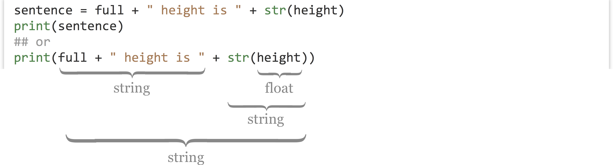
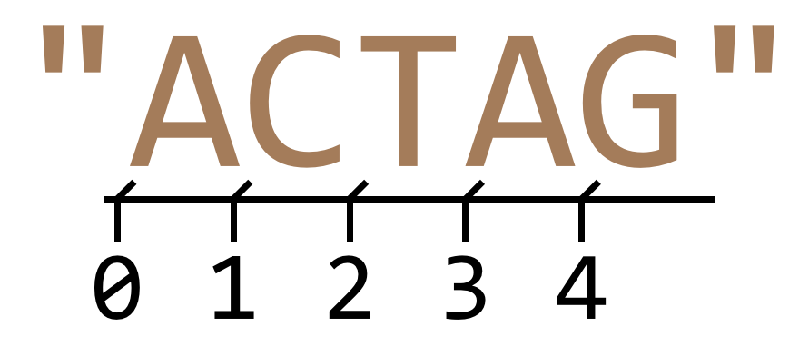
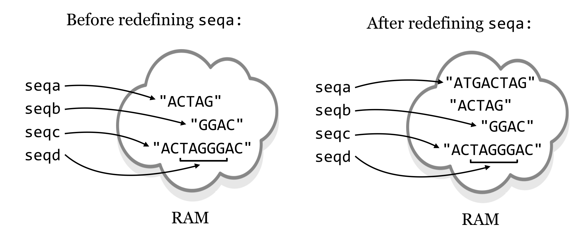

# Elementary Data Types

###### {- #variables} 

Variables are vital to nearly all programming languages. In Python, *variables* are "names that refer to data". The most basic types of data that can be referred to are defined by how contemporary computers work and are shared by most languages.

### Integers and Floats{-}

###### {- #float}
###### {- #int}

Consider the integer `10`, and the real number `5.64`. It turns out that these two numbers are represented differently in the computer’s binary code, partly for reasons of efficiency (e.g., storing `10` vs. `10.0000000000`). Python and most other languages consider integers and real numbers to be two different "types": real numbers are called *floats* (short for "floating point numbers"), and integers are called *ints*. We assign data like floats and ints to variables using the `=` operator.

<pre id=part2-02-assignment
     class="language-python 
            line-numbers 
            linkable-line-numbers">
<code>
print("Hello world!")

exons = 10              # an int
theta = 5.64            # a float
</code></pre>

While we’re on the topic of variables, variable names in Python should always start with a letter (lowercase by convention) and contain only letters, underscores, and numbers.

Note that the interpreter ignores `#` characters and anything after them on the line.^[The `#` symbols are ignored unless they occur within a pair of quotes. Technically, the interpreter also ignores the `#!` line, but it is needed to help the system find the interpreter in the execution process if running the program as a script.] This allows us to put "comments" in our code. Blank lines don’t matter, either, allowing the insertion of blank lines in the code for ease of reading.

We can convert an int type into a float type using the `float()` function, which takes one parameter inside the parentheses:

<pre id=part2-02-float
     class="language-python 
            line-numbers 
            linkable-line-numbers">
<code>
exons_as_float = float(exons)           # return 10.0 (a float)
</code></pre>

Similarly, we can convert floats to ints using the `int()` function, which truncates the floating point value at the decimal point (so `5.64` will be truncated to the int `5`, while `-4.67` would be truncated to the int `-4`):

<pre id=part2-02-int
     class="language-python 
            line-numbers 
            linkable-line-numbers">
<code>
theta_as_int = int(theta)               # return 5 (an int)
</code></pre>

Up until Python3, if we performed mathematical operations using only int types, the result was always an int. However, when transitioning from Python2 to Python3, the division operator `/` was updated to always return a float.

<pre id=part2-02-operators
     class="language-python 
            line-numbers 
            linkable-line-numbers">
<code>
a = 10                     # an int
b = 3                      # an int
answer_1 = a / b           # int/int returns float: 3.3333
                           # in Python2, int/int returned int

answer_2 = a / float(b)    # int/float returns float: 3.3333

c = 2.0                   # a float
answer_3 = (b + c) * a     # (int + float) * int returns (float) * int...
                           #    ... return float: 50.0
</code></pre>

In the last line above, we see that mathematical expressions can be grouped with parentheses in the usual way, to override the standard order of operations if needed. If a subexpression returns a float, then it will travel up the chain to induce floating-point math for the rest of the expression.

Another property of importance is that the right-hand side of an assignment is evaluated before the assignment happens.

<pre id=part2-02-right
     class="language-python 
            line-numbers 
            linkable-line-numbers">
<code>
value = 7
value = value + 1
print(value)        # prints 8
</code></pre>

Aside from the usual addition and subtraction, other mathematical operators of note include `**` for exponential powers and `%` for modulus (to indicate a remainder after integer division, e.g., `7 % 3` is `1`, `8 % 3` is `2`, `9 % 3` is `0`, and so on).

<pre id=part2-02-modulo
     class="language-python 
            line-numbers 
            linkable-line-numbers">
<code>
a = 7
b = 3
c = a % b          # modulus ("remainder"): 1
c = a ** b         # exponent: 343
</code></pre>

Notice that we’ve reused the variables `a`, `b`, and `c`; this is completely allowable, but we must remember that they now refer to different data. (Recall that a variable in Python is a name that refers to, or references, some data.) In general, execution of lines within the same file (or cell in a Jupyter Notebook) happens in an orderly top-to-bottom fashion, though later we’ll see "control structures" that alter this flow.

In summary, there are seven binary operators^[There is a single "unary operator", `-` which negates an int or float, i.e., `-5`.] that can be used on ints and floats in Python:
- `+` : addition
- `-` : subtraction
- `*` : multiplication
- `**` : exponent
- `/` : division
- `//` : floor division (truncated whole number quotient)
- `%` : modulo (remainder)

### Booleans {-}

Booleans are simple data types that hold either the special value `True` or the special value `False`. Many functions return Booleans, as do comparisons:

<pre id=part2-02-bool
     class="language-python 
            line-numbers 
            linkable-line-numbers">
<code>
sun_is_yellow = True            # boolean True
test = 2 < -3                   # boolean False
</code></pre>

For now, we won’t use Boolean values much, but later on they’ll be important for controlling the flow of our programs.

### Strings {-}

###### {- #escape}

Strings, which hold sequences of letters, digits, and other characters, are the most interesting basic data type.^[Unlike C and some other languages, Python does not have a "char" datatype specifically for storing a single character.] We can specify the contents using either single or double quotes, which can be useful if we want the string itself to contain a quote. Alternatively, we can *escape* odd characters like quotes if they would confuse the interpreter as it attempts to parse the file.

<pre id=part2-02-escape
     class="language-python 
            line-numbers 
            linkable-line-numbers">
<code>
first = "Shawn"
last = "O'Neil"                 # string
last = 'O\'Neil'                # same string
</code></pre>

Strings can be added together with `+` to concatenate them, which results in a new string being returned so that it can be assigned to a variable. The `print()` function, in its simplest form, takes a single value such as a string as a parameter. This could be a variable referring to a piece of data, or the result of a computation that returns one:

<pre id=part2-02-string_cat
     class="language-python 
            line-numbers 
            linkable-line-numbers">
<code>
full = first + last
print(full)                     # prints "ShawnO'Neil"
print(first + " " + last)       # prints "Shawn O'Neil"

# Since Python 3.6, we can also use f-strings (formatted string literals)
# for easy printing of nicely formatted strings. We'll sprinkle examples
# throughout the text.
print(f"{first} {last}")        # prints "Shawn O'Neil"
</code></pre>

We cannot concatenate strings to data types that aren’t strings, however.

<pre id=part2-02-error
     class="language-python 
            line-numbers 
            linkable-line-numbers">
<code>
height = 5.5
sentence = full + " height is " + height     # Error on this line!
</code></pre>

Running the above code would result in a `TypeError: cannot concatenate 'str' and 'float' objects`, and the offending line number would be reported. In general, the actual bug in your code might be before the line reporting the error. This particular error example wouldn’t occur if we had specified `height = "5.5"` in the previous line, because two strings can be concatenated successfully.

Fortunately, most built-in data types in Python can be converted to a string (or a string describing them) using the `str()` function, which returns a string.

  

As the above illustrates, we may choose in some cases to store the result of an expression in a variable for later use, or we may wish to use a more complex expression directly. The choice is a balance between verbose code and less verbose code, either of which can enhance readability. You should use whatever makes the most sense to you, the person most likely to have to read the code later!

This case also serves to demonstrate the benefit of utalizing f-strings: there is no need to cast the int as a string! We can use any and all valid Python expressions in them.

<pre id=part2-02-f-string
     class="language-python 
            line-numbers 
            linkable-line-numbers">
<code>
print(f"{full} height is {height}")
</code></pre>

Python makes it easy to extract a single-character string from a string using brackets, or "index" syntax. Remember that in Python, the first letter of a string occurs at index `0`.

  

The use of brackets is also known as "slice" syntax, because we can them it to extract a slice (substring) of a string with the following syntax: `string_var[begin_index:end_index]`. Again, indexing of a string starts at `0`. Because things can’t be too easy, the beginning index is inclusive, while the ending index is exclusive: `string_var[inclusive:exclusive]`.

<pre id=part2-02-slicing
     class="language-python 
            line-numbers 
            linkable-line-numbers">
<code>
seq = "ACTAG"
subseq = seq[1:4]          # "CTA"
</code></pre>

A good way to remember this confusing bit of syntax is to think of indices as occurring between the letters.

  

If a string looks like it could be converted to an int or float type, it probably can be with the `float()` or `int()` conversion functions. If such a conversion doesn’t make sense, however, Python will crash with an error. For example, the last line below will produce the error `ValueError: could not convert string to float: XY_2.7Q`.

<pre id=part2-02-float-err
     class="language-python 
            line-numbers 
            linkable-line-numbers">
<code>
exons_str = "10"
theta_str = "5.64"
evalue_str = "2.5e-4"

exons = int(exons_str)             # int 10
theta = float(theta_str)           # float 5.64
evalue = float(evalue_str)         # float 0.00025

test = float("XY_2.7Q")            # Error on this line!
</code></pre>

To get the length of a string, we can use the `len()` function, which returns an int. We can use this in conjunction with `[]` syntax to get the last letter of a string, even if we don’t know the length of the string before the program is run. We need to remember, though, that the index of the last character is one less than the length, based on the indexing rules. Alternatively, by using negative indexes, we can count from the end of the string, with the last character having index `-1`, the 2nd to last character having index `-2`, and so on.

<pre id=part2-02-len
     class="language-python 
            line-numbers 
            linkable-line-numbers">
<code>
seq = "ACTAG"
seq_len = len(seq)                    # int 5
last_letter = seq[seq_len - 1]        # string "G"
## or
last_letter = seq[len(seq) - 1]       # string "G"
## or
last_letter = seq[-1]                 # string "G"
</code></pre>

Similarly, if we want a substring from position `2` to the end of the string, we need to remember the peculiarities of the `[]` slice notation, which is inclusive:exclusive.

<pre id=part2-02-more_slicing
     class="language-python 
            line-numbers 
            linkable-line-numbers">
<code>
end_seq = seq[2:len(seq)]     # indices 2 to 5, inclusive:exclusive
## or
end_seq = seq[2:]             # indices 2 to the end of the string

print(end_seq)                # print "TAG"
</code></pre>

There are four binary operators that can act on strings, we encourage you to play with them to figure out how they work:
- `+`
- `*`
- `in`
- `not in`

### Immutability {-}

###### {- #immutable} 

In some languages it is possible to change the contents of a string after it’s been created. In Python and some other languages, this is not the case, and strings are said to be *immutable*. Data are said to be immutable if they cannot be altered after their initial creation. The following line of code, for example, would cause an error like `TypeError: 'str' object does not support item assignment`:

<pre id=part2-02-immutable
     class="language-python 
            line-numbers 
            linkable-line-numbers">
<code>
seq = "ACTAG"
seq[2] = "C"                          # Error on this line!
</code></pre>

Languages like Python and Java make strings immutable for a variety of reasons, including computational efficiency and as a safeguard to prevent certain common classes of programming bugs. For computational biology, where we often wish to modify strings representing biological sequences, this is an annoyance. We’ll learn several strategies to work around this problem in future chapters.

In many cases, we can make it look like we are changing the contents of some string data by reusing the variable name. In the code below, we are defining strings `seqa` and `seqb`, as well as `seqc` as the concatenation of these, and then `seqd` as a substring of `seqc`. Finally, we reuse the `seqa` variable name to refer to different data (which gets copied from the original).

<pre id=part2-02-overwrite
     class="language-python 
            line-numbers 
            linkable-line-numbers">
<code>
seqa = "ACTAG"                         # "ACTAG"
seqb = "GGAC"                          # "GGAC"
seqc = seqa + seqb                     # "ACTAGGGAC"
seqd = seqc[2:7]                       # "TAGGG"

seqa = "ATG" + seqa                    # redefine seqa, "ATGACTAG"
</code></pre>

Here’s how we might represent these variables and the data stored in memory, both before and after the reassignment of `seqa`.

  

###### {- #garbage-collection}

Because the string `"ACTAG"` is immutable, redefining `seqa` results in an entirely different piece of data being created. The original string `"ACTAG"` will still exist in memory (RAM) for a short time, but because it is not accessible via any variables, Python will eventually clean it out to make room in memory in a process known as *garbage collection*.^[Garbage collection is a common feature of high-level languages like Python, though some compiled languages support it as well. C does not: programmers are required to ensure that all unused data are erased during program execution. Failure to do so is known as a "memory leak" and causes many real-world software crashes.] Garbage collection is an automatic, periodic process of de-allocating memory used by data that are no longer accessible (and hence no longer needed) by the program.

This immutability of strings could result in code that takes much longer to execute than expected, because concatenating strings results in copying of data (see the results of `seqc = seqa + seqb` above). For example, if we had a command that concatenated chromosome strings (millions of letters each) to create a genome string, `genome = chr1 + chr2 + chr3 + chr4`, the result would be a copy of all four chromosomes being created in memory! On the other hand, in many cases, Python can use the immutability of strings to its advantage. Suppose, for example, that we wanted to get a large substring from a large string, `centromere_region = chr1[0:1500000]`. In this case, Python doesn’t need to make a copy of the substring in memory. Because the original string can never change, all it needs is some bookkeeping behind the scenes to remember that the `centromere_region` variable is associated with part of string `chr1` references. This is why `seqd` in the figure above does not duplicate data from `seqc`.

None of this discussion is to imply that you should worry about the computational efficiency of these operations at this point. Rather, the concept of immutability and the definition of a variable (in Python) as a "name that refers to some data" are important enough to warrant formal discussion.

#### Exercises {-}

1. Create and run a Python program that uses integers, floats, and strings, and converts between these types. Try using the `bool()` function to convert an integer, float, or string to Boolean and print the results. What kinds of integers, floats, and strings are converted to a Boolean `False`, and what kinds are converted to `True`?
2. We know that we can’t use the `+` operator to concatenate a string type and integer type, but what happens when we multiply a string by an integer? (This is a feature that is fairly specific to Python.)
3. What happens when you attempt to use a float type as an index into a string using `[]` syntax? What happens when you use a negative integer?
4. Suppose you have a sequence string as a variable, like `seq = "ACTAGATGA"`. Using only the concepts from this chapter, write some code that uses the `seq` variable to create two new variables, `first_half` and `second_half` that contain the first half (rounded down) and the second half (rounded up) of `seq`. When printed, these two should print `"ACTA"` and `"GATGA"`, respectively. 

   <pre id=part2-02-exersise
        class="language-python 
               line-numbers 
               linkable-line-numbers">
    <code>
    #!/usr/bin/env python
    
   seq = "ACTAGATGA"
   ## Write some code here:
   
  
   
   print(first_half)                     # should print "ACTA"
   print(second_half)                    # should print "GATGA"
   </code></pre>
   
   Importantly, your code should work no matter the string `seq` refers to, without changing any other code, so long as the length of the string is at least two letters. For example, if `seq = "TACTTG"`, then the same code should result in `first_half `referring to `"TAC"` and `second_half` referring to `"TTG"`.

