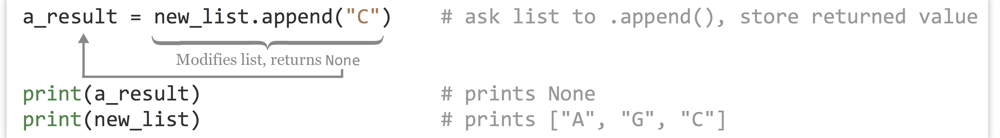

# Collections and Looping: Lists and for

A list, as its name implies, is a list of data (integers, floats, strings, Booleans, or even other lists or more complicated data types). Python lists are similar to arrays or vectors in other languages. Like letters in strings, elements of a list are indexed starting at `0` using `[]` syntax. We can also use brackets to create a list with a few elements of different types, though in practice we won’t do this often.

<pre id=part2-03-list
     class="language-python 
            line-numbers 
            linkable-line-numbers">
<code>
a_list = [1, 2.4, "CYP6B", 724]          # list of 4 elements
an_el = a_list[1]                        # 2.4
</code></pre>

Just like with strings, we can use `[]` notation to get a sublist "slice," and we can use the `len()` function to get the length of a list.

<pre id=part2-03-len
     class="language-python 
            line-numbers 
            linkable-line-numbers">
<code>
sublist = a_list[1:3]                    # list of two: [2.4, "CYP6B"]
list_len = len(a_list)                   # 4
last_el = a_list[list_len - 1]           # 725
</code></pre>

###### {- #mutable} 

Unlike strings, though, lists are *mutable*, meaning we can modify them after they’ve been created, for example, by replacing an element with another element. As mentioned above, lists can even contain other lists!

<pre id=part2-03-mutable
     class="language-python 
            line-numbers 
            linkable-line-numbers">
<code>
inner_list = [0.245, False]              # list of two elements
a_list[3] = inner_list                   # a_list now refers to
                                         # [2, 2.4, "CYP6B", [0.245, False]]
</code></pre>

We will often want our code to create an empty list, and then add data elements to it one element at a time. An empty list is returned by calling the `list()` function with no parameters, or assigning a variable name to empty brackets. Given a variable which references a list object, we can append an element to the end using the `.append()` method, giving the method the element we want to append as a parameter.

<pre id=part2-03-append
     class="language-python 
            line-numbers 
            linkable-line-numbers">
<code>
new_list = list()                        # new_list refers to an empty list
## or
new_list = []
new_list.append("A")                     # new_list now refers to ["A"]
new_list.append("G")                     # new_list now refers to ["A", "G"]
</code></pre>

This syntax might seem a bit odd compared to what we’ve seen so far. Here `new_list.append("G")` is telling the list object the `new_list` variable refers to to run its `.append()` method, taking as a parameter the string `"G"`. We’ll explore the concepts of objects and methods more formally in later chapters. For now, consider the list not just a collection of data, but a "smart" object with which we can interact using methods.

Note that the `.append()` method asks the list to modify itself (which it can do, because lists are mutable), but this operation doesn’t return anything of use.^[It returns a special data type known as `None`, which allows for a (variable)[#variables] to exist but not reference any data. (Technically, `None` is a type of data, albeit a very simple one.) `None` can be used as a type of placeholder, and so in some situations isn’t entirely useless.]

  

This type of command opens up the possibility for some insidious bugs; for example, a line like `new_list = new_list.append("C")` looks innocent enough and causes no immediate error, but it is probably not what the programmer intended. The reason is that the `new_list.append("C")` call successfully asks the list to modify itself, but then the `None` value is returned, which would be assigned to the `new_list` variable with the assignment. At the end of the line, `new_list` will refer to `None`, and the list itself will no longer be accessible. (In fact, it will be garbage collected in due time.) In short, use `some_list.append(el)`, not `some_list = some_list.append(el)`.

We often want to sort lists, which we can do in two ways. First, we could use the `sorted()` function, which takes a list as a parameter and returns a new copy of the list in sorted order, leaving the original alone. Alternatively, we could call a list's `.sort()` method to to sort a list in place.

<pre id=part2-03-sort
     class="language-python 
            line-numbers 
            linkable-line-numbers">
<code>
c_list = ["T", "C", "A", "G"]
sorted_copy = sorted(c_list)             # ["A", "C", "G", "T"]

print(c_list)                            # prints ["T", "C", "A", "G"]
c_list.sort()                            # asks c_list to sort itself
print(c_list)                            # prints ["A", "C", "G", "T"]
</code></pre>

As with the `.append()` method above, the `.sort()` method returns `None`, so the following would almost surely have resulted in a bug: `a_list = a_list.sort()`.

At this point, one would be forgiven for thinking that methods always return `None` and so assignment based on the results isn’t useful. But before we move on from lists, let’s introduce a simple way to split a string up into a list of substrings, using the `.split()` method on a string data type. For example, let’s split up a string wherever the subsequence `"TA"` occurs.

<pre id=part2-03-split
     class="language-python 
            line-numbers 
            linkable-line-numbers">
<code>
seq = "CGCGTAGTACAGA"

subs_list = seq.split("TA")
print(subs_list)                      # prints ["CGCG", "G", "CAGA"]
</code></pre>

If the sequence was instead `"CGCGTATACAGA"`, the resulting list would have contained `["CGCG", "", "CAGA"]` (that is, one of the elements would be a zero-length empty string). This example illustrates that strings, like lists, are also "smart" objects with which we can interact using methods. (In fact, so are integers, floats, and all other Python types that we’ll cover.)

### Tuples (Immutable Lists) {-}

###### {- #tuples}

As noted above, lists are mutable, meaning they can be altered after their creation. In some special cases, it is helpful to create an immutable version of a list, called a "tuple" in Python. Like lists, tuples can be created in two ways: with the `tuple()` function (which returns an empty tuple) or directly.

<pre id=part2-03-tuple
     class="language-python 
            line-numbers 
            linkable-line-numbers">
<code>
ids = tuple()                            # empty tuple
ids = ("CYP6B",)                         # a tuple of length 1, note the comma
ids = ("CYP6B", "AGP4", "CATB")          # a tuple of length 3
</code></pre>

Tuples work much like lists – we can call `len()` on them and extract elements or slices with `[]` syntax. We can’t change, remove, or insert elements.^[Tuples are a cause of one of the more confusing parts of Python, because they are created by enclosing a list of elements inside of parentheses, but function calls also take parameters listed inside of parentheses, and mathematical expressions are grouped by parentheses, too! Consider the expression `(4 + 3) * 2`. Is `(4 + 3)` an integer, or a single-element tuple? Actually, it’s an integer. By default, Python looks for a comma to determine whether a tuple should be created, so `(4 + 3)` is an integer, while `(4 + 3, 8)` is a two-element tuple and `(4 + 3,)` is a single-element tuple. Use parentheses deliberately in Python: either to group mathematical expressions, create tuples, or call functions – where the function name and opening parenthesis are neighboring, as in `print(a)` rather than `print (a)`. Needlessly adding parentheses (and thereby accidentally creating tuples) has been the cause of some difficult-to-find bugs.]

### Looping with for {-}

###### {- #iterable}

A for-loop in Python executes a block of code, once for each element of an *iterable* data type: one which can be accessed one element at a time, in order. As it turns out, both strings and lists are such iterable types in Python, though for now we’ll explore only iterating over lists with for-loops.

###### {- #block}

A *block* is a set of lines of code that are grouped as a unit; in many cases they are executed as a unit as well, perhaps more than one time. Blocks in Python are indicated by being indented an additional level (usually with four spaces – remember to be consistent with this indentation practice).

When using a for-loop to iterate over a list, we need to specify a variable name that will reference each element of the list in turn.

<pre id=part2-03-for
     class="language-python 
            line-numbers 
            linkable-line-numbers">
<code>
gene_ids = ["CYP6B", "AGP4", "CATB"]

for gene_id in gene_ids:
    print("gene_id is " + gene_id)
    
print("Done.")
</code></pre>

In the above, one line is indented an additional level just below the line defining the for-loop. In the for-loop, the `gene_id` variable is set to reference each element of the `gene_ids` list in turn. Here’s the output of the loop:

<pre id=part2-03-output
     class="language-txt 
            line-numbers 
            linkable-line-numbers">
<code>
gene_id is CYP6B
gene_id is AGP4
gene_id is CATB
Done.
</code></pre>

Using for-loops in Python often confuses beginners, because a variable (e.g., `gene_id`) is being assigned without using the standard `=` assignment operator. If it helps, you can think of the first loop through the block as executing `gene_id = gene_ids[0]`, the next time around as executing `gene_id = gene_ids[1]`, and so on, until all elements of `gene_ids` have been used.

Blocks may contain multiple lines (including blank lines) so that multiple lines of code can work together. Here’s a modified loop that keeps a counter variable, incrementing it by one each time.

<pre id=part2-03-counter
     class="language-python 
            line-numbers 
            linkable-line-numbers">
<code>
gene_ids = ["CYP6B", "AGP4", "CATB"]
counter = 0

for gene_id in gene_ids:
    print("gene_id is " + gene_id)
    
    counter = counter + 1

print("Done.")
print(counter)
</code></pre>

The output of this loop would be the same as the output above, with an additional line printing `3` (the contents of `counter` after the loop ends).

Some common errors when using block structures in Python include the following, many of which will result in an `IndentationError`.

1. Not using the same number of spaces for each indentation level, or mixing tab indentation with multiple-space indentation. (Most Python programmers prefer using four spaces per level.)
2. Forgetting the colon `:` that ends the line before the block.
3. Using something like a for-loop line that requires a block, but not indenting the next line.
4. Needlessly indenting (creating a block) without a corresponding for-loop definition line.

We often want to loop over a range of integers. Conveniently, the `range()` function returns a list of numbers. It commonly takes two parameters: (1) the starting integer (inclusive) and (2) the ending integer (exclusive). Thus we could program our for-loop slightly differently by generating a list of integers to use as indices, and iterating over that:

<pre id=part2-03-range
     class="language-python 
            line-numbers 
            linkable-line-numbers">
<code>
gene_ids = ["CYP6B", "AGP4", "CATB"]

indices = range(0,3)   
for index in indices:                              # for index in [0, 1, 2]
    gene_id = gene_ids[index]
    print(f"gene id {index} is {gene_id}")
print("Done.")

## Or, more succinctly:
for index in range(0, len(gene_ids)):               # for index in [0, 1, 2]
    print(f"gene id {index} is {gene_ids[index]}")
print("Done.")
</code></pre>

The output of one of the loops above:

<pre id=part2-03-output2
     class="language-txt 
            line-numbers 
            linkable-line-numbers">
<code>
gene_id is CYP6B
gene_id is AGP4
gene_id is CATB
Done.
</code></pre>

The second example above illustrates the rationale behind the inclusive/exclusive nature of the `range()` function: because indices start at zero and go to one less than the length of the list, we can use `range(0, len(gene_ids))` (as opposed to needing to modify the ending index) to properly iterate over the indices of `gene_ids` without first knowing the length of the list. Seasoned programmers generally find this intuitive, but those who are not used to counting from zero may need some practice. You should study these examples of looping carefully, and try them out. These concepts are often more difficult for beginners, but they are important to learn.

Loops and the blocks they control can be nested, to powerful effect:

  

In the above, the outer for-loop controls a block of five lines; contained within is the inner for-loop controlling a block of only two lines. The outer block is principally concerned with the variable `i`, while the inner block is principally concerned with the variable `j`. We see that both blocks also make use of variables defined outside them; the inner block makes use of `sum`, `i`, and `j`, while lines specific to the outer block make use of `sum` and `i` (but not `j`). This is a common pattern we’ll be seeing more often. Can you determine the value of total at the end without running the code?

#### List Comprehensions {-}

Python and a few other languages include specialized shorthand syntax for creating lists from other lists known as list comprehensions. Effectively, this shorthand combines a for-loop syntax and list-creation syntax into a single line.

Here’s a quick example: starting with a list of numbers `[1, 2, 3, 4, 5, 6]`, we generate a list of squares (`[1, 4, 9, 16, 25, 36]`):

<pre id=part2-03-comprehension
     class="language-python 
            line-numbers 
            linkable-line-numbers">
<code>
nums = [1, 2, 3, 4, 5, 6]
squares = [num ** 2 for num in nums]   # [1, 4, 9, 16, 25, 36]
</code></pre>

Here we’re using a naming convention of `num in nums`, but like a for-loop, the looping variable can be named almost anything; for example, `squares = [x ** 2 for x in nums]` would accomplish the same task.

List comprehensions can be quite flexible and used in creative ways. Given a list of sequences, we can easily generate a list of lengths.

<pre id=part2-03-lens
     class="language-python 
            line-numbers 
            linkable-line-numbers">
<code>
seqs = ["TAC", "TC", "CGAGG", "TAG", "A"]
lens = [len(seq) for seq in seqs]      # [3, 2, 5, 3, 1]
</code></pre>

These structures support "conditional inclusion" as well, though we haven’t yet covered operators like `==`:

<pre id=part2-03-conditional
     class="language-python 
            line-numbers 
            linkable-line-numbers">
<code>
lens = [len(seq) for seq in seqs if seq[0] == "T"] # [3, 2, 3]
</code></pre>

The next example generates a list of `1`s for each element where the first base is `"T"`, and then uses the `sum()` function to sum up the list, resulting in a count of sequences beginning with `"T"`.

<pre id=part2-03-sum
     class="language-python 
            line-numbers 
            linkable-line-numbers">
<code>
count_start_ts = sum([1 for seq in seqs if seq[0] == "T"])
print(count_start_ts)                  # prints 3
</code></pre>

Although many Python programmers often use list comprehensions, we won’t use them much in this book. Partially, this is because they are a feature that many programming languages don’t have, but also because they can become difficult to read and understand owing to their compactness. As an example, what do you think the following comprehension does? `[x for x in range(2, n) if x not in [j for i in range(2, sqrtn) for j in range (i*2, n, i)]]` (Suppose `n = 100` and `sqrtn = 10`. This example also makes use of the fact that `range()` can take a step argument, as in `range(start, stop, step)`. )

#### Exercises {-}

1. What is the value of total at the end of each loop set below? First, see if you can compute the answers by hand, and then write and execute the code with some added `print()` statements to check your answers.

   <pre id=part2-03-exersise
        class="language-python 
               line-numbers 
               linkable-line-numbers">
    <code>
    total = 0
    for i in range(0,4):
        total = total + 1
    print(total)                  ## What is printed?

    total = 0
    for i in range(0,4):
        for j in range(0,4):
            total = total + 1
    print(total)                  ## What is printed?

    total = 0
    for i in range(0,4):
        for j in range(0,4):
            for k in range(0,4):
                total = total + 1
    print(total)                  ## What is printed?
   </code></pre>
2. Suppose we say the first for-loop block above has "depth" 1 and "width" 4, and the second has depth 2 and width 4, and the third has depth 3 and width 4. Can you define an equation that indicates what the `total` would be for a nested for-loop block with depth *d* and width *w*? How does this equation relate to the number of times the interpreter has to execute the line `total = total + 1`?
3. Determine an equation that relates the final value of total below to the value of `x`.

   <pre id=part2-03-exersise3
        class="language-python 
               line-numbers 
               linkable-line-numbers">
    <code>
    total = 0
    x = 10

    for i in range(0, x):
        for j in range(0, i):
            total = total + 1
    print(total)                  ## How does total relate to x?
   </code></pre>
4. Given a declaration of a sequence string, like `seq = "ATGATAGAGGGATACGGGATAG"`, and a subsequence of interest, like `subseq = "GATA"`, write some code that prints all of the locations of that substring in the sequence, one per line, using only the Python concepts we’ve covered so far (such as `len()`, for-loops, and `.split()`). For the above example, the output should be `3`, `11`, and `18`.  
Your code should still work if the substring occurs at the start or end of the sequence, or if the subsequence occurs back to back (e.g., in `"GATACCGATAGATA"`, `"GATA"` occurs at positions 1, 7, and 11). As a hint, you may assume the subsequence is not self-overlapping (e.g., you needn’t worry about locating `"GAGA"` in `"GAGAGAGAGA"`, which would occur at positions 1, 3, 5, and 7).

###### {- #row_column_major_order}

5. Suppose we have a matrix represented as a list of columns: `cols = [[10, 20, 30, 40], [5, 6, 7, 8], [0.9, 0.10, 0.11, 0.12]]`. Because each column is an internal list, this arrangement is said to be in "*column-major order*". Write some code that produces the same data in "*row-major order*"; for example, rows should contain `[[10, 5, 0.9], [20, 6, 0.10], [30, 7, 0.11], [40, 8, 0.12]]`. You can assume that all columns have the same number of elements and that the matrix is at least 2 by 2.  
This problem is a bit tricky, but it will help you organize your thoughts around loops and lists. You might start by first determining the number of rows in the data, and then building the "structure" of rows as a list of empty lists.

