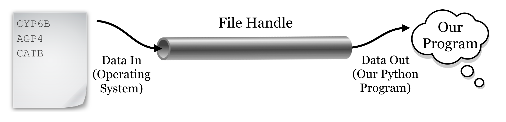
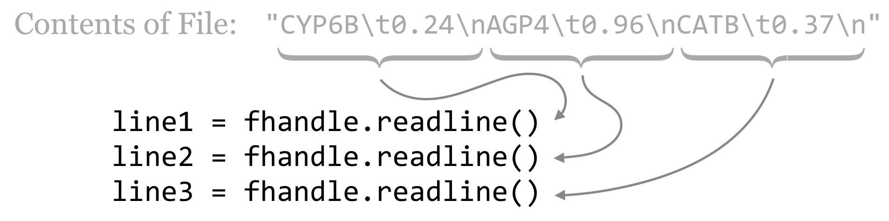
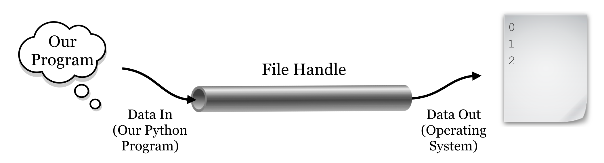

# File Input and Output

So far, all the data we’ve been working with have been "hard-coded" into our programs. In real life, though, we’ll be seeking data from external files.

###### {- #file_handle}

We can access data that exist in an external file (a text file, usually) using a *file handle*, a special kind of data type we can connect to using an external source. In its simplest form, a file handle for reading data works sort of like a pipe: the operating system puts data (usually strings) in one end, and we extract data out of the other end, usually one line at a time. File handles for writing to files move the data in the opposite direction.

  

To associate a file handle called `fhandle` with the file `"filename.txt"`, for example, the command is `fhandle = open("filename.txt", "r")`. The r indicates that we’re creating a read-only file handle. The file handle data type has a method called `.readline()`, which returns the next available line from the pipe as a string; so, `line = fhandle.readline()` extracts a string (line) from the file handle and assigns it to `line`.

Let’s create a small file with three lines each containing a gene ID, a tab, and a corresponding GC-content value.

  

Now let’s create a program that reads and prints the data. When we are finished reading data from a file, we need to run the file handle’s `.close()` method. Using `.close()` causes the file handle to alert the operating system that we are done reading data from the handle. At this point the operating system is free to remove the back-end "pipe" and any data that might be in it.

<pre id=part2-04-open
     class="language-python 
            line-numbers 
            linkable-line-numbers">
<code>fhandle = open("ids.txt", "r")

line1 = fhandle.readline()
line2 = fhandle.readline()
line3 = fhandle.readline()

print("Starting output:")
print(line1)
print(line2)
print(line3)
print("Done.")

fhandle.close()
</code></pre>

In many languages, it is good practice to test whether a file handle was successfully opened, and if not, exit the program with an error. We could also do such tests in Python, but because Python by default quits with an informative error in this situation anyway, we won't worry as much about checking for errors here. Python also includes a special `with` keyword that handles both opening and closing the file:

<pre id=part2-04-with-open
     class="language-python 
            line-numbers 
            linkable-line-numbers">
<code>with open("ids.txt", "r") as fhandle:
    line1 = fhandle.readline()
    line2 = fhandle.readline()
    line3 = fhandle.readline()

    print("Starting output:")
    print(line1)
    print(line2)
    print(line3)

print("Done processing file; file handle is closed.")
</code></pre>

Python documentation recommends using with in this way, as it is slightly safer in cases of program crashes that occur when a file handle is open. Notice that `with open()` works similarly to loops, in that it also requires an indented [code block](#block). The file is closed when the script moves on to the next code block, noted by the lack of indentation. If we try to refer to this file handle outside of the `with open()` block, we will get the error `ValueError: I/O operation on closed file.`.

If the file doesn’t exist or is not readable by the program, you will get a `FileNoteFoundError` with the file name you attempted to open. Because our file does exist, we can successfully execute the code and inspect the results:

<pre id=part2-04-output
     class="language-txt 
            line-numbers 
            linkable-line-numbers">
<code>Starting output:
CYP6B 0.24

AGP4 0.96

CATB 0.37

Done processing file; file handle is closed.
</code></pre>

There are a few things to note here. First, each time we call `fhandle.readline()`, the file handle returns a different string: the next string waiting to be popped out of the pipe. Second, we see that the output contains our three lines, but separated by blank lines: this is because there are "newline" characters already in the file. We don’t see these newline characters, but we can represent them ourselves if we like, in a string with the control code `\n`. Similarly, tab characters have a control code like `\t`. The file is actually a single serial string, and the `.readline()` method asks the file handle to return everything up to and including the next `\n`.

  

In the end, the reason for the blank lines in our output is that the `print()` function, for our convenience, appends a `\n` to the end of any string that we print (otherwise, most of our output would all be on the same line). Thus each line read in from the file is being printed with two `\n` characters. We’ll learn how to print without an additional newline later, when we learn how to write data to files. For now, we’ll solve the problem by removing leading and trailing whitespace (spaces, tabs, and newlines) by asking a string to run its `.strip()` method.

<pre id=part2-04-strip
     class="language-python 
            line-numbers 
            linkable-line-numbers">
<code>
with open("ids.txt", "r") as fhandle:
    line1 = fhandle.readline()
    line1stripped = line1.strip()
    line2 = fhandle.readline()
    line2stripped = line2.strip()
    line3 = fhandle.readline()
    line3stripped = line3.strip()

    print("Starting output:")
    print(line1stripped)
    print(line2stripped)
    print(line3stripped)

print("Done.")
</code></pre>

Here’s the modified output:

<pre id=part2-04-output_stripped
     class="language-txt 
            line-numbers 
            linkable-line-numbers">
<code>
Starting output:
CYP6B 0.24
AGP4 0.96
CATB 0.37
Done.
</code></pre>

If you feel adventurous (and you should!), you can try method chaining, where the dot syntax for methods can be appended so long as the previous method returned the correct type.

  

To tie this into earlier concepts, after we’ve extracted each line and stripped off the trailing whitespace, we can use `.split("\t")` to split each line into a list of strings. From there, we can use `float()` to convert the second element of each into a float type (remember, all data read from files are strings), and compute the mean GC content.

<pre id=part2-04-GC
     class="language-python 
            line-numbers 
            linkable-line-numbers">
<code>
with open("ids.txt", "r") as fhandle:
    line1 = fhandle.readline().strip()
    line2 = fhandle.readline().strip()
    line3 = fhandle.readline().strip()

line1_list = line1.split("\t")
line2_list = line2.split("\t")
line3_list = line3.split("\t")

gc1 = float(line1_list[1])
gc2 = float(line2_list[1])
gc3 = float(line3_list[1])

mean_gc = (gc1 + gc2 + gc3)/3
print(mean_gc)
</code></pre>

The above prints the average GC content of the three lines as `0.523333333`. (Because `.strip()` also returns a string, we could have further chained methods, as in `line1_list = fhandle.readline().strip().split("\t")`. Or to take it even further, `gc1 = fhandle.readline().strip().split("\t")[1]`.)

Because file handles work like a pipe, they don’t allow for "random access"; we can get the next bit of data out of the end of the pipe, but that’s it.^[In more sophisticated usage of file handles, our pipe analogy breaks down. It’s possible to "rewind" or "fast-forward" the operating system’s current position in the file being read, if we know how far the "read head" needs to move to get to the data we want. Perhaps a better analogy for file handles would be an old-fashioned magnetic cassette tape, perhaps a fitting analogy given that files were once stored on such tapes.] One might think that a command like `line5 = fhandle[4]` would work, but instead it would produce an error like `TypeError: '_io.TextIOWrapper' object is not subscriptable`.

On the other hand, like lists, file handles are [iterable](##iterable), meaning we can use a for-loop to access each line in order. A simple program to read lines of a file and print them one at a time (without extra blank lines) might look like this:

<pre id=part2-04-for_loop
     class="language-python 
            line-numbers 
            linkable-line-numbers">
<code>
with open("ids.txt", "r") as fhandle:
    for line in fhandle:
        linestripped = line.strip()
        print(linestripped)
print("Done")
</code></pre>

Like `.readline()`, using a for-loop extracts lines from the pipe. So, if you call `.readline()` twice on a file handle attached to a file with 10 lines, and then run a for-loop on that file handle, the for-loop will iterate over the remaining 8 lines. This call could be useful if you want to remove a header line from a text table before processing the remaining lines with a loop, for example.

### Writing Data {-}

Writing data to a file works much the same way as reading data: we open a file handle (which again works like a pipe), and call a method on the handle called `.write()` to write strings to it. In this case, instead of using the "r" parameter in calling `open()`, we’ll use `"w"` to indicate that we want to write to the file. Be warned: when you open a file handle for writing in this manner, it overwrites any existing contents of the file. If you’d rather append to the file, you can instead use `"a"`.^[It’s also possible to open a file handle for simultaneous reading and writing. We won’t cover it here, as that functionality is less often needed.]

Unlike the `print()` function, the `.write()` method of a file handle does not automatically include an additional newline character `"\n"`. Thus, if you wish to write multiple lines to a file handle, you have to add them yourself. Here’s an example that prints the numbers `0` through `9` to a file, one per line.

<pre id=part2-04-for_loop
     class="language-python 
            line-numbers 
            linkable-line-numbers">
<code>
with open("data/numbers.txt", "w") as fhandle:   # overwrites data/numbers.txt
    for value in range(0, 10):
        fhandle.write(f"{value}\n")
</code></pre>

As mentioned above, a file handle opened for writing works like a pipe that is set up by the operating system. When writing, however, we put data into the pipe, and the operating system pulls the data out the other side, writing it to the file on disk.

  

Because the operating system is busy handling similar requests for many programs on the system, it may not get around to pulling the data from the pipe and writing to the file on disk right away. So, it’s important that we remember to use the `with` statement or call the `.close()` method on the file handle when we are done writing data; this tells the operating system that any information left in the pipe should be flushed out and saved to disk, and that the pipe structure can be cleaned up. If our program were to crash (or were to be killed) before the handle was properly closed, data in the pipe may never get written.

### Computing a Mean {-}

Let’s put many of the skills we’ve learned so far into practice to compute the mean of the E values from the output of BLAST, which is formatted as a simple text table with tabs separating the columns. Here’s what the file, [`pz_blastx_yeast_top1.txt`](data/pz_blastx_yeast_top1.txt), looks like in `less -S`. Although the reader will have to take our word for it, the eleventh column of this file contains E values like `5e-14`, `2e-112`, and `1e-18`.

<pre id=part2-04-top1
     class="language-txt 
            line-numbers 
            linkable-line-numbers">
<code>
PZ7180000000004_TY  YKL081W 31.07   338   197   8     13    993   1    ...
PZ1082_AB           YHR104W 44.92   118   62    3     4     348   196  ...
PZ11_FX             YLR406C 53.01   83    38    1     290   42    25   ...
PZ7180000036154     YNL245C 36.27   102   60    3     105   395   1    ...
PZ605962            YKR079C 29.57   115   66    4     429   121   479  ...
PZ856513            YKL215C 48.39   155   73    3     3     452   109  ...
...
</code></pre>

###### {- #pseudocode}

When solving a problem like this, it’s usually a good idea to first write, in simple English (or your nonprogramming language of choice), the *strategy* you intend to use to solve the problem. The strategy here will be as follows: the mean of a set of numbers is defined as their sum, divided by the count of them. We’ll need to keep at least two important variables, `eval_sum` and `counter`. After opening the file, we can loop through the lines and extract each E value. (This will require cleaning up the line with `.strip()`, splitting it into pieces using `.split("\t")`, and finally converting the E value to a float rather than using the string.) For each line that we see, we can add the E value extracted to the `eval_sum` variable, and we’ll add `1` to the `counter` variable as well. In the end, we can simply report `eval_sum/counter`.

It often helps to convert this strategy into something partway between natural language and code, called *pseudocode*, which can help tremendously in organizing your thoughts, particularly for complex programs:

<pre id=part2-04-pseudo
     class="language-pseudocode">
<code>
counter = 0
sum_eval = 0.0

open fhandle
    for each line in fhandle
        strip the newline characters
        break into a list of strings by spitting on tabs
        eval as a string is in list at index 10 (11th column)
        add float(eval) to sum_eval and save in sum_eval
        add 1 to count and save in count
  
mean = sum_eval divided by counter
print("mean is " + mean)
</code></pre>

With the pseudocode sketched out, we can write the actual code for our program. When executed, it reliably prints `Mean is: 1.3721261129291757e-08`.

<pre id=part2-04-mean
     class="language-python 
            line-numbers 
            linkable-line-numbers">
<code>
#!/usr/bin/env python

counter = 0
eval_sum = 0.0

with open("pz_blastx_yeast_top1.txt", "r") as blast_handle:
    for line in blast_handle:
        line_stripped = line.strip()
        line_list = line_stripped.split("\t")
        eval_str = line_list[10]

        eval_sum = eval_sum + float(eval_str)
        counter = counter + 1

mean = eval_sum/counter
print(f"Mean is: {mean}")
</code></pre>

Note that the actual Python code (in [blast_mean.py](data/blast_mean.py)) ended up looking quite a lot like the pseudocode – this is one of the frequently cited selling points for Python. (For this reason, we’ll also skip the pseudocode step for most examples in this book, though it can still be a valuable technique when programming in any language.)

This may seem like a fair amount of work to compute a simple mean, but it is a consequence of writing software "from scratch," and we have to start somewhere! Additionally, the benefit of learning these techniques will pay off over the long run when it comes to solving novel problems.

### The Process of Programming {-}

Although the process of designing a strategy (and pseudocode) seems tedious, it’s highly recommended. As you progress in your abilities, your strategies and pseudocode will become more terse and higher level, but you should never skip the planning steps before coding. (On the other hand, there is also the danger of over-planning, but this more often effects teams of coders working on large projects.)

There’s another thing worth noting at this point: programs like the above are almost never written top-to-bottom in their entirety, at least not without requiring significant debugging! You may forget that the result of splitting a string results in a list of strings, resulting in an error on a line like `eval_sum = eval_sum + eval_str` because `eval_sum` is a float, while `eval_str` is a string. After finding and fixing this error, you may find yet another error if you attempt to print with a line like `print("Mean is: " + mean)`, because again the types don’t match and can’t be concatenated. After all this, perhaps you find the resulting mean to unexpectedly be a large number, like `131.18`, only to find out it was because you accidently used `eval_str = line_list[11]`, forgetting that list indices start at `0`.

There are two strategies for avoiding long chains of annoying bugs like this, and harder-to-find (and thus more dangerous) bugs that result in incorrect output that isn’t obviously incorrect. The first strategy is to only write a few lines at a time, and test newly added lines with `print()` statements that reveal whether they are doing what they are supposed to. In the example above, you might write a few lines and do some printing to ensure that you can successfully open the file handle and read from it (if the file is large, create a smaller version for testing). Then write a simple for-loop and do some printing to ensure you can successfully loop over the lines of the file and split them into lists of strings. Continue on by filling in some of the code in the for-loop, again printing and testing to ensure the code is doing what you think it is. And so on via [iterative development](#iterative_development).

###### {- #unit_test}

The second strategy, to avoid the more dangerous bugs that aren’t immediately obvious, is to test and develop your programs using small files for which you can calculate the answer by hand (or some other trusted process). When you know from testing that your program or even just parts of your program produces the intended output, hidden bugs are much less likely to slip through the cracks. Some people produce several small inputs that represent the variety of different input situations, run the tests, and compare the outputs to the expected results in an automated fashion. This is known as "*unit testing*", a common practice in professional software development.

Finally, remember that every programmer, no matter her experience level, gets frustrated from time to time! This is entirely normal, and a good strategy when this happens is to take a brief walk, or even take a break for the day, picking up again the next day. Some find they program efficiently in the morning, others late at night. Whatever you do, *avoid the temptation to program by trial and error*, mindlessly tweaking the code in the hopes that it will produce the output you want. Even if you succeed this way (which rarely happens), you’re likely to produce code with insidious bugs, and it may well be unreadable even to yourself in a few days’ time.

#### Exercises {-}
1. Write a Python program to compute the sample standard deviation of the E values in the file [pz_blastx_yeast_top1.txt](data/pz_blastx_yeast_top1.txt). As a reminder, the sample standard deviation is defined as the square root of the sum of squared differences from the mean, divided by the number of values minus 1:  
    $ 
    stdev = \sqrt{\frac{\sum{_{i=1}^{n} (eval_i - mean_{evals})^2}}{n-1}}
    $
      
To accomplish this, you’ll need to make two passes over the data: one as in the example to compute the mean, and another to compute the sum of squared differences. This means you’ll need to access the E values twice. Rather than close and reopen the data file, you should create an initially empty list to which you can append each E value (in your first pass over the data) for later use.  
To compute the square root of a float, you will need to import the math module by calling `import math` near the top of your program. Then the `math.sqrt()` function will return the square root of a float; for example, `math.sqrt(3)` will return the float `1.7320508`.
2. If `a_list` is a list, then `b_list = reversed(a_list)` creates a "`listreverseiterator`" allowing one to loop over the elements with a for-loop in reverse order. Using this information, write a program called `reverse_blast.py` that reads the contents of [`pz_blastx_yeast_top1.txt`](data/pz_blastx_yeast_top1.txt) and writes the lines in reverse order to a file called `pz_blastx_yeast_top1_reversed.txt`.
3. A *quine* (after the logician and philosopher W. V. Quine) is a nonempty program that prints its own source code exactly. Use file handles to write a quine called `quine.py`. (Quine programs aren’t technically allowed to open files. Can you write a program that prints its own source code without opening a file?)

