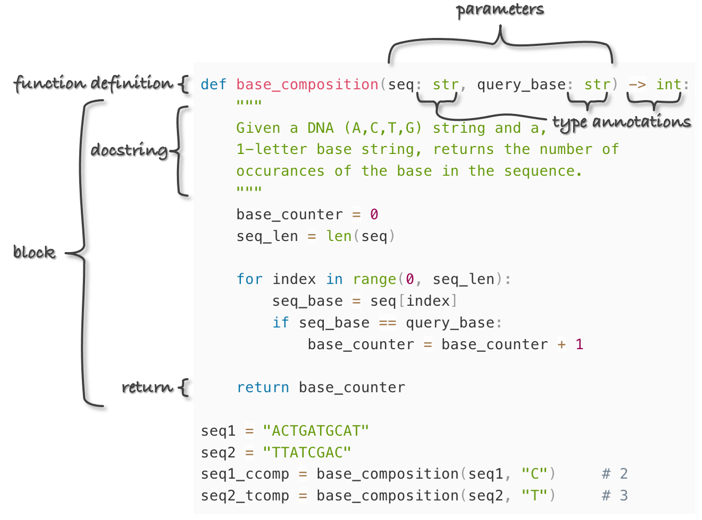
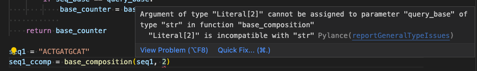

#  Python Functions

> The psychological profiling [of a programmer] is mostly the ability to shift levels of abstraction, from low level to high level. To see something in the small and to see something in the large.
>
>~Donald Knuth

Functions (sometimes called "subroutines") are arguably the most important concept in programming. We’ve already seen their use in many contexts, for example, when using functions like `len()` and `float()`. Here’s a bit of code that computes the GC content of a DNA sequence in a variable called `seq`:

<pre id=part2-06-GC-content
     class="language-python 
            line-numbers 
            linkable-line-numbers">
<code>
base_counter = 0
seq_len = len(seq)

for index in range(0, seq_len):
    seq_base = seq[index]
    if seq_base == "G" or seq_base == "C":
        base_counter = base_counter + 1

gc = base_counter/float(seq_len)
</code></pre>

What if we wanted to compute the GC content for multiple different variables in our code? Should we rewrite our GC-computing for-loop for each different variable? No way! First, we’d be at a much higher risk of bugs (it’s a probabilistic fact that more typing leads to more typos). Second, the whole point of programming is for the computer to do all the work, not us.

Ideally, we’d like to encapsulate the functionality of computing GC content, just as the functionality of getting the length of a sequence is encapsulated by the `len()` function. We want to just be able to say `gc = gc_content(seq)`. Functions allow us to do exactly this: encapsulate a [block](#block) of code for reuse whenever we need it. There are three important parts of a function:

1. The input (parameters given to the function).
2. The code block that is to be executed using those parameters. As usual, an additional level of indentation will define the block.
3. The output of the function, called the return value. This may be optional, if the function "does something" (`like print()`) rather than "returns something" (like `len()`).

Ignoring point 2, functions can actually represent a mathematical ideal: they relate inputs to outputs. They even have domains (the set of all valid inputs) and ranges (the set of all potential outputs).

We define functions in Python using the `def` keyword, and, in Python, functions must be defined before they can be executed. Here’s an example function that computes a "base composition" (count of a character in a given string) given two parameters: (1) the sequence (a string) and (2) the base/character to look for (also a string).

  

Here we can easily identify the three important parts of a function as noted above: the input, the code block, and the return statement. We also see two additional optional components: the docstring and type annotations. The docstring (or documentation string) provides information on how the function works. Type annotations help us to annotate the types of variables we are using. More on both of these concepts later.

The last two lines above call the function with different parameters—note that the parameter variable names (in this case `seq` and `query_base`) need not relate to the variable names of the data outside the function. This is an important point to which we’ll return. When the interpreter reads the `def` line and corresponding block, the function is defined (available for use), but the lines are not run, or *called*, until the function is used in the last two lines.

One of the best things about functions is that they can call other functions, provided they’ve already been defined at the time they are called.

<pre id=part2-06-block
     class="language-python 
            line-numbers 
            linkable-line-numbers">
<code>
def base_composition(seq: str, query_base: str) -> int:
    """
    Given a DNA (A,C,T,G) string and a
    1-letter base string, returns the number of
    occurances of the base in the sequence.
    """
    base_counter = 0
    seq_len = len(seq)
    
    for index in range(0, seq_len):
        seq_base = seq[index]
        if seq_base == query_base:
            base_counter = base_counter + 1
            
    return base_counter

def gc_content(seq: str) -> float:
    '''Given a DNA (A,C,T,G) sequence string, returns the GC-content as float'''
    g_cont = base_composition(seq, "G")
    c_cont = base_composition(seq, "C")
    gc = (g_cont + c_cont)/len(seq)
    return gc

seq3 = "ACCCTAGACTG"
seq3_gc = gc_content(seq3)                   # 0.5454
</code></pre>

Because functions need only to be defined before they are called, it is common to see collections of functions first in a program. Further, the order of definition need not correspond to their order of execution: either the `gc_content()` or the `base_composition()` function definition could occur first in this file and the computation would still work.

The idea of encapsulating small ideas into functions in this way is a powerful one, and from this point forward you should attempt to think mostly in terms of "what *function* am I writing/do I need," rather than "what *program* am I writing?"

### Important Notes about Functions {-}

In an effort to produce clean, readable, and reusable code, you should strive to follow these rules when writing functions.

1. Function blocks should only utilize variables that are either *created within the function block* (e.g., `g_cont` and `c_cont` within the `gc_content()` function above), or *passed in as parameters* (e.g., `seq`). Functions should be "worlds unto themselves" that only interact with the outside world through their parameters and return statement. The following redefinition of the `gc_content()` function would work, but it would be considered bad form because `seq4` is used but is neither created within the function nor passed as a parameter.
    <pre id=part2-06-seq4
        class="language-python 
                line-numbers 
                linkable-line-numbers">
    <code>
    def gc_content() -> float:
        '''Given a DNA (A,C,T,G) sequence string, returns the GC-content as float'''
        g_cont = base_composition(seq4, "G")
        c_cont = base_composition(seq4, "C")
        gc = (g_cont + c_cont)/len(seq)
        return gc

    seq4 = "ACCCTAGACTG"
    seq4_gc = gc_content()                   # 0.5454
    </code></pre>
    Notice the difference: the function takes no parameters and so must use the same variable names as defined outside the function. This makes the function tied to the context in which it is called. Because function definitions may be hundreds or thousands of lines removed from where they are called (or even present in a different file), this makes the task of coding much more difficult. Ideally, functions should be able to "stand alone".
2. Document the use of each function, either with comments or docstrings. What parameters are taken, and what types should they be? Do the parameters need to conform to any specification? For example: "this function works only for DNA strings, not RNA strings." What is returned? The preferred method of function documentation is docstrings: these triple-quoted strings must occur at the top of the function block, and they may span multiple lines. Later, when we discuss documentation for Python code, we’ll learn how the Python interpreter can automatically collate these comments into nice, human-readable documents for others who might want to call your functions.

    

3. Utilize type annotations to further document parameter and return data types, and pair with a text editor that offers linting^[Linting is a form of static code analysis. Essentially, it's used to try to find errors, bugs, and other potentially problematic code BEFORE your code is run.]. Our current favorite is VS Code with the Python Extension, which includes a whole host of useful tools.

    For example, notice that when we attempt to pass `base_compostion` an integer for `query_base` on the last line, VS Code underlines it with a zigzag red line. When we hover over this with our mouse, we see the problem:

    

    
    

    Our use of type annotations in the function header lets our text editor know we intended to pass two strings to `base_composition`, and it can then alert us to the fact that we are trying to pass a string and an int: probably an error. However, note that type annotations are in no way (currently!) enforced by the Python interpreter, and this code runs with zero errors and returns `0`, as the `query_base` of `2` never appears in `seq`.

4. Functions shouldn’t be "too long". This is subjective and dependent on context, but most programmers are uncomfortable with functions that are more than one page long in their editor window.^[With the advent of large monitors, perhaps this is no longer a good rule of thumb! Personally, I find that few of my functions need to exceed 30 lines in length, depending only somewhat on the language I’m writing in.] The idea is that a function encapsulates a single, small, reusable idea. If you find yourself writing a function that is hard to read or understand, consider breaking it into two functions that need to be called in sequence, or into one short function that calls another short function.

5. Write lots of functions! Even if a section of code is only going to be called once, it is completely acceptable to make a function out of it if it encapsulates some idea or well-separable block. After all, you never know if you might need to use it again, and just the act of encapsulating the code helps you ensure its correctness, allowing you to forget about it when working on the rest of your program.

### GC Content over Sequences in a File {-}

In Chapter 19, "[Conditional Control Flow](#conditional-control-flow)", one of the exercises involved computing the molecular weight for each sequence in a tab-separated file of IDs and sequences, [`ids_seqs.txt`](data/ids_seqs.txt). Here are the lines of this file viewed with `less -S`:

    

If you completed the molecular weight exercise in Chapter 19, you might have found it somewhat challenging. Without using functions, you likely needed to use a for-loop to iterate over each line of the file, and within there another for-loop to iterate over each base of the current sequence, and inside of that an if-statement to determine the molecular weight of each base.

Here we’ll write a similar program, except this time we’ll make use of a function that returns the GC content of its parameter. The entire solution is actually quite short and readable.

<pre id=part2-06-chapter19
     class="language-python 
            line-numbers 
            linkable-line-numbers">
<code>
#!/usr/bin/env python

def base_composition(seq: str, query_base: str) -> int:
    """
    Given a DNA (A,C,T,G) string and a 1-letter base string,
    returns the number of occurances of the base in the sequence.
    """
    base_counter = 0
    seq_len = len(seq)
    
    for index in range(0, seq_len):
        seq_base = seq[index]
        if seq_base == query_base:
            base_counter = base_counter + 1
            
    return base_counter

def gc_content(seq: str) -> float:
    '''Given a DNA (A,C,T,G) sequence string, returns the GC-content as float'''
    g_cont = base_composition(seq, "G")
    c_cont = base_composition(seq, "C")
    gc = (g_cont + c_cont)/len(seq)
    return gc

## Open file, and loop over lines
with open("ids_seqs.txt", "r") as fhandle:
    for line in fhandle:
        linelist = line.strip().split("\t")
        id = linelist[0]
        sequence = linelist[1]
        seqgc = gc_content(sequence)
        print(f"{id}\t{seqgc}")
</code></pre>

In the above code ([`ids_seqs_gcs.py`](data/ids_seqs_gcs.py)), there’s a clear "separation of concerns" that makes designing a solution easier. One function handles counting bases in a DNA sequence, and another the computation of the GC content. With those out of the way, we can turn our focus to parsing the input file and printing the output.

To simplify exposition, most of the small code samples in the next few chapters don’t involve creating new functions. Most of the exercises will suggest writing functions as a means of breaking a problem down into its component parts, however.

#### Exercises {-}

1. We have now covered four of the basic control-flow structures common to most programming languages. What are they, and what do they do?

2. We often want to look at some sort of windows of a sequence; perhaps we want to look at the codons of a sequence like `"ACTTAGAGC"`(`"ACT"`, `"TAG"`, and `"AGC"`), which we can think of as a 3bp "window size" and a 3bp "step size." Or perhaps we want to consider overlapping windows of 6-mers (like `"ACTTAG"`, `"CTTAGA"`, `"TTAGAG"`, and `"TAGAGC"`, window size 6, step size 1).

    Write a program with a function called `get_windows()` that takes three parameters: the sequence to extract windows from (string), the window size (int), and the step size (int). The function should return a list of strings, one per window, with no "partial windows" if the last window would run off the end of the sequence.

    <pre id=part2-06-get_windows
     class="language-python 
            line-numbers 
            linkable-line-numbers">
    <code>
    def get_windows(seq: str, windowsize: int, stepsize: int) -> list:
        """Given a string, windowsize (int) and step size (int),
        returns a list of windows of the windowsize.
        E.g. "TACTGG", 3, 2 => ["TAC", "CTG"]
        """
        ## your code here
        ## etc. 
    </code></pre>

    (You might find a while-loop to be more helpful than a for-loop for this exercise.) You can find a [template](data/get_windows_template.py) which contains several [unit tests](#unit_test). These tests are in the form of `assert` statements: if the conditional in the statement is `True`, the code will continue to run, otherwise, the program is stopped and raises an `AssertionError` - this error can even be customized.

3. Although the `get_windows()` function is designed to run on strings, indexing in strings and in lists works the same in Python. What happens if you run `get_windows([1, 2, 3, 4, 5, 6, 7, 8], 3, 2)`?

4. Redo exercise 1 from [Chapter 19](#conditional-control-flow), but this time write and use a `molecular_weight()` function that takes a DNA string called `seq` as a parameter.

