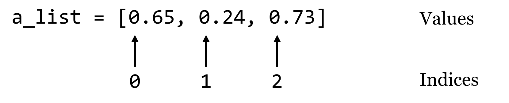

# Dictionaries

Dictionaries (often called "hash tables" in other languages) are an efficient and incredibly useful way to associate data with other data. Consider a list, which associates each data element in the list with an integer starting at zero:

  

A dictionary works in much the same way, except instead of indices, dictionaries use "keys", which may be integers or strings.^[Dictionary keys may be any [immutable](#immutable) type, which includes integers and strings, but they also include a number of other more exotic types, like [tuples](#tuples) (immutable lists). Although floats are also immutable, because keys are looked up on the basis of equality and rounding errors can compound, it is generally not recommended to use them as dictionary keys.] We’ll usually draw dictionaries longwise, and include the keys within the illustrating brackets, because they are as much a part of the dictionary structure as the values:

  

Let’s create a dictionary holding these keys and values with some code, calling it `ids_to_gcs`. Note that this name encodes both what the keys and values represent, which can be handy when keeping track of the contents of these structures. To create an empty dictionary, we call the `dict()` function with no parameters, which returns the empty dictionary. Then, we can assign and retrieve values much like we do with lists, except (1) we’ll be using strings as keys instead of integer indices, and (2) we can assign values to keys even if the key is not already present.

<pre id=part2-08-dict_init
     class="language-python 
            line-numbers 
            linkable-line-numbers">
<code>
ids_to_gcs = dict()

ids_to_gcs["CYP6B"] = 0.56

key = "CATB"
val = 0.73
ids_to_gcs[key] = val

ids_to_gcs["AGP2"] = 0.24
</code></pre>

We can then access individual values just like with a list:

<pre id=part2-08-dict_access
     class="language-python 
            line-numbers 
            linkable-line-numbers">
<code>
val_catb = ids_to_gcs["CATB"]
print(val_catb)                       # prints 0.73

key_agp2 = "AGP2"
val_agp2 = ids_to_gcs[key_agp2]       # holds 0.24
</code></pre>

However, we cannot access a value for a key that doesn’t exist. This will result in a `KeyError`, and the program will halt.

<pre id=part2-08-dict_error
     class="language-python 
            line-numbers 
            linkable-line-numbers">
<code>
test = ids_to_gcs["TL34_X"]           # Error!
</code></pre>

Dictionaries go one way only: given the key, we can look up the value, but given a value, we can’t easily find the corresponding key. Also, the name "dictionary" is a bit misleading, because although real dictionaries are sorted in alphabetical order, Python dictionaries have no intrinsic order. Unlike lists, which are ordered and have a first and last element, Python makes no guarantees about how the key/value pairs are stored internally. Also, each unique key can only be present once in the dictionary and associated with one value, though that value might be something complex like a list, or even another dictionary. Perhaps a better analogy would be a set of labeled shelves, where each label can only be used once.

  

There are a variety of functions and methods that we can use to operate on dictionaries in Python. For example, the `len()` function will return the number of key/value pairs in a dictionary. For the dictionary above, `len(ids_to_gcs)` will return `3`. If we want, we can get a list of all the keys in a dictionary using its `.keys()` method, though this list may be in a random order because dictionaries are unordered. We could always sort the list, and loop over that:

<pre id=part2-08-sort
     class="language-python 
            line-numbers 
            linkable-line-numbers">
<code>
ids = ids_to_gcs.keys()      # list of keys
ids_sorted = sorted(ids)     # sorted version
for idkey in ids_sorted:     # for each key
    gc = ids_to_gcs[idkey]   # get the value
    print("id " + idkey + " has GC content " + str(gc))
</code></pre>

Similarly, we can get a list of all the values using `.values()`, again in no particular order. So, `ids_to_gcs.values()` will return a list of three floats.^[In Python 3.0 and later, what is returned by `.keys()` and `.values()` is not technically a list but a "view", which operates similarly to a list without using any additional memory. The code shown still works, but `ids.sort()` (the sort-in-place version) would not, as views do not have a `.sort()` method.]

If we try to get a value for a key that isn’t present in the dictionary, we’ll get a `KeyError`. So, we will usually want to test whether a key is present before attempting to read its value. We can do this using the `in` keyword.

<pre id=part2-08-in
     class="language-python 
            line-numbers 
            linkable-line-numbers">
<code>
if "TL34_X" in ids_to_gcs:
    tl34x_gc = ids_to_gcs["TL34_X"]
    print("TL34_X has GC " + str(tl34x_gc))
else:
    print("TL34_X not found in dictionary.")
</code></pre>

### Counting Gene Ontology Terms {-}

To illustrate the usage of a dictionary in practice, consider the file [`PZ.annot.txt`](data/PZ.annot.txt), the result of annotating a set of assembled transcripts with gene ontology (GO) terms and numbers. Each tab-separated line gives a gene ID, an annotation with a GO number, and a corresponding human-readable term associated with that number.

<pre id=part2-08-GO
     class="language-python 
            line-numbers 
            linkable-line-numbers">
<code>
PZ7180000020811_DVU     GO:0003824      GJ12748 [Drosophila virilis]
PZ7180000020752_DVU     GO:0003824      GI16375 [Drosophila mojavensis]
PZ7180000034678_DWY     GO:0003824      hypothetical protein YpF1991016_1335 [Yersinia pestis biovar Orientalis str. F1991016]
PZ7180000024883_EZN     GO:0006548      sjchgc01974 protein
PZ7180000024883_EZN     GO:0004252      sjchgc01974 protein
PZ7180000024883_EZN     GO:0004500      sjchgc01974 protein
PZ7180000024883_EZN     GO:0006508      sjchgc01974 protein
PZ7180000023260_APN     GO:0005515      btb poz domain containing protein
...
</code></pre>

In this file, each gene may be associated with multiple GO numbers, and each GO number may be associated with multiple genes. Further, each GO term may be associated with multiple different GO numbers. How many times is each ID found in this file? Ideally, we’d like to produce tab-separated output that looks like so:

<pre id=part2-08-GO-tab
     class="language-txt 
            line-numbers 
            linkable-line-numbers">
<code>
1   PZ7180000020811_DVU
1   PZ7180000020752_DVU
1   PZ7180000034678_DWY
4   PZ7180000024883_EZN
1   PZ7180000023260_APN
...
</code></pre>

Our strategy: To practice some of the command line interaction concepts, we’ll have this program read the file on standard input and write its output to standard output (as discussed in chapter 21, “[Command Line Interfacing](#command-line-interfacing)”). We’ll need to keep a dictionary, where the keys are the gene IDs and the values are the counts. A for-loop will do to read in each line, stripping off the ending newline and splitting the result into a list on the tab character, `\t`. If the ID is in the dictionary, we’ll add one to the value. Because the dictionary will start empty, we will frequently run into IDs that aren’t already present in the dictionary; in these cases we can set the value to `1`. Once we have processed the entire input, we can loop over the dictionary printing each count and ID.

In the code below (`[go_id_count.py](data/go_id_count.py)`), when the dictionary has the `seqid` key, we are reading from the dictionary and updating the value (incrementing by 1, in this case). But when the key is not present, we’re adding that new key to the dictionary and initializing the value.

<pre id=part2-08-go_id_count
     class="language-python 
            line-numbers 
            linkable-line-numbers">
<code>
#!/usr/bin/env python
import sys

if(sys.stdin.isatty()):
    print("Usage: cat <annotation file> | ./go_id_count.py")
    quit()

ids_to_counts = dict()

# Parse input
for line in sys.stdin:
    line_list = line.strip().split("\t")
    seqid = line_list[0]
    if seqid in ids_to_counts:      #seqid already seen, update
        ids_to_counts[seqid] += 1
    else:                           #new seqid, initialize
        ids_to_counts[seqid] = 1

# Print dict contents
for seqid in ids_to_counts:
    count = ids_to_counts[seqid]
    print(count, seqid, sep="\t")
</code></pre>

In the loop that prints the dictionary contents, there is no need to check for the presence of each `seqid` before reading it to print, because we are simply iterating over each key that exists in the dictionary.

<pre id=part2-08-output
     class="language-txt 
            line-numbers 
            linkable-line-numbers">
<code>
[oneils@mbp ~/apcb/py]$ <b>cat PZ.annot.txt | ./go_id_count.py</b>
2   PZ736262
4   PZ7180000000004_OO
5   PZ7180000000004_OM
3   PZ7180000000004_OJ
2   PZ7180000000021_AX
...
</code></pre>

What’s the advantage of organizing our Python program to read rows and columns on standard input and write rows and columns to standard output? Well, if we know the built-in command line tools well enough, we can utilize them along with our program for other analyses. For example, we can first filter the data with `grep` to select those lines that match the term `transcriptase`:

<pre id=part2-08-filter-input
     class="language-txt 
            line-numbers 
            linkable-line-numbers">
<code>
[oneils@mbp ~/apcb/py]$ <b>cat PZ.annot.txt | grep 'transcriptase'</b>
</code></pre>

The result is only lines containing the word “transcriptase”:

<pre id=part2-08-filtered
     class="language-txt 
            line-numbers 
            linkable-line-numbers">
<code>
PZ7180000000003_PI  GO:0003723  reverse transcriptase
PZ7180000000003_PI  GO:0003964  reverse transcriptase
PZ7180000000003_PI  GO:0031072  reverse transcriptase
PZ7180000000003_PI  GO:0006278  reverse transcriptase
PZ840833_BZS    GO:0005488  reverse transcriptase
PZ858982_CAA    GO:0005488  reverse transcriptase
PZ858982_CAA    GO:0044464  reverse transcriptase
PZ7180000029134_AHQ GO:0003723  reverse transcriptase
PZ7180000029134_AHQ GO:0003964  reverse transcriptase
...
</code></pre>

If we then feed those results through our program (`cat PZ.annot.txt | grep 'transcriptase' | ./go_id_count.py`), we see only counts for IDs among those lines.

<pre id=part2-08-filtered-count
     class="language-txt 
            line-numbers 
            linkable-line-numbers">
<code>
4   PZ924_N
4   PZ7180000000089_N
1   PZ840833_BZS
1   PZCAP37180000034572_A
3   PZ7180000029134_AHQ
1   PZ492962
</code></pre>

Finally, we could pipe the results through `wc` to count these lines and determine how many IDs were annotated at least once with that term (21). If we wanted to instead see which eight genes had the most annotations matching "transcriptase", we could do that, too, by sorting on the counts and using `head` to print the top eight lines (here we’re breaking up the long command with backslashes, which allow us to continue typing on the next line in the terminal).^[For simple problems like this, if we know the command line tools well enough, we don’t even need to use Python. This version of the problem can be solved with a pipeline like `cat PZ.annot.txt | grep 'transcriptase' | awk '{print $1}' | sort | uniq -c | sort -k1,1nr | head`.]

<pre id=part2-08-txn-output
     class="language-txt 
            line-numbers 
            linkable-line-numbers">
<code>
[oneils@mbp ~/apcb/py]$ <b>cat PZ.annot.txt | \</b>
> <b>grep 'transcriptase' | \</b>
> <b>./go_id_count.py | \</b>
> <b>sort -k1,1nr | \</b>
> <b>head -n 8</b>
7   PZ32722_B
5   PZ7180000000012_DC
4   PZ59_HO
4   PZ7180000000003_PI
4   PZ7180000000089_N
4   PZ924_N
3   PZ578878
3   PZ7180000000012_IL
</code></pre>

It appears gene `PZ32722_B` has been annotated as a transcriptase seven times. This example illustrates that, as we work and build tools, if we consider how they might interact with other tools (even other pieces of code, like functions), we can increase our efficiency remarkably.

### Extracting All Lines Matching a Set of IDs {-}

Another useful property of dictionaries is that they are very efficient to search. Suppose we had an unordered list of strings, and we wanted to determine whether a particular string occurred in the list. This can be done, but it would require looking at each element (in a `for` loop, perhaps) to see if it equaled the one we are searching for. If we instead stored the strings as keys in a dictionary (storing `"present"`, or the number `1`, or anything else in the value^[In practice, if we don't have a value we're interested in storing, we should use a set instead of a dictionary.]), we could use `in`, which takes a single time step (effectively, on average) no matter how many keys are in the dictionary.^[In computer science terms, we say that searching an unordered list runs in time $O(n)$, or “big $O$ of $n$” where $n$ is the size of the list. Looking up a dictionary key using `in`, is $O(1)$ (for the average case), which is to say that the time taken is independent of the size of the dictionary. If we need to do such a search many times, these differences can add up significantly. More information on run-time considerations is covered in chapter 27, “[Algorithms and Data Structures](#algorithms-and-data-structures)”.]

Returning to the GO/ID list from the last example, suppose that we had the following problem: we wish to first identify all those genes (rows in the table) that were labeled with `GO:0001539` (which we can do easily with `grep` on the command line), and then we wish to extract all rows from the table matching those IDs to get an idea of what other annotations those genes might have.

In essence, we want to print all entries of a file:

<pre id=part2-08-go-0001539
     class="language-txt 
            line-numbers 
            linkable-line-numbers">
<code>
PZ7180000020811_DVU     GO:0003824      GJ12748 [Drosophila virilis]
PZ7180000020752_DVU     GO:0003824      GI16375 [Drosophila mojavensis]
PZ7180000034678_DWY     GO:0003824      hypothetical protein YpF1991016_1335 [Yersinia pestis biovar Orientalis str. F1991016]
PZ7180000024883_EZN     GO:0006548      sjchgc01974 protein
PZ7180000024883_EZN     GO:0004252      sjchgc01974 protein
PZ7180000024883_EZN     GO:0004500      sjchgc01974 protein
PZ7180000024883_EZN     GO:0006508      sjchgc01974 protein
PZ7180000023260_APN     GO:0005515      btb poz domain containing protein
...
</code></pre>

Where the first column matches any ID in the first column of another input:

<pre id=part2-08-grep
     class="language-txt 
            line-numbers 
            linkable-line-numbers">
<code>
[oneils@mbp ~/apcb/py]$ <b>cat PZ.annot.txt | grep 'GO:0001539'</b>
PZ7180000000028_AP GO:0001539 troponin c 25d
PZ7180000000030_AP GO:0001539 troponin c
PZ7180000000043_AP GO:0001539 troponin c 25d
PZ7180000000044_AP GO:0001539 troponin c 25d
PZ7180000000045_AP GO:0001539 troponin c 25d
PZ7180000000046_AP GO:0001539 troponin c 25d
...
</code></pre>

As it turns out, the above problem is common in data analysis (subsetting lines on the basis of an input “query” set), so we’ll be careful to design a program that is not specific to this data set, except that the IDs in question are found in the first column.^[The `grep` utility can perform a similar operation; `grep -f query_patterns.txt subject_file.txt` will print all lines in `subject_file.txt` that are matched by any of the patterns in `query_patterns.txt`. But this requires that all patterns are compared to all lines (even if the patterns are simple), and so our custom Python solution is much faster when the number of queries is large (because dictionary key lookup is so fast).]

We’ll write a program called `match_1st_cols.py` that takes two inputs: on standard input, it will read a number of lines that have the query IDs we wish to extract, and it will also take a parameter that specifies the file from which matching lines should be printed. For this instance, we would like to be able to execute our program as follows:

<pre id=part2-08-fxn_call
     class="language-txt 
            line-numbers 
            linkable-line-numbers">
<code>
[oneils@mbp ~/apcb/py]$ <b>cat PZ.annot.txt | grep 'GO:0001539' | \</b>
> <b>./match_1st_cols.py PZ.annot.txt</b>
</code></pre>

In terms of code, the program can first read the input from stdin and create a dictionary that has keys corresponding to each ID that we wish to extract (the values can be anything). Next, the program will loop over the lines of the input file (specified in `sys.argv[1]`), and look up each ID dictionary created previously; if it’s found, the line is printed.

<pre id=part2-08-py-script
     class="language-python 
            line-numbers 
            linkable-line-numbers">
<code>
#!/usr/bin/env python
import sys

if sys.stdin.isatty() or len(sys.argv) != 2:
    print("Usage: cat <id_list> | ./match_1st_cols.py <search_file>")
    print("This script extracts lines from <search_file> where any entry")
    print(" in the the first column of <id_list> matches the first column")
    print(" of <search_file>")
    quit()

## Build IDs wanted dictionary from standard input
ids_wanted = dict()
for line in sys.stdin:
    line_stripped = line.strip()
    line_list = line_stripped.split("\t")
    id = line_list[0]
    ids_wanted[id] = "wanted"

## Loop over the file, print the lines that are wanted
with open(sys.argv[1], "r") as fhandle:
    for line in fhandle:
        line_stripped = line.strip()
        line_list = line_stripped.split("\t")
        id = line_list[0]
        # Is the ID one of the ones we want? 
        if id in ids_wanted:
            print(line_stripped)
</code></pre>

Making the program (`[match_1st_cols.py](data/match_1st_cols.py)`) executable and running it reveals all annotations for those IDs that are annotated with `GO:0001539`.

<pre id=part2-08-fxn_call_results
     class="language-txt 
            line-numbers 
            linkable-line-numbers">
<code>
[oneils@mbp ~/apcb/py]$ <b>cat PZ.annot.txt | grep 'GO:0001539' | \</b>
> <b>./match_1st_cols.py PZ.annot.txt</b>
PZ7180000000028_AP GO:0001539 troponin c 25d
PZ7180000000028_AP GO:0009288 troponin c 25d
PZ7180000000028_AP GO:0005509 troponin c 25d
PZ7180000000030_AP GO:0001539 troponin c
PZ7180000000030_AP GO:0009288 troponin c
PZ7180000000030_AP GO:0005509 troponin c
PZ7180000000043_AP GO:0001539 troponin c 25d
PZ7180000000043_AP GO:0009288 troponin c 25d
...
</code></pre>

As before, we can use this strategy to easily extract all the lines matching a variety of criteria, just by modifying one or both inputs. Given any list of gene IDs of interest from a collaborator, for example, we could use that on the standard input and extract the corresponding lines from the GO file.

#### Exercises {-}

1. Dictionaries are often used for simple lookups. For example, a dictionary might have keys for all three base-pair DNA sequences (`"TGG"`, `"GCC"`, `"TAG"`, and so on) whose values correspond to amino acid codes (correspondingly, `"W"`, `"A"`, `"*"` for “stop,” and so on). The full table can be found on the web by searching for “amino acid codon table.”

    Write a function called `codon_to_aa()` that takes in a single three-base-pair string and returns a one-character string with the corresponding amino acid code, by looking up the codon in a dicti0onary. You may need to define all 64 possibilities, so be careful not to make any typos! If the input is not a valid three-base-pair DNA string, the function should return `"X"` to signify “unknown.” Test your function with a few calls like `print(codon_to_aa("TGG"))`, `print(codon_to_aa("TAA"))`, and `print(codon_to_aa("BOB"))`.

2. Combine the result of the `codon_to_aa()` function above with the `get_windows()` function from the exercises in chapter 20, “[Python Functions](#python-functions)” to produce a `dna_to_aa()` function. Given a string like `"AAACTGTCTCTA"`, the function should return its translation as `"KLSL"`.

3. Use the `get_windows()` function to write a `count_kmers()` function; it should take two parameters (a DNA sequence and an integer) and return a dictionary of k-mers and the count of those k-mers. For example, `count_kmers("AAACTGTCTCTA", 3)` should return a dictionary with keys `"AAA"`, `"AAC"`, `"ACT"`, `"CTG"`, `"TGT"`, `"GTC"`, `"TCT"`, `"CTC"`, `"CTA"` and corresponding values `1`, `1`, `1`, `1`, `1`, `1`, `2`, `1`, `1`. (K-mer counting is an important step in many bioinformatics algorithms, including genome assembly.)

4. Create a function `union_dictionaries()` that takes two dictionaries as parameters returns their “union” as a dictionary — when a key is found in both, the larger value should be used in the output. If dictionary `dict_a` maps `"A"`, `"B"`, `"C"` to `3`, `2`, `6`, and `dict_b` maps `"B"`, `"C"`, `"D"` to `7`, `4`, `1`, for example, the output should map `"A"`, `"B"`, `"C"`, `"D"` to `3`, `7`, `6`, `1`.

