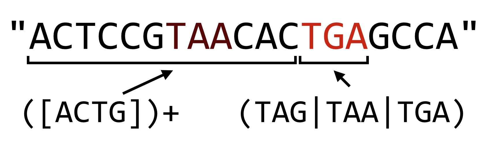
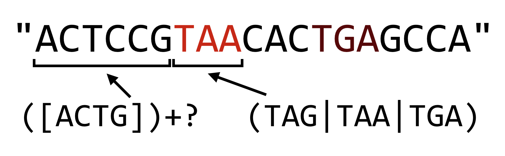
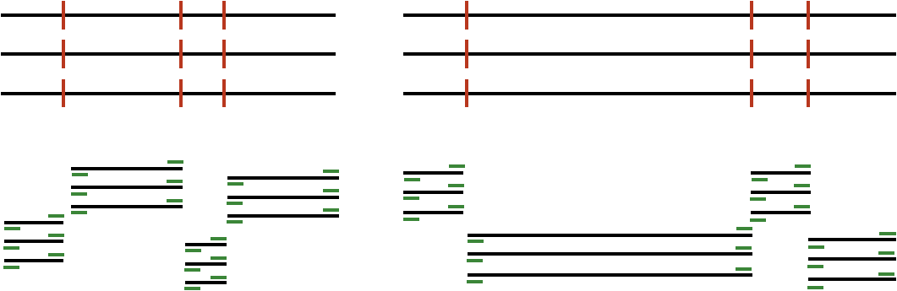

# String Tips and Regular Expressions

Chapter 16, “[Elementary Data Types](#elementary-data-types)”, mentioned that strings in Python are immutable, meaning they can’t be modified after they have been created. For computational biology, this characteristic can be a hindrance. One way to get around this limitation is to convert strings into lists of single-character strings, modify the lists as necessary, and convert the lists of characters back to strings when needed. Python comes with a number of built-in functions that operate on lists and strings which are useful for computational biology.

### Converting a String into a List of Single-Character Strings {-}

Remember that because Python strings are immutable, we **can’t** run something like

<pre id=part2-09-error
     class="language-python 
            line-numbers 
            linkable-line-numbers">
<code>
seq = "ACTAG"
seq[2] = "U"            # Error!
</code></pre>

To convert a string into a list of single-character strings, we can pass the string as a parameter to the `list()` function (when called with no parameters, this function creates an empty list):

<pre id=part2-09-list-of-char
     class="language-python 
            line-numbers 
            linkable-line-numbers">
<code>
seq = "ACTAG"
base_list = list(seq)
base_list[2] = "U"
print(base_list)        # prints ['A', 'C', 'U', 'A', 'G']
</code></pre>

### Converting a List of Strings into a String {-}

If we happen to have a list of strings (such as the list of single-character strings above), we can join them into a single string using the `.join()` method of whatever string we wish to use as a separator for the output string.

<pre id=part2-09-join
     class="language-python 
            line-numbers 
            linkable-line-numbers">
<code>
rejoined = ":".join(base_list)      # 'A:C:U:A:G'
rejoined2 = "".join(base_list)      # 'ACUAG'
</code></pre>

The syntax may seem a bit backward, `"separator".join(list_variable)`, but it makes sense when considering what the method `.`-syntax says: it asks the string `“separator"` to produce a string given the input list `list_variable`. Because the output is of type string, it makes sense that we should ask a string to do this production.

### Reverse a List {-}

Sometimes we may want to reverse the order of a list. We can do this with the list method `.reverse()`, reverses the list in place (and returns `None`).

<pre id=part2-09-reverse
     class="language-python 
            line-numbers 
            linkable-line-numbers">
<code>
base_list.reverse()          # base_list now: ['G', 'A', 'U', 'C', 'C']
</code></pre>

As with the `.sort()` and `.append()` methods from chapter 17, “[Collections and Looping: Lists and for](#collections-and-looping-lists-and-for)”, `.reverse()` returns `None`, so a line like `base_list = base_list.reverse()` would almost surely be a bug.

### Reverse a String {-}

There are two ways to reverse a string in Python: (1) convert it into a list of single-character strings, reverse the list, then join it back into a string, or (2) use “extended slice syntax.” The former solution uses the methods described above, whereas the second method extends the `[]` slice syntax so that the brackets can contain values for `[start:end:step]`, where `start` and `end` can be empty (to indicate the first and last indices of the string), and step can be `-1` (to indicate stepping backward in the string).

<pre id=part2-09-reverse-str
     class="language-python 
            line-numbers 
            linkable-line-numbers">
<code>
seq = "ACTAG"
seq_list = list(seq)
seq_list.reverse()
seq_rev = "".join(seq_list)  # seq_rev: "GATCA"
# OR
seq_rev = seq[::-1]              # seq_rev: "GATCA"
</code></pre>

The extended slice syntax is quite a bit faster and requires less typing, but it **is** a bit more difficult to read. A search online for “python string reverse” will almost certainly reveal this solution first.

### Simple Find and Replace in a String {-}

We’ve already seen how to split a string into a list of strings with the `.split()` method. A similar method, `.replace()`, allows us to replace all matching substrings of a string with another string. Because strings are immutable, this method returns a modified copy of the original string.

<pre id=part2-09-replace
     class="language-python 
            line-numbers 
            linkable-line-numbers">
<code>
seq = "ACGTATATATGG"
replaced = seq.replace("TAT", "X")  # replaced: "ACGXAXGG"
rna = seq.replace("U", "T")         # rna: "ACGUAUAUAUGG"
                                    # seq is still: "ACGTATATATATGG"
</code></pre>

Also because strings are immutable, the original data are left unchanged. However, because a variable is simply a name we use to refer to some data, we can make it *look* like we’ve modified the original string by reassigning the `seq` variable to whatever is returned by the method.

<pre id=part2-09-overwrite
     class="language-python 
            line-numbers 
            linkable-line-numbers">
<code>
seq = seq.replace("U", "T")         # seq now: "ACGUAUAUAUGG"
</code></pre>

### Commands versus Queries {-}

Why do some operations (like the list method `.sort()`) change the data in place and return `None`, while others (like the string method `.split()` or the function `len()`) return something and leave the original data alone? Why is it so rare to see operations that do both? The reason is that the designers of Python (usually) try to follow what is known as the *principle of command-query separation*, a philosophical principle in the design of programming languages that states that single operations should either modify data or return answers to queries, but not both.

The idea behind this principle is that upon reading code, it should be immediately obvious what it does, a feature that is easily achieved if each operation only has one thing it can do. When operations both change data and return an answer, there is a temptation to “code by side effect”, that is, to make use of simultaneous effects to minimize typing at the cost of clarity. Compared to many other languages, Python makes a stronger attempt to follow this principle.

### Regular Expressions

Regular expressions, common to many programming languages and even command line tools like `sed`, are syntax for matching patterns in strings. The simplest patterns are just simple strings; for example, `"ATG"` is the pattern for a start codon. Because Python treats backslashes as special in strings (e.g., `"\t"` is not actually `"\"` followed by a `"t"`, but rather a tab character), patterns for regular expressions in Python are usually expressed as “raw strings”, indicated by prefixing them with an `r`. So, `r"ATG"` is also the pattern for a start codon, but `r"\t"` is the regular expression for `"\"` and `"t"` rather than the tab character.

<pre id=part2-09-tab
     class="language-python 
            line-numbers 
            linkable-line-numbers">
<code>
print(len("\t"))       # prints 1 (tab character)
print(len(r"\t"))      # prints 2 (\ character and t character)
</code></pre>

Python regular expression functionality is imported with the `re` module by using `import re` (remember to import a module before attempting to use it, so near the top of your script is a great place for all your import statements, one per line). There are many functions in the `re` module for working with strings and regular expression patterns, but we’ll cover just the three most important ones: (1) searching for a pattern in a string, (2) replacing a pattern in a string, and (3) splitting a string into a list of strings based on a pattern.

### Searching for a Pattern in a String {-}

Searching for a pattern is accomplished with the `re.search()` function. Most functions in the `re` module return a special `SRE_Match` data type, or a list of them (with their own set of methods), or `None` if no match was found. The `if` statement (and `while` loops) in Python treats `None` as false, so we can easily use `re.search()` in an `if` statement. The result of a successful match can tell us the location of the match in the query using the `.start()` method:

<pre id=part2-09-search
     class="language-python 
            line-numbers 
            linkable-line-numbers">
<code>
import re

seq = "CCGATGCATGCC"
if re.search(r"ATG", seq):
    print("seq has a start codon!")
    result = re.search(r"ATG", seq)
    print(f"the start codon is at position: {result.start()}")
</code></pre>

### Replace a Pattern in a String {-}

The `re.subn()` function can be used to search and replace a pattern within a string. It takes at least four important arguments (and some optional ones we won’t discuss here): (1) the pattern to search for, (2) the replacement string to replace matches with, (3) the string to look in, and (4) the maximum number of replacements to make (`0` to replace all matches). This function returns a tuple^[Tuples are similar to lists, but [immutable](#immutable), see [Tuples](#tuples-immutable-lists)] containing two elements: at index `0`, the modified copy of the string, and at index `1`, the number of replacements made.

<pre id=part2-09-subn
     class="language-python 
            line-numbers 
            linkable-line-numbers">
<code>
seq = "CCGATGCATGCC"
pattern = r"ATG"
replacement = "*"
result = re.subn(pattern, replacement, seq, 0)
print(result[0])                                # prints "CCG*C*CC"
print(result[1])                                # prints 2
</code></pre>

### Split a String into a List of Strings Based on a Pattern {-}

We’ve already seen that we can split a string based on simple strings with `.split()`. Being able to split on complex regular expressions is often useful as well, and the `re.split()` function provides this functionality.

<pre id=part2-09-split
     class="language-python 
            line-numbers 
            linkable-line-numbers">
<code>
seq = "CCGATGCATGCC"
between_starts = re.split(r"ATG", seq)
print(between_starts)                      # prints ['CCG', 'C', 'CC']
</code></pre>

We’ll leave it as an exercise for the reader to determine what would be output for a sequence where the matches are back to back, or where the matches overlap, as in `re.split(r"ATA", "GCATATAGG")`.

### The Language of Regular Expressions, in Python {-}

In chapter 12, “[Patterns (Regular Expressions)](#patterns-regular-expressions)”, we covered regular expressions in some detail when discussing `sed`. Regular expressions in Python work similarly: 

+----------+--------------------+-----------------------------+-------------------------------------------+
| Encoding | Pattern matches    | Example Regex               | Example Match                             |
+:========:+====================+:===========================:+===========================================+
| `.`      | Any character      | `r"CC."`                    | `CCA` - *Any Proline codon*               |
+----------+--------------------+-----------------------------+-------------------------------------------+
| `[set]`  | Set of characters  | `r"[ATGC]"`                 | `T` - *A single DNA nucleotide*           |
|          |                    +-----------------------------+-------------------------------------------+
|          |                    | `r"[a-zA-Z]"`               | `q` - *Any letter*                        |
+----------+--------------------+-----------------------------+-------------------------------------------+
| `[^set]` | Not in set         | `r"[^a-zA-Z]"`              | `305.7` - *No letters*                    |
+----------+--------------------+-----------------------------+-------------------------------------------+
| `+`      | 1 or more times    | `r"[ATGC]+"`                | `TGCCGTA` - *DNA sequence*                |
+----------+--------------------+-----------------------------+-------------------------------------------+
| `*`      | 0 or more times    | `r"[0-9]*"`                 | `42` - *0 or more numbers*                |
|          |                    +-----------------------------+-------------------------------------------+
|          |                    | `r"GC*G"`                   | `GG` - *2 Gs with 0 or more Cs inbetween* |
+----------+--------------------+-----------------------------+-------------------------------------------+
| `(.)`    | Group a pattern    | `r"(ATG)+"`                 | `ATGATG` - *1 or more ATG codons*         |
+----------+--------------------+-----------------------------+-------------------------------------------+
| `|`      | "or"               | `r"[ACTG]+(TAG|TAA|TGA)"`   | `AAATAA` - *DNA seq and a stop codon*     |
+----------+--------------------+-----------------------------+-------------------------------------------+
| `{n}`    | *n* times          | `r"(AT){3}"`                | `ATATAT` - *exactly 3 ATs*                |
+----------+--------------------+-----------------------------+-------------------------------------------+
| `{n,m}`  | *n*-*m* times      | `r"(AT){1,3}"`              | `ATAT` - *AT repeated 1, 2 or 3 times*    |
+----------+--------------------+-----------------------------+-------------------------------------------+
| `^`      | At the start       |                             |                                           |
+----------+--------------------+ `r"^([ACTG])+$"`            + *A string of DNA and only DNA*            +
| `$`      | At the end         |                             |                                           |
+----------+--------------------+-----------------------------+-------------------------------------------+

For more detailed examples of these regular expression constructs, refer to [chapter 12](#patterns-regular-expressions).

The regular expression syntax of Python provides extended regular expression syntax which supports a number of sophisticated features, two of which are detailed here.

First, operators that specify that a match should be repeated (such as plus signs, curly brackets, and asterisks) are by default “greedy”. The same is true in the POSIX-extended syntax used by `sed`. In Python, however, we have the option of making the operator non-greedy, or more accurately, reluctant. Consider the pattern `r"([ACTG])+(TAG|TAA|TGA)"`, which matches a DNA sequence terminated by a stop codon. The greedy part, `([ACTG])+`, will consume all but the last stop codon, leaving as little of the remaining string as possible to make the rest of the pattern match.

  

In Python, if we want to make the plus sign reluctant, we can follow it with a question mark, which causes the match to leave as much as possible for later parts of the pattern.

  

The reluctance operator can also follow the asterisk and curly brackets, but beware: when used without following one of these three repetition operators, the question mark operator works as an “optional” operator (e.g., `r"C(ATG)?C"` matches `"CC"` and `"CATGC"`).

The regular expression syntax used by Python introduced a number of shorthand codes for character classes. For example, `\w` is the shorthand for “any alphanumeric and the underscore”, so `r"\w+"` is the pattern for a series of these and is equivalent to `r"[A-Za-z0-9_]+"`. The pattern `\W` matches any character that is not alphanumeric or the underscore, so `r"\W+"` matches a series of these (equivalent to `r"[^A-Za-z0-9_]+"`). Perhaps the most important shorthand class is `\s`, which matches a single whitespace character: a tab, space, or newline character (`\S` matches any non-whitespace character). This is most useful when parsing input, where it cannot be guaranteed that words are separated by tabs, spaces, or some combination thereof.

<pre id=part2-09-white-space
     class="language-python 
            line-numbers 
            linkable-line-numbers">
<code>
#!/usr/bin/env python
import re
import sys

## Parse input in two columns
for line in sys.stdin:
    line_stripped = line.strip()
    #line_list = line.split("\t") 
    line_list = re.split(r"\s+", line_stripped) 

    # ...
</code></pre>

In the code above, we’ve replaced the split on `"\t"` that we’re used to with a `re.split()` on `r"\s+"`, which will ensure that we correctly parse the pieces of the line even if they are separated with multiple tabs, spaces, or some combination thereof.

### Counting Promoter Elements {-}

Consider the file [grape_promoters.txt](data/grape_promoters.txt), which contains on each line 1000bp upstream of gene regions in the *Vitis vinifera* genome:

<pre id=part2-09-grape
     class="language-txt 
            line-numbers 
            linkable-line-numbers">
<code>
GSVIVT01034325001_1      GATTTCAAAAGCATTCTGTTGTTCTTTGAGGTCAGCAACCTGACCAATAAAAACT
GSVIVT01034326001_2      TACGCTTGACAAGACGTCTCCATGTCCTTTCAAGCGACTTGCTACGCTATGCACC
GSVIVT01034329001_3      AAAATTGGATGCATAAAACAAAATAAATGTAAATACTAAAATAATGATCATATTC
GSVIVT01034331001_4      AAAAAATAAAGTGTTTTAAAATAAAATCATTTAATTATTTTCACCTATTTTTTAA
GSVIVT01034332001_5      CAAAGCCATAGCAAAAATTGCATTCTCGAACAACCAAATAAAATCGAAACTTGTA
GSVIVT01034334001_6      GATGTTAGGAATAGTGGTTAATGGTTGTTGTCCACGTGTATAGCTTTGTTAGAAT
GSVIVT01034337001_7      AAGATATTATAATTAAAAAATATTTAATATAATTTTTTTAAAATATTGCATTTTG
GSVIVT01034340001_8      AAATTTTGGAAACTTATTAATAAAGGAATGACTCACATATTGTTCTTATTCAAAA
GSVIVT01034341001_9      GTAGTGGTAAACCGTTGAGGTGGATGTCATGCTGTTGTCGACGGCGATTGGTGGT
GSVIVT01034344001_10     TTGTATCGCATATTCAACCAAATATAAGATATGATAAGTGATGATATATATTATT
GSVIVT01034346001_11     AACCCATTTCTTATCTCTTTCTTTCTTTCTTTCTTTCTTTCTTCTTCTTCTTCTT
...
</code></pre>

These columns are not separated by a tab character, but rather by a variable number of spaces.

Promoter motifs are small DNA patterns nearby gene sequences to which the cellular machinery binds in order to help initiate the gene-transcription process. For example, the ABF protein binds to the DNA pattern `"CACGTGGC"` if it is near a gene in some plants. Some motifs are flexible and can be described by regular expressions; the GATA protein binds to any short DNA sequence matching the pattern `"[AT]GATA[GA]"`. We wish to analyze the *V. vinifera* upstream regions above, and count for each the number of occurrences of the GATA motif. Our output should look like so:

<pre id=part2-09-grape-count
     class="language-txt 
            line-numbers 
            linkable-line-numbers">
<code>
GSVIVT01034325001_1     3
GSVIVT01034326001_2     2
GSVIVT01034329001_3     2
GSVIVT01034331001_4     2
GSVIVT01034332001_5     1
GSVIVT01034334001_6     2
...
</code></pre>

After importing the `re` module, we’ll first write a `function count_motifs()` that takes two parameters: first a sequence in which to count motif matches, and second a motif for which to search. There are a variety of ways we could code this function, but a simple solution will be to use `re.split()` to split the sequence on the motif regular expression — the number of motifs will then be the length of the result minus one (because if no motifs are found, no split will be done; if one is found, one split will be done, and so on).

With this function written and tested, we can open the file using `open()` and loop over each line, calling the `count_motifs()` function on each sequence with the motif `r"[AT]GATA[GA]"`. Because the columns are separated with a variable number of spaces instead of single tab or space characters, we’ll use `re.split()` to split each line into pieces.

First, we’ll write and test the function that counts motifs and offers an example usage, where the number of matches should be two.

<pre id=part2-09-count_test
     class="language-python 
            line-numbers 
            linkable-line-numbers">
<code>
#!/usr/bin/env python
import re

def count_motifs(seq, motif):
    pieces = re.split(motif, seq)
    return len(pieces) - 1

seq = "AAAAAAATGATAGAAAAAGATAAAAAA"
print(count_motifs(seq, r"[AT]GATA[GA]"))   # prints 2
</code></pre>

Next we can finish the program, using `re.split()` to process each line.

<pre id=part2-09-count_motifs
     class="language-python 
            line-numbers 
            linkable-line-numbers">
<code>
#!/usr/bin/env python
import re

def count_motifs(seq, motif):
    pieces = re.split(motif, seq)
    return len(pieces) - 1

with open("grape_promoters.txt", "r") as fhandle:
    for line in fhandle:
        linestripped = line.strip()
        line_list = re.split(r"\s+", linestripped)
        gid = line_list[0]
        seq = line_list[1]

        num_motifs = count_motifs(seq, r"[AT]GATA[GA]")
        print(f"{gid}\t{num_motifs}")
</code></pre>

When run, this simple program ([`grape_count_gata.py`](data/grape_count_gata.py)) produces the output desired above. Because the output is sent to standard output, we can further filter the results through the `sort` and `head` command line utilities to identify which promoters are most likely to be found by GATA: `./grape_count_gata.py | sort -k2,2nr | head -n 10`.

#### Exercises {-}

1. Write a function called `reverse_complement()` that takes a DNA sequence parameter and returns its reverse complement (i.e., reverses the string, switches A’s and T’s, and switches G’s and C’s, so the reverse complement of `AAAGC` would be `GCTTT`).

2.  DNA sequences that are destined to be turned into proteins are “read” by the cellular machinery in one of six “reading frames” with lengths that are multiples of three. The first three are derived from the sequence itself, starting at index 0, index 1, and index 2; to derive reading frames three, four, and five, we first reverse-complement the sequence and then produce frames from indices 0, 1, and 2:

     <pre id=part2-09-frames
          class="language-txt 
               line-numbers 
               linkable-line-numbers">
     <code>
     ACTAGACG            #sequence
    ACTAGA                #reading frame 1 (index 0)
     CTAGAC               #reading frame 2 (index 1)
      TAGACG              #reading frame 3 (index 2)
    CGTCTAGT            #reverse complement of sequence
    CGTCTA                #reading frame 4 (index 0 of rev comp)
     GTCTAG               #reading frame 5 (index 1 of rev comp)
      TCTAGT              #reading frame 6 (index 2 of rev comp)
     </code></pre>

     Using the `reverse_complement()` function from above (and potentially the `get_windows()` function from chapter 20, “[Python Functions](#python-functions)”), write a `seq_to_six_frames()` function that takes a DNA sequence as a parameter and returns a list of the six reading frames (as strings).

3. Write a function called `longest_non_stop()` that takes a DNA sequence as a parameter and returns the longest amino acid sequence that can be produced from it. This is done by generating the six reading frames from the sequence, converting each to an amino acid sequence (probably using the `dna_to_aa()` function from chapter 22, [“Dictionaries”](#dictionaries)), and then trimming the resulting sequences down to the first “stop” codon (`"*"`) if there are any.

     In the DNA sequence `seq = "AGCTACTAGGAAGATAGACGATTAGAC"`, for example, the six translations are `SY*EDRRLD` (Frame 1), `ATRKIDD*` (Frame 2), `LLGR*TIR` (Frame 3), `V*SSIFLVA` (Frame 4), `SNRLSS**` (Frame 5), and `LIVYLPSS` (Frame 6). In order of lengths, the possibilities are thus `"V"`, `"SY"`, `"LLGR"`, `"SNRLSS"`, `"ATRKIDD"`, and `"LIVYLPSS"`. As a result, `longest_non_stop(seq)` should return `"LIVYLPSS"`.

4. Modify the `grape_count_gata.py` program, calling it `motifs_count.py` so that it can read the file name and motifs to process (the latter as a comma-separated list) from `sys.argv`. When run as `./motifs_count.py grape_promoters.txt [AT]GATA[GA],[CGT]ACGTG[GT][AC],TTGAC`, the output should look like:

     <pre id=part2-09-new_output
          class="language-txt 
               line-numbers 
               linkable-line-numbers">
     <code>
     GSVIVT01034325001_1     3       [AT]GATA[GA]
GSVIVT01034325001_1     0       [CGT]ACGTG[GT][AC]
GSVIVT01034325001_1     2       TTGAC
GSVIVT01034326001_2     2       [AT]GATA[GA]
GSVIVT01034326001_2     0       [CGT]ACGTG[GT][AC]
GSVIVT01034326001_2     4       TTGAC
GSVIVT01034329001_3     2       [AT]GATA[GA]
GSVIVT01034329001_3     0       [CGT]ACGTG[GT][AC]
     </code></pre>

5. Genotyping by sequencing (GBS) is a method for identifying genetic variants in a DNA sample by first splitting chromosomes in pseudorandom locations through the application of restriction enzymes and then sequencing short reads from the ends of the resulting fragments: 

     

     
     

     In the above, black lines represent input DNA sequence, red lines are cut sites, and green lines represent output from the sequencing machine. (Some simplifications have been made to the figure above for the sake of clarity.) The result is much higher depth of sequencing at fewer locations, which can be useful in a variety of contexts, including looking for genetic variants between different versions of the same chromosome (which requires many reads from the same location to statistically confirm those variants).

     The restriction enzymes cut on the basis of patterns; for example, the ApeK1 enzyme cuts DNA molecules at the pattern `"GC[AT]GC"`. Based on the recognized patterns, some enzymes are “frequent cutters” and some are not; more frequent cutters sample more locations in a genome but sacrifice depth of sequencing. For this reason, researchers often want to know, given an enzyme pattern and genome sequence, the distribution of fragment lengths that will result.

     Write a function `gbs_cut()` that takes a DNA sequence, a regular expression pattern, and a “bin size.” It should return a dictionary mapping sequence lengths, rounded down to the nearest bin size, to the number of fragments produced by the cutter in that bin. As an example, `"AAAAGCAGCAAAAAAGCTGCAAGCAGCAAAAA"` when processed with `"GC[AT]GC"` produces fragment sizes of 4, 6, 2, and 5. If grouped in a bin size of 3, the dictionary would have keys `0`, `3`, and `6`, and values `1`, `1`, and `2`.

