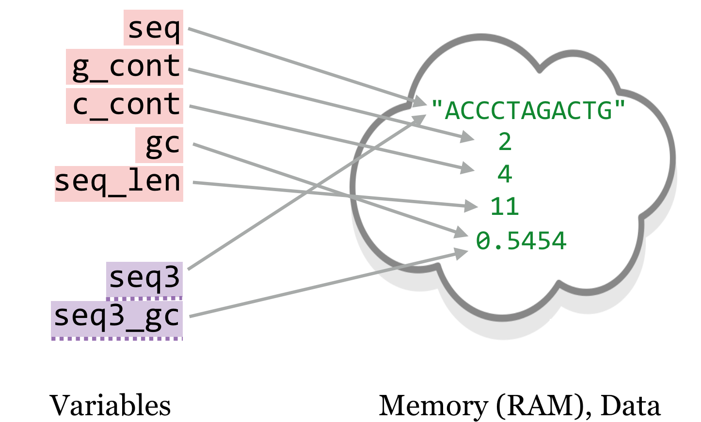
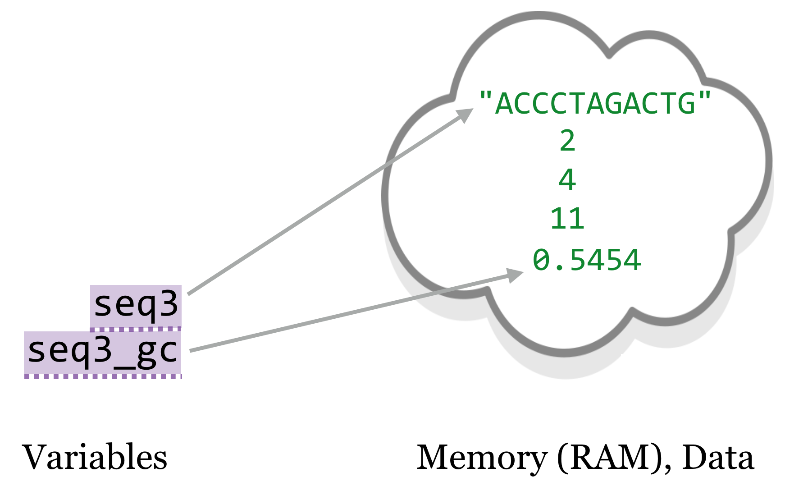
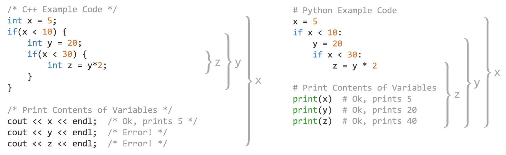
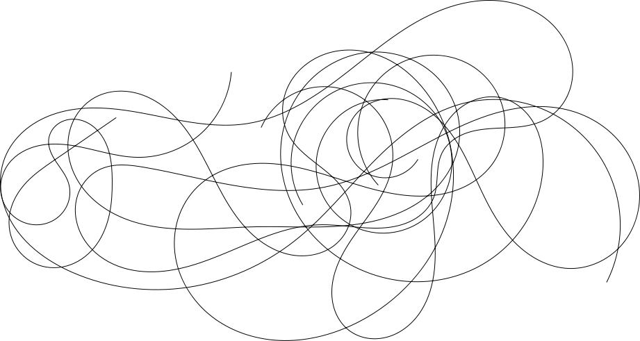

# Variables and second_sample

In chapter 20, “[Python Functions](#python-functions)”, we learned that a function should use only variables that have either been defined within the block of the function, or passed in explicitly as parameters (Rule 1). This rule works closely with our definition of a [variable](#variables) in Python, as a name that refers to some data.

This is a powerful concept, allowing us to pass parameters to functions and get returned values. In Python, *a single piece of data may be referenced by multiple variables*. Parameter variables are new names for the same data. We can explore this concept with a simple example.

<pre id=part2-10-ref
     class="language-python 
            line-numbers 
            linkable-line-numbers">
<code>
nums = [1, 2, 3, 4, 5]
numsb = nums
numsb[0] = 1000
print(nums)          # prints [1000, 2, 3, 4, 5]
print(numsb)         # prints [1000, 2, 3, 4, 5]
</code></pre>

In this code sample, we have created a single list, but we are associating two variable names with it, `nums` and `numsb`. When we modify the list through one name, the change is reflected through the other (we can only change the data because lists are [mutable](#mutable), but even immutable data may be referred to by multiple names).

The same thing happens when we use a parameter in a function. Let’s revisit the `gc_content()` function, which makes use of a `base_composition()` function that we wrote (but leave out here for clarity). In this listing, all of the variable names belonging to the function are highlighted in red, whereas other “global” variable names are highlighted in purple and underlined with a dashed line. According to Rule 1, we shouldn’t see any purple/underlined variables in the function definition.

<pre id=part2-10-gc_content
     class="language-python 
            line-numbers 
            linkable-line-numbers">
<code>
def gc_content(seq: str) -> float:
    '''Given a DNA (A,C,T,G) sequence string, returns the GC-content as float'''
    g_cont = base_composition(seq, "G")
    c_cont = base_composition(seq, "C")
    gc = (g_cont + c_cont)/len(seq)
    return gc

seq3 = "ACCCTAGACTG"
seq3_gc = gc_content(seq3)                   # 0.5454
</code></pre>

  

Outside of the function, the string data `"ACCCTAGACTG"` was assigned to the variable `seq3`, but inside the function, it was assigned to the variable `seq`. Inside the function, the data value `0.54` was referenced by the variable `gc`, and outside it was referenced by `seq3_gc`.^[Many languages work like Python and allow different variables to refer to the same data, but in some languages this is impossible or less common. In some languages, all data are immutable, making the point moot. R is an example where most variables end up referring to unique data; see the box in chapter 31, “[R Functions](#r-functions)”, for a more detailed comparison.]

We know that we *could* access the variable `seq3` from inside the function, even if we shouldn’t. But what about the other way around? Could we access the `gc` variable, which was defined within the function, outside the function?

<pre id=part2-10-gc_content-error
     class="language-python 
            line-numbers 
            linkable-line-numbers">
<code>
def gc_content(seq: str) -> float:
    '''Given a DNA (A,C,T,G) sequence string, returns the GC-content as float'''
    g_cont = base_composition(seq, "G")
    c_cont = base_composition(seq, "C")
    gc = (g_cont + c_cont)/len(seq)
    return gc

seq3 = "ACCCTAGACTG"
seq3_gc = gc_content(seq3)                   # 0.5454
print(gc)               #Error!
</code></pre>

###### {- #scope}
###### {- #local_variable}

In fact, we cannot. The above `print(gc)` line, even after the computation of `seq3_gc`, would produce a `NameError: name 'gc' is not defined`. This error occurs because variables have scope, and the `gc` variable’s scope is limited, from the time it is defined to the end of the function block in which it is defined (all of the red-highlighted variables share this feature). A variable’s *scope* is the context in which can be used. It defines “how long the variable lives”, or “where the variable exists”. A variable with limited scope, as in the execution of a function, is called a *local variable*.

After the function call ends, the picture would look more like so:

  

Eventually, the [garbage collector](#garbage_collector) will notice that no variables refer to the data `2`, `4`, and `11`, and it will clear those out of RAM to make room for new data.

Because scope talks about variables, it has little to do with the data to which a variable refers — except to say that data are garbage collected when there are no variables referring to that data in any current scope. Nevertheless, because the `gc` variable is not in scope after the function ends, we can’t use it outside of the function block.

One of the particularly interesting and powerful features of local variables is that they exist independently of any other variables that might happen to exist at the time with the same name (sometimes they are said to “shadow” other variables with the same name). Consider the following code:

<pre id=part2-10-gc_no-error
     class="language-python 
            line-numbers 
            linkable-line-numbers">
<code>
def gc_content(seq: str) -> float:
    '''Given a DNA (A,C,T,G) sequence string, returns the GC-content as float'''
    g_cont = base_composition(seq, "G")
    c_cont = base_composition(seq, "C")
    gc = (g_cont + c_cont)/len(seq)
    return gc

gc = "Measure of G and C bases in a sequence"
seq3 = "ACCCTAGACTG"
seq3_gc = gc_content(seq3)                   # 0.5454
print(gc)
</code></pre>

What do you think the last line, `print(gc)`, will print? If you guessed `"Measure of G and C bases in a sequence"`, you are right! Even though the `gc_content()` function defines its own `gc` variable, because this variable is local, it does not “step on” the outside `gc` variable.^[Even though the Python interpreter has no trouble handling variables with the same name in different scopes, many humans do struggle with this, so we recommend against it as a general rule.] In summary:

- Variables defined within a function (and parameters to a function) are local to the function call.
- These local variables “shadow” any other variables that might exist during the execution of the function.
- When the function call ends, the local variables are forgotten.

One of the important lessons of scope is knowing when it might lead to trouble. This is easiest to see if we were to compare how scoping works with another language, C++ in this case. In C++, variables are declared with their types, and variables declared within an if statement block (or any other block) are also local to that block. This means that they *go out of scope* when the block ends. If we were to try and use them outside of the block in which they were declared, an error would occur.

In Python, on the other hand, variables declared in if statements, for loop blocks, and while loop blocks are not local variables, and stay in scope outside of the block. Thus we say that C++ has “block-level” scoping, while Python uses only “function-level” scoping. The brackets in the figure below illustrate the scope for some variables in equivalent C++ and Python code. Because C++ uses block-level scoping, and `x` and `y` are declared inside of blocks, we cannot access their contents outside of those blocks.

  

This might seem like an advantage for Python, but in this case we think that that C++ may have it right. After all, if we *needed* for the `y` and `z` variables to be accessible after the if blocks in the C++ example, we could have declared them along with `x`. We might even have given them a default value to hold using declarations like `int y = -1` and `int z = -1`; if these variables still hold -1 after the if-blocks are run, then we know that those internal lines didn’t execute. This would be especially helpful if the value of `x` wasn’t set to five as it is here, but rather is dependent on the input data.

In Python, on the other hand, code like this might cause a problem. If the `x` variable is dependent on the input data, then the `y` and `z` variables might never be set at all, leading to an eventual `NameError` when they are later accessed. We certainly shouldn’t consider any program that sometimes produces an error, depending on the input data, to be very good!

Probably the best way around this sort of problem is to pretend that Python uses block-level scoping, declaring variables in the widest block/level in which they will be used. `None` is a good default value that we can later check for if we want to conditionally execute later code on the basis of whether variables were actually set to something useful:

<pre id=part2-10-init
     class="language-python 
            line-numbers 
            linkable-line-numbers">
<code>
# Python example code
x = 5
y = None
z = None
if x < 10:
    y = 20
    if x < 30:
     z = y*2

# print contents of variables
print(x)
if x != None:
    print(y)
if z != None:
    print(z)
</code></pre>

This code will not crash, no matter the value of `x`. Setting initial values for these variables to `None` before the if blocks also provides a reminder and visual clue that these variables are intended to be used outside of the nested if blocks, and that we should check their contents before using them later.

C++ and other block-level-scoped languages thus encourage “short-lived” variables, which is a good programming mantra. Defining variables only when needed and using them for as short a time as possible helps to produce clearer, more modular, and even more efficient code (because short-lived variables allow the garbage collector to clean out more data). In a way, breaking Rule 1 of functions is a similar type of abuse of variable scope.

Beginning programmers often find it easier to avoid these conventions by setting a large number of variables near the beginning of a program and then accessing and setting them at various points throughout the program. This is sometimes colloquially called “spaghetti code,” because the long-distance connections created between the different areas of code resemble spaghetti. Rarely does this strategy pay off, however.

  

As discussed in chapter 27, “[Algorithms and Data Structures](#algorithms-and-data-structures)”, local variables and similar concepts allow us to solve complex problems in fascinating and elegant ways.

#### Exercises {-}

1. Create a RAM/variable diagram that illustrates the following segment of code, and use it to explain the printed output.

    <pre id=part2-10-ex-1
     class="language-python 
            line-numbers 
            linkable-line-numbers">
    <code>
    def append_min(input_list):
       smallest = min(input_list)
       input_list.append(smallest)
       return input_list

   nums = [4, 1, 5, 6, 7]
   numsb = append_min(nums)
   print(nums)
   print(numsb)
    </code></pre>

2. Create a RAM/variable diagram that illustrates the following segment of code, and use it to explain the printed output.

    <pre id=part2-10-ex-2
     class="language-python 
            line-numbers 
            linkable-line-numbers">
    <code>
    def append_min(input_list):
       smallest = min(input_list)
       new_list = list()
       for el in input_list:
           new_list.append(el)

       new_list.append(smallest)

       return new_list

   nums = [4, 1, 5, 6, 7]
   numsb = append_min(nums)
   print(nums)
   print(numsb)
    </code></pre>

3. Step through the following code, and create a RAM/variable diagram for each time a `#point` is reached. (Because `#point 1` is reached twice, that will mean four diagrams.) You can assume that data are never garbage collected, but that local variables do disappear.

    <pre id=part2-10-ex-3
     class="language-python 
            line-numbers 
            linkable-line-numbers">
    <code>
    def base_composition(seq, query_base):
       answer = 0
       seq_len = len(seq)

       for index in range(0, seq_len):
           seq_base = seq[index]
           if seq_base == query_base:
               answer = answer + 1
       # point 1
       return answer

   def gc_content(seq):
       g_cont = base_composition(seq, "G")
       c_cont = base_composition(seq, "C")
       seq_len = len(seq)
       # point 2
       answer = (g_cont + c_cont)/float(seq_len)
       return answer

   answer = "Computing answer..."
   seq = "ACCCTAGACTG"
   seq_gc = gc_content(seq)
   # point 3
   print(answer)
    </code></pre>

4. What is returned by a function in Python if no `return` statement is specified?

