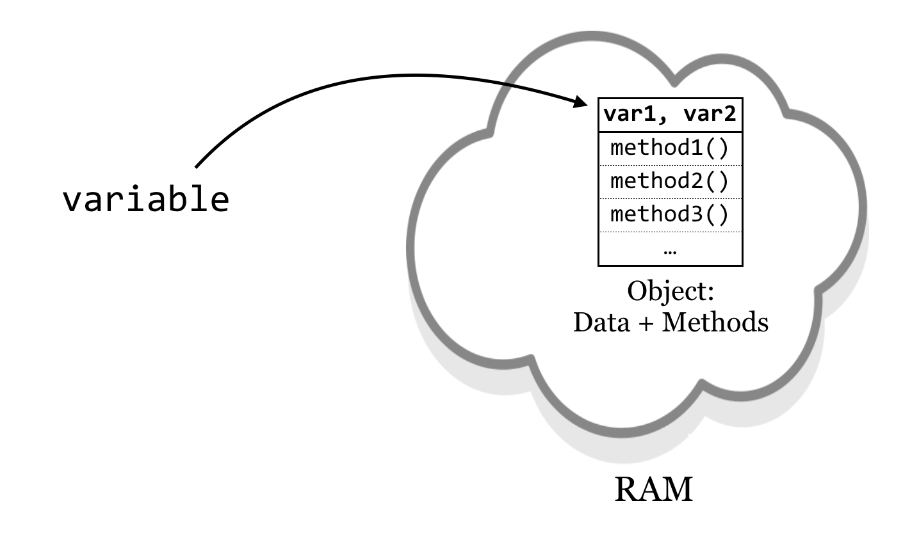
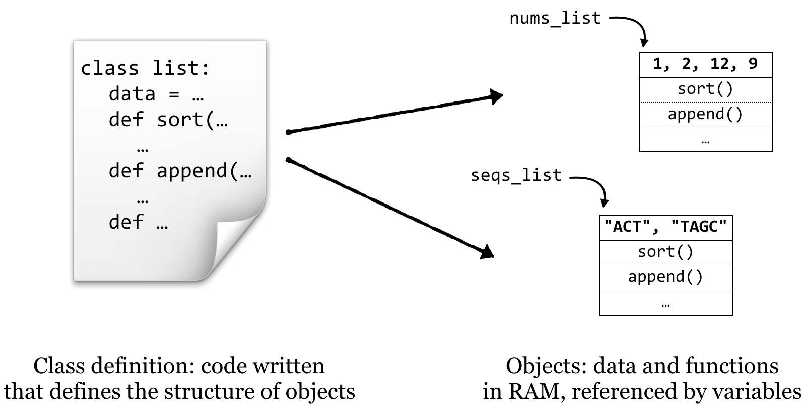

# Variables and Classes

This book, when initially introducing Python, mentioned some of the features of the language, such as its emphasis on “one best way” and readable code. Python also provides quite a bit of built-in functionality through importable modules such as `sys`, `re`, and `subprocess`.

Python provides another advantage: it is naturally “object oriented”, even though we haven’t discussed this point yet. Although there are competing paradigms for the best way to architect programs, the object-oriented paradigm is commonly used for software engineering and large-project management.^[Another prominent methodology for programming is the “functional” paradigm, wherein functions are the main focus and data are usually immutable. While Python also supports functional programming, we won’t focus on this topic. On the other hand, the R programming language emphasizes functional programming, so we’ll explore this paradigm in more detail in later chapters.] Even for small programs, though, the basic concepts of object orientation can make the task of programming easier.

###### {- #object}
###### {- #method}
###### {- #instance-variable}

An *object*, practically speaking, is a segment of memory (RAM) that references both data (referred to by *instance variables*) of various types and associated functions that can operate on the data.^[This definition is not precise, and in fact intentionally misrepresents how objects are stored in RAM. (In reality, all objects of the same type share a single set of functions/methods.) But this definition will serve us well conceptually.] Functions belonging to objects are called methods. Said another way, a *method* is a function that is associated with an object, and an *instance variable* is a variable that belongs to an object.

###### {- #class}

In Python, objects are the data that we have been associating with variables. What the methods are, how they work, and what the data are (e.g., a list of numbers, dictionary of strings, etc.) are defined by a *class*: the collection of code that serves as the “blueprint” for objects of that type and how they work.

  

Thus the class (much like the blueprint for a house) defines the structure of objects, but each object’s instance variables may refer to different data elements so long as they conform to the defined structure (much like how different families may live in houses built from the same blueprint). In Python, each piece of data we routinely encounter constitutes an object. Each data type we’ve dealt with so far (lists, strings, dictionaries, and so on) has a class definition—a blueprint—that defines it. For example, lists have data (numbers, strings, or any other type) and methods such as `.sort()` and `.append()`.

  

In a sense, calling object methods makes a request of the object: `nums_list.sort()` might be interpreted as “object referred to by `nums_list`, please run your `sort()` method”. Upon receiving this message, the object will reorder its data.^[Although some have criticized the anthropomorphization of objects this way, it’s perfectly fine—so long as we always say “please!”]

### Creating New Classes {-}

Definitions for Python classes are just blocks of code, indicated by an additional level of indentation (like function blocks, if statement blocks, and loop blocks). Each class definition requires three things, two of which we are already familiar with:

###### {- #constructor}

1. Methods (functions) that belong to objects of the class.
2. [Instance variables](#instance-variable) referring to data.
3. A special method called a *constructor*. This method will be called automatically whenever a new object of the class is created, and must have the name `__init__`.

One peculiarity of Python is that each method of an object must take as its first argument a parameter called self,^[This first parameter doesn’t technically need to be named `self`, but it is a widely accepted standard.] which we use to access the instance variables. Let’s start by defining a class, `Gene` (class names traditionally begin with a capital letter): each `Gene` object will have (1) an `id` (string) and (2) a `sequence` (also a string). When creating a `Gene` object, we should define its `id` and `sequence` by passing them as parameters to the `__init__ `method.

Outside of the block defining the class, we can make use of it to create and interact with `Gene` objects.

<pre id=part2-11-class
     class="language-python 
            line-numbers 
            linkable-line-numbers">
<code>
#!/usr/bin/env python

class Gene:
    def __init__(self, creationid, creationseq):
        print("I'm a new Gene object!")
        print(f"My constructor got a param: {creationid}")
        print("Assigning that param to my id instance variable...")
        self.id = creationid
        print("Similarly, assigning to my sequence instance variable...")
        self.sequence = creationseq

    def print_id(self):
        print(f"My id is: {self.id}")

    def print_len(self):
        print(f"My sequence len is: {len(self.sequence)}")

print("\n***   Creating geneA:")
geneA = Gene("AY342", "CATTGAC")

print("\n***   Creating geneB:")
geneB = Gene("G54B", "TTACTAGA")

print("\n***   Asking geneA to print_id():")
geneA.print_id()

print("\n***   Asking geneB to print_id():")
geneB.print_id()

print("\n***   Asking geneA to print_len():")
geneA.print_len()
</code></pre>

(Normally we don’t include print() calls in the constructor; we’re doing so here just to clarify the object creation process.) Executing the above:

<pre id=part2-11-output
     class="language-txt 
            line-numbers 
            linkable-line-numbers">
<code>

***   Creating geneA:
I'm a new Gene object!
My constructor got a param: AY342
Assigning that param to my id instance variable...
Similarly, assigning to my sequence instance variable...

***   Creating geneB:
I'm a new Gene object!
My constructor got a param: G54B
Assigning that param to my id instance variable...
Similarly, assigning to my sequence instance variable...

***   Asking geneA to print_id():
My id is: AY342

***   Asking geneB to print_id():
My id is: G54B

***   Asking geneA to print_len():
My sequence len is: 7
</code></pre>

Note that even though each method (including the constructor) takes as its first parameter `self`, we don’t specify this parameter when calling methods for the objects. (For example, `.print_id()` takes a self parameter that we don’t specify when calling it.) It’s quite common to forget to include this “implicit” `self` parameter; if you do, you’ll get an error like `TypeError: print_id() takes no arguments (1 given)`, because the number of parameters taken by the method doesn’t match the number given when called. Also, any parameters sent to the creation function (`Gene("AY342", "CATTGAC")`) are passed on to the constructor (`__init__(self, creationid, creationseq)`).

What is `self`? The `self` parameter is a variable that is given to the method so that the object can refer to “itself”. Much like other people might refer to you by your name, you might refer to yourself as “self”, as in “self: remember to resubmit that manuscript tomorrow”.

Interestingly, in some sense, the methods defined for classes are breaking the first rule of functions: they are accessing variables that aren’t passed in as parameters! This is actually all right. The entire point of objects is that they hold functions *and* data that the functions can always be assumed to have direct access to.

Let’s continue our example by adding a method that computes the GC content of the `self.sequence` instance variable. This method needs to be included in the block defining the class; notice that a method belonging to an object can call another method belonging to itself, so we can compute GC content as a pair of methods, much like we did with simple functions:

<pre id=part2-11-gc
     class="language-python 
            line-numbers 
            linkable-line-numbers">
<code>
    # ... (inside class Gene:)

    def print_len(self):
        print(f"My sequence len is: {len(self.sequence)}")

    def base_composition(self, base): 
        base_count = 0 
        for index in range(0, len(self.sequence)): 
            base_i = self.sequence[index] 
            if base_i == base: 
                base_count = base_count + 1 
        return base_count 

    def gc_content(self): 
        g_count = self.base_composition("G") 
        c_count = self.base_composition("C") 
        return (g_count + c_count)/len(self.sequence)

print("\n***   Creating geneA:")
geneA = Gene("AY342", "CATTGAC")

# ...

print("\n***   Asking geneA to return its T content:")
geneA_t = geneA.base_composition("T") 
print(geneA_t)

print("\n***   Asking geneA to return its GC content:")
geneA_gc = geneA.gc_content()
print(geneA_gc)
</code></pre>

Resulting in the output:

<pre id=part2-11-gc-output
     class="language-txt 
            line-numbers 
            linkable-line-numbers">
<code>
...
***   Asking geneA to return its T content:
2

***   Asking geneA to return its GC content:
0.42857142857142855
</code></pre>

It can also be useful to write methods that let us get and set the instance variables of an object. We might add to our class definition methods to get and set the sequence, for example, by having the methods refer to the `self.seq` instance variable.

<pre id=part2-11-seq
     class="language-python 
            line-numbers 
            linkable-line-numbers">
<code>
    # ... (inside class Gene:)

    def gc_content(self):
        g_count = self.base_composition("G")
        c_count = self.base_composition("C")
        return (g_count + c_count)/len(self.sequence)

    def get_seq(self): 
        return self.sequence 

    def set_seq(self, newseq): 
        self.sequence = newseq 

print("***   Creating geneA:")
geneA = Gene("AY342", "CATTGAC")

# ...
</code></pre>

We could make use of this added functionality later in our code with a line like `print(f"gene A's sequence is {geneA.get_seq()}")` or `geneA.set_seq("ACTAGGGG")`.

Although methods can return values (as with `.base_composition()` and `.gc_content()`) and perform some action that modifies the object (as with `.set_seq()`), the principle of [command-query separation](#commands-versus-queries) states that they shouldn’t do both unless it is absolutely necessary.

Is it possible for us to modify the instance variables of an object directly? It makes sense that we can; because the gene object’s name for itself is `self` and sets its sequence via `self.sequence`, we should be able to set the gene object’s sequence using our name for it, `geneA`. In fact, `geneA.sequence = "ACTAGGGG"` would have the same result as calling `geneA.set_seq("ACTAGGGG")`, as defined above.

So why might we want to use “getter” and “setter” methods as opposed to directly modifying or reading an object’s instance variables? The difference is related a bit to politeness—if not to the object itself, then to whomever wrote the code for the class. By using methods, we are *requesting* that the object change its sequence data, whereas directly setting instance variables just reaches in and changes it—which is a bit like performing open-heart surgery without the patient’s permission!

This is a subtle distinction, but it’s considered serious business to many programmers. To see why, suppose that there are many methods that won’t work at all on RNA sequences, so we must make sure that the `sequence` instance variable never has any `U` characters in it. In this case, we could have the `.set_seq()` method decide whether or not to accept the sequence:

<pre id=part2-11-prevent-u
     class="language-python 
            line-numbers 
            linkable-line-numbers">
<code>
    # ... (inside class Gene:)

    def set_seq(self, newseq):
        if newseq.base_composition("U") != 0:
            print("Sorry, no RNA allowed.")
        else:
            self.sequence = newseq 
</code></pre>

###### {- #assert}

Python has an `assert` statement for this sort of error checking. Like a function, it takes two parameters, but unlike a function, parentheses are not allowed.

<pre id=part2-11-assert
     class="language-python 
            line-numbers 
            linkable-line-numbers">
<code>
    # ... (inside class Gene:)

    def set_seq(self, newseq):
        assert newseq.base_composition("U") == 0, "Sorry, no RNA allowed."
        self.sequence = newseq 
</code></pre>

When using an `assert`, if the check doesn’t evaluate to `True`, then the program will stop and report the specified error. The complete code for this example can be found in the file [`gene_class.py`](data/gene_class.py).

Using methods when working with objects is about encapsulation and letting the objects do as much work as possible. That way, they can ensure correct results so that you (or whomever you are sharing code with, which might be “future you”) don’t have to. Objects can have any number of instance variables, and the methods may access and modify them, but it’s a good idea to ensure that all instance variables are left in a coherent state for a given object. For example, if a `Gene` object has an instance variable for the sequence, and another holding its GC content, then the GC content should be updated whenever the sequence is. Even better is to compute such quantities as needed, like we did above.^[One might ask whether a `Gene` object would ever need to allow its sequence to change at all. One possible reason would be if we were simulating mutations over time; a method like `.mutate(0.05)` might ask a gene to randomly change 5% of its bases.]

The steps for writing a class definition are as follows:

1. Decide what concept or entity the objects of that class will represent, as well as what data (instance variables) and methods (functions) they will have.
2. Create a constructor method and have it initialize all of the instance variables, either with parameters passed into the constructor, or as empty (e.g., something like `self.id = ""` or `self.go_terms = list()`). Although instance variables can be created by any method, having them all initialized in the constructor provides a quick visual reference to refer to when coding.
3. Write methods that set or get the instance variables, compute calculations, call other methods or functions, and so on. Don’t forget the `self` parameter!

#### Exercises {-}

1. Create a program `objects_test.py` that defines and uses a class. The class can be anything you want, but it should have at least two methods (other than the constructor) and at least two instance variables. One of the methods should be an “action” that you can ask an object of that class to perform, and the other should return an “answer”.

2. Once defined, classes (and objects of those types) can be used anywhere, including other class definitions. Write two class definitions, one of which contains multiple instances of the other. For example, instance variables in a `House` object could refer to several different `Room` objects. (For a more biologically inspired example, a `Gene` object could have a `self.exons` that contains a list of `Exon` objects.)

    The example below illustrates this more thoroughly, but having some practice first will be beneficial.

3. If classes implement some special methods, then we can compare objects of those types with `==`, `<`, and the other comparison operators.

    When comparing two `Gene` objects, for example, we might say that they are equal if their sequences are equal, and `geneA` is less than `geneB` if `geneA.seq` < `geneB.seq`. Thus we can add a special method `__eq__()`, which, given the usual `self` and a reference to another object of the same type called `other`, returns `True` if we’d consider the two equal and `False` otherwise:

    <pre id=part2-11-ex-equal
     class="language-python 
            line-numbers 
            linkable-line-numbers">
    <code>
        # ... (inside class Gene:)
        def __eq__(self, other):
        if self.seq == other.get_seq():
            return True
        return False
    </code></pre>

    We can also implement an `__lt__()` method for “less than”:

    <pre id=part2-11-ex-lt
     class="language-python 
            line-numbers 
            linkable-line-numbers">
    <code>
        # ... (inside class Gene:)
        def __lt__(self, other):
        if self.seq < other.get_seq():
            return True
        return False
    </code></pre>

    With these, Python can work out how to compare `Gene` objects with `<` and `==`. The other comparisons can be enabled by defining `__le__()` (for `<=`), `__gt__()` (for `>`),` __ge__()` (for `>=`) and `__ne__()` (for `!=`).

    <pre id=part2-11-ex-lt
     class="language-python 
            line-numbers 
            linkable-line-numbers">
    <code>
    geneA = Gene("XY6B", "CATGATA")
   geneB = Gene("LQQ5", "CATGATA")

   print(geneA.__lt__(geneB))  # False
   # same as:
   print(geneA < geneB)        # False

   print(geneA.__eq__(geneB))  # True
   # same as:
   print(geneA == geneB)       # True
    </code></pre>

    Finally, if we have a list of `Gene` objects `genes_list` which define these comparators, then Python can sort according to our comparison criteria with `genes_list.sort()` and `sorted(genes_list)`.

    Explore these concepts by defining your own ordered data type, implementing `__eq__()`, `__lt__()`, and the other comparison methods. Compare two objects of those types with the standard comparison operators, and sort a list of them. You might also try implementing a `__repr__()` method, which should return a string representing the object, enabling `print()` (as in `print(geneA)`).

