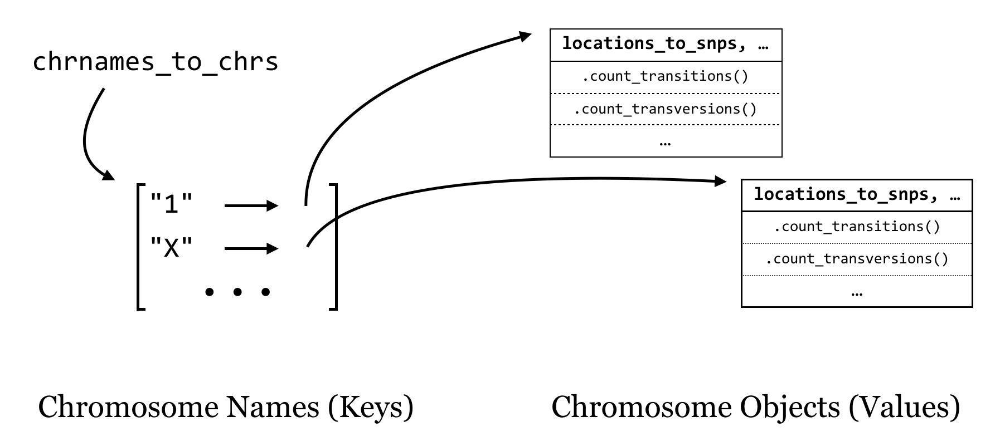

# Use Case: Counting SNPs

As it turns out, multiple classes can be defined that interact with each other: instance variables of a custom class may refer to custom object types. Consider the file [`trio.subset.vcf`](data/trio.sample.vcf), a VCF (variant call format) file for describing single-nucleotide polymorphisms (SNPs, pronounced “snips”) across individuals in a group or population. In this case, the file represents a random sampling of SNPs from three people—a mother, a father, and their daughter—compared to the reference human genome.^[This file was obtained from the 1000 Human Genomes Project at https://ftp.1000genomes.ebi.ac.uk/vol1/ftp/pilot_data/release/2010_07/trio/snps/, in the file `CEU.trio.2010_03.genotypes.vcf.gz`. After decompressing, we sampled 5% of the SNPs at random with `awk '{if($1 ~ "##" || rand() < 0.05) {print $0}}' CEU.trio.2010_03.genotypes.vcf > trio.sample.vcf`; see chapter 11, "[Rows and Columns](#rows-and-columns)" for details.]

<pre id=part2-12-vcf
     class="language-txt 
            line-numbers 
            linkable-line-numbers">
<code>
##fileformat=VCFv4.0
##INFO=<ID=AA,Number=1,Type=String,Description="Ancestral Allele, ftp://ftp.1000
##INFO=<ID=DP,Number=1,Type=Integer,Description="Total Depth">
##INFO=<ID=HM2,Number=0,Type=Flag,Description="HapMap2 membership">
##INFO=<ID=HM3,Number=0,Type=Flag,Description="HapMap3 membership">
##reference=human_b36_both.fasta
##FORMAT=<ID=GT,Number=1,Type=String,Description="Genotype">
##FORMAT=<ID=GQ,Number=1,Type=Integer,Description="Genotype Quality">
##FORMAT=<ID=DP,Number=1,Type=Integer,Description="Read Depth">
#CHROM  POS     ID      REF     ALT     QUAL    FILTER  INFO    FORMAT  NA12891 
1       799739  rs57181708      A       G       .       PASS    AA=-;DP=141     
1       805678  .       A       T       .       PASS    AA=a;DP=185     GT:GQ:DP
1       842827  rs4970461       T       G       .       PASS    AA=G;DP=114     
1       847591  rs6689107       T       G       .       PASS    AA=G;DP=99      
1       858267  rs13302914      C       T       .       PASS    AA=.;DP=84      
1       877161  .       C       T       .       PASS    AA=.;DP=89      GT:GQ:DP
1       892860  rs7524174       G       A       .       PASS    AA=G;DP=105     
1       917172  rs2341362       T       C       .       PASS    AA=t;DP=133;HM3 
...
</code></pre>

This file contains a variety of information, including header lines starting with `#` describing some of the coding found in the file. Columns 1-5 contain the chromosome number of the SNP, the SNP’s position on the chromosome, the ID of the SNP (if it has previously been described in human populations), the base identity of the reference at that position, and an alternative base found in one of the three family members, respectively. Other columns describe various information; this file follows the “VCF 4.0” format, which is described in more detail at https://www.internationalgenome.org/wiki/Analysis/vcf4.0. Some columns contain a `.` entry, which indicates that the information isn’t present; in the case of the ID column, these represent novel polymorphisms identified in this trio.

For this example, we are interested in the first five columns, and the main questions are:
- How many transitions (A vs. G or C vs. T) are there within the data for each chromosome?
- How many transversions (anything else) are there within the data for each chromosome?

We may in the future have other questions about transitions and transversions on a per-chromosome basis. To answer the questions above, and to prepare for future ones, we’ll start by defining some classes to represent these various entities. This example will prove to be a bit longer than others we’ve studied, partially because it allows us to illustrate answering multiple questions using the same codebase if we do some extra work up front, but also because object-oriented designs tend to result in significantly more code (a common criticism of using classes and objects).

### SNP Class {-}

A SNP object will hold relevant information about a single nonheader line in the VCF file. Instance variables would include the reference allele (a one-character string, e.g., `"A"`), the alternative allele (a one-character string, e.g., `"G"`), the name of the chromosome on which it exists (a string, e.g., `"1"`), the reference position (an integer, e.g., `799739`), and the ID of the SNP (e.g., `"rs57181708"` or `"."`). Because we’ll be parsing lines one at a time, all of this information can be provided in the constructor.

SNP objects should be able to answer questions: `.is_transition()` should return `True` if the SNP is a transition and `False` otherwise by looking at the two allele instance variables. Similarly, `.is_transversion()` should return `True` if the SNP is a transversion and `False` otherwise.

### Chromosome Class {-}

A `Chromosome` object will hold data for an individual chromosome, including the chromosome name (a string, e.g., `"1"`), and all of the SNP objects that are located on that chromosome. We could store the SNP objects in a list, but we could also consider storing them in a dictionary, which maps SNP locations (integers) to the SNP objects. Then we can not only gain access to the list of SNPs (using the dictionary’s `.values()` method) or the list of locations (using the dictionary’s `.keys()` method), but also, given any location, we can get access to the SNP at that location. (We can even use `in` to determine whether a SNP exists at a given location.)

  

The chromosome constructor will initialize the name of the chromosome as `self.chrname`, but the `snps` dictionary will start as empty.

A `Chromosome` object should be able to answer questions as well: `.count_transitions()` should tell us the number of transition SNPs, and `.count_transversions()` should return the number of transversion SNPs. We’re also going to need some way to *add* a SNP object to a chromosome’s SNP dictionary because it starts empty. We’ll accomplish this with an `.add_snp()` method, which will take all of the information for a SNP, create the new SNP object, and add it to the dictionary. If a SNP already exists at that location, an error should occur, because our program shouldn’t accept VCF files that have multiple rows with the same position for the same chromosome.

For overall strategy, once we have our classes defined (and debugged), the “executable” portion of our program will be fairly simple: we’ll need to keep a collection of `Chromosome` objects that we can interact with to add SNPs, and at the end we’ll just loop through these and ask each how many transitions and transversions it has. It makes sense to keep these `Chromosome` objects in a dictionary as well, with the keys being the chromosome names (strings) and the values being the `Chromosome` objects. We’ll call this dictionary `chrnames_to_chrs`.

  

As we loop through each line of input (reading a file name given in `sys.argv[1]`), we’ll split it apart and check whether the chromosome name is in the dictionary with `in`. If so, we’ll ask the object in that slot to add a SNP with `.add_snp()`. If not, then we’ll need to first create a new `Chromosome` object, ask it to `.add_snp()`, and finally add it to the dictionary. Of course, all of this should happen only for nonheader lines.

We’ll start with the SNP class, and then the `Chromosome` class. Although it is difficult to show here, it’s a good idea to work on and debug each method in turn (with occasional `print()` statements), starting with the constructors. Because a SNP is only a SNP if the reference and alternative allele differ, we’ll `assert` this condition in the constructor so an error is produced if we ever try to create a nonpolymorphic SNP (which wouldn’t actually be a SNP at all).

<pre id=part2-12-snp
     class="language-python 
            line-numbers 
            linkable-line-numbers">
<code>
#!/usr/bin/env python
## Imports we are likely to need:
import sys
import re

## A class representing simple SNPs
class SNP:
    def __init__(self, chrname, pos, snpid, refallele, altallele):
        assert refallele != altallele, f"Error: ref == alt at pos {pos}"
        self.chrname = chrname
        self.pos = pos
        self.snpid = snpid
        self.refallele = refallele
        self.altallele = altallele

    ## Returns True if refallele/altallele is A/G, G/A, C/T, or T/C
    def is_transition(self):
        if self.refallele == "G" or self.refallele == "A":
            if self.altallele == "G" or self.altallele == "A":
                return True

        if self.refallele == "C" or self.refallele == "T":
            if self.altallele == "C" or self.altallele == "T":
                return True

        return False

    ## Returns True if the snp is a transversion (ie, not a transition)
    def is_transversion(self):
        if self.is_transition():
            return False
        return True
</code></pre>

Note the shortcut that we took in the above code for the `.is_transversion()` method, which calls the `.is_transition()` method and returns the opposite answer. This sort of “shortcut” coding has its benefits and downsides. One benefit is that we can reuse methods rather than copying and pasting to produce many similar chunks of code, reducing the potential surface area for bugs to occur. A downside is that we have to be more careful - in this case, we’ve had to ensure that the alleles differ (via the assert in the constructor), so a SNP must be either a transition or transversion. (Is this actually true? What if someone were to attempt to create a SNP object with non-DNA characters? It’s always wise to consider ways code could be inadvertently misused.)

The above shows the start of the script and the SNP class; code like this could be tested with just a few lines:

<pre id=part2-12-tests
     class="language-python 
            line-numbers 
            linkable-line-numbers">
<code>
## transition test; should not result in "Failed Test"
snp1 = SNP("1", 12351, "rs11345", "C", "T")
assert snp1.is_transition() == True, "Failed Test"      ## Does not error

## transversion test; should not result in "Failed Test"
snp2 = SNP("1", 36642, "rs22541", "A", "T")
assert snp2.is_transversion() == True, "Failed Test"    ## Does not error

## error test; should result in "Error: ref == alt at pos 69835"
snp3 = SNP("1", 69835, "rs53461", "A", "A")             ## Results in error
</code></pre>

Although we won’t ultimately leave these testing lines in, they provide a good sanity check for the code. If these checks were wrapped in a function that could be called whenever we make changes to the code, we would have what is known as a *unit test*, or a collection of code (often one or more functions), with the specific purpose of testing functionality of other code for correctness.^[Unit tests are often automated; in fact, Python includes a module for building unit tests called `unittest`, although we recommend `pytest`.] These can be especially useful as code changes over time.

Let’s continue on with the `Chromosome` class. Note that the `.add_snp()` method contains assertions that the SNP location is not a duplicate and that the chromosome name for the new SNP matches the chromosome’s `self.chrname`.

<pre id=part2-12-add_snp
     class="language-python 
            line-numbers 
            linkable-line-numbers">
<code>
# ...

## A class representing a chromosome, which has a collection of SNPs
class Chromosome:
    def __init__(self, chrname):
        self.chrname = chrname
        self.locations_to_snps = dict()

    ## Returns the chromosome name
    def get_name(self):
        return self.chrname

    def add_snp(self, chrname, pos, snpid, refallele, altallele):
        '''Given all necessary information to add a new SNP, create a new SNP object 
        and add it to the SNPs dictionary. If a SNP already exists at that location, or
        the given chrname doesn't match self.chrname, an error is reported.'''
        ## If there is already an entry for that SNP, throw an error
        open_location = not(pos in self.locations_to_snps)
        assert open_location, f"Duplicate SNP: {self.chrname}:{pos}"
        
        ## If the chrname doesn't match self.chrname, throw an error
        assert chrname == self.chrname, "Chr name mismatch!"

        ## Otherwise, create the SNP object and add it to the dictionary
        newsnp = SNP(chrname, pos, snpid, refallele, altallele)
        self.locations_to_snps[pos] = newsnp
</code></pre>

Now we can write the methods for `.count_transitions()` and `.count_transversions()`. Because we’ve ensured that each SNP object is either a transition or a transversion, and no locations are duplicated within a chromosome, the `.count_transversions()` method can make direct use of the `.count_transitions()` method and the total number of SNPs stored via `len(self.locations_to_snps)`. (Alternatively, we could make a `count_transversions()` that operates similarly to `count_transitions()` by looping over all the SNP objects.)

<pre id=part2-12-count_trans
     class="language-python 
            line-numbers 
            linkable-line-numbers">
<code>
# ...(inside class Chromosome:)

    def count_transitions(self):
        '''Returns the number of transition SNPs stored in the chromosome'''
        count = 0
        for location in self.locations_to_snps:
            snp = self.locations_to_snps[location]
            if snp.is_transition():
                count += 1
        return count

    def count_transversions(self):
        '''Returns the number of transversion SNPs stored in this chromosome'''
        total_snps = len(self.locations_to_snps)
        return total_snps - self.count_transitions()
</code></pre>

The corresponding test code is below. Here we are using `assert` statements, but we could also use lines like `print(chr1.count_transitions())` and ensure the output is as expected.

<pre id=part2-12-more-tests
     class="language-python 
            line-numbers 
            linkable-line-numbers">
<code>
## A test chromosome
chr1 = Chromosome("testChr")
chr1.add_snp("testChr", 24524, "rs15926", "G", "T")
chr1.add_snp("testChr", 62464, "rs61532", "C", "T")

## These should not fail:
assert chr1.count_transitions() == 1, "Failed Test"
assert chr1.count_transversions() == 1, "Failed Test"

## This should fail with a "Duplicate SNP" error:
chr1.add_snp("testChr", 24524, "rs88664", "A", "C")
</code></pre>

With the class definitions created and debugged, we can write the “executable” part of the program, concerned with parsing the input file (from a filename given in `sys.argv[1]`) and printing the results. First, the portion of code that checks whether the user has given a file name (and produces some help text if not) and reads the data in. Again, we are storing a collection of `Chromosome` objects in a `chrnames_to_chrs` dictionary. For each VCF line, we determine whether a `Chromosome` with that name already exists: if so, we ask that object to `.add_snp()`. If not, we create a new Chromosome object, ask it to `.add_snp()`, and add it to the dictionary.

<pre id=part2-12-executable
     class="language-python 
            line-numbers 
            linkable-line-numbers">
<code>
# ...

## Check usage syntax, read filename 
if len(sys.argv) != 2:
    print("This program parses a VCF 4.0 file and counts")
    print("transitions and transversions on a per-chromosome basis.")
    print("")
    print("Usage: ./snps_ex.py <input_vcf_file>")
    quit()

filename = sys.argv[1]

## Create chrnames_to_chrs dictionary, parse the input file
chrnames_to_chrs = dict()
with open(filename, "r") as fhandle:
    for line in fhandle:
        # don't attempt to parse header lines (^# matches # at start of string)
        if line[0] != "#":
            line_stripped = line.strip()
            line_list = re.split(r"\s+", line_stripped)

            chrname = line_list[0]
            pos = int(line_list[1])
            snpid = line_list[2]
            refallele = line_list[3]
            altallele = line_list[4]

            ## Put the data in the dictionary
            if chrname in chrnames_to_chrs:
                chr_obj = chrnames_to_chrs[chrname]
                chr_obj.add_snp(chrname, pos, snpid, refallele, altallele)
            else:
                chr_obj = Chromosome(chrname)
                chr_obj.add_snp(chrname, pos, snpid, refallele, altallele)
                chrnames_to_chrs[chrname] = chr_obj
</code></pre>

In the `chr_obj = chrnames_to_chrs[chrname]` line above, we are defining a variable referring to the `Chromosome` object in the dictionary, and after that we are asking that object to add the SNP with `.add_snp()`. We could have combined these two with syntax like `chrnames_to_chrs[chrname].add_snp()`.

Finally, a small block of code prints out the results by looping over the keys in the dictionary, accessing each `Chromosome` object and asking it the number of transitions and transversions:

<pre id=part2-12-print
     class="language-python 
            line-numbers 
            linkable-line-numbers">
<code>
# ...

## Print the results!
print(f"chrom\ttransitions\ttransversions")
for chrname in chrnames_to_chrs:
    chr_obj = chrnames_to_chrs[chrname]
    trs = chr_obj.count_transitions()
    trv = chr_obj.count_transversions()
    print(f"{chrname}\t{trs}\t{trv}")
</code></pre>

We’ll have to remove or comment out the testing code (particularly the tests we expected to fail) to see the results. But once we do that, we can run the program (called [`snps_ex.py`](data/snps_ex.py)).

<pre id=part2-12-output
     class="language-txt 
            line-numbers 
            linkable-line-numbers">
<code>
[oneils@mbp ~/apcb/py]$ <b>chmod +x snps_ex.py</b>
[oneils@mbp ~/apcb/py]$ <b>./snps_ex.py trio.sample.vcf</b>
chrom   transitions     transversions
1       9345    4262
2       10309   5130
3       8708    4261
4       9050    4372
5       7586    3874
6       7874    3697
7       6784    3274
8       6520    3419
9       5102    2653
10      6165    2952
11      5944    2908
12      5876    2700
13      4926    2368
14      4016    1891
15      3397    1676
16      3449    1891
17      3024    1357
18      3791    1738
19      2198    962
20      2656    1187
21      1773    848
22      1539    639
X       3028    1527
</code></pre>

What we’ve created here is no small thing, with nearly 150 lines of code! And yet each piece of code is encapsulated in some way; even the long for loop represents the code to parse the input file and populate the `chrnames_to_chrs` dictionary. By clearly naming our variables, methods, and classes we can quickly see what each entity does. We can reason about this program without too much difficulty at the highest level of abstraction but also delve down to understand each piece individually. As a benefit, we can easily reuse or adapt this code in a powerful way by adding or modifying methods.

### An Extension: Searching for SNP-Dense Regions {-}

Counting transitions and transversions on a per-chromosome basis for this VCF file could have been accomplished without defining classes and objects. But one of the advantages of spending some time organizing the code up front is that we can more easily answer related questions about the same data.

Suppose that, having determined the number of transitions and transversions per chromosome, we’re now interested in determining the most SNP-dense region of each chromosome. There are a number of ways we could define SNP density, but we’ll choose an easy one: given a region from positions $l$ to $m$, the density is the number of SNPs occurring within $l$ and $m$ divided by the size of the region, $m – l + 1$, times 1,000 (for SNPs per 1,000 base pairs).

  

For a `Chromosome` object to be able to tell us the highest-density region, it will need to be able to compute the density for any given region by counting the SNPs in that region. We can start by adding to the chromosome class a method that computes the SNP density between two positions $l$ and $m$.

<pre id=part2-12-spk
     class="language-python 
            line-numbers 
            linkable-line-numbers">
<code>
    # ... (inside class Chromosome:)

    def density_region(self, l, m):
        '''returns the number of snps between l and m, divided by the size of the region'''
        count = 0
        for location in self.locations_to_snps:
            if location >= l and location <= m:
                count += 1
        size = m - l  + 1
        return 1000*count/size
</code></pre>

After debugging this method and ensuring it works, we can write a method that finds the highest-density region. But how should we define our regions? Let’s say we want to consider regions of 100,000 bases. Then we might consider bases 1 to 100,000 to be a region, 100,001 to 200,000 to be a region, and so on, up until the start of the region considered is past the last SNP location. We can accomplish this with a while-loop. The strategy will be to keep information on the densest region found so far (including its density as well as start and end location), and update this answer as needed in the loop.^[This strategy is not the fastest we could have devised. In order to determine the highest-density region, we have to consider each region, and the computation for each region involves looping over all of the SNP positions (the vast majority of which lie outside the region). More sophisticated algorithms exist that would run much faster, but they are outside the scope of this book. Nevertheless, a slow solution is better than no solution!]

<pre id=part2-12-max
     class="language-python 
            line-numbers 
            linkable-line-numbers">
<code>
    # ... (inside class Chromosome:)

    def max_density(self, region_size):
        '''Given a region size, looks at non-overlapping windows
        of that size and returns a list of three elements for
        the region with the highest density:
        [density of region, start of region, end of region]'''
        region_start = 1
        ## default answer if no SNPs exist [density, start, end]:
        best_answer = [0.0, 1, region_size - 1]

        ## todo: implement this method
        last_snp_position = self.get_last_snp_position()
        while region_start < last_snp_position:
            region_end = region_start + region_size - 1
            region_density = self.density_region(region_start, region_end)
            # if this region has a higher density than any we've seen so far:
            if region_density > best_answer[0]:
                best_answer = [region_density, region_start, region_end]
            region_start = region_start + region_size

        return best_answer
</code></pre>

In the above, we needed to access the position of the last SNP on the chromosome (so that the code could stop considering regions beyond the last SNP). Rather than write that code directly in the method, we decided that should be its own method, and marked it with a “todo” comment. So, we need to add this method as well:

<pre id=part2-12-last
     class="language-python 
            line-numbers 
            linkable-line-numbers">
<code>
    # ... (inside class Chromosome:)

    def get_last_snp_position(self):
        '''returns the position of the last SNP known'''
        locations = list(self.locations_to_snps.keys())
        locations.sort()
        return locations[len(locations) - 1]
</code></pre>

In the code that prints the results, we can add the new call to `.max_density(100000)` for each chromosome, and print the relevant information.

<pre id=part2-12-print_density
     class="language-python 
            line-numbers 
            linkable-line-numbers">
<code>
# ...

## Print the results!
print(f"chrom\ttransitions\ttransversions\tdensity\tregion")
for chrname in chrnames_to_chrs:
    chr_obj = chrnames_to_chrs[chrname]
    trs = chr_obj.count_transitions()
    trv = chr_obj.count_transversions()

    max_dens_list = chr_obj.max_density(100000)
    density = max_dens_list[0]
    region_start = max_dens_list[1]
    region_end = max_dens_list[2]
    print(f"{chrname}\t{trs}\t{trv}\t{density}\t{region_start}..{region_end}")
</code></pre>

Let’s call our new [`snps_ex_density.py`](data/snps_ex_density.py) (piping the result through `column -t` to more easily see the tab-separated column layout):

<pre id=part2-12-density-output
     class="language-txt 
            line-numbers 
            linkable-line-numbers">
<code>
[oneils@mbp ~/apcb/py]$ <b>chmod +x snps_ex_density.py</b>
[oneils@mbp ~/apcb/py]$ <b>./snps_ex_density.py trio.sample.vcf | column -t</b>
chrom  transitions  transversions  density  region
1      9345         4262           0.25     105900001..106000000
2      10309        5130           0.24     225700001..225800000
3      8708         4261           0.26     166900001..167000000
4      9050         4372           0.27     162200001..162300000
5      7586         3874           0.24     8000001..8100000
6      7874         3697           0.81     32600001..32700000
7      6784         3274           0.24     2000001..2100000
8      6520         3419           0.42     4000001..4100000
9      5102         2653           0.26     11700001..11800000
10     6165         2952           0.26     2000001..2100000
11     5944         2908           0.26     6000001..6100000
12     5876         2700           0.26     130500001..130600000
13     4926         2368           0.25     88000001..88100000
14     4016         1891           0.23     40000001..40100000
15     3397         1676           0.28     96600001..96700000
16     3449         1891           0.33     12500001..12600000
17     3024         1357           0.23     61400001..61500000
18     3791         1738           0.22     49700001..49800000
19     2198         962            0.21     15600001..15700000
20     2656         1187           0.22     15000001..15100000
21     1773         848            0.26     19100001..19200000
22     1539         639            0.22     47400001..47500000
X      3028         1527           0.15     800001..900000
</code></pre>

Again, none of the individual methods or sections of code are particularly long or complex, yet together they represent a rather sophisticated analysis program.

### Summary {-}

Perhaps you find these examples using classes and objects for problem solving to be elegant, or perhaps not. Some programmers think that this sort of organization results in overly verbose and complex code. It is certainly easy to get too ambitious with the idea of classes and objects. Creating custom classes for every little thing risks confusion and needless hassle. In the end, it is up to each programmer to decide what level of encapsulation is right for the project; for most people, good separation of concepts by using classes is an art form that requires practice.

When should you consider creating a class?
- When you have many different types of data relating to the same concept, and you’d like to keep them organized into single objects as instance variables.
- When you have many different functions related to the same concept, and you’d like to keep them organized into single objects as methods.
- When you have a concept that is simple now, but you suspect might increase in complexity in the future as you add to it. Like functions, classes enable code to be reused, and it is easy to add new methods and instance variables to classes when needed.

#### Inheritance and Polymorphism {-}

Despite this discussion of objects, there are some unique features of the object-oriented paradigm that we haven’t covered but are sometimes considered integral to the topic. In particular, most object-oriented languages (Python included) support inheritance and polymorphism for objects and classes.

Inheritance is the idea that some types of classes may be represented as special cases of other types of classes. Consider a class defining a `Sequence`, which might have instance variables for `self.seq` and `self.id`. Sequences might be able to report their length, and so might have a `.length_bp()` method, returning `len(self.seq)`. There may also be many other operations a generic `Sequence` could support, like `.get_id()`. Now, suppose we wanted to implement an `OpenReadingFrame` class; it too should have a `self.id` and a `self.seq` and be able to report its `.length_bp()`. Because an object of this type would represent an open reading frame, it probably should also have a `.get_translation()` method returning the amino-acid translation of its `self.seq`. By using inheritance, we can define the `OpenReadingFrame` class as a type of `Sequence` class, saving us from having to re-implement `.length_bp()` — we’d only need to implement the class-specific `.get_translation()` method and any other methods would be automatically inherited from the `Sequence` class.

<pre id=part2-12-inherit
     class="language-python 
            line-numbers 
            linkable-line-numbers">
<code>
class Sequence:
    def __init__(self, gid, seq):
        self.gid = gid
        self.seq = seq

    def get_id(self):   
        return self.gid

    def length_bp(self):
        return len(self.seq)

# OpenReadingFrame *inherits* from Sequence
# as well as defines an new method
class OpenReadingFrame(Sequence):
    def __init__(self, gid, seq):
        self.gid = gid
        self.seq = seq

    def get_translation(self):
        return dna_to_aa(self.seq)

geneA = Sequence("SeqA", "CATGAG")
geneB = OpenReadingFrame("SeqB", "ATGCCCTGA")
print(geneA.length_bp())    # prints 6
print(geneB.length_bp())    # prints 9
</code></pre>

Polymorphism is the idea that inheriting class types don’t have to accept the default methods inherited, and they are free to re-implement (or “override”) specific methods even if their “parent” or “sibling” classes already define them. For example, we might consider another class called `AminoAcidSequence` that inherits from `Sequence`, so it too will have a `.get_id()` and `.length_bp()`; in this case, though, the inherited `.length_bp()` would be wrong, because `len(self.seq)` would be three times too short. So, an `AminoAcidSequence` could override the `.length_bp()` method to return `3*len(self.seq)`. The interesting feature of polymorphism is that given an object like `gene_A`, we don’t even need to know what “kind” of `Sequence` object it is: running `gene_A.length_bp()` will return the right answer if it is any of these three kinds of sequence.

<pre id=part2-12-poly
     class="language-python 
            line-numbers 
            linkable-line-numbers">
<code>
# ...

## AminoAcidSequence *inherits* from Sequence
## as well as overrides an existing method
class AminoAcidSequence(Sequence):
    def __init__(self, gid, seq):
        self.gid = gid
        self.seq = seq

    def length_bp(self):
        return(3*len(self.seq))

geneC = AminoAcidSequence("SeqC", "RQVDYW")
print(geneC.length_bp())    # prints 18
print(geneC.get_id())       # prints "SeqC"
</code></pre>

These ideas are considered by many to be the defining points of “object-oriented design,” and they allow programmers to structure their code in hierarchical ways (via inheritance) while allowing interesting patterns of flexibility (via polymorphism). We haven’t covered them in detail here, as making good use of them requires a fair amount of practice. Besides, the simple idea of encapsulating data and functions into objects provides quite a lot of benefit in itself!

#### Exercises {-}

1. Modify the `snps_ex_density.py` script to output, for each 100,000 bp region of each chromosome, the percentage of SNPs that are transitions and the number of SNPs in each window. The output should be a format that looks like so:

    <pre id=part2-12-ex-1
     class="language-txt 
            line-numbers 
            linkable-line-numbers">
    <code>
    chromosome  region  percent_transitions num_snps
   1   1..100000   0.5646   12
   1   100001..200000   0.5214  16
   1   200001..300000   0.4513  7
   1   300001..400000   0.3126  19
   ...
    </code></pre>

    In the section on R programming (chapter 40, “[Plotting Data and ggplot2](#plotting-data-and-ggplot2)”), we’ll discover easy ways to visualize this type of output.

2. The `random` module (used with `import random`) allows us to make random choices; for example, `random.random()` returns a random float between `0.0` and `1.0`. The `random.randint(a, b)` function returns a random integer between `a` and `b` (inclusive); for example, `random.randint(1, 4)` could return `1`, `2`, `3`, or `4`. There’s also a `random.choice()` function; given a list, it returns a single element (at random) from it. So, if `bases = ["A", "C", "T", "G"]`, then `random.choice(bases)` will return a single string, either `"A"`, `"C"`, `"T"`, or `"G"`.

    Create a program called `pop_sim.py`. In this program write a `Bug` class; a “bug” object will represent an individual organism with a genome, from which a fitness can be calculated. For example, if `a = Bug()`, perhaps a will have a `self.genome` as a list of 100 random DNA bases (e.g. `["G", "T", "A", "G", ...]`; these should be created in the constructor). You should implement a `.get_fitness()` method which returns a float computed in some way from `self.genome`, for example the number of G or C bases, plus 5 if the genome contains three `"A"` characters in a row. `Bug` objects should also have a `.mutate_random_base()` method, which causes a random element of `self.genome` to be set to a random element from `["A", "C", "G", "T"]`. Finally, implement a `.set_base()` method, which sets a specific index in the genome to a specific base: `a.set_base(3, "T")` should set `self.genome[3]` to `"T"`.

    Test your program by creating a list of 10 `Bug` objects, and in a for loop, have each run its `.mutate_random_base()` method and print its new fitness.

3. Next, create a `Population` class. `Population` objects will have a list of `Bug` objects (say, 50) called `self.bug_list`.

    This Population class should have a `.create_offspring()` method, which will: 
    1. create a new_pop list
    2. for each element `oldbug` of `self.bug_list`: 
        a. create a new `Bug` object `newbug`
        b. and set the genome of `newbug` (one base at a time) to be the same as that of `oldbug`
        c. call `newbug.mutate_random_base()`
        d. add `oldbug` and `newbug` to `new_pop`. 
    3. Finally, this method should set `self.bug_pop` to `new_pop`.

    The `Population` class will also have a `.cull()` method; this should reduce `self.bug_pop` to the top 50% of bug objects by fitness. (You might find the exercise above discussing `.__lt__()` and similar methods useful, as they will allow you to sort `self.bug_pop` by fitness if implemented properly.)

    Finally, implement a `.get_mean_fitness()` method, which should return the average fitness of `self.bug_pop`.

    To test your code, instantiate a `p = Population()` object, and in a for-loop: 
    1. run `p.create_offspring()`
    2. run `p.cull()` 
    3. print `p.get_mean_fitness()`, allowing you to see the evolutionary progress of your simulation.

4. Modify the simulation program above to explore its dynamics. You could consider adding a `.get_best_individual()` method to the `Population` class, for example, or implement a “mating” scheme whereby offspring genomes are mixes of two parent genomes. You could also try tweaking the `.get_fitness()` method. This sort of simulation is known as a *genetic algorithm*, especially when the evolved individuals represent potential solutions to a computational problem.^[The idea of simulating populations “in silico” is not only quite fun, but has also produced interesting insights into population dynamics. For an example, see Hinton and Nowlan, [“How Learning Can Guide Evolution,” Complex Systems 1 (1987): 495–502](https://www.complex-systems.com/abstracts/v01_i03_a06/). Simulation of complex systems using random sampling is commonly known as a Monte Carlo method. For a more fanciful treatment of simulations of natural systems, see Daniel Shiffman, [The Nature of Code](https://natureofcode.com/) (2012).]

