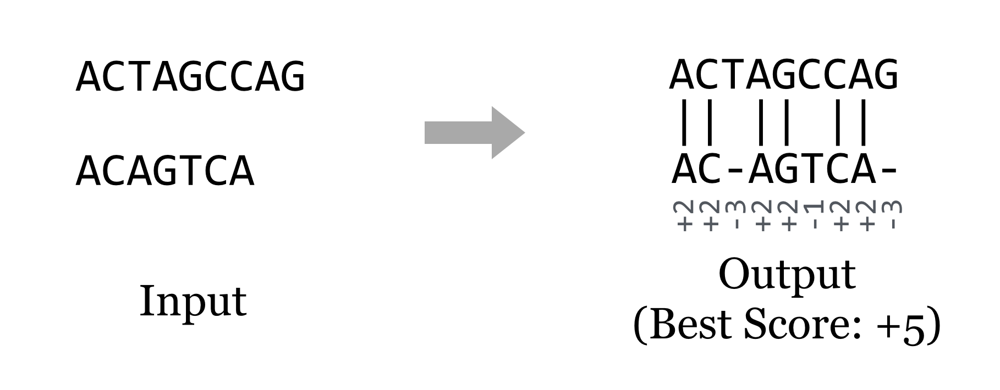
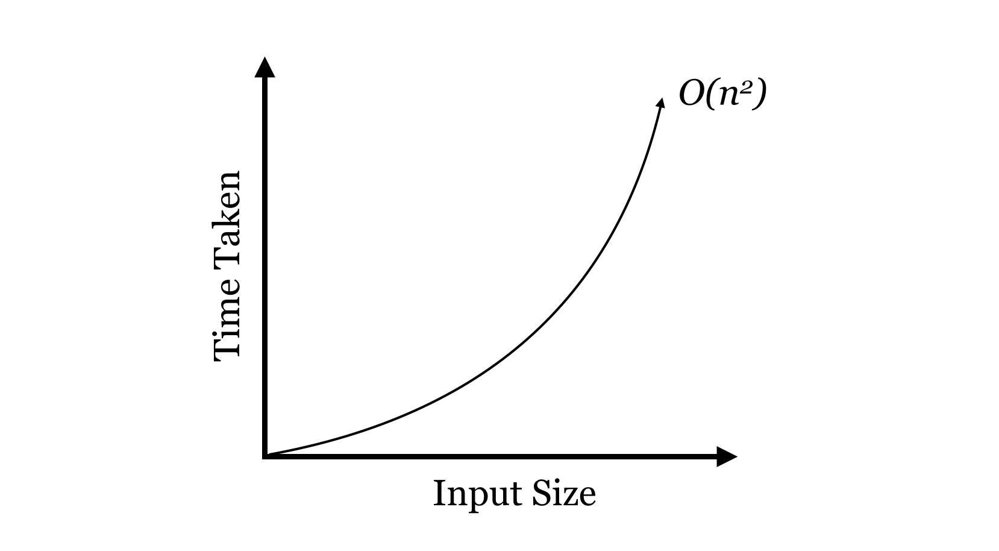
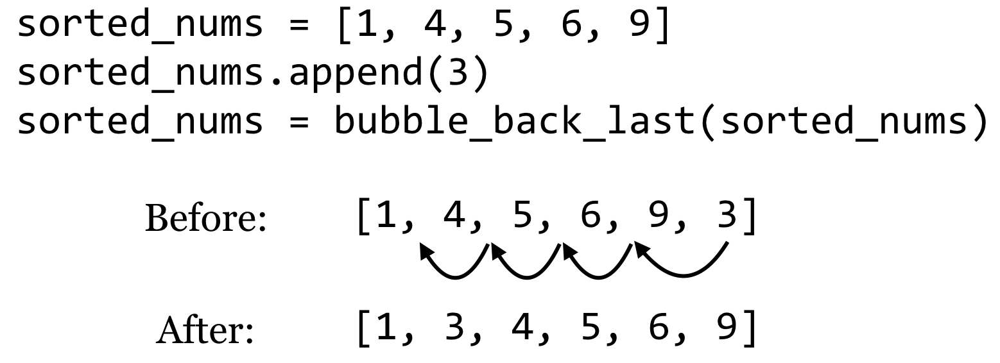
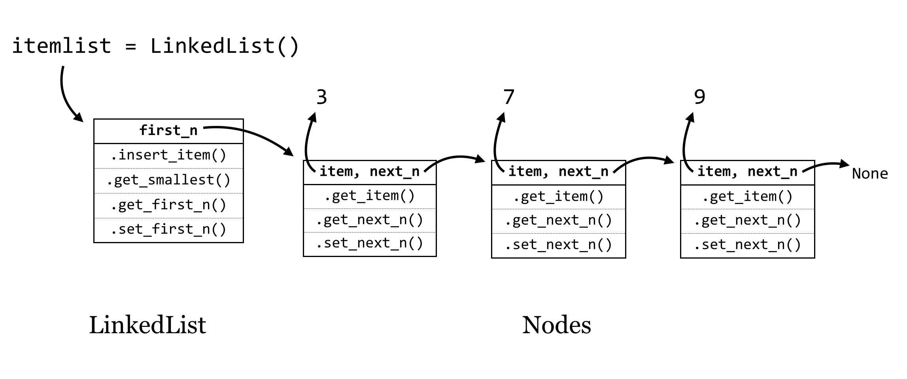
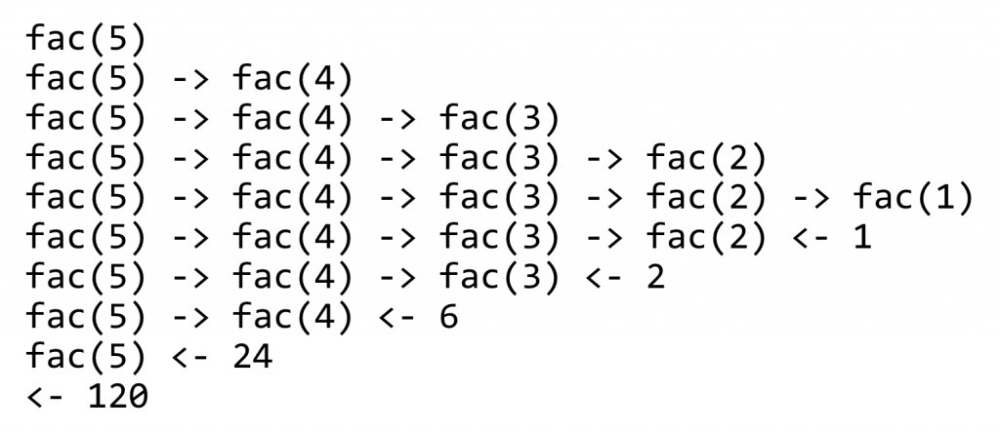
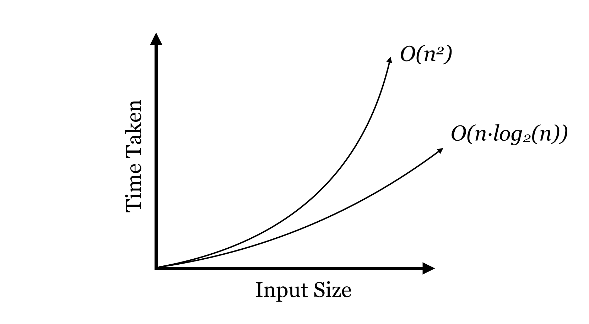
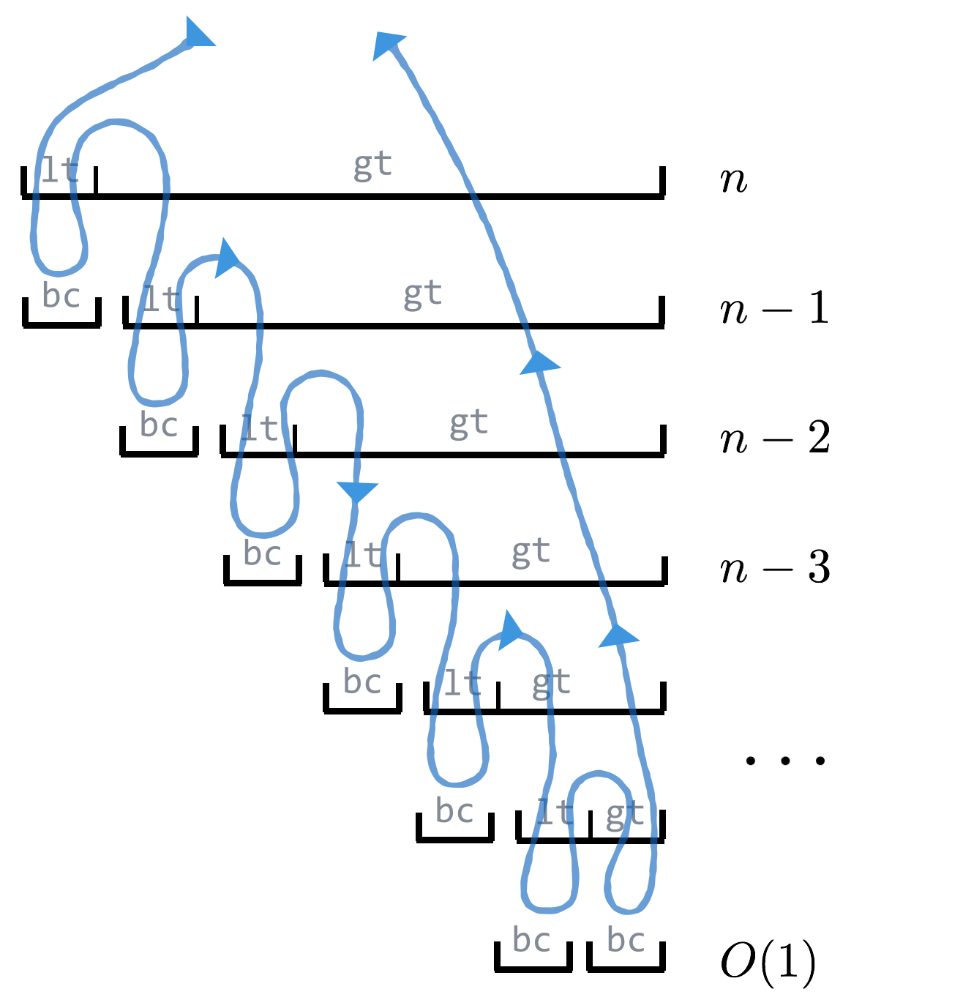

# Algorithms and Data Structures

Having learned so many programming concepts — variables and the data to which they refer, functions, loops, and so on — it would be a shame not to talk about some of the surprising and elegant methods they enable. Computer science students spend years learning about these topics, and the themes in this chapter underlie much of bioinformatics.

We’ll start with algorithms, which according to a classic book on the topic — *Introduction to Algorithms* by Thomas H. Cormen, Charles E. Leiserson, Ronald L. Rivest, and Clifford Stein—are:

> any well-defined computational procedure that takes some value, or set of values, as input and produces some value, or set of values, as output.

With such a broad definition, all of the Python coding we’ve done could accurately be categorized as practice in algorithms. The word “algorithm,” by the way, derives from the name of the eighth-century Persian mathematician al-Khwārizmī, who developed systematic approaches for solving equations (among other accomplishments). Although most functioning code may be characterized as an algorithm, algorithms usually involve more than just collating data and are paired with well-defined *problems*, providing a specification for what valid inputs are and what the corresponding outputs should be. Some examples of problems include:

1. The **sorting** problem: given a list of $n$ numbers in arbitrary order, return it or a copy of it in sorted order.
2. The **searching** problem: given a list of $n$ numbers in sorted order and a query number `q`, return `True` if `q` is present in the list and `False` if it is not.
3. The **string alignment** problem: given two strings of length $m$ and $n$, line them up against each other (inserting dashes where necessary to make them the same length) to maximize a score based on the character matches.
    

      
    

Clearly, some problems, like the string alignment problem, are of special interest for life scientists. Others, like sorting and searching, are ubiquitous. No matter who cares about the problem, a good algorithm for solving it should do so efficiently. Usually, “efficiently” means “in a short amount of time”, though with the large data sets produced by modern DNA-sequencing technologies, it often also means “using a small amount of memory”.

Most bioinformatics problems like string alignment require rather sophisticated methods built from simpler concepts, so we’ll start with the usual introductory topic for algorithms design and analysis: sorting. After all, *someone* had to write Python’s `sorted()` function for lists, and it does form a good basis for study.

Consider a small list of five numbers, in unsorted order.

  

What code might we write to sort these numbers? Whatever it is, it might make sense to put it into a function that takes an unsorted list, and returns a copy of it in sorted order (to stay consistent with Python’s use of the [principle of command-query separation](#commands-versus-queries)). To start, we’ll make a copy of the list, and then we’ll have the function merely “fix up” some of the out-of-order numbers in this copy by looking at a sliding window of size 2 — pairs of adjacent numbers — and switching their placement if they are out of order.

<pre id=part2-14-pairs
     class="language-python 
            line-numbers 
            linkable-line-numbers">
<code>
def get_sorted(nums: list) -> list:
    '''Returns a sorted copy of a list of numbers (almost)'''
    ## make a copy that we can sort and return
    c_nums = list()
    for num in nums:
        c_nums.append(num)

    ## Look neighboring pairs, swapping where needed
    for index in range(0, len(c_nums) - 1):
        leftnum = c_nums[index]
        rightnum = c_nums[index + 1]
        if leftnum > rightnum:
            c_nums[index] = rightnum
            c_nums[index + 1] = leftnum

    return c_nums
</code></pre>

Just fixing up a handful of pairs in this way won’t result in the list being sorted, but it should be obvious that because the pairs of fix-ups overlap, the largest number will have found its way to the last position. In a sense, it “bubbled” to the top. If we were to repeat this process, the second-to-largest number must also find its way to the correct spot. In fact, if we repeat this process as many times as there are numbers, the list will be fully sorted.

<pre id=part2-14-sorted
     class="language-python 
            line-numbers 
            linkable-line-numbers">
<code>
def get_sorted(nums: list) -> list:
    '''Returns a sorted copy of a list of numbers (almost)'''
    ## make a copy that we can sort and return
    c_nums = list()
    for num in nums:
        c_nums.append(num)

    for repetition in range(0, len(c_nums)):
        ## Look neighboring pairs, swapping where needed
        for index in range(0, len(c_nums) - 1):
            leftnum = c_nums[index]
            rightnum = c_nums[index + 1]
            if leftnum > rightnum:
                c_nums[index] = rightnum
                c_nums[index + 1] = leftnum

    return c_nums

nums = [3, 4, 5, 1, 6, 3, 7, 9]
print(get_sorted(nums))             # prints [1, 3, 3, 4, 5, 6, 7, 9]
</code></pre>

This algorithm for sorting is affectionately known as “bubblesort.” In a rough sense, how many operations will this algorithm perform, in the worst case, for a list of size $n$? Suppose the if statement always finds `True`, and numbers need to be swapped. In this case, each operation of the inner loop requires five or so “time steps” (four assignments and an `if` check). The inner loop runs $n - 1$ times (if there are $n$ numbers), which is itself repeated $n$ times in the outer loop. The copy step to produce the new `c_nums` list also uses $n$ steps, so the total number of basic operations is, more or less, $$ n(n-1)5+n = 5n^2-4n $$

When analyzing the running time of an algorithm, however, we only care about the “big stuff”.

### Order Notation {-}

In computing an algorithm’s run time, we only care about the highest-order terms, and we tend to ignore constants that aren’t related to the “size” of the input. We say that the run time is *order* of the highest-order term (without constants), which we denote with an uppercase $O$: $n(n-1)5+n = 5n^2-4n$ is $O(n^2)$.

We read this as “five $n$ squared minus four $n$ is order $n$ squared” or “five $n$ squared minus four $n$ is big-oh $n$ squared”. Because this run time talks about a particular algorithm, we might also say “bubblesort is order $n$ squared.” Big-O notation implies that, roughly, an algorithm will run in time *less than or equal to* the equation interpreted as a function of the input size, in the worst case (ignoring constants and small terms).

Worst-case analysis assumes that we get unlucky with every input, but in many cases the algorithm might run faster in practice. So, why do we do worst-case analysis? First, it gives the user of an algorithm a guarantee — nobody wants to hear that software *might* use a certain amount of time. Second, while it is sometimes possible to do average-case analysis, it requires knowledge of the distribution of input data in practice (which is rare) or more sophisticated analysis techniques.

Why do we use order notation to characterize algorithm run time, dropping small terms and constants? First, although we stated previously that each basic operation is one “computer step,” that’s not really true: the line `c_nums[index + 1] = leftnum` requires both an addition and an assignment. But no one wants to count each CPU cycle individually, especially if the result won’t change how we compare two algorithms for large data sets, which is the primary purpose of order notation. Dropping off constant terms and lower-order terms makes good mathematical sense in these cases. For large enough input (i.e., all $n$ greater than some size $c$), even terms that seem like they would make a big difference turn out not to matter, as the following hypothetical comparison demonstrates.

$$ \begin{align}
    0.01n^2 - 100n &> 200n^{1.5} + 20n, \text{for }n > \text{some }c \\
    O(n^2) &> O(n^{1.5}) \\
    \text{Time Alg A }&> \text{Time Alg B (for large inputs)}
\end{align} $$

In this case^[Technically $O(n^2) > O(n^{1.5})$ is an abuse of notation; we **should** say $O(n^{1.5})$ is $O(n^2)$, based on the definition of the notation.], $0.01n^2 - 100n$ is larger than $200n^{1.5} + 20n$ when $n$ is larger than $400,024,000$ (which is this example’s $c$).

So, although order notation seems like a fuzzy way of looking at the efficiency of an algorithm, it’s a rigorously defined and reasonable way to do so.^[When analyzing an algorithm in Python, however, not all lines are a single computational step. For example, Python has a built-in `sorted()` function for sorting, and although it is not as slow as bubblesort, it takes much longer than one step to sort millions of numbers. If an algorithm makes use of a function like `sorted()`, the run time of that (based on the size of the input given) also needs to be considered. A function that calls our bubblesort function $n$ times, for example, would run in time $O(n^3)$] Because some programming languages are faster than others—but only by a constant factor (perhaps compiled C code is 100 times faster than Python) — a good algorithm implemented in a slow language often beats a mediocre algorithm implemented in a fast language!

Now, a run time of $O(n^2)$ isn’t very good: the time taken to sort a list of numbers will grow quadratically with the size of the list.

  

$O(n^2)$ isn’t great, but for the sorting problem we can do better, and we’ll return to the study of algorithms and sorting a bit later. First, let’s detour and talk about interesting ways we can organize data, using variables and the objects to which they refer.

### Data Structures {-}

A data structure is an organization for a collection of data that ideally allows for fast access and certain operations on the data. We’ve seen a couple of data structures already in Python: lists and dictionaries. Given such a structure, we might ask questions like:

- Does the data structure keep its elements in a specific order (such as sorted order)? If we use `.append()` to add elements to lists, lists are kept in the order items are added. If we wanted the list to stay sorted, we’d have to ensure new elements are inserted in right spot.
- How long does it take to add a new element? For Python lists, the `.append()` method operates in time $O(1)$, which is to say a single element can be added to the end, and the time taken does not depend on how big the list is. Unfortunately, this won’t be true if we need to keep the list sorted, because inserting into the middle requires rearranging the way the data are stored.
- How long does it take to find the smallest element? Because using `.append()` adds elements to the end of the list (unless we keep the list sorted), we need to search the entire list for the smallest element. This operation takes time $O(n)$, where $n$ is the length of the list. If the list is sorted, though, it takes only $O(1)$ time to look at the first item of the list.

There are trade-offs that we can make when thinking about how to use data structures. Suppose, for example, that we wanted to quickly find the smallest element of a list, even as items are added to it. One possibility would be to sort the list after each addition; if we did that, then the smallest element would always be at index `0` for quick retrieval. But this is a lot of work, and the total time spent sorting would start to outweigh the benefits of keeping the list sorted in the first place! Even better, we could write a function that (1) inserts the new item to the end and then (2) bubbles it backward to its correct location; only one such bubbling would be needed for each insertion, but each is an $O(n)$ operation (unless we could somehow guarantee that only large elements are added).

  

Then finding the smallest item is easy, as we know it is always present at index `0`.

+--------------------+-------------+--------------+
| Structure          | Insert Item | Get Smallest |
+====================+:===========:+:============:+
| Sorted Simple List | $O(n)$      | $O(1)$       |
+--------------------+-------------+--------------+

Instead, let’s do something much more creative, and build our own data structure from scratch. While this data structure is a lot of trouble to create for only a little benefit, it does have its uses and serves as a building block for many other sophisticated structures.

### Sorted Linked Lists {-}

Our data structure, called a “sorted linked list”, will keep a collection of items in sorted order, and will do the work of inserting new items in the correct location in that order. These items could be integers, floats, or strings, anything that can be compared with the `<` operator (which, recall, compares strings in [lexicographic order](#lexicographic_order); as discussed in previous chapters, we can even define our own object types that are comparable with `>` by implementing `.__lt__()`, `.__eq__()` and similar [methods](#custom_comparable)).

To accomplish this task, we’re going to make heavy use of classes and objects, and the fact that a variable (even an [instance variable](#instance_variable)) is a name that refers to an object.

The strategy will be to have two types of objects: the first, which we’ll call a `LinkedList`, will be the main type of object with which our programs will interact (much like we interacted with `Chromosome` objects in previous chapters, while `SNP` objects were dealt with by the `Chromosome` objects). The `LinkedList` object will have methods like `.insert_item()` and `.get_smallest()`. The other objects will be of type `Node`, and each of these will have an instance variable `self.item` that will refer to the item stored by an individual `Node`. So, drawing just the objects in RAM, our sorted linked list of three items (`4`, `7`, and `9`) might look something like this:

  

The objects are unlikely to be neatly organized this way in RAM — we’re showing them in a line for illustration only. The arrows in this figure indicate that after we create a new `LinkedList` object called `itemlist`, this variable is a name that refers to an object, and each `Node` object has a `self.item` instance variable that refers to a “data” object of some type, like an integer or string.^[There is no reason a `Node` object couldn’t also hold other information. For example, nodes could have a `self.snp` to hold an SNP object as well, with `self.item` being the location of the SNP, so SNPs are stored in order of their locations.]

Now, if this collection of objects were to exist as shown, it wouldn’t be that useful. Our program would only be able to interact with the `itemlist` object, and in fact there are no variables that refer to the individual `Node` objects, so they would be deleted via [garbage collection](#garbage_collection).

Here’s the trick: if an instance variable is just a variable (and hence a reference to an object), we can give each `Node` object a `self.next_n` instance variable that will refer to the next node in line. Similarly, the `LinkedList` object will have a `self.first_n` instance variable that will refer to the first one.

  

The last `Node` object’s `self.next_n` refers to `None`, a placeholder that we can use to allow a variable to reference “nothing here.” Actually, `None` will be the initial value for `self.next_n` when a new node is created, and we’ll have to add methods for `get_next_n()` and `set_next_n()` that allow us to get or change a `Node`’s `next_n` variable at will. The `LinkedLists`’s `first_n` variable will similarly be initialized as `None` in the constructor.

Suppose that we have this data structure in place, and we want to add the number `2`; this would be the new “smallest” item. To do this we’d need to run `itemlist.insert_item(2)`, and this method would consider the following questions to handle all of the possible cases for inserting an item (by using if statements):

1. Is `self.first_n` equal to `None`? If so, then the new item is the only item, so create a new `Node` holding the new item and set `self.first_n` to that node.
2. If `self.first_n` is not equal to `None`:
    a. Is the new item smaller than `self.first_n`’s item? If so, then 
        1. create a new `Node` holding the new item
        2. set its `next_n` to `self.first_n`
        3. set `self.first_n` to the new node
        
        Here's an illustration for this case:

    

    
    

    b. Otherwise, the new node does not go between the `LinkedList` object and the first `Node` object. In this case, we could treat the `self.first_n` object as though it were itself a `LinkedList`, if only it had an `.insert_item()` method.

This case (b) is really the heart of the linked list strategy: each `Node` object will also have an `.insert_item()` method. Further, each node’s `.insert_item()` will follow the same logic as above: if `self.next_n` is `None`, the new node goes after that node. If not, the node needs to determine if the new node should go between itself and the next node, or if it should “pass the buck” to the node next in line.

Now we can turn to the code. First, here’s the code for the `LinkedList` class.

<pre id=part2-14-linkedlist
     class="language-python 
            line-numbers 
            linkable-line-numbers">
<code>
#!/usr/bin/env python

class LinkedList:
    def __init__(self):
        self.first_n = None

    def get_smallest(self):
        if self.first_n != None:
            return self.first_n.get_item()
        else:
            return None

    def insert_item(self, item):
        if self.first_n == None:                      # 1.
            newnode = Node(item)
            self.first_n = newnode
        else:
            if item < self.first_n.get_item():        # 2a.
                newnode = Node(item)                      # 1)
                newnode.set_next_n(self.first_n)          # 2)
                self.first_n = newnode                    # 3)
            else:                                     # 2b.
                self.first_n.insert_item(item)
</code></pre>

The highlighted lines above are those illustrated in step 2a and are crucial; in particular, the order in which the various variables are set makes all the difference. What would happen if `self.first_n = newnode` was called *before* `newnode.set_next(self.first_n)`? We would lose all references to the rest of the list: `itemlist.first_n` would refer to `newnode`, the new node’s `.next_n` would refer to `None`, and no variable would refer to the node holding `3` — it would be lost in RAM and eventually [garbage collected](#garbage_collection).

As mentioned above, the class for a `Node` is quite similar. In fact, it is possible to build linked lists with only one object type, but this would necessitate a “dummy” node to represent an empty list anyway (perhaps storing `None` in its `self.item`).

<pre id=part2-14-node
     class="language-python 
            line-numbers 
            linkable-line-numbers">
<code>
class Node:
    def __init__(self, item):
        self.item = item
        self.next_n = None

    def get_item(self):
        return self.item

    def get_next_n(self):
        return self.next_n

    def set_next_n(self, newnext):
        self.next_n = newnext

    def insert_item(self, item):
        if self.next_n == None:
            newnode = Node(item)
            self.next_n = newnode
        else:
            if item < self.next_n.get_item():
                newnode = Node(item)
                newnode.set_next_n(self.next_n)
                self.next_n = newnode
            else:
                self.next_n.insert_item(item)
</code></pre>

Our new data structure is relatively easy to use, and it keeps itself sorted nicely:

<pre id=part2-14-ll-use
     class="language-python 
            line-numbers 
            linkable-line-numbers">
<code>
numlist = LinkedList()
numlist.insert_item(9)
numlist.insert_item(3)
numlist.insert_item(7)
print(numlist.get_smallest())       # prints 3
numlist.insert_item(2)
print(numlist.get_smallest())       # prints 2
</code></pre>

### Linked List Methods {-}

This idea of “passing the buck” between nodes is pretty clever, and it allows us to write sophisticated queries on our data structure with ease. Suppose we wanted to ask whether a given item is already present in the list.

To solve a problem like this, we can think of each node as implementing a decision procedure (using a method, like `.is_item_present(query)`). The `LinkedList` interface object would return `False` if its `self.first_n` is `None` (to indicate the list is empty, so the query item can’t be present). If its `self.first_n` is not `None`, it calls `self.first_n.is_item_present(query)`, expecting that node to either return `True` or `False`.

<pre id=part2-14-controller_is_item_present
     class="language-python 
            line-numbers 
            linkable-line-numbers">
<code>
    # ... (inside class LinkedList:)

    def is_item_present(self, query) -> bool:
        if self.first_n == None:
            return False
        else:
            answer = self.first_n.is_item_present(query)
            return answer
</code></pre>

For a node, the decision procedure is only slightly more complex:

1. Check whether `self.item` is equal to the `query`. If so, a `True` can safely be returned.
2. Otherwise:
    a. If `self.next_n` is `None`, then `False` can be returned, because if the buck got passed to the end of the list, no node has matched the `query`.
    b. If `self.next_n` does exist, on the other hand, just pass the buck down the line, and rely on the answer to come back, which can be returned.

    <pre id=part2-14-node_is_item_present
     class="language-python 
            line-numbers 
            linkable-line-numbers">
    <code>
    # ... (inside class Node:)
        def is_item_present(self, query) -> bool:
        if self.item == query:                         # 1.
            return True
        else:
            if self.next_n == None:                    # 2a.
                return False
            else:                                      # 2b.
                answer = self.next_n.is_item_present(query)
                return answer
    </code></pre>

Here is a quick demonstration of the usage (the whole script can be found in the file [`linkedlist.py`](/data/linkedlist.py)):

<pre id=part2-14-usage-is-present
     class="language-python 
            line-numbers 
            linkable-line-numbers">
<code>
numlist = LinkedList()
numlist.insert_item(9)
numlist.insert_item(3)
numlist.insert_item(7)
print(numlist.get_smallest())       # prints 3
numlist.insert_item(2)
print(numlist.get_smallest())       # prints 2
print(numlist.is_item_present(7))   # prints True
print(numlist.is_item_present(6))   # prints False
</code></pre>

Notice the similarity in all of these methods: each node first determines whether it can answer the problem — if so, it computes and returns the answer. If not, it checks for a node to pass the problem on to, and if one exists, the buck is passed. Notice that at each buck pass the method being called is the same — it’s just being called for a different object. And each time the overall “problem” gets smaller as the number of nodes left to pass the buck to decreases.

How much time does it take to insert an item into a list that is already of length $n$? Because the new item might have to go at the end of the list, the buck might need to be passed $n$ times, meaning an insertion is $O(n)$. What about getting the smallest element? In the `LinkedList` `.get_smallest()` method, it only needs to determine whether `self.first_n` is `None`, and if not, it returns the element stored in that node. Because there is no buck passing, the time is $O(1)$.

+--------------------+-------------+--------------+
| Structure          | Insert Item | Get Smallest |
+====================+:===========:+:============:+
| Sorted Simple List | $O(n)$      | $O(1)$       |
+--------------------+-------------+--------------+
| Sorted Linked List | $O(n)$      | $O(1)$       |
+--------------------+-------------+--------------+

The creation of the sorted linked list structure didn’t get us much over a more straightforward list kept in sorted order via bubbling, but the ideas implemented here pave the way for much more sophisticated solutions.

#### Exercises {-}

1. How much time would it take to insert $n$ sequences into a Python list, and then at the end sort it with bubblesort in the worst-case scenario (using order notation)?
2. How much time would it take to insert $n$ elements into a sorted linked list that starts empty, in the worst-case scenario (using order notation)? (Note that the first insertion is quick, but the second item might take two buck-passes, the third may take three, and so on.)
3. Add “pass the buck” methods to the `LinkedList` and `Node` classes that result in each item being printed in order.
4. Write “pass the buck” methods that cause the list of items to be printed, but in *reverse* order.
5. Add methods to the `LinkedList` and `Node` classes so that the linked list can be converted into a normal list (in any order, though reverse order is most natural). For example, `print(itemlist.collect_to_list())` should print something like `[9, 3, 7]`.

### Divide and Conquer {-}

So far, both the algorithm (bubblesort) and the data structure (sorted linked list) we’ve studied have been linear in nature. Here, we’ll see how these ideas can be extended in “bifurcating” ways.

Let’s consider the sorted linked list from the last section, which was defined by a “controlling” class (the `LinkedList`) and a number of nearly identical `Nodes`, each with a reference to a “next” `Node` object in the line. So long as certain rules were followed (e.g., that the list was kept in sorted order), this allowed each node to make *local* decisions that resulted in *global* answers to questions.

###### {- #binary_tree}

What if we gave each node a bit more power? Rather than a single `self.next_n` instance variable, what if there were two: a `self.left_n` and a `self.right_n`? We will need a corresponding rule to keep things organized: smaller items go toward the left, and larger (or equal-sized) items go toward the right. This data structure is the well-known *binary tree*.

  

The illustration above looks quite a bit more complicated. But if we inspect this structure closely, it’s quite similar to the linked list:^[If we ignore all the nodes’ `self.left_n` references (i.e., the entire left side of the tree), then the `self.right_n` path from top to the lower right is a sorted linked list! Similarly, the path from the top to the lower left is a reverse-sorted linked list.] there is a controlling class of `BinaryTree`, and instead of a `self.first_n` instance variable, it has an instance variable called `self.root_n`, because the node it references is the “root” of the tree. Before any items have been inserted, `self.root_n` will be `None`. Upon an item insertion, if `self.root_n` is `None`, the new item goes there; otherwise, the buck is necessarily passed to `self.root_n`. We’ll see why in a moment.

<pre id=part2-14-tree_constructor_insert
     class="language-python 
            line-numbers 
            linkable-line-numbers">
<code>
#!/usr/bin/env python

class BinaryTree:
    def __init__(self):
        self.root_n = None

    def insert_item(self, item):
        if self.root_n == None:
            newnode = Node(item)
            self.root_n = newnode
        else:
            self.root_n.insert_item(item)
</code></pre>

Now, for the `Node` class, we’ll need a constructor, as well as “get” and “set” methods for both `left_n` and `right_n`, which initially are set to `None`.

<pre id=part2-14-tree_node_getters_setters
     class="language-python 
            line-numbers 
            linkable-line-numbers">
<code>
class Node:
    def __init__(self, item):
        self.item = item
        self.left_n = None
        self.right_n = None
        
    def get_item(self):
        return self.item
    
    def get_left_n(self):
        return self.left_n
    
    def set_left_n(self, newleft):
        self.left_n = newleft
        
    def get_right_n(self):
        return self.right_n
    
    def set_right_n(self, newright):
        self.right_n = newright
</code></pre>

What about a node’s `.insert_item()` method? What sort of decision-making process needs to happen? The process is even simpler than for a sorted linked list. If each node always follows the rule that smaller items can be found to the left and larger or equal items can always be found to the right, then new items can always be inserted at the bottom of the tree. In the tree above, for example, a node holding `8` would be placed to the right of (and “below”) the node holding `7`. The decision process for a node is thus as follows:

1. Is the new item to insert less than our `self.item`? If so, the new item goes to the left:
    a. Is `self.left_n` equal to `None`? If so, then we need to create a new node holding the new item, and set `self.left_n` to that node.
    b. If not, we can pass the buck to `self.left_n`.
2. Otherwise, the item must be larger than or equal to `self.item`, so it needs to go to the right:
    a. Is `self.right_n` equal to `None`? If so, then we need to create a new node holding the new item, and set `self.right_n` to that node.
    b. If not, we can pass the buck to `self.right_n`.

In the previous figure of a tree, `8` would go to the right of `7`, `6` would go to the left of `7`, `18` would go the right of `11`, and so on. The logic for inserting a new item is thus quite simple, from a node’s point of view:

<pre id=part2-14-tree_node_insert
     class="language-python 
            line-numbers 
            linkable-line-numbers">
<code>
    # ... (inside class Node:)
        def insert_item(self, item):
        if item < self.item:                        
            if self.left_n == None:                 # 1a.  
                newnode = Node(item)
                self.left_n = newnode
            else:                                   # 1b.
                self.left_n.insert_item(item)
        else:
            if self.right_n == None:                # 2a.
                newnode = Node(item)
                self.right_n = newnode
            else:                                   # 2b.
                self.right_n.insert_item(item)
</code></pre>

The remaining method to consider is the tree’s `.get_smallest()`. In the case of a linked list, the smallest item (if present) was the first node in the list, and so could be accessed with no buck passing. But in the case of a binary tree, this isn’t true: the smallest item can be found all the way to the left. The code for `.get_smallest()` in the `Tree` class and the corresponding `Node` class reflects this.

<pre id=part2-14-tree_get_smallest
     class="language-python 
            line-numbers 
            linkable-line-numbers">
<code>
    # ... (inside class Tree:)

    def get_smallest(self):
        if self.root_n == None:
            return None
        else:
            answer = self.root_n.get_smallest()
            return answer
</code></pre>

<pre id=part2-14-node_get_smallest
     class="language-python 
            line-numbers 
            linkable-line-numbers">
<code>
    # ... (inside class Node:)
    def get_smallest(self):
        if self.left_n == None:
            return self.item
        else:
            answer = self.left_n.get_smallest()
            return answer
</code></pre>

In the case of a node, if `self.left_n` is `None`, then *that* node’s item must be the smallest one, because it can assume the message was only ever passed toward it to the left. Similar usage code as for the linked list demonstrates that this wonderful structure ([`binarytree.py`](data/binarytree.py)) really does work:

<pre id=part2-14-tree_usage
     class="language-python 
            line-numbers 
            linkable-line-numbers">
<code>
numtree = BinaryTree()
numtree.insert_item(9)
numtree.insert_item(3)
numtree.insert_item(7)
numtree.insert_item(1000)
numtree.insert_item(10)
print(numtree.get_smallest())       # prints 3
numtree.insert_item(2)
print(numtree.get_smallest())       # prints 2
</code></pre>

The most interesting question is: how much time does it take to insert a new item into a tree that already contains $n$ items? The answer depends on the shape of the tree. Suppose that the tree is nice and “bushy”, meaning that all nodes except those at the bottom have nodes to their left and right.

  

The time taken to insert an item is the number of times the buck needs to be passed to reach the bottom of the tree. In this case, at each node, the total number of nodes in consideration is reduced by half; first $n$, then $n/2$, then $n/4$, and so on, until there is only a single place the new item could go. How many times can a number $n$ be divided in half until reaching a value of 1 (or smaller)? The formula is $log_2(n)$. It takes the same amount of time to find the smallest item for a bushy tree, because the length down the left-hand side is the same as any other path to a “leaf” in the tree.

+---------------------+---------------+---------------+
| Structure           | Insert Item   | Get Smallest  |
+=====================+:=============:+:=============:+
| Sorted Simple List  | $O(n)$        | $O(1)$        |
+---------------------+---------------+---------------+
| Sorted Linked List  | $O(n)$        | $O(1)$        |
+---------------------+---------------+---------------+
| “Bushy” Binary Tree | $O(log_2(n))$ | $O(log_2(n))$ |
+---------------------+---------------+---------------+
		
In general, the logarithm of $n$ is much smaller than $n$ itself, so a binary tree trades off some speed in finding the smallest element for speed in insertion.

Note, however, that the shape of a tree depends on the order in which the items are inserted; for example if `10` is inserted into an empty tree, followed by `9`, the `9` will go to the left. Further inserting `8` will put it all the way to the left of `9`. Thus, it is possible that a tree isn’t in fact bushy, but rather very unbalanced. For an extreme example, if the numbers from $n$, $n-1$, $n-2$, ..., $3$, $2$ were inserted in that order, the tree would look like so:

  

In this case, the tree has degenerated into a reverse-sorted linked list. So, the insertion time (for `1`, for example) is $O(n)$, and finding the smallest item is also, because the tree is heavily unbalanced in a leftward direction. Unfortunately, in practice, we can’t guarantee the order in which data will be inserted, and such runs of consecutive insertions aren’t uncommon in real-world data.

More sophisticated structures called “balanced” binary trees have modifications to their insertion methods that ensure the tree stays bushy, no matter what order items are inserted. This is tricky, as it requires manipulating the structure of the tree after insertions, but the structure manipulation itself can’t take too long or the benefit of insertion is lost. Examples of balanced binary trees include so-called red-black trees, and AVL trees (named after Georgy Adelson-Velsky and Evgenii Landis, who first described them).

+------------------------+---------------+---------------+
| Structure              | Insert Item   | Get Smallest  |
+========================+:=============:+:=============:+
| Sorted Simple List     | $O(n)$        | $O(1)$        |
+------------------------+---------------+---------------+
| Sorted Linked List     | $O(n)$        | $O(1)$        |
+------------------------+---------------+---------------+
| “Bushy” Binary Tree    | $O(log_2(n))$ | $O(log_2(n))$ |
+------------------------+---------------+---------------+
| “Un-Bushy” Binary Tree | $O(n)$        | $O(n)$        |
+------------------------+---------------+---------------+
| Balanced Binary Tree   | $O(log_2(n))$ | $O(log_2(n))$ |
+------------------------+---------------+---------------+

In practice, we don’t make a distinction between “bushy” and “un-bushy” binary trees: simple binary-search trees are $O(n)$ for both $.insert_item()$ and $.get_smallest()$, because we cannot guarantee bushiness (recall that we assume worst-case performance when analyzing an algorithm). Real applications thus use AVL trees, red-black trees, or other more sophisticated data structures.

#### Exercises {-}

1. Add “pass the buck” methods to `BinaryTree` and its `Node` class for `.print_in_order()` and `.print_reverse_order()`, causing the items to be printed in sorted and reverse-sorted order, respectively.
2. Add `.count_nodes()` methods that return the total number of items stored in the tree. How long does it take, in order notation? Does this depend on whether the tree is bushy or not? If so, what would be the run time for a bushy versus un-bushy tree?
3. Add `.count_leaves()` methods that return the total number of “leaves” (nodes with `None` in `left_n` and `right_n`).
4. Binary search trees are so called because they can easily and efficiently determine whether a query item is present. Add `.is_item_present()` methods that return `True` if a query item exists in the tree and `False` otherwise (similar to the `LinkedList` `.is_item_present()`). How long does it take, in order notation? Does this depend on whether the tree is bushy or not? If so, what would be the run time for a bushy versus un-bushy tree?
5. Modify the binary tree code so that duplicate items can’t be stored in separate nodes.

### Back to Sorting {-}

We previously left the topic of sorting having developed `bubblesort`, an $O(n^2)$ method for sorting a simple list of items. We can certainly do better.

One of the interesting features of the `insert_item()` method used by nodes in both the tree and linked list is that this method, for any given node, calls itself, but in another node. In reality, there aren’t multiple copies of the method stored in RAM; rather, a single method is shared between them, and only the `self` parameter is really changing. So, this method (which is just a function associated with a class) is actually calling *itself*.

In a related way, it turns out that any function (not associated with an object) can call itself. Suppose we wanted to compute the factorial function, defined as

$$
    factorial(n) = n \times (n-1) \times (n-2) \times ... \times 2 \times 1
$$

One of the most interesting features of the factorial function is that it can be defined in terms of itself:

$$
    factorial(n) = \begin{cases}
                    &  1,                       & \text{if } n=1 \\
                    &  n \times factorial(n-1), & \text{otherwise}
                    \end{cases}
$$

If we wanted to compute `factorial(7)`, a logical way to think would be: “first, I’ll compute the factorial of 6, then multiply it by 7”. This reduces the problem to computing `factorial(6)`, which we can logically solve in the same way. Eventually we’ll want to compute `factorial(1)`, and realize that is just 1. The code follows this logic impeccably:

<pre id=part2-14-factorial
     class="language-python 
            line-numbers 
            linkable-line-numbers">
<code>
def factorial(n:int) -> int:
    if n == 1:
        return 1
    else:
        subanswer = factorial(n-1)
        answer = subanswer * n
        return answer

print(factorial(7))                 # prints 5040
print(factorial(8))                 # prints 40320
print(factorial(9))                 # prints 362880
</code></pre>

As surprising as it might be, this bit of code really works.^[Factorials can be easily (and slightly more efficiently) computed with a loop, but we’re more interested in illustrating the concept of a self-calling function.] The reason is that the parameter `n` is a [local variable](#local_variable), and so in each call of the function it is independent of any other `n` variable that might exist.^[Additionally, the operations of defining a function and executing it are disjoint, so there’s nothing to stop a function being defined in terms of itself.] The call to `factorial(7)` has an `n` equal to `7`, which calls `factorial(6)`, which in turn gets its own `n` equal to `6`, and so on. Each call waits at the `subanswer = factorial(n-1)` line, and only when `factorial(1)` is reached do the returns start percolating back up the chain of calls. Because calling a function is a quick operation ($O(1)$), the time taken to compute `factorial(n)` is $O(n)$, one for each call and addition computed at each level.

  

###### {- #recursion}

This strategy — a function that calls itself — is called *recursion*. There are usually at least two cases considered by a recursive function: (1) the *base case*, which returns an immediate answer if the data are simple enough, and (2) the *recursive case*, which computes one or more subanswers and modifies them to return the final answer. In the recursive case, the data on which to operate must get “closer” to the base case. If they do not, then the chain of calls will never finish.

Applying recursion to sorting items is relatively straightforward. The more difficult part will be determining how fast it runs for a list of size $n$. We’ll illustrate the general strategy with an algorithm called `quicksort`, first described in 1960 by Tony Hoare.

For an overall strategy, we’ll implement the recursive sort in a function called `quicksort()`. The first thing to check is whether the list is of length 1 or 0: if so, we can simply return it since it is already sorted. (This is the base case of the recursive method.) If not, we’ll pick a “pivot” element from the input list; usually, this will be a random element, but we’ll use the first element as the pivot to start with. Next, we’ll break the input list into three lists: `lt`, containing the elements less than the pivot; `eq`, containing the elements equal to the pivot; and `gt`, containing elements greater than the pivot. Next, we’ll sort `lt` and `gt` to produce `lt_sorted` and `gt_sorted`. The answer, then, is a new list containing first the elements from `lt_sorted`, then the elements from `eq`, and finally the elements from `gt_sorted`.

The interesting parts of the code below are the highlighted lines: how do we sort `lt` and `gt` to produce `lt_sorted` and `gt_sorted`?

<pre id=part2-14-quicksort
     class="language-python 
            line-numbers 
            linkable-line-numbers">
<code>
def quicksort(nums: list) -> list:
    if len(nums) <= 1:              # base case
        return nums
    else:                           # recursive case
        pivot = nums[0]             # O(1)
        lt = list()
        eq = list()
        gt = list()

        for num in nums:            # O(n)
            if num < pivot:
                lt.append(num)
            elif num == pivot:
                eq.append(num)
            else:
                gt.append(num)

        ## producing lt_sorted and gt_sorted
        lt_sorted = quicksort(lt)  # O(?)
        gt_sorted = quicksort(gt)  # O(?)

        answer = list()
        for num in lt_sorted:      # O(n)
            answer.append(num)
        for num in eq:             # O(n)
            answer.append(num)     
        for num in gt_sorted:      # O(n)
            answer.append(num)

    return answer
</code></pre>

We could use Python’s built-in `sorted()` function, but that’s clearly cheating. We could use `bubblesort`, but doing so would result in our function suffering the same time bound as for `bubblesort` (we say “time bound” because the order notation essentially provides an upper bound on time usage). The answer is to use recursion: because `lt` and `gt` must both be smaller than the input list, as subproblems they are getting closer to the base case, and we can call `quicksort()` on them!

<pre id=part2-14-quicksort_use
     class="language-python 
            line-numbers 
            linkable-line-numbers">
<code>
nums = [4, 6, 8, 1, 2, 8, 9, 2]
print(quicksort(nums))               # prints [1, 2, 2, 4, 6, 8, 8, 9]
</code></pre>

Let’s attempt to analyze the running time of `quicksort()` — will it be better than, equal to, or worse than `bubblesort`? As with the binary trees covered previously, it turns out the answer is “it depends.”

First, we’ll consider how long the function takes to run — not counting the subcalls to `quicksort()` — on a list of size $n$. The first step is to pick a pivot, which is quick. Next, we split the input list into three sublists. Because appending to a list is quick, but all $n$ elements need to be appended to one of the three, the time spent in this section is $O(n)$. After the subcalls, the sorted versions of the lists need to be appended to the `answer` list, and because there are $n$ things to append, the time there is also $O(n)$. Thus, not counting the recursive subcalls, the run time is $O(n)$ plus $O(n)$ which is $O(n)$.

But that’s not the end of the story — we can’t just ignore the time taken to sort the sublists, even though they are smaller. For the sake of argument, let’s suppose we always get “lucky,” and the pivot happens to be the median element of the input list, so `len(lt)` and `len(gt)` are both approximately $n/2$. We can visualize the execution of the function calls as a sort of “call tree”, where the size of the nodes represents how big the input list is.

  

Here, the top “node” represents the work done by the first call; before it can finish, it must call to sort the `lt` list on the second layer, which must again call to sort its own `lt` list, and so on, until the bottom layer, where a base case is reached. The path of execution can be traced in the figure along the line. To analyze the run time of the algorithm, we can note that the amount of work done at each layer is $O(n)$, so the total amount of work is this value times the number of layers. In the case where the pivots split the lists roughly in half, the result is the same as the number of layers in the bushy binary tree: $O(log_2(n))$. Thus, in this idealized scenario, the total run time is $O(n log_2(n))$, which is much better than the $O(n^2)$ of bubblesort.^[This proof is a visually oriented one, and not terribly rigorous. A more formalized proof would develop what is known as a recurrence relation for the behavior of the algorithm, in the form of $T(n) = 2 T (n/2) + c,\ T(1) = d$, to be solved for $T(n)$, representing the time taken to sort $n$ items.]

  

This equation assumes that the pivots split the input lists more or less in half, which is likely to be the case (on average), if we choose the pivots at random. But we didn’t choose at random; we used `nums[0]`. What would happen if the input to the list happened to be already sorted? In this case, the pivot would always be the first element, `lt` would always be empty, and `gt` would have one fewer element. The “work tree” would also be different.

  

In this “unlucky” case, the work on each level is approximately $n$, $n - 1$, $n - 2$, and so on, so the total work is $n+(n-1)+(n-2)+...1=n(n+1)/2$ which is $O(n^2)$. Does this mean that in the worst case `quicksort()` is as slow as bubblesort? Unfortunately, yes. But some very smart people have analyzed `quicksort()` (assuming the pivot element is chosen at random, rather than using the first element) and proved that in the average case the run time is $O(n\ log_2(n))$, and the chances of significantly worse performance are astronomically small. Further, a similar method known as “mergesort” operates by guaranteeing an even 50/50 split (of a different kind).

+------------+------------------+------------------+
| Algorithm  | Average Case     | Worst Case       |
+============+:================:+:================:+
| Bubblesort | $O(n^2)$         | $O(n^2)$         |
+------------+------------------+------------------+
| Quicksort  | $O(n\ log_2(n))$ | $O(n^2)$         |
+------------+------------------+------------------+
| Mergesort  | $O(n\ log_2(n))$ | $O(n\ log_2(n))$ |
+------------+------------------+------------------+

Using random selection for pivot, `quicksort()` is fast in practice, though mergesort and similar algorithms are frequently used as well. (Python’s `.sort()` and `sorted()` use a variant of mergesort called “Timsort”.) Although as mentioned above worst-case analysis is most prevalent in algorithms analysis, `quicksort()` is one of the few exceptions to this rule.

These discussions of algorithms and data structures might seem esoteric, but they should illustrate the beauty and creativeness possible in programming. Further, recursively defined methods and sophisticated data structures underlie many methods in bioinformatics, including pairwise sequence alignment, reference-guided alignment, and Hidden Markov Models.

#### Exercises {-}

1. The first step for writing `mergesort()` is to write a function called `merge()`; it should take two sorted lists (together comprising $n$ elements) and return a merged sorted version. For example, `merge([1, 2, 4, 5, 8, 9, 10, 15], [2, 3, 6, 11, 12, 13])` should return the list `[1, 2, 2, 3, 4, 5, 6, 8, 9, 10, 11, 12, 13, 15]`, and it should do so in time $O(n)$, where $n$ is the total number of elements from both lists. (Note that `.append()` on a Python list is time $O(1)$, as are mathematical expressions like `c = a + b`, but other list operations like `.insert()` are not.)

    The `mergesort()` function should first split the input list into two almost-equal-sized pieces (e.g., `first_half = input_list[0:len(input_list)//2]`); these can then be sorted recursively with `mergesort()`, and finally the `merge()` function can be used to combine the sorted pieces into a single answer. If all steps in the function (not counting the recursive calls) are $O(n)$, then the total time will be $O(n\ log_2(n))$.

    Implement `merge()` and `mergesort()`.

2. The Fibonacci numbers (1, 1, 2, 3, 5, 8, 13, etc.) are, like the factorials, recursively defined:

    $$
    Fib(n) = \begin{cases}
        &  1,                       & \text{if } n=1 \\
        &  1,                       & \text{if } n=2 \\
        &  Fib(n-1)+Fib(n-2),       & \text{otherwise}
        \end{cases}
    $$

    Write a recursive function `fib()` that returns the $n$th Fibonacci number (`fib(1)` should return `1`, `fib(3)` should return `2`, `fib(10)` should return `55`).

3. Next, write a function called `fib_loop()` that returns the $n$th Fibonacci by using a simple loop. What is the run time, in order notation, in terms of $n$? Compare how long it takes to compute `fib(35)` versus `fib_loop(35)`, and then try `fib(40)` versus `fib_loop(40)`. Why do you think `fib()` takes so much longer? Try drawing the “call trees” for `fib(1)`, `fib(2)`, `fib(3)`, `fib(4)`, `fib(5)`, and `fib(6)`. Could you make a guess as to what the run time of this function is in order notation? Can you imagine any ways it could be sped up?

