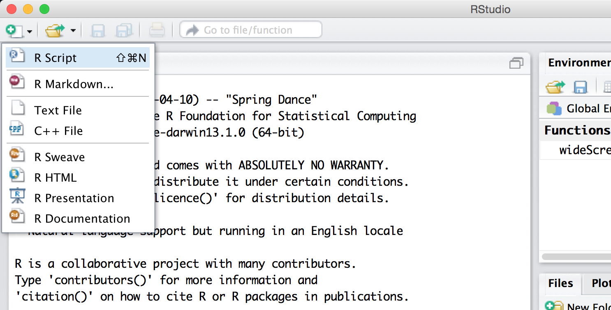
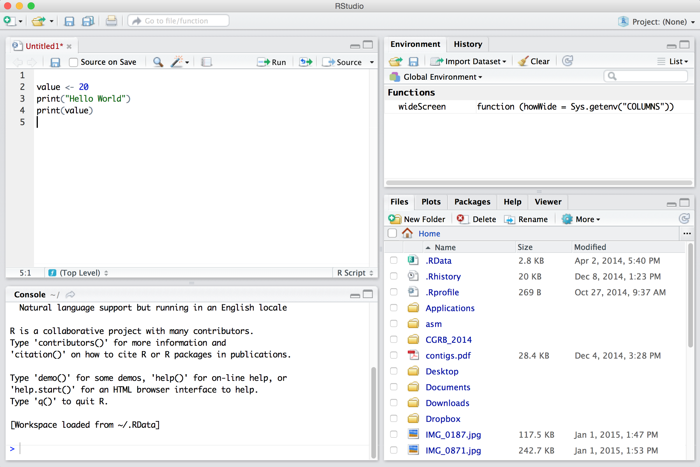

# (PART\*) Part 3: Programming in R {-}

# An Introduction

The R programming language has a rich history, tracing its roots to the S language originally developed for statistical computing in the mid-1970s at (where else?) Bell Laboratories. Later, the open-source R project extended the capabilities of S while incorporating features of languages like LISP and Scheme.

Many features of R are shared with Python: both are high-level, interpreted languages. (For a discussion of interpreted vs. compiled languages, see chapter 13, “[Hello, World]()”.) Both languages provide a wide array of features and functions for common tasks, and both languages are buttressed by a staggering variety of additional packages for more specialized analyses. Superficially, much of their syntax is similar, though below the surface lie significant (and fascinating) differences.

Practically, the major difference between the two languages lies in what built-in features and functions are available, and what packages are available for download. Where Python is considered a “general purpose” language, R specializes in statistical analyses. Need to build a mixed nonlinear model for a large table of numerical values from a multifactorial experiment? R is probably the tool of choice. Need to count potential promoter motifs in a large sequence set? Python is likely a better candidate. R does support functionality for the types of string analyses covered in the section on Python (such as DNA sequence analysis and regular expressions), but these are currently easier to work with in Python. Python provides excellent data plotting through the `matplotlib` library, but R’s `ggplot2` library quickly became one of the dominant tools for data visualization since its initial release in 2005.

Where the analysis of biological data is concerned, both languages have grown rapidly. The `bioconductor` packages in R provide many statistical bioinformatics tools, while `BioPython` focuses on some statistical methods and many sequence-oriented methods such as multiple alignment. As of this writing, both languages appear be heading toward a common feature set: relatively recent Python packages such as `pandas`, `numpy`, `scipy`, and `statsmodels` add functionality that has been present in R for decades, while R has grown in general functionality and popularity. For now, though, both languages still make great additions to a computational biologist’s repertoire, and both are supported by large and engaged communities.

So which of these two languages (and of course Python and R are far from the only two choices) should an aspiring computational biologist learn first? Well, the placement of Python in this book is no accident. For most users, Python is a better “introductory programming experience,” even if the experience is brief, for a couple of reasons. First, much of Python was designed with education and ease of use in mind, easing the transition to computational thinking and explaining its current popularity in Computer Science departments around the world. Second, Python shares more similarity with other “mainstream” languages like Java, C, and C++ than does R, easing transference of concepts should one wish to continue on the programming journey. Further, R contains a much larger menagerie of data types and specialized syntax for working with them, as well as multiple frameworks for things like variable assignment and object orientation. Effective R programmers arguably have more to keep in mind as they work.

R is a remarkably flexible language. With so much flexibility comes both power and interesting ways of thinking about programming. While Python emphasizes the use of for-loops and if-statements to control program flow, R provides an alternative syntax for manipulation of data through sophisticated logical statements. (For-loops and if-statements are discussed late in this section.) Functions are quite important in Python, but in R they take on such significance that we are required to think about them at a higher level (as types of data that can be operated on by other functions). For many of the statistical tasks in which R excels, the underlying interpreter code is highly optimized or parallelized so that analyses of millions or billions of data points can be completed quickly. Finally, many excellent packages are available only for R.

Ultimately, though, the answer to “which language should I learn?” is as dynamic as “which language should I use?” There are good arguments to be made for (and against) all tools, and the types of skills you wish to acquire and situational needs will play a large role at any given time. Some advice: eventually, *learn to program in multiple languages*. The benefits of learning more than one language are easily on par with learning to program in the first place!

### Hello, World {-}

R is an [interpreted]() language, meaning that an R program is a text file (or multiple text files, in some cases) with commands that are interpreted by another program interacting with the CPU and RAM through the operating system. On the command line, the R interpreter is simply `R`, which we can run and send commands to one at a time.

<pre id=block_7059ec
     class="language-txt 
            line-numbers 
            linkable-line-numbers">
<code>
oneils@atmosphere ~$ <b>R</b>
R version 4.0.3 (2020-10-10) -- "Bunny-Wunnies Freak Out"
Copyright (C) 2020 The R Foundation for Statistical Computing
Platform: x86_64-apple-darwin17.0 (64-bit)

R is free software and comes with ABSOLUTELY NO WARRANTY.
You are welcome to redistribute it under certain conditions.
Type 'license()' or 'licence()' for distribution details.

  Natural language support but running in an English locale

R is a collaborative project with many contributors.
Type 'contributors()' for more information and
'citation()' on how to cite R or R packages in publications.

Type 'demo()' for some demos, 'help()' for on-line help, or
'help.start()' for an HTML browser interface to help.
Type 'q()' to quit R.

> <b>print("Hello world!")</b>
[1] "Hello world!"
>
</code></pre>

When we are done working with the R interpreter this way, we can run `quit(save = "no")` to exit, instructing that any temporary data that we haven’t already explicitly saved should not be saved.

<pre id=block_a63c31
     class="language-txt 
            line-numbers 
            linkable-line-numbers">
<code>
> <b>quit(save = "no")</b>
oneils@atmosphere ~$ 
</code></pre>

We will occasionally need to work with the R interpreter in this way, particularly when we need to install packages. For the most part, however, we will run R programs as executable [scripts](), much like we did for Python. In this case, we use the `Rscript` interpreter via the familiar `#!/usr/bin/env Rscript` line, which as always must be the first line of the file. (See chapter 5, “[Permissions and Executables](),” for more information on creating executable script files on the command line.)

  

As with other script types, we can make this script executable with `chmod` and execute it.

<pre id=block_663659
     class="language-txt 
            line-numbers 
            linkable-line-numbers">
<code>
oneils@atmosphere ~$ <b>chmod +x helloworld.R</b>
oneils@atmosphere ~$ <b>./helloworld.R</b>
[1] "Hello World"
oneils@atmosphere ~$ 
</code></pre>

### RStudio {-}

Programming in R on the command line works as well as any other language, but the most common way to program in R today is using an integrated development environment (IDE) known as RStudio. Graphical IDEs like RStudio help the programmer to write code, manage the various files associated with a project, and provide hints and documentation during the programming process. Many IDEs (like Eclipse and Xcode) are complicated pieces of software in their own right. The RStudio IDE is moderately complex, but the developers have worked hard to focus on ease of use specifically for the R programming language. It is available for Windows, OS X, and Linux, at [http://rstudio.com](http://rstudio.com). Installing RStudio requires first installing the R interpreter from [http://www.r-project.org](http://www.r-project.org).

  

When first opened, RStudio presents three panes. On the left is the same interface with the interpreter that we saw by running R on the command line. On the lower right is a pane presenting tabs for a file browser, a help browser, and a panel where plots can be viewed. The upper right pane shows the history of commands that the interpreter has run since it opened and the “global environment,” illustrating some information about which variables and data the interpreter currently has stored in memory.

None of these three panes, however, is the one we are primarily interested in! To open up the most important pane, we need to create a new “R script” file—a text file of R commands, just like the executable script on the command line. To do this, we use the button with a green plus sign.

  

The new pane is an editor for our code file. Here we’ve entered three lines of code (a line like `#!/usr/bin/env Rstudio` is only necessary for running R scripts on the command line).

  

The file editor pane contains a number of buttons, four of which are worth discussing immediately. First, the save button (the small blue diskette) saves the file—R script files traditionally get the file extension `.R`. Farther to the right, the `Run` button sends the highlighted section of code to the interpreter window, even if that section is multiple lines (which are executed by the interpreter in sequence, as with most languages). The next button (with the loopy blue arrow) reruns the most recently run section of code, even if it is not highlighted. Finally, the Source button runs all the code in the file, just as would the `Rscript` version on the command line. The outputs of `Run` and `Source` are shown in the interpreter pane below, in black text.

Note that the Run button allows the programmer to execute lines of code out of their natural order—we could just as easily run lines 2, 3, and 4 in that order (by highlighting them with the mouse and clicking Run) as we could 4 followed by 3 followed by 2 (by highlighting and running each in turn). As it turns out, programs are usually sensitive to the order in which lines of code are executed! So, as much as possible, avoid the `Run` button and instead use the `Source` button. This means that sections of code will be rerun as you develop your programs. The benefit is that you can be sure that your code will run in a non-RStudio environment as well, and you will be less likely to create confusing code.^[On the other hand, some sections of code might run for many minutes or even hours, so you could consider carefully avoiding rerunning those sections of code when needed.] For the most part, we won’t illustrate code directly in RStudio, but rather as simple text files and snippets of them.

### Libraries/Packages {-}

While a default installation of the R interpreter includes a huge number of functions and packages, many additional libraries have been made available on CRAN (the Comprehensive R Archive Network), providing important new functions. Fortunately, installing these libraries from CRAN is easy and requires only the interactive R interpreter and an internet connection.^[In R, the terms “library” and “package” are frequently used synonymously, but technically they are distinct. The library is the directory where packages (collections of code and data providing the functionality) are stored.]

As an example, we’ll install the `stringr` package, which provides additional functions for working with character-like data types (this will be the first additional package we’ll need in later chapters). To install it at the interactive R console, we need to run `install.packages("stringr")`. You may be asked whether the package should be installed in a “personal library” and whether to create such a personal library, to which you can answer `y`. You may also be prompted to select a nearby geographical location from which to download the package, also known as a “mirror.”

Once the package has been installed, using it in an R script is as easy as first calling `library("stringr")` or `library(stringr)`, after which the functions provided by the library are available. In this example, we’re using the `str_split()` function provided by the `stringr` package; the printed output would be `"Hello" "world"` rather than `"Hello world"`.

<pre id=block_c41fda
     class="language-r 
            line-numbers 
            linkable-line-numbers">
<code>
library(stringr)

print(str_split("Hellow world", " "))
</code></pre>

Note that `install.packages()` needs to be run only once per package, and should usually be done in the interactive R interpreter. The `library()` function will need to be used (once) for each library in each R script that uses it. These calls are usually collected near the top of the script.

#### Exercises {-}

1. If you are working on the command line, create an executable file interpreted by `Rscript` and have it print some information. If you prefer to try RStudio, install it and create a new R script, having it print several lines of text and using the `Source` button to run the entire script. Experiment with the “Run” and “Re-Run” buttons as well.
2. If you are working in RStudio, use the interface to create a new “Project” (represented by a directory in the file system housing data, R scripts, and other files related to an analysis project) and create several R scripts. For one of the scripts you create, try clicking the “Compile Notebook” icon (it looks like a small notepad) to create an HTML report, and save it in the project directory.
3. If you are using RStudio, try creating a new “R Markdown” file rather than an R script file. R Markdown files allow you to mix “chunks” of R code along with text documentation, which can then be “knitted” into a nicely formatted HTML report. Save the report in the project directory.
4. Install the `stringr` library via the interactive console and write a script that uses the `str_split()` function in it. If you are using RStudio, libraries can also be installed in the “Packages” tab of the RStudio interface.

