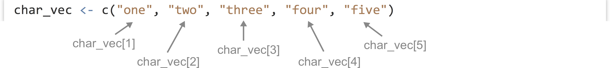
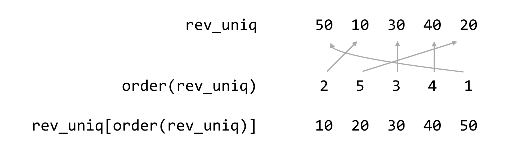

# Vectors

Vectors (similar to single-type arrays in other languages) are ordered collections of simple types, usually numerics, integers, characters, or logicals. We can create vectors using the `c()` function (for concatenate), which takes as parameters the elements to put into the vector:

<pre id=part3-03-concat
     class="language-r
            line-numbers
            linkable-line-numbers">
<code>
samples <- c(3.2, 4.7, -3.5)            # 3-element numeric vector
</code></pre>

The `c()` function can take other vectors as parameters, too--it will “deconstruct” all subvectors and return one large vector, rather than a vector of vectors.

<pre id=part3-03-c-deconstruct
     class="language-r
            line-numbers
            linkable-line-numbers">
<code>
samples2 <- c(20.4, 4.7, 37.6)          # 5-element numeric vector
print(samples2)                         # prints [1] 20.4, 3.2, 4.7, -3.5, 37.6
</code></pre>

We can extract individual elements from a vector using `[]` syntax; though note that, unlike many other languages,
the first element is at index 1.

<pre id=part3-03-bracket-index-single
     class="language-r
            line-numbers
            linkable-line-numbers">
<code>
second_sample <- samples2[2]            # numeric 3.2
</code></pre>

The `length()` function returns the number of elements of a vector (or similar types, like lists, which we’ll cover later) as an integer:

<pre id=part3-03-length-func
     class="language-r
            line-numbers
            linkable-line-numbers">
<code>
num_samples <- length(samples2)         # integer 5
</code></pre>

We can use this to extract the last element of a vector, for example.

<pre id=part3-03-length-get-last
     class="language-r
            line-numbers
            linkable-line-numbers">
<code>
last_sample <- samples2[num_samples]                # numeric 37.6
# OR
last_sample <- samples2[length(samples2)]        # numeric 37.6
</code></pre>

### No "Naked Data": Vectors Have (a) Class {-}

So far in our discussion of R’s data types, we’ve been making a simplification, or at least we’ve been leaving something out. Even individual values like the numeric `4.6` are actually vectors of length one. Which is to say, `gc_content <- 0.34` is equivalent to `gc_content <- c(0.34)`, and in both cases, `length(gc_content)` will return `1`, which itself is a vector of length one. This applies to numerics, integers, logicals, and character types. Thus, at least compared to other languages, R has no “naked data”; the vector is the most basic unit of data that R has. This is slightly more confusing for character types than others, as each individual element is a string of characters of any length (including potentially the “empty” string `""`).

  

This explains quite a lot about R, including some curiosities such as why `print(gc_content)` prints `[1] 0.34`. This output is indicating that `gc_content` is a vector, the first element of which is `0.34`. Consider the `seq()` function, which returns a vector of numerics; it takes three parameters:^[Most R functions take a large number of parameters, but many of them are optional. In the next chapter, we’ll see what such optional parameters look like, and how to get an extensive list of all the parameters that built-in R functions can take.] (1) the number at which to start, (2) the number at which to end, and (3) the step size.

<pre id=part3-03-seq-example
     class="language-r
            line-numbers
            linkable-line-numbers">
<code>
range <- seq(1, 20, 0.5)
print(range)
</code></pre>

When we print the result, we’ll get output like the following, where the list of numbers is formatted such that it spans the width of the output window.

<pre id=part3-03-seq-example-out
     class="language-txt
            line-numbers
            linkable-line-numbers
            no-whitespace-normalization">
<code> [1]  1.0  1.5  2.0  2.5  3.0  3.5  4.0  4.5  5.0  5.5  6.0  6.5  7.0  7.5  8.0
[16]  8.5  9.0  9.5 10.0 10.5 11.0 11.5 12.0 12.5 13.0 13.5 14.0 14.5 15.0 15.5
[31] 16.0 16.5 17.0 17.5 18.0 18.5 19.0 19.5 20.0
</code></pre>

The numbers in brackets indicate that the first element of the printed vector is `1.0`, the sixteenth element is `8.5`, and the thirty-first element is `16.0`.

By the way, to produce a sequence of integers (rather than numerics), the step-size argument can be left off, as in `seq(1, 20)`. This is equivalent to a commonly seen shorthand, `1:20`.

If all of our integers, logicals, and so on are actually vectors, and we can tell their type by running the `class()` function on them, then vectors must be the things that we are examining the class of. So, what if we attempt to mix types within a vector, for example, by including an integer with some logicals?

<pre id=part3-03-vec-class-mix1
     class="language-r
            line-numbers
            linkable-line-numbers">
<code>
mix <- c(TRUE, FALSE, as.integer(20))
</code></pre>

Running `print(class(mix))` will result in `"integer"`. In fact, if we attempt to print out mix with `print(mix)`, we’d find that the logicals have been converted into integers!

<pre id=part3-03-vec-class-mix1-out
     class="language-txt
            line-numbers
            linkable-line-numbers">
<code>
[1]  1  0 20
</code></pre>

R has chosen to convert `TRUE` into `1` and `FALSE` into `0`; these are standard binary values for true and false, whereas there is no standard logical value for a given integer. Similarly, if a numeric is added, everything is converted to numeric.

<pre id=part3-03-vec-class-mix2
     class="language-r
            line-numbers
            linkable-line-numbers">
<code>
mix <- c(TRUE, FALSE, as.integer(20), 3.5)
print(class(mix))                           # [1] "numeric"
print(mix)                                  # [1] 1.0 0.0 20.0 3.5
</code></pre>

And if a character string is added, everything is converted into a character string (with `3.5` becoming `"3.5"`, `TRUE` becoming `"TRUE"`, and so on).

<pre id=part3-03-vec-class-mix3
     class="language-r
            line-numbers
            linkable-line-numbers">
<code>
mix <- c(TRUE, FALSE, as.integer(20), 3.5, "A")
print(class(mix))                           # [1] "character"
print(mix)                                  # [1] "TRUE" "FALSE" "20" "3.5" "A"
</code></pre>

In summary, vectors are the most basic unit of data in R, and they cannot mix types—R will autoconvert any mixed types in a single vector to a “lowest common denominator,” in the order of logical (most specific), integer, numeric, character (most general). This can sometimes result in difficult-to-find bugs, particularly when reading data from a file. If a file has a column of what appears to be numbers, but a single element cannot be interpreted as a number, the entire vector may be converted to a character type with no warning as the file is read in. We’ll discuss reading data in from text files after examining vectors and their properties.

### Subsetting Vectors, Selective Replacement {-}

Consider the fact that we can use `[]` syntax to extract single elements from vectors:

<pre id=part3-03-selective-rep-indexing-single
     class="language-r
            line-numbers
            linkable-line-numbers">
<code>
numbers <- c(10, 20, 30, 40, 50)
second_el <- numbers[2]                     # 20
</code></pre>

Based on the above, we know that the `20` extracted is a vector of length one. The `2` used in the brackets is also a vector of length one; thus the line above is equivalent to `second_el <- nums[c(2)]`. Does this mean that we can use longer vectors for extracting elements? Yes!

<pre id=part3-03-selective-rep-indexing-multi
     class="language-r
            line-numbers
            linkable-line-numbers">
<code>
subvector <- numbers[c(3,2)]
print(subvector)                            # [1] 30 20
</code></pre>

In fact, the extracted elements were even placed in the resulting two-element vector in the order in which they were extracted (the third element followed by the second element). We can use a similar syntax to selectively replace elements by specific indices in vectors.

<pre id=part3-03-selective-rep-multi1
     class="language-r
            line-numbers
            linkable-line-numbers">
<code>
numbers[c(3,2)] <- c(35, 25)
print(numbers)                              # [1] 10 25 35 40 50
</code></pre>

*Selective replacement* is the process of replacing selected elements of a vector (or similar structure) by specifying which elements to replace with `[]` indexing syntax combined with assignment `<-`.^[The term “selective replacement” is not widely used outside of this book. In some situations, the term “conditional replacement” is used, but we wanted to define some concrete terminology to capture the entirety of the idea.]

R vectors (and many other data container types) can be named, that is, associated with a character vector of the same length. We can set and subsequently get this names vector using the `names()` function, but the syntax is a little odd.

<pre id=part3-03-named-vec1
     class="language-r
            line-numbers
            linkable-line-numbers">
<code>
# create vector
scores <- c(89, 94, 73)
# set names for the elements
names(scores) <- c("Student A", "Student B", "Student C")

print("Printing the vector:")
print(scores)

print("Printing the names:")
names_scores <- names(scores)
print(names_scores)
</code></pre>

Named vectors, when printed, display their names as well. The result from above:

<pre id=part3-03-named-vec1-out
     class="language-txt
            line-numbers
            linkable-line-numbers">
<code>
[1] "Printing the vector:"
Student A Student B Student C
       89        94        73
[1] "Printing the names:"
[1] "Student A" "Student B" "Student C"
</code></pre>

Named vectors may not seem that helpful now, but the concept will be quite useful later. Named vectors give us another way to subset and selectively replace in vectors: by name.

<pre id=part3-03-named-vec-selection
     class="language-r
            line-numbers
            linkable-line-numbers">
<code>
ca_scores <- scores[c("Student C", "Student A")]  # 2 element vector: 73 98
# OR
ca_names <- c("Student C", "Student A")
ca_scores <- scores[ca_names]

scores[c("Student A", "Student C")] <- c(93, 84)
print(scores)
</code></pre>

Although R doesn’t enforce it, the names should be unique to avoid confusion when selecting or selectively replacing this way. Having updated Student A’s and Student B’s score, the change is reflected in the output:

<pre id=part3-03-named-vec-selection-out
     class="language-txt
            line-numbers
            linkable-line-numbers">
<code>
Student A Student B Student C
       93        94        84
</code></pre>

There’s one final and extremely powerful way of subsetting and selectively replacing in a vector: by logical vector. By indexing with a vector of logicals of the same length as the vector to be indexed, we can extract only those elements where the logical vector has a `TRUE` value.

<pre id=part3-03-logical-selection
     class="language-r
            line-numbers
            linkable-line-numbers">
<code>
select_vec <- c(TRUE, FALSE, TRUE)
ac_scores <- scores[select_vec]                  # 2 element vector: 93 84
# OR
ac_scores <- scores[c(TRUE, FALSE, TRUE)]
</code></pre>

While indexing by index number and by name allows us to extract elements in any given order, indexing by logical doesn’t afford us this possibility.

We can perform selective replacement this way as well; let’s suppose Students A and C retake their quizzes and moderately improve their scores.

<pre id=part3-03-logical-replacement
     class="language-r
            line-numbers
            linkable-line-numbers">
<code>
scores[c(TRUE, FALSE, TRUE)] <- c(94, 86)
print(scores)
</code></pre>

And the printed output:

<pre id=part3-03-logical-replacement-out
     class="language-txt
            line-numbers
            linkable-line-numbers">
<code>
Student A Student B Student C
       94        94        86
</code></pre>

In this case, the length of the replacement vector (`c(159, 169)`) is equal to the number of `TRUE` values in the indexing vector (`c(TRUE, FALSE, TRUE)`); we’ll explore whether this is a requirement below.

In summary, we have three important ways of indexing into/selecting from/selectively replacing in vectors:

1. by index number vector,
2. by character vector (if the vector is named), and
3. by logical vector.

### Vectorized Operations, `NA` Values {-}

If vectors are the most basic unit of data in R, all of the functions and operators we’ve been working with—`as.numeric()`, `*`, and even comparisons like `>`—implicitly work over entire vectors.

<pre id=part3-03-as-numeric-vectorized
     class="language-r
            line-numbers
            linkable-line-numbers">
<code>
numeric_chars <- c("6", "3.7", "9b3x")
numerics <- as.numeric(numeric_chars)
print(numerics)                                 # [1] 6.0 3.7 NA
</code></pre>

In this example, each element of the character vector has been converted, so that `class(numerics)` would return `"numeric"`. The final character string, `"9b3x"`, cannot be reasonably converted to a numeric type, and so it has been replaced by `NA`. When this happens, the interpreter produces a warning message: `NAs introduced by coercion`.

`NA` is a special value in R that indicates either missing data or a failed computation of some type (as in attempting to convert `"9b3x"` to a numeric). Most operations involving `NA` values return `NA` values; for example, `NA + 3` returns `NA`, and many functions that operate on entire vectors return an `NA` if any element is `NA`. A canonical example is the `mean()` function.

<pre id=part3-03-mean-na-example
     class="language-r
            line-numbers
            linkable-line-numbers">
<code>
ave <- mean(numerics)
print(ave)                                      # [1] NA
</code></pre>

Such functions often include an optional parameter that we can give, `na.rm = TRUE`, specifying that `NA` values should be removed before the function is run.

<pre id=part3-03-mean-na-example-narm-true
     class="language-r
            line-numbers
            linkable-line-numbers">
<code>
ave <- mean(numerics, na.rm = TRUE)
print(ave)                                      # [1] 4.85
</code></pre>

While this is convenient, there is a way for us to remove `NA` values from any vector (see below).

Other special values in R include `NaN`, for “Not a Number,” returned by calculations such as the square root of -1, `sqrt(-1)`, and `Inf` for “Infinity,” returned by calculations such as `1/0`. (`Inf/Inf`, by the way, returns `NaN`.)

Returning to the concept of vectorized operations, simple arithmetic operations such as `+`, `*`, `/`, `-`, `^` (exponent), and `%%` ([modulus](linky)) are vectorized as well, meaning that an expression like `3 * 7` is equivalent to `c(3)` * `c(7)`. When the vectors are longer than a single element, the operation is done on an element-by-element basis.

<pre id=part3-03-vectorized-mult-ex
     class="language-r
            line-numbers
            linkable-line-numbers">
<code>
values <- c(10, 20, 30, 40)
mult <- c(1, 2, 3, 4)

result <- values * mult                # 4 element vector: 10 40 90 160
</code></pre>

  

If we consider the `*` operator, it takes two inputs (numeric or integer) and returns an output (numeric or integer) for each pair from the vectors. This is quite similar to the comparison `>`, which takes two inputs (numeric or integer or character) and returns a logical.

<pre id=part3-03-vectorized-gt-ex
     class="language-r
            line-numbers
            linkable-line-numbers">
<code>
values <- c(10, 20, 30, 40)
comparison_values <- c(25, 10, 25, 35)

result <- values > comparison_values   # 4 element vector: FALSE TRUE TRUE TRUE
</code></pre>

### Vector Recycling {-}

###### {- #vector_recycling}
What happens if we try to multiply two vectors that aren’t the same length? It turns out that the shorter of the two will be reused as needed, in a process known as *vector recycling*, or the reuse of the shorter vector in a vectorized operation.

<pre id=part3-03-vector-recyc-1
     class="language-r
            line-numbers
            linkable-line-numbers">
<code>
values <- c(10, 20, 30, 40)
mult <- c(10, -10)

result <- values * mult                # 4 element vector: 100 -200 300 -400
</code></pre>

This works well when working with vectors of length one against longer vectors, because the length-one vector will be recycled as needed.

<pre id=part3-03-vector-recyc-2
     class="language-r
            line-numbers
            linkable-line-numbers">
<code>
result <- values * 2                   # same as values * c(2)
print(result)                          # [1] 20 40 60 80
</code></pre>

If the length of the longer vector is not a multiple of the length of the shorter, however, the last recycle will go only partway through.

<pre id=part3-03-vector-recyc-3
     class="language-r
            line-numbers
            linkable-line-numbers">
<code>
values <- c(3, 5, 7)
mult <- c(10, -10)

result <- values * mult                # 3 element vector: 30 -50 70
</code></pre>

When this happens, the interpreter prints a warning: `longer object length is not a multiple of shorter object length`. There are few situations where this type of partial recycling is not an accident, and it should be avoided.

Vector recycling also applies to [selective replacement](); for example, we can selectively replace four elements of a vector with elements from a two-element vector:

<pre id=part3-03-vector-recyc-4
     class="language-r
            line-numbers
            linkable-line-numbers">
<code>
values <- c(10, 20, 30, 40, 50, 60)
values[c(TRUE, TRUE, FALSE, TRUE, FALSE, TRUE)] <- c(5, -5)

print(values)                          # [1] 5 -5 30 5 50 -5
</code></pre>

More often we’ll selectively replace elements of a vector with a length-one vector.

<pre id=part3-03-vector-recyc-5
     class="language-r
            line-numbers
            linkable-line-numbers">
<code>
values <- c(10, 20, 30, 40, 50, 60)
values[c(TRUE, TRUE, FALSE, TRUE, FALSE, TRUE)] <- 0 # same as ... <- c(0)

print(values)                          # [1] 0 0 30 0 50 0
</code></pre>

These concepts, when combined with vector indexing of various kinds, are quite powerful. Consider that an expression like `values > 35` is itself vectorized, with the shorter vector (holding just `35`) being recycled such that what is returned is a logical vector with `TRUE` values where the elements of values are greater than `35`. We could use this vector as an indexing vector for selective replacement if we wish.

<pre id=part3-03-vector-recyc-replacement
     class="language-r
            line-numbers
            linkable-line-numbers">
<code>
values <- c(10, 20, 30, 40, 50, 60)
select_vec <- values > 35              # TRUE TRUE TRUE FALSE FALSE FALSE
values[select_vec] <- 0

print(values)                          # [1] 10 20 30 0 0 0
</code></pre>

More succinctly, rather than create a temporary variable for `select_vec`, we can place the expression `values > 35` directly within the brackets.

<pre id=part3-03-vector-recyc-replacement-2
     class="language-r
            line-numbers
            linkable-line-numbers">
<code>
values <- c(10, 20, 30, 40, 50, 60)
values[values > 35] <- 0

print(values)                          # [1] 10 20 30 0 0 0
</code></pre>

Similarly, we could use the result of something like `mean(values)` to replace all elements of a vector greater than the mean with `0` easily, no matter the order of the elements!

<pre id=part3-03-vector-recyc-replacement-3
     class="language-r
            line-numbers
            linkable-line-numbers">
<code>
values <- c(30, 10, 60, 20, 40, 50)
values[values > mean(values)] <- 0

print(values)                          # [1] 30 10 0 20 0 0
</code></pre>

More often, we’ll want to extract such values using logical selection.

<pre id=part3-03-vector-recyc-extraction-mean
     class="language-r
            line-numbers
            linkable-line-numbers">
<code>
values <- c(30, 10, 60, 20, 40, 50)
gt_mean <- values[values > mean(values)]

print(gt_mean)                         # [1] 60 40 50
</code></pre>

These sorts of vectorized selections, especially when combined with logical vectors, are a powerful and important part of R, so study them until you are confident with the technique.

#### Exercises {-}

<!-- weird, something about bookdown or knitr doesn't like `r` as a variable name in inline code e.g. `rels <- seq(1, 30, 0.3)` 
hell I can't even put it in a comment (that should be just r int he e.g.) -->
 
1. Suppose we have `els` as a range of numbers from 1 to 30 in steps of 0.3; `els <- seq(1, 30, 0.3)`. Using just the `as.integer()` function, logical indexing, and comparisons like `>`, generate a sequence `els_decimals` that contains all values of `els` that are not round integers. (That is, it should contain all values of `els` except `1.0`, `2.0`, `3.0`, and so on. There should be 297 of them.)

2. We briefly mentioned the `%%`, or “modulus,” operator, which returns the remainder of a number after integer division (e.g., `4 %% 3 == 1` and `4 %% 4 == 0`; it is also vectorized). Given any vector `els`, for example `els <- seq(1, 30, 0.3)`, produce a vector `els_every_other` that contains every other element of `els`. You will likely want to use `%%`, the `==` equality comparison, and you might also want to use `seq()` to generate a vector of indices of the same length as `els`. Do the same again, but modify the code to extract every third element of `els` into a vector called `els_every_third`.

3. From chapter 27, “[Variables and Data](),” we know that comparisons like `==`, `!=`, `>=` are available as well. Further, we know that `!` negates the values of a logical vector, while `&` combines two logical vectors with “and,” and `|` combines two logical vectors with “or.” Use these, along with the `%%` operator discussed above, to produce a vector `div_3_4` of all integers between `1` and `1,000` (inclusive) that are evenly divisible by `3` and evenly divisible by `4`. (There are 83 of them.) Create another, `not_div_5_6`, of numbers that are not evenly divisible by `5` or `6`. (There are 667 of them. For example, `1,000` should not be included because it is divisible by `5`, and `18` should not be included because it is divisible by `6`, but `34` should be because it is divisible by neither.)

### Common Vector Functions {-}

As vectors (specifically numeric vectors) are so ubiquitous, R has dozens (hundreds, actually) of functions that do useful things with them. While we can’t cover all of them, we can quickly cover a few that will be important in future chapters.

First, we’ve already seen the `seq()` and `length()` functions; the former generates a numeric vector comprising a sequence of numbers, and the latter returns the length of a vector as a single-element integer vector.

<pre id=part3-03-range-func
     class="language-r
            line-numbers
            linkable-line-numbers">
<code>
range <- seq(0, 7, 0.2)                # 0.0 0.2 0.4 ... 7.0
len_range <- length(range)             # 36
</code></pre>

Presented without an example, `mean()`, `sd()`, and `median()` return the mean, standard deviation, and median of a numeric vector, respectively. (Provided that none of the input elements are `NA`, though all three accept the `na.rm = TRUE` parameter.) Generalizing `median()`, the `quantile()` function returns the Yth percentile of a function, or multiple percentiles if the second argument has more than one element.

<pre id=part3-03-quantile-func
     class="language-r
            line-numbers
            linkable-line-numbers">
<code>
quantiles_range <- quantile(range, c(0.25, 0.5, 0.75))
print(quantiles_range)
 25%  50%  75%
1.75 3.50 5.25
</code></pre>

The output is a named numeric vector:

<pre id=part3-03-quantile-func-out
     class="language-txt
            line-numbers
            linkable-line-numbers">
<code>
 25%  50%  75%
1.75 3.50 5.25
</code></pre>

The `unique()` function removes duplicates in a vector, leaving the remaining elements in order of their first occurrence, and the `rev()` function reverses a vector.

<pre id=part3-03-unique-rev-funcs
     class="language-r
            line-numbers
            linkable-line-numbers">
<code>
values <- c(20, 40, 30, 20, 10, 50, 10)
values_uniq <- unique(values)         # 20 40 30 10 50

rev_uniq <- rev(values_uniq)          # 50 10 30 40 20
</code></pre>

There is the `sort()` function, which sorts a vector (in natural order for numerics and integers, and [lexicographic (dictionary) order]() for character vectors). Perhaps more interesting is the `order()` function, which returns an integer vector of indices describing where the original elements of the vector would need to be placed to produce a sorted order.

<pre id=part3-03-order-func
     class="language-r
            line-numbers
            linkable-line-numbers">
<code>
order_rev_uniq <- order(rev_uniq)     # 2 5 3 4 1
</code></pre>

In this example, the order vector, `2 5 3 4 1`, indicates that the second element of `rev_uniq` would come first, followed by the fifth, and so on. Thus we could produce a sorted version of `rev_uniq` with `rev_uniq[order_rev_uniq]` (by virtue of vectors’ index-based selection), or more succinctly with `rev_uniq[order(rev_uniq)]`.

  

Importantly, this allows us to rearrange multiple vectors with a common order determined by a single one. For example, given two vectors, `id` and `score`, which are related element-wise, we might decide to rearrange both sets in alphabetical order for `id`.

<pre id=part3-03-order-func-example
     class="language-r
            line-numbers
            linkable-line-numbers">
<code>
id <- c("cc4", "aa6", "bb3")
score <- c(20.05, 35.62, 42.71)

id_sorted <- id[order(id)]
score_sorted <- score[order(id)]

print(id_sorted)                     # [1] "aa6" "bb3" "cc4"
print(score_sorted)                  # [1] 35.62 42.71 20.05
values <- c(5, 10, 15, 20, 25, 30)
</code></pre>

The `sample()` function returns a random sampling from a vector of a given size, either with replacement or without as specified with the `replace =` parameter (`FALSE` is the default if unspecified).

<pre id=part3-03-sample-func
     class="language-r
            line-numbers
            linkable-line-numbers">
<code>
values <- c(5, 10, 15, 20, 25, 30)

sample_1 <- sample(values, 3, replace = FALSE)        # 15 5 30
sample_2 <- sample(values, 3, replace = TRUE)         # 15 30 15
</code></pre>

The `rep()` function repeats a vector to produce a longer vector. We can repeat in an element-by-element fashion, or over the whole vector, depending on whether the `each =` parameter is used or not.

<pre id=part3-03-rep-func
     class="language-r
            line-numbers
            linkable-line-numbers">
<code>
count <- c(1, 2)

count_rep1 <- rep(count, 3)                           # 1 2 1 2 1 2
count_rep2 <- rep(count, each = 3)                    # 1 1 1 2 2 2
</code></pre>

Last (but not least) for this discussion is the `is.na()` function: given a vector with elements that are possibly `NA` values, it returns a logical vector whole elements are `TRUE` in indices where the original was `NA`, allowing us to easily indicate which elements of vectors are `NA` and remove them.

<pre id=part3-03-isna-func
     class="language-r
            line-numbers
            linkable-line-numbers">
<code>
values_char <- c("5.7", "4.3", "a9b3", "2.4")
values <- as.numeric(values_char)                     # 5.7 4.3 NA 2.4

values_na <- is.na(values)                            # FALSE FALSE TRUE FALSE

values_no_nas <- values[!values_na]                   # 5.7 4.3 2.4
# OR
values_no_nas <- values[!is.na(values_na)]            # 5.7 4.3 2.4
</code></pre>

Notice the use of the exclamation point in the above to negate the logical vector returned by `is.na()`.

### Generating Random Data {-}

R excels at working with probability distributions, including generating random samples from them. Many distributions are supported, including the Normal (Gaussian), Log-Normal, Exponential, Gamma, Student’s t, and so on. Here we’ll just look at generating samples from a few for use in future examples.

First, the `rnorm()` function generates a numeric vector of a given length sampled from the Normal distribution with specified mean (with `mean =`) and standard deviation (with `sd =`).

<pre id=part3-03-rnorm-func
     class="language-r
            line-numbers
            linkable-line-numbers">
<code>
sample_norm <- rnorm(5, mean = 6, sd = 2)     # e.g. 7.07 2.4 4.5 6.2 5.1
</code></pre>

Similarly, the `runif()` function samples from a uniform distribution limited by a minimum and maximum value.

<pre id=part3-03-runif-func
     class="language-r
            line-numbers
            linkable-line-numbers">
<code>
sample_unif <- runif(5, min = 2, max = 6)     # e.g. 2.1 4.06 2.48 4.67 5.80
</code></pre>

The `rexp()` generates data from an Exponential distribution with a given “rate” parameter, controlling the rate of decay of the density function (the mean of large samples will approach `1.0/rate`).

<pre id=part3-03-rexp-func
     class="language-r
            line-numbers
            linkable-line-numbers">
<code>
sample_exp <- rexp(5, rate = 1.5)             # e.g. 0.24 0.50 0.01 0.55 0.30
</code></pre>

  

R includes a large number of statistical tests, though we won’t be covering much in the way of statistics other than a few driving examples. The `t.test()` function runs a two-sided student’s t-test comparing the means of two vectors. What is returned is a more complex data type with class `"htest"`.

<pre id=part3-03-ttest-func
     class="language-r
            line-numbers
            linkable-line-numbers">
<code>
sample_1 <- rnorm(100, mean = 10, sd = 4)
sample_2 <- rnorm(100, mean = 12, sd = 4)

ttest_result <- t.test(sample_1, sample_2)
print(class(ttest_result))                    # [1] "htest"
print(ttest_result)
</code></pre>

When printed, this complex data type formats itself into nice, human-readable output:

<pre id=part3-03-ttest-func-out
     class="language-txt
            line-numbers
            linkable-line-numbers">
<code>
Welch Two Sample t-test

data:  sample_1 and sample_2
t = -2.6847, df = 193.503, p-value = 0.007889
alternative hypothesis: true difference in means is not equal to 0
95 percent confidence interval:
 -2.690577 -0.411598
sample estimates:
mean of x mean of y
 10.03711  11.58819
</code></pre>

### Reading and Writing Tabular Data, Wrapping Long Lines {-}

Before we go much further, we’re going to want to be able to import data into our R programs from external files (which we’ll assume to be rows and columns of data in text files). We’ll do this with `read.table()`, and the result will be a type of data known as a “data frame” (or `data.frame` in code). We’ll cover the nuances of data frames later, but note for now that they can be thought of as a collection of vectors (of equal length), one for each column in the table.

As an example, let’s suppose we have a tab-separated text file in our present working directory called `states.txt`.^[When running on the command line, the present working directory is inherited from the shell. In RStudio, the present working directory is set to the “project” directory if the file is part of a project folder. In either case, it is possible to change the working directory from within R using the `setwd()` function, as in `setwd("/home/username/rproject")` in Unix/Linux and `setwd("C:/Documents and Settings/username/My Documents/rproject")` in Windows. It is also possible to specify file names by absolute path, as in `/home/username/rproject/states.txt`, no matter the present working directory.] Each row represents one of the US states along with information on population, per capita income, illiteracy rate, murder rate (per 100,000), percentage of high school graduates, and region (all measured in the 1970s). The first row contains a “header” line with column names.

<pre id=part3-03-states-txt-example
     class="language-txt
            line-numbers
            linkable-line-numbers">
<code>
name    population      income  murder  hs_grad region
Alabama 3615    3624    15.1    41.3    South
Alaska  365     6315    11.3    66.7    West
Arizona 2212    4530    7.8     58.1    West
Arkansas        2110    3378    10.1    39.9    South
California      21198   5114    10.3    62.6    West
Colorado        2541    4884    6.8     63.9    West
...
</code></pre>

Later in the file, someone has decided to annotate Michigan’s line, indicating it as the “mitten” state:

<pre id=part3-03-states-txt-example-comment
     class="language-txt
            line-numbers
            linkable-line-numbers">
<code>
...
Massachusetts   5814    4755    3.3     58.5    Northeast
Michigan        9111    4751    11.1    52.8    North Central   # mitten
Minnesota       3921    4675    2.3     57.6    North Central
...
</code></pre>

Like most functions, `read.table()` takes many potential parameters (23, in fact), but most of them have reasonable defaults. Still, there are five or so that we will commonly need to set. Because of the need to set so many parameters, using `read.table()` often results in a long line of code. Fortunately, the R interpreter allows us to break long lines over multiple lines, so long as each line ends on a character that doesn’t complete the expression (so the interpreter knows it needs to keep reading following lines before executing them). Common character choices are the comma and plus sign. When we do wrap a long line in this way, it’s customary to indent the following lines to indicate their continuance in a visual way.

<pre id=part3-03-read-table-func
     class="language-r
            line-numbers
            linkable-line-numbers">
<code>
states <- read.table(file = "states.txt",
                     header = TRUE,
                     sep = "\t",
                     stringsAsFactors = FALSE,
                     comment.char = "#")
</code></pre>

When reading states.txt, the `file =` parameter specifies the file name to be read, while `header = TRUE` indicates to the interpreter that the first line in the file gives the column names (without it, the column names will be `"V1"`, `"V2"`, `"V3"` and so on). The `sep = "\t"` parameter indicates that tab characters are used to separate the columns in the file (the default is any whitespace), and `comment.char = "#"` indicates that `#` characters and anything after them should be ignored while reading the file (which is appropriate, as evident by the `# mitten` annotation in the file). The `stringsAsFactors = FALSE` parameter is more cryptic: it tells the interpreter to leave the character-vector columns (like `region` in this example) as character vectors, rather than convert them to the more sophisticated factor data type (to be covered in later chapters).

At this point, the `states` variable contains the data frame holding the columns (vectors) of data. We can print it with `print(states)`, but the result is quite a lot of output:

<pre id=part3-03-print-states-out
     class="language-txt
            line-numbers
            linkable-line-numbers">
<code>
             name population income murder hs_grad        region
1         Alabama       3615   3624   15.1    41.3         South
2          Alaska        365   6315   11.3    66.7          West
3         Arizona       2212   4530    7.8    58.1          West
4        Arkansas       2110   3378   10.1    39.9         South
5      California      21198   5114   10.3    62.6          West
6        Colorado       2541   4884    6.8    63.9          West
...
</code></pre>

It might make better sense to extract just the first 10 rows of data and print them, which we can do with the `head()` function (`head()` can also extract just the first few elements of a long vector).

<pre id=part3-03-states-head
     class="language-r
            line-numbers
            linkable-line-numbers">
<code>
first_10 <- head(states, n = 10)

print(first_10)
# OR
print(head(states, n = 10))
</code></pre>

The functions `nrow()` and `ncol()` return the number of rows and columns of a data frame, respectively (which is preferred over `length()`, which returns the number of columns); the `dim()` function returns a two-element vector with number of rows (at index 1) and number of columns (at index 2).

As mentioned previously, individual columns of a data frame are (almost always) vectors. To access one of these individual vectors, we can use a special `$` syntax, with the column name following the `$`.

<pre id=part3-03-states-dollar-syntax
     class="language-r
            line-numbers
            linkable-line-numbers">
<code>
incomes <- states$"income"
print(incomes)                    # [1] 3624 6315 4530 3378 5114 4884 ...
</code></pre>

So long as the column name is sufficiently simple (in particular, so long as it doesn’t have any spaces), then the quote marks around the column name can be (and often are) omitted.

<pre id=part3-03-states-dollar-syntax-noquotes
     class="language-r
            line-numbers
            linkable-line-numbers">
<code>
incomes <- states$income
print(incomes)                    # [1] 3624 6315 4530 3378 5114 4884 ...
</code></pre>

Although this syntax can be used to extract a column from a data frame as a vector, note that it refers to the vector within the data frame as well. In a sense, `states$income` *is* the vector stored in the `states` data frame. Thus we can use techniques like [selective replacement]() to work with them just like any other vectors. Here, we’ll replace all instances of “North Central” in the `states$region` vector with just the term “Central,” effectively renaming the region.^[If you have any familiarity with R, you might have run across the `attach()` function, which takes a data frame and results in the creation of a separate vector for each column. Generally, “disassembling” a data frame this way is a bad idea—after all, the columns of a data frame are usually associated with each other for a reason! Further, this function results in the creation of many variables with names based on the column names of the data frame. Because these names aren’t clearly delimited in the code, it’s easy to create hard-to-find bugs and mix up columns from multiple data frames this way.] 

<pre id=part3-03-states-rename-region
     class="language-r
            line-numbers
            linkable-line-numbers">
<code>
nrth_cntrl_logical <- states$region == "North Central"  # Logical vector
states$region[nrth_cntrl_logical] <- "Central"          # Selective replacement
# OR
states$region[states$region == "North Central"] <- "Central"
</code></pre>

Writing a data frame to a tab-separated file is accomplished with the `write.table()` function.^[There are also more specialized functions for both reading and writing tabular data, such as `read.csv()` and `write.csv()`. We’ve focused on `read.table()` and `write.table()` because they are flexible enough to read and write tables in a variety of formats, including comma separated, tab separated, and so on.] As with `read.table()`, `write.table()` can take quite a few parameters, most of which have reasonable defaults. But there are six or so we’ll want to set more often than others. Let’s write the modified `states` data frame to a file called `states_modified.txt` as a tab-separated file.

<pre id=part3-03-write-table
     class="language-r
            line-numbers
            linkable-line-numbers">
<code>
write.table(states,
            file = "states_modified.txt",
            quote = FALSE,
            sep = "\t",
            row.names = FALSE,
            col.names = TRUE)
</code></pre>

The first two parameters here are the data frame to write and the file name to write to. The `quote = FALSE` parameter specifies that quotation marks shouldn’t be written around character types in the output (so the `name` column will have entries like `Alabama` and `Alaska` rather than `"Alabama"` and `"Alaska"`). The `sep = "\t"` indicates that tabs should separate the columns, while `row.names = FALSE` indicates that row names should not be written (because they don’t contain any meaningful information for this data frame), and `col.names = TRUE` indicates that we do want the column names output to the first line of the file as a “header” line.

#### R and the Unix/Linux Command Line {-}

In chapter 26, “[An Introduction](),” we mentioned that R scripts can be run from the command line by using the `#!/usr/bin/env Rscript` executable environment. (Older versions of R required the user to run a command like `R CMD BATCH scriptname.R`, but today using `Rscript` is preferred.) We devoted more discussion to interfacing Python with the command line environment than we will R, partially because R isn’t as frequently used that way, but also because it’s quite easy.

When using `read.table()`, for example, data can be read from standard input by using the file name `"stdin"`. Anything that is printed from an R script goes to standard output by default. Because R does a fair amount of formatting when printing, however, it is often more convenient to print data frames using `write.table()` specifying `file = ""`.

Finally, to get command line parameters into an R script as a character vector, the line `args <- commandArgs(trailingOnly = TRUE)` will do the trick. Here’s a simple script that will read a table on standard input, write it to standard output, and also read and print out any command line arguments:

<pre id=part3-03-rscript-example
     class="language-r
            line-numbers
            linkable-line-numbers">
<code>
#!/usr/bin/env Rscript

# read args from command-line params
args <- commandArgs(trailingOnly = TRUE)
print(args)

# read data frame from stdin
input_df <- read.table("stdin", 
                       header = FALSE, 
                       stringsAsFactors = FALSE)
# write data frame to stdout
write.table(input_df,
            file = "", 
            row.names = FALSE, 
            col.names = FALSE,
            sep = "\t")
</code></pre>

Try making this script executable on the command line, and running it on `p450s_blastp_yeast_top1.txt` with something like `cat p450s_blastp_yeast_top1.txt | ./stdin_stdout_ex.R arg1 'arg 2'`.

#### Exercises {-}

1. Suppose we have any odd-length numeric vector (e.g., `sample<- c(3.2, 5.1, 2.5, 1.6, 7.9)` or `sample <- runif(25, min = 0, max = 1))`. Write some lines of code that result in printing the median of the vector, without using the `median()` or `quantile()` functions. You might find the `length()` and `as.integer()` functions to be helpful.

2. If `sample` is a sample from an exponential distribution, for example, `sample <- rexp(1000, rate = 1.5)`, then the median of the sample is generally smaller than the mean. Generate a vector, `between_median_mean`, that contains all values of `sample` that are larger than (or equal to) the median of the sample, and less than (or equal to) the mean of the sample.

3. Read in the [`states.txt`]() file into a data frame as described. Extract a numeric vector called `murder_lowincome` containing murder rates for just those states with per capita incomes less than the median per capita income (you can use the `median()` function this time). Similarly, extract a vector called `murder_highincome` containing murder rates for just those states with greater than (or equal to) the median per capita income. Run a two-sample `t.test()` to determine whether the mean murder rates are different between these two groups.

4. Let `states` be the state information data frame described above. Describe what the various operations below do in terms of indexing, selective replacement, vector recycling, and the types of data involved (e.g., numeric vectors and logical vectors). To get you started, the first line adds a new column to the `states` data frame called `"newpop"` that contains the same information as the `"population"` column. 

   <pre id=part3-03-describe-ops-exercise
        class="language-r 
               line-numbers 
               linkable-line-numbers">
    <code>
states$newpop <- states$population
highmurder <- states$murder >= median(states$murder)
states$newpop[highmurder] <- states$population[highmurder] * 0.9
states$newpop[!highmurder] <- states$population[!highmurder] * 1.1
    </code></pre>

5. Determine the number of unique regions that are listed in the `states` data frame. Determine the number of unique regions represented by states with greater than the median income.

6. What does the `sum()` function report for a numeric vector `c(2, 3, 0, 1, 0, 2)`? How about for `c(1, 0, 0, 1, 1, 0)`? And, finally, how about for the logical vector `c(TRUE, FALSE, FALSE, TRUE, TRUE, FALSE)`? How could the `sum()` function thus be useful in a logical context?

