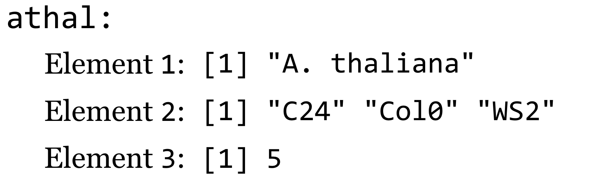
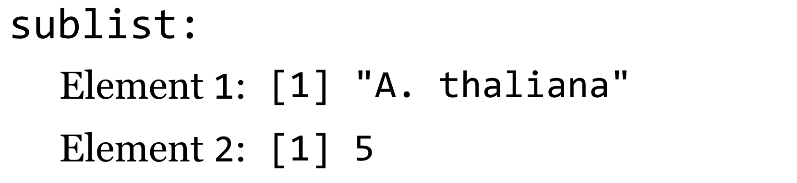

# Lists and Attributes

The next important data type in our journey through R is the list. Lists are quite similar to vectors—they are ordered collections of data, indexable by index number, logical vector, and name (if the list is named). Lists, however, can hold multiple different types of data (including other lists). Suppose we had three different vectors representing some information about the plant *Arabidopsis thaliana*.

<pre id=part3-05-athal-data
     class="language-r
            line-numbers
            linkable-line-numbers">
<code>
organism <- "A. thaliana"
ecotypes <- c("C24", "Col0", "WS2")
num_chromosomes <- 5
</code></pre>

We can then use the `list()` function to gather these vectors together into a single unit with class `"list"`.

<pre id=part3-05-athal-list-def-1
     class="language-r
            line-numbers
            linkable-line-numbers">
<code>
athal <- list(organism, ecotypes, num_chromosomes)
print(class(athal))                                  # [1] "list"
</code></pre>

Graphically, we might represent this list like so:

  

Here, the `[1]` syntax is indicating that the elements of the list are vectors (as in when vectors are printed). Like vectors, lists can be indexed by index vector and logical vector.

<pre id=part3-05-sublist-extract-1
     class="language-r
            line-numbers
            linkable-line-numbers">
<code>
sublist <- athal[c(1,3)]
sublist <- athal[c(TRUE, FALSE, TRUE)]
</code></pre>

Both of the above assign to the variable sublist a list looking like:

  

This seems straightforward enough: subsetting a list with an indexing vector returns a smaller list with the requested elements. But this rule can be deceiving if we forget that a vector is the most basic element of data. Because `2` is the length-one vector `c(2)`, `athal[2]` returns not the second element of the `athal` list, but rather a length-one list with a single element (the vector of ecotypes).

<pre id=part3-05-sublist-extract-2
     class="language-r
            line-numbers
            linkable-line-numbers">
<code>
eco_list <- athal[2]
print(class(eco_list))                               # [1] "list"
print(length(eco_list))                              # [1] 1 
</code></pre>

A graphical representation of this list:

  

We will thus need a different syntax if we wish to extract an individual element from a list. This alternate syntax is `athal[[2]]`.

<pre id=part3-05-sublist-extract-3
     class="language-r
            line-numbers
            linkable-line-numbers">
<code>
ecotypes <- athal[[2]]
print(class(ecotypes))                               # [1] "character"
print(ecotypes)                                      # [1] "C24" "Col0" "Ws2"
</code></pre>

If we wanted to extract the second ecotype directly, we would need to use the relatively clunky `second_ecotype <- athal[[2]][2]`, which accesses the second element of the vector (accessed by `[2]`) inside of the of the second element of the list (accessed by `[[2]]`).

<pre id=part3-05-list-print
     class="language-r
            line-numbers
            linkable-line-numbers">
<code>
print(athal)
</code></pre>

When we print a list, this structure and the double-bracket syntax is reflected in the output.

<pre id=part3-05-list-print-out
     class="language-txt
            line-numbers
            linkable-line-numbers">
<code>
[[1]]
[1] "A. thaliana"

[[2]]
[1] "C24"  "Col0" "WS2" 

[[3]]
[1] 5
</code></pre>

### Named Lists, Lists within Lists {-}

Like vectors, lists can be named—associated with a character vector of equal length—using the `names()` function. We can use an index vector of names to extract a sublist, and we can use `[[]]` syntax to extract individual elements by name.

<pre id=part3-05-list-names-1
     class="language-r
            line-numbers
            linkable-line-numbers">
<code>
names(athal) <- c("Species", "Ecotypes", "# Chromosomes")
sublist <- athal[c("Species", "# Chromosomes")]      # list of length two

ecotypes <- athal[["Ecotypes"]]                      # ecotypes vector
</code></pre>

We can even extract elements from a list if the name of the element we want is stored in another variable, using the `[[]]` syntax.

<pre id=part3-05-list-names-2
     class="language-r
            line-numbers
            linkable-line-numbers">
<code>
extract_name <- "Ecotypes"
ecotypes <- athal[[extract_name]]                    # ecotypes vector
</code></pre>

As fun as this double-bracket syntax is, because extracting elements from a list by name is a common operation, there is a shortcut using `$` syntax.

<pre id=part3-05-list-names-dollar
     class="language-r
            line-numbers
            linkable-line-numbers">
<code>
ecotypes <- athal[["Ecotypes"]]
# same as
ecotypes <- athal$"Ecotypes"
</code></pre>

In fact, if the name doesn’t contain any special characters (spaces, etc.), then the quotation marks can be left off.

<pre id=part3-05-list-names-dollar-noquotes
     class="language-r
            line-numbers
            linkable-line-numbers">
<code>
ecotypes <- athal$Ecotypes
</code></pre>

This shortcut is widely used and convenient, but, because the quotes are implied, we can’t use `$` syntax to extract an element by name if that name is stored in an intermediary variable. For example, if `extract_name <- "ecotypes"`, then `athal$extract_name` will expand to `athal[["extract_name"]]`, and we won’t get the ecotypes vector. This common error reflects a misunderstanding of the [syntactic sugar]() employed by R. Similarly, the `$` syntax won’t work for names like `"# Chromosomes"` because that name contains a space and a special character (for this reason, names of list elements are often simplified).

Frequently, `$` syntax is combined with vector syntax if the element of the list being referred to is a vector. For example, we can directly extract the third ecotype, or set the third ecotype.

<pre id=part3-05-list-names-dollar-vector
     class="language-r
            line-numbers
            linkable-line-numbers">
<code>
third_ecotype <- athal$Ecotypes[3]
athal$Ecotypes[3] <- "WS2b"
</code></pre>

Continuing with this example, let’s suppose we have another list that describes information about each chromosome. We can start with an empty list, and assign elements to it by name.

<pre id=part3-05-list-assign-to-empty
     class="language-r
            line-numbers
            linkable-line-numbers">
<code>
chrs <- list()
chrs$Lengths <- c(34.9, 22.0, 25.4, 20.8, 31.2)
chrs$GeneCounts <- c(7078, 4245, 5437, 4124, 6318)
</code></pre>

This list of two elements relates to *A. thaliana*, so it makes sense to include it somehow in the `athal` list. Fortunately, lists can contain other lists, so we’ll assign this `chrs` list as element of the `athal` list.

<pre id=part3-05-list-assign-sublist
     class="language-r
            line-numbers
            linkable-line-numbers">
<code>
athal$ChrInfo <- chrs
</code></pre>

Lists are an excellent container for general collections of heterogeneous data in a single organized “object.” (These differ from Python [objects]() in that they don’t have methods stored in them as well, but we’ll see how R works with methods in later chapters.) If we ran `print(athal)` at this point, all this information would be printed, but unfortunately in a fairly unfriendly manner:

<pre id=part3-05-list-complex-print-out
     class="language-txt
            line-numbers
            linkable-line-numbers">
<code>
$Species
[1] "A. thaliana"

$Ecotypes
[1] "C24"  "Col0" "WS2b"

$`# Chromosomes`
[1] 5

$ChrInfo
$ChrInfo$Lengths
[1] 34.9 22.0 25.4 20.8 31.2

$ChrInfo$GeneCounts
[1] 7078 4245 5437 4124 6318
</code></pre>

This output does illustrate something of interest, however. We can chain the `$` syntax to access elements of lists and contained lists by name. For example, `lengths <- athal$ChrInfo$Lengths` extracts the vector of lengths contained in the internal `ChrInfo` list, and we can even modify elements of these vectors with syntax like `athal$ChrInfo$GeneCounts[1] <- 7079` (perhaps a new gene was recently discovered on the first chromosome). Expanding the syntax a bit to use double-brackets rather than `$` notation, these are equivalent to `lengths <- athal[["ChrInfo"]][["Lengths"]]` and `athal[["ChrInfo"]][["GeneCounts"]][1] <- 7079`.

### Attributes, Removing Elements, List Structure

Lists are an excellent way to organize heterogeneous data, especially when data are stored in a Name → Value association,^[R lists are often used like dictionaries in Python and hash tables in other languages, because of this easy and effective Name → Value lookup operation. It should be noted that (at least as of R 3.3), name lookups in lists are not as efficient as name lookups in Python dictionaries or other true hash tables. For an efficient and more idiomatic hash table/dictionary operation, there is also the package `hash` available for install with `install.packages("hash")`.] making it easy to access data by character name. But what if we want to look up some information associated with a piece of data but not represented in the data itself? This would be a type of “metadata,” and R allows us to associate metadata to any piece of data using what are called *attributes*. Suppose we have a simple vector of normally distributed data:

<pre id=part3-05-list-attr-1
     class="language-r
            line-numbers
            linkable-line-numbers">
<code>
sample <- rnorm(10, mean = 20, sd = 10)
</code></pre>

Later, we might want know what type of data this is: is it normally distributed, or something else? We can solve this problem by assigning the term `"normal"` as an attribute of the data. The attribute also needs a name, which we’ll call `"disttype"`. Attributes are assigned in a fashion similar to names.

<pre id=part3-05-list-attr-2
     class="language-r
            line-numbers
            linkable-line-numbers">
<code>
attr(sample, "disttype") <- "normal"
print(sample)
</code></pre>

When printed, the output shows the attributes that have been assigned as well.

<pre id=part3-05-list-attr-2-out
     class="language-txt
            line-numbers
            linkable-line-numbers">
<code>
 [1] -3.177991  8.676695 10.623292 22.020329  5.497178 10.135908  7.113268
 [8] 26.784623 16.306509 21.237899
attr(,"disttype")
[1] "normal"
</code></pre>

We can separately extract a given attribute from a data item, using syntax like `sample_dist <- attr(sample, "disttype")`. Attributes are used widely in R, though they are rarely modified in day-to-day usage of the language.^[For example, the names of a vector are stored as an attribute called “names”—the lines `names(scores) <- c("Student A", "Student B", "Student C")` and `attr(scores, "names") <- c("Student A", "Student B", "Student C")` are (almost) equivalent. Still, it is recommended to use specialized functions like `names()` rather than set them with `attr()` because the `names()` function includes additional checks on the sanity of the names vector.]

To expand our *A. thaliana* example, let’s assign a “kingdom” attribute to the species vector.

<pre id=part3-05-athal-list-attr
     class="language-r
            line-numbers
            linkable-line-numbers">
<code>
attr(athal$Species, "kingdom") <- "Plantae"
</code></pre>

At this point, we’ve built a fairly sophisticated structure: a list containing vectors (one of which has an attribute) and another list, itself containing vectors, with the various list elements being named. If we were to run `print(athal)`, we’d see rather messy output. Fortunately, R includes an alternative to `print()` called `str()`, which nicely prints the structure of a list (or other data object). Here’s the result of calling `str(athal)` at this point.

<pre id=part3-05-athal-str-out
     class="language-txt
            line-numbers
            linkable-line-numbers">
<code>
List of 4
 $ Species      : atomic [1:1] A. thaliana
  ..- attr(*, "kingdom")= chr "Plantae"
 $ Ecotypes     : chr [1:3] "C24" "Col0" "WS2b"
 $ # Chromosomes: num 5
 $ ChrInfo      :List of 2
  ..$ Lengths   : num [1:5] 54.2 36.4 19.7 46.3 29.2
  ..$ GeneCounts: num [1:5] 8621 7215 3124 7219 4140
</code></pre>

Removing an element or attribute from a list is as simple as assigning it the special value `NULL`.

<pre id=part3-05-list-assign-null
     class="language-r
            line-numbers
            linkable-line-numbers">
<code>
# delete ChrInfo and Species attribute
athal$ChrInfo <- NULL
attr(athal$Species, "kingdom") <- NULL
str(athal)
</code></pre>

The printed structure reveals that this information has been removed.

<pre id=part3-05-list-assign-null-out
     class="language-txt
            line-numbers
            linkable-line-numbers">
<code>
List of 3
 $ Species      : chr "A. thaliana"
 $ Ecotypes     : chr [1:3] "C24" "Col0" "WS2b"
 $ # Chromosomes: num 5
</code></pre>

What is the point of all this detailed list making and attribute assigning? It turns out to be quite important, because many R functions return exactly these sorts of complex attribute-laden lists. Consider the `t.test()` function, which compares the means of two vectors for statistical equality:

<pre id=part3-05-ttest-1
     class="language-r
            line-numbers
            linkable-line-numbers">
<code>
samp1 <- rnorm(100, mean = 10, sd = 5)
samp2 <- rnorm(100, mean = 8, sd = 5)
tresult <- t.test(samp1, samp2)
print(tresult)
</code></pre>

When printed, the result is a nicely formatted, human-readable result.

<pre id=part3-05-ttest-1-out
     class="language-txt
            line-numbers
            linkable-line-numbers">
<code>
Welch Two Sample t-test

data:  samp1 and samp2
t = 2.8214, df = 197.172, p-value = 0.005271
alternative hypothesis: true difference in means is not equal to 0
95 percent confidence interval:
 0.6312612 3.5626936
sample estimates:
mean of x mean of y 
 9.307440  7.210463 
</code></pre>

If we run `str(tresult)`, however, we find the true nature of `tresult`: it’s a list!

<pre id=part3-05-ttest-1-str-out
     class="language-txt
            line-numbers
            linkable-line-numbers">
<code>
List of 9
 $ statistic  : Named num 5.41
  ..- attr(*, "names")= chr "t"
 $ parameter  : Named num 198
  ..- attr(*, "names")= chr "df"
 $ p.value    : num 1.84e-07
 $ conf.int   : atomic [1:2] 2.07 4.45
  ..- attr(*, "conf.level")= num 0.95
 $ estimate   : Named num [1:2] 10.41 7.15
  ..- attr(*, "names")= chr [1:2] "mean of x" "mean of y"
 $ null.value : Named num 0
  ..- attr(*, "names")= chr "difference in means"
 $ alternative: chr "two.sided"
 $ method     : chr "Welch Two Sample t-test"
 $ data.name  : chr "samp1 and samp2"
 - attr(*, "class")= chr "htest"
</code></pre>

Given knowledge of this structure, we can easily extract specific elements, such as the *p* value with `pval <- tresult$p.value` or `pval <- tresult[["p.value"]]`.

One final note about lists: vectors (and other types) can be converted into a list with the `as.list()` function. This will come in handy later, because lists are one of the most general data types in R, and we can use them for intermediary data representations.

<pre id=part3-05-as-list-example
     class="language-r
            line-numbers
            linkable-line-numbers">
<code>
scores <- c(56.3, 91.7, 87.4)
scores_list <- as.list(scores)     # A list with 3 single-element vectors
</code></pre>

#### Exercises {-}

1. The following code first generates a random sample called `a`, and then a sample called `response`, wherein each element of `response` is an element of `a` times 1.5 plus some random noise:

   <pre id=part3-05-ex1-1
        class="language-r 
               line-numbers 
               linkable-line-numbers">
    <code>
a <- rnorm(100, mean = 2, sd = 3)
response <- a * 1.5 + rnorm(100, mean = 0, sd = 1)
    </code></pre>

   Next, we can easily create a linear model predicting values of response from `a`:

   <pre id=part3-05-ex1-2
        class="language-r 
               line-numbers 
               linkable-line-numbers">
   <code>
model <- lm(response ~ a)
print(model)
   </code></pre>
    
   When printed, the output nicely describes the parameters of the model.
    
   <pre id=part3-05-ex1-3
        class="language-txt
               line-numbers 
               linkable-line-numbers">
   <code>
Call:
lm(formula = response ~ a)
&nbsp;
Coefficients:
(Intercept)            a  
   -0.06706      1.53367  
   </code></pre>
    
   We can also easily test the significance of the parameters with the anova() function (to run an analysis of variance test on the model).
   
   <pre id=part3-05-ex1-4
        class="language-r
               line-numbers 
               linkable-line-numbers">
   <code>
vartest <- anova(model)
print(vartest)
   </code></pre>
   
   The output again shows nicely formatted text:
   
   <pre id=part3-05-ex1-5
        class="language-txt
               line-numbers 
               linkable-line-numbers">
   <code>
Analysis of Variance Table
&nbsp;
Response: response
          Df  Sum Sq Mean Sq F value    Pr(>F)    
a          1 2848.43 2848.43  3827.2 < 2.2e-16 ***
Residuals 98   72.94    0.74                      
---
Signif. codes:  0 ‘***’ 0.001 ‘**’ 0.01 ‘*’ 0.05 ‘.’ 0.1 ‘ ’ 1
   </code></pre>
   
   From the `model`, extract the coefficient of `a` into a variable called `a_coeff` (which would contain just the number `1.533367` for this random sample). Next, from `vartest` extract the *p* value associated with the `a` coefficient into a vector called `a_pval` (for this random sample, the p value is `2.2e-16`).
    
2. Write a function called `simple_lm_pval()` that automates the process above; it should take two parameters (two potentially linearly dependent numeric vectors) and return the *p* value associated with the first (nonintercept) coefficient.

3. Create a list containing three random samples from different distributions (e.g., from `rnorm()`, `runif()`, and `rexp()`), and add an attribute for `"disttype"` to each. Use `print()` and `str()` on the list to examine the attributes you added.

4. Some names can be used with `$` notation without quotation marks; if `l <- list(values = c(20, 30))`, then `print(l$values)` will print the internal vector. On the other hand, if `l <- list("val-entries" = c(20, 30))`, then quotations are required as in `print(l$"val-entries")`. By experimentation, determine at least five different characters that require the use of quotation marks when using `$` notation.

5. Experiment with the `is.list()` and `as.list()` functions, trying each of them on both vectors and lists.

  

