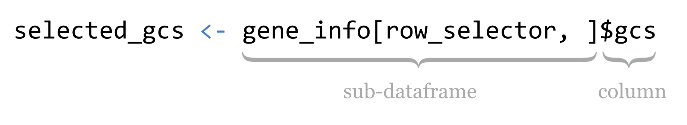

# Data Frames

In chapter 28, “[Vectors](),” we briefly introduced data frames as storing tables of data. Now that we have a clear understanding of both vectors and lists, we can easily describe data frames. (If you hastily skipped chapters [28]() and [30]() to learn about data frames, now’s the time to return to them!) Data frames are essentially named lists, where the elements are vectors representing columns. But data frames provide a few more features than simple lists of vectors. They ensure that the component column vectors are always the same length, and they allow us to work with the data by row as well as by column. Data frames are some of the most useful and ubiquitous data types in R.

While we’ve already covered using the `read.table()` function to produce a data frame based on the contents of a text file, it’s also possible to create a data frame from a set of vectors.

<pre id=part3-06-df-from-vectors
     class="language-r
            line-numbers
            linkable-line-numbers">
<code>
ids <- c("AGP", "T34", "ALQ", "IXL")
lengths <- c(256, 134, 92, 421)
gcs <- c(0.21, 0.34, 0.41, 0.65)

gene_info <- data.frame(ids, lengths, gcs, stringsAsFactors = FALSE)
print(gene_info)
</code></pre>

  

When printed, the contents of the column vectors are displayed neatly, with the column names along the top and row names along the left-hand side.

As with `read.table()`, the `data.frame()` function takes an optional `stringsAsFactors` argument, which specifies whether character vectors (like `ids`) should be converted to factor types (we’ll cover these in detail later). For now, we’ll disable this conversion.

Running `str(gene_info)` reveals the data frame’s list-like nature:

<pre id=part3-06-df-from-vectors-str-out
     class="language-txt
            line-numbers
            linkable-line-numbers">
<code>
'data.frame': 4 obs. of  3 variables:
 $ ids    : chr  "AGP" "T34" "ALQ" "IXL"
 $ lengths: num  256 134 92 421
 $ gcs    : num  0.21 0.34 0.41 0.65
</code></pre>

Like elements of lists, the columns of data frames don’t have to have names, but not having them is uncommon. Most data frames get column names when they are created (either by `read.table()` or `data.frame()`), and if unset, they usually default to `V1`, `V2`, and so on. The column names can be accessed and set with the `names()` function, or with the more appropriate `colnames()` function.

<pre id=part3-06-df-colnames
     class="language-r
            line-numbers
            linkable-line-numbers">
<code>
# set column names
names(gene_info) <- c("ids", "lengths", "gcs")
# better way:
colnames(gene_info) <- c("ids", "lengths", "gcs")

print(colnames(gene_info))                      # [1] "ids" "lengths" "gcs"
</code></pre>

To highlight the list-like nature of data frames, we can work with data frames by column much like lists by element. The three lines in the following example all result in `sub_info` being a two-column data frame.

<pre id=part3-06-df-select-cols-like-list
     class="language-r
            line-numbers
            linkable-line-numbers">
<code>
sub_info <- gene_info[c(1,3)]
sub_info <- gene_info[c("ids", "gcs")]
sub_info <- gene_info[c(TRUE, FALSE, TRUE)]
</code></pre>

An expression like `gene_info[2]` thus would not return a numeric vector of lengths, but rather a single-column data frame containing the numeric vector. We can use `[[]] `syntax and `$` syntax to refer to the vectors contained within data frames as well (the latter is much more common).

<pre id=part3-06-df-select-single-col-like-list
     class="language-r
            line-numbers
            linkable-line-numbers">
<code>
ids_vec <- gene_info[[1]]
ids_vec <- gene_info[["ids"]]
ids_vec <- gene_info$ids
</code></pre>

We can even delete columns of a data frame by setting the element to `NULL`, as in `gene_info$lengths <- NULL`.

The real charm of data frames is that we can extract and otherwise work with them by row. Just as data frames have column names, they also have row names: a character vector of the same length as each column. Unfortunately, by default, the row names are `"1"`, `"2"`, `"3"`, and so on, but when the data frame is printed, the quotation marks are left off (see the result of `print(gene_info)` above). The row names are accessible through the `rownames()` function.

Data frames are indexable using an extended `[]` syntax: `[<row_selector>, <column_selector>]`, where `<row_selector>` and `<column_selector>` are vectors. Just as with vectors and lists, these indexing/selection vectors may be integers (to select by index), characters (to select by name), or logicals (to select logically). Also as with vectors, when indexing by index position or name, the requested order is respected.

<pre id=part3-06-df-select-rowcol-ex1
     class="language-r
            line-numbers
            linkable-line-numbers">
<code>
# select the third and first rows, columns "lengths" and "ids"
subframe <- gene_info[c(3, 1), c("lengths", "ids")]
print(subframe)
</code></pre>

Here’s the resulting output, illustrating that `"3"` and `"1"` were the row names, which now occur at the first and second row, respectively.^[Unfortunately, when printed, quotation marks are left off of row names, commonly leading programmers to think that the row indexes are what is being displayed. Similarly, quotation marks are left off of columns that are character vectors (like the `ids` column in this example), which can cause confusion if the column is a character type with elements like `"1"`, `"2"`, and so on, potentially leading the programmer to think the column is numeric. In a final twist of confusion, using `[<row_selector>, <column_selector>]` syntax breaks a common pattern: `[]` indexing of a vector always returns a vector, `[]` indexing of a list always returns a list, and `[<row_selector>, <column_selector>]` indexing of a data frame always returns a data frame, *unless* it would have only one column, in which case the column/vector is returned. The remedy for this is `[<row_selector>, <column_selector>, drop = FALSE]`, which instructs R not to “drop” a dimension.]

<pre id=part3-06-df-select-rowcol-ex1-out
     class="language-r
            line-numbers
            linkable-line-numbers">
<code>
  lengths ids
3      92 ALQ
1     256 AGP
</code></pre>

Finally, if one of `<row_selector> `or `<column_selector>` are not specified, then all rows or columns are included. As an example, `gene_info[c(3,1), ]` returns a data frame with the third and first rows and all three columns, while `gene_info[, c("lengths", "ids")]` returns one with only the `"lengths"` and `"ids"` columns, but all rows.

### Data Frame Operations {-}

Because data frames have much in common with lists and rows—and columns can be indexed by index number, name, or logical vector—there are many powerful ways we can manipulate them. Suppose we wanted to extract only those rows where the `lengths` column is less than `200`, or the `gcs` column is less than `0.3`.

<pre id=part3-06-df-select-logical-1
     class="language-r
            line-numbers
            linkable-line-numbers">
<code>
row_selector <- gene_info$lengths < 200 | gene_info$gcs < 0.3
selected <- gene_info[row_selector, ]
print(selected)
</code></pre>

This syntax is concise but sophisticated. While `gene_info$lengths` refers to the numeric vector named `"lengths"` in the data frame, the `<` logical operator is vectorized, with the single element `200` being recycled as needed. The same process happens for `gene_info$gcs < 0.3`, and the logical-or operator `|` is vectorized, producing a logical vector later used for selecting the rows of interest. An even shorter version of these two lines would be` selected <- gene_info[gene_info$lengths < 200 | gene_info$gcs < 0.3, ].` The printed output:

<pre id=part3-06-df-select-logical-1-out
     class="language-txt
            line-numbers
            linkable-line-numbers">
<code>
   ids lengths  gcs
g1 AGP     256 0.21
g2 T34     134 0.34
g3 ALQ      92 0.41
</code></pre>

If we wished to extract the gcs vector from this result, we could use something like `selected_gcs <- selected$gcs`. Sometimes more compact syntax is used, where the `$` and column name are appended directly to the `[]` syntax.

  

Alternatively, and perhaps more clearly, we can first use `$` notation to extract the column of interest, and then use `[]` logical indexing on the resulting vector.

  

Because subsetting data frame rows by logical condition is so common, there is a specialized function for this task: `subset()`. The first parameter is the data frame from which to select, and later parameters are logical expressions based on column names within that data frame (quotation marks are left off). For example, `selected <- subset(gene_info, lengths < 200 | gcs < 0.3)`. If more than one logical expression is given, they are combined with `&` (and). Thus `subset(gene_info, lengths < 200, gcs < 0.3)` is equivalent to `gene_info[gene_info$lengths < 200 & gene_info$gcs < 0.3 ,]`.

While the `subset()` function is convenient for simple extractions, knowing the ins and outs of `[]` selection for data frames as it relates to lists and vectors is a powerful tool. Consider the `order()` function, which, given a vector, returns an index vector that can be used for sorting. Just as with using `order()` to sort a vector, we can use `order()` to sort a data frame based on a particular column.

<pre id=part3-06-df-order-ex
     class="language-r
            line-numbers
            linkable-line-numbers">
<code>
gene_info_sorted <- gene_info[order(gene_info$lengths), ]
print(gene_info_sorted)
</code></pre>

The result is a data frame ordered by the lengths column:

<pre id=part3-06-df-order-ex-out
     class="language-txt
            line-numbers
            linkable-line-numbers">
<code>
   ids lengths  gcs
g3 ALQ      92 0.41
g2 T34     134 0.34
g1 AGP     256 0.21
g4 IXL     421 0.65
</code></pre>

Because data frames force all column vectors to be the same length, we can create new columns by assigning to them by name, and relying on [vector recycling]() to fill out the column as necessary. Let’s create a new column called `gc_categories`, which is initially filled with `NA` values, and then use [selective replacement]() to assign values `"low"` or `"high"` depending on the contents of the `gcs` column.

<pre id=part3-06-df-gc-category-col-add
     class="language-r
            line-numbers
            linkable-line-numbers">
<code>
gene_info$gc_category <- NA
gene_info$gc_category[gene_info$gcs < 0.5] <- "low"
gene_info$gc_category[gene_info$gcs >= 0.5] <- "high"
print(gene_info)
</code></pre>

While there are more automated approaches for categorizing numerical data, the above example illustrates the flexibility and power of the data frame and vector syntax covered so far.

<pre id=part3-06-df-gc-category-col-add-out
     class="language-txt
            line-numbers
            linkable-line-numbers">
<code>
   ids lengths  gcs gc_category
g1 AGP     256 0.21         low
g2 T34     134 0.34         low
g3 ALQ      92 0.41         low
g4 IXL     421 0.65        high
</code></pre>

One final note: while the `head()` function returns the first few elements of a vector or list, when applied to a data frame, it returns a similar data frame with only the first few rows.

#### Matrices and Arrays {-}

Depending on the type of analysis, you might find yourself working with matrices in R, which are essentially two-dimensional vectors. Like vectors, all elements of a matrix must be the same type, and attempts to mix types will result in autoconversion. Like data frames, they are two dimensional, and so can be indexed with `[<row_selector>, <column_selector>]` syntax. They also have `rownames()` and `colnames()`.

<pre id=part3-06-df-matrix-ex
     class="language-r
            line-numbers
            linkable-line-numbers">
<code>
m <- matrix(c(1, 2, 3, 4, 5, 6), nrow = 2, ncol = 3)
print(m)
</code></pre>

<pre id=part3-06-df-matrix-ex-out
     class="language-r
            line-numbers
            linkable-line-numbers">
<code>
     [,1] [,2] [,3]
[1,]    1    3    5
[2,]    2    4    6
</code></pre>

There are a number of interesting functions for working with matrices, including `det()` (for computing the determinant of a matrix) and `t()` (for transposing a matrix).

Arrays generalize the concept of multidimensional data; where matrices have only two dimensions, arrays may have two, three, or more. The line `a <- array(c(1,1,1,1,2,2,2,2,3,3,3,3), dim = c(2,2,3))`, for example, creates a three-dimensional array, composed of three two-by-two matrices. The upper left element can be extracted as `a[1,1,1]`.

#### Exercises {-}

1. Read the `states.txt` file into a data frame, as discussed in Chapter 28, [Vectors](). Extract a new data frame called `states_name_pop` containing only the columns for `name` and `population`.

2. Using `subset()`, extract a data frame called `states_gradincome_high` containing all columns, and all rows where the income is greater than the median of income or where `hs_grad` is greater than the median of `hs_grad`. (There are 35 such states listed in the table.) Next, do the same extraction with `[<row_selector>, <column_selector>]` syntax.

3. Create a table called `states_by_region_income`, where the rows are ordered first by `region` and second by `income`. (The `order()` function can take multiple parameters as in `order(vec1, vec2)`; they are considered in turn in determining the ordering.)

4. Use `order()`, `colnames()`, and `[<row_selector>,<column_selector>]` syntax to create a data frame `states_cols_ordered`, where the columns are alphabetically ordered (i.e., `hs_grad` first, then `income`, then `murder`, then `name`, and so on).

5. The `nrow()` function returns the number of rows in a data frame, while `rev()` reverses a vector and `seq(a, b)` returns a vector of integers from `a` to `b` (inclusive). Use these to produce `states_by_income_rev`, which is the `states` data frame but with rows appearing in *reverse* order of income (highest incomes on top).

6. Try converting the `states` data frame to a matrix by running it through the `as.matrix()` function. What happens to the data, and why do you think that is?

