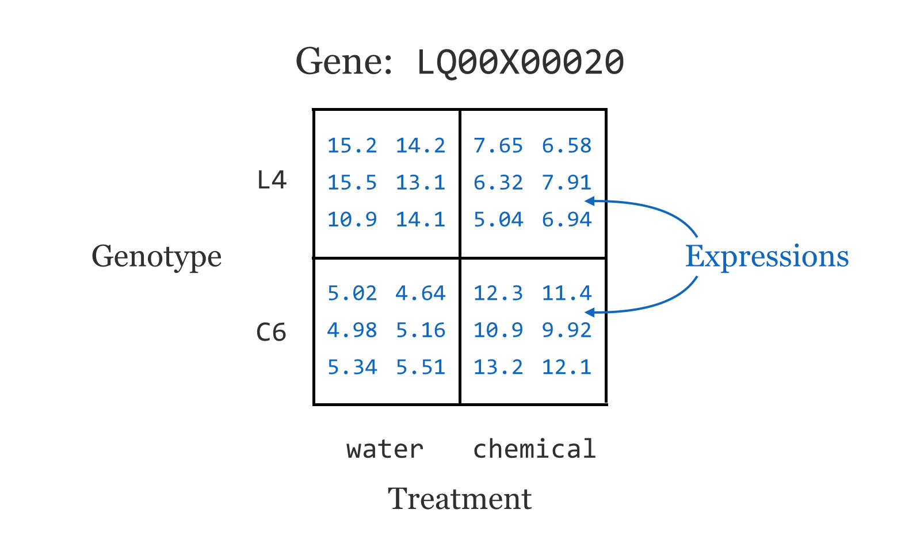
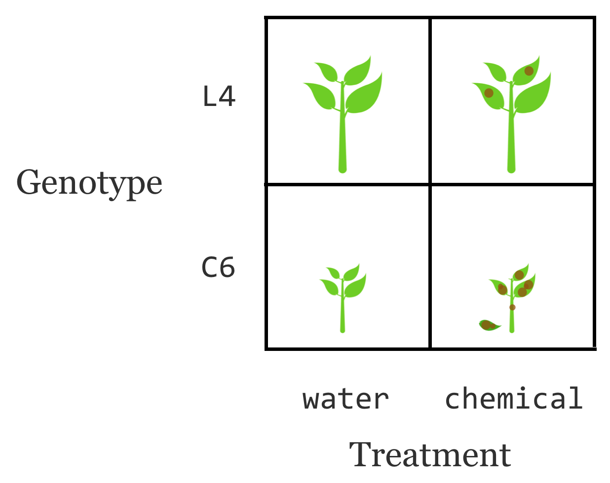
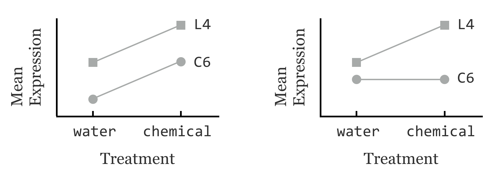
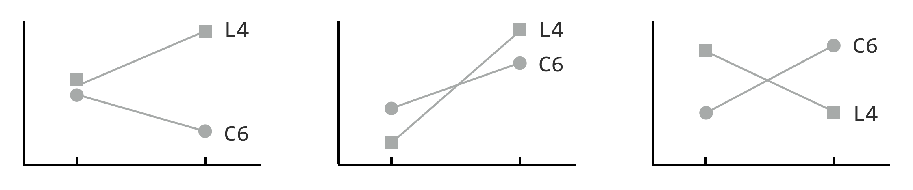
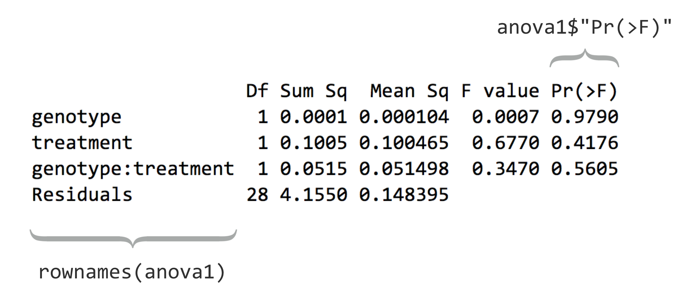
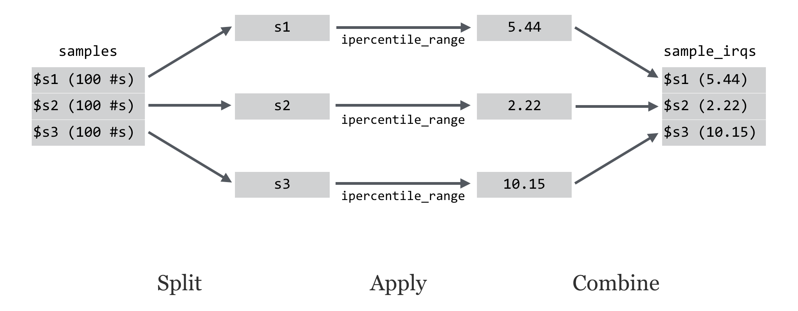
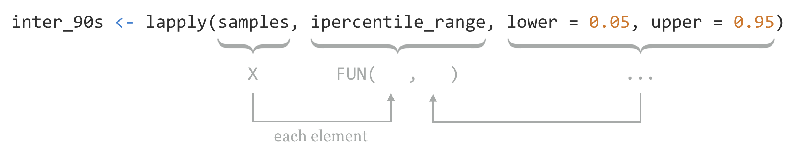
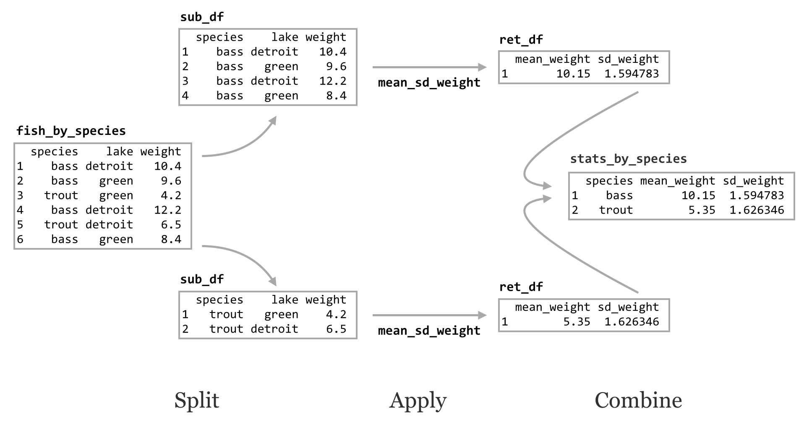
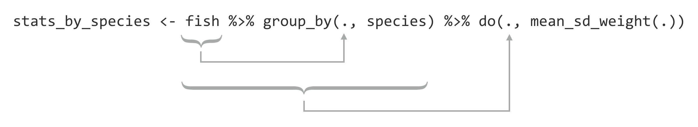

# Split, Apply, Combine

Although we touched briefly on writing functions, the discussion has so far been largely about the various types of data used by R and the syntax and functions for working with them. These include vectors of various types, lists, data frames, factors, indexing, replacement, and vector recycling.

At some point won't we discuss analyzing a meaningful data set? Yes, and that point is now. We'll continue to work with the gene expression data from chapter 35, "[Character and Categorical Data](#character-and-categorical-data)," after it's been processed to include the appropriate individual columns using the functions in the `stringr` library. Here's the code from the last chapter which pre-processed the input data:

<pre id=part3-08-processesed_exp
     class="language-r
            line-numbers
            linkable-line-numbers">
<code>
library(stringr)

expr_long <- read.table("expr_long_coded.txt",
                        header = TRUE,
                        sep = "\t",
                        stringsAsFactors = FALSE)

# Split sample column into 3-column matrix on _'s
sample_split <- str_split_fixed(expr_long$sample, "_", 3)

# Turn the matrix into a data frame with appropriate column names
# and combine it with the original data frame into a larger set
sample_split_df <- data.frame(sample_split)
colnames(sample_split_df) <- c("genotype", "treatment", "tissuerep")
expr_long_split <- cbind(expr_long, sample_split_df)

# Create an individual tissue column
expr_long_split$tissue <- NA
expr_long_split$tissue[str_detect(expr_long_split$tissuerep, "A")] <- "A"
expr_long_split$tissue[str_detect(expr_long_split$tissuerep, "B")] <- "B"
expr_long_split$tissue[str_detect(expr_long_split$tissuerep, "C")] <- "C"

# We've already checked for NAs
#print(expr_long_split[is.na(expr_long_split$tissue), ]) # should print 0 rows

# Create a new rep column
expr_long_split$rep <- NA
expr_long_split$rep[str_detect(expr_long_split$tissuerep, "1")] <- "1"
expr_long_split$rep[str_detect(expr_long_split$tissuerep, "2")] <- "2"
expr_long_split$rep[str_detect(expr_long_split$tissuerep, "3")] <- "3"

# We've already checked for NAs, but a few were left
#print(expr_long_split[is.na(expr_long_split$rep), ]) # should print 0 rows

# So we remove all rows with such "bad" IDs
bad_ids <- expr_long_split$id[is.na(expr_long_split$rep)]
bad_rows <- expr_long_split$id %in% bad_ids      # logical vector
expr_long_split <- expr_long_split[!bad_rows, ]  # logical selection
</code></pre>

As we continue, we'll likely want to rerun our analysis script in different ways, without having to rerun all of the code above, as it takes a few minutes to run this preprocessing script. One good strategy would be to write this "cleaned" data frame out to a text file using `write.table()`, and read it back in to an analysis-only script with `read.table()`. Just for variety, though, let's use the `save()` function, which stores any R object (such as a list, vector, or data frame) to a file in a compressed binary format.

<pre id=part3-08-save
     class="language-r
            line-numbers
            linkable-line-numbers">
<code>
save(expr_long_split, file = "expr_long_split.Rdata")
</code></pre>

The traditional file extension for such an R-object file is `.Rdata`. Such data files are often shared among R programmers.

The first few lines of the saved data frame are all readings for the same gene. There are ~360,000 lines in the full data frame, with readings for over 11,000 genes. (The script above, which processes the [`expr_long_coded.txt`](data/expr_long_coded.txt) file, can be found in the file [`expr_preprocess.R`](data/expr_preprocess.R).) The figure below shows the results of `print(head(expr_long_split))`:

<pre id=part3-08-head
     class="language-txt
            line-numbers
            linkable-line-numbers">
<code>
           id           annotation expression        sample genotype treatment
1 LQ00X000020 Hypothetical protein   5.024142 C6_control_A1       C6   control
2 LQ00X000020 Hypothetical protein   4.646697 C6_control_A3       C6   control
3 LQ00X000020 Hypothetical protein   4.986592 C6_control_B1       C6   control
4 LQ00X000020 Hypothetical protein   5.164292 C6_control_B2       C6   control
5 LQ00X000020 Hypothetical protein   5.348810 C6_control_B3       C6   control
6 LQ00X000020 Hypothetical protein   5.519393 C6_control_C1       C6   control
  tissuerep tissue rep
1        A1      A   1
2        A3      A   3
3        B1      B   1
4        B2      B   2
5        B3      B   3
6        C1      C   1
</code></pre>

Let's start a new analysis script that loads this data frame before we begin our analysis of it. For this script we may also need the `stringr` library, and we're going to include the `dplyr` library as well (which we assume has been separately installed with `install.packages("dplyr")` in the interactive console).

<pre id=part3-08-load
     class="language-r
            line-numbers
            linkable-line-numbers">
<code>
library(stringr)
library(dplyr)

## This script analyzes the data stored in the data frame
## expr_long_split.Rdata, containing gene expression data

load("expr_long_split.Rdata")
expr <- expr_long_split
</code></pre>

The `load()` function creates a variable with the same name that was used in `save()`, and for convenience we've created a copy of the data frame with a shorter variable name, `expr`. While these sorts of R data files are convenient for R users, the benefit of a `write.table()` approach would be that other users and languages would have more direct access to the data (e.g., in Python or even Microsoft Excel).

This data set represents a multifactor analysis of gene expression^[Here we'll be using the colloquial term "gene" to refer to a genetic locus producing messenger RNA and its expression to be represented by the amount of mRNA (of the various isoforms) present in the cell at the sampling time.] in two genotypes of a plant, where a control treatment (water) and a chemical treatment (pesticide) have been applied to each. Further, three tissue types were tested (A, B, and C, for leaf, stem, and root, respectively) and two or three replicates were tested for each combination for statistical power. These data represent microarray readings and have already been normalized and so are ready for analysis.^[Microarrays are an older technology for measuring gene expression that have been largely supplanted by direct RNA-seq methods. For both technologies, the overall levels of expression vary between samples (e.g., owing to measurement efficiency) and must be modified so that values from different samples are comparable; microarray data are often \log_2 transformed as well in preparation for statistical analysis. Both steps have been performed for these data; we've avoided discussion of these preparatory steps as they are specific to the technology used and an area of active research for RNA-seq. Generally, RNA-seq analyses involve work at both the command line for data preprocessing and using functions from specialized R packages.] (These data are also anonymized for this publication at the request of the researchers.)

For now, we'll focus on the genotype and treatment variables. Ignoring other variables, this gives us around 24 expression readings for each gene.

<div class="fig center" style="width: 100%">
  
</div>

This sort of design is quite common in gene expression studies. It is unsurprising that gene expression will differ between two genotypes, and that gene expression will differ between two treatments. But genotypes and treatments frequently react in interesting ways. In this case, perhaps the L4 genotype is known to grow larger than the C6 genotype, and the chemical treatment is known to be harmful to the plants. Interestingly, it seems that the chemical treatment is less harmful to the L4 genotype.

<div class="fig center" style="width: 100%">
  
</div>

The natural question is: which genes might be contributing to the increased durability of L4 under chemical exposure? We can't simply look for the differences in mean expression between genotypes (with, say, `t.test()`), as that would capture many genes involved in plant size. Nor can we look for those with mean expression differences that are large between treatments, because we know many genes will react to a chemical treatment no matter what. Even both signals together (left side of the image below) are not that interesting, as they represent genes that are affected by the chemical and are involved with plant size, but may have nothing at all to do with unique features of L4 in the chemical treatment. What we are really interested in are genes with a *differential* response to the chemical between two the two genotypes (right side of the image below).

<div class="fig center" style="width: 100%">
  
</div>

Does that mean that we can look for genes where the mean difference is large in one genotype, but not the other? Or within one treatment, but not that other? No, because many of these interesting scenarios would be missed:

<div class="fig center" style="width: 100%">
  
</div>

For each gene's expression measurements, we need a classic ANOVA (analysis of variance) model. After accounting for the variance explained by the genotype difference (to which we can assign a *p* value indicating whether there is a difference) as well as the variance explained by the treatment (which will also have a *p* value), is the leftover variance — for the interaction/differential response — significant?

### A Single Gene Test, Formulas {-}

To get started, we'll run an ANOVA for just a single gene.^[There are many interesting ways we could analyze these data. For the sake of focusing on R rather than statistical methods, we'll stick to a relatively simple per gene 2x2 ANOVA model.] First, we'll need to isolate a sub-data frame consisting of readings for only a single ID. We can use the `unique()` function to get a vector of unique IDs, and then the `%in%` operator to select rows matching only the first of those.

<pre id=part3-08-extract_one_gene
     class="language-r
            line-numbers
            linkable-line-numbers">
<code>
uniq_ids <- unique(expr$id)
expr1 <- expr[expr$id %in% uniq_ids[1], ]
</code></pre>

This data frame contains rows for a single gene and columns for expression, genotype, treatment, and others (we could verify this with a simple `print()` if needed). We wish to run an ANOVA for these variables, based on a linear model predicting expression values from genotype, treatment, and the interaction of these terms.

The next step is to build a simple linear model using the `lm()` function, which takes as its only required parameter a "formula" describing how the predictor values should be related to the predicted values. Note the format of the formula: `response_vector ~ predictor_vector1 + predictor_vector2 + predictor_vector1 : predictor_vector2`, indicating that we wish to determine how to predict values in the response vector using elements from the predictor vectors.

<pre id=part3-08-lm1a
     class="language-r
            line-numbers
            linkable-line-numbers">
<code>
lm1 <- lm(expr1$expression ~ expr1$genotype +                   # genotype
                             expr1$treatment +                  # treatment
                             expr1$genotype : expr1$treatment)  # interaction
</code></pre>

If the vectors or factors of interest exist within a data frame (as is the case here), then the `lm()` function can work with column names only and a `data =` argument.

<pre id=part3-08-lm1b
     class="language-r
            line-numbers
            linkable-line-numbers">
<code>
lm1 <- lm(expression ~ genotype + treatment + genotype:treatment, data = expr1)
</code></pre>

We can then print the linear model returned with `print(lm1)`, as well as its structure with `str(lm1)`, to see that it contains quite a bit of information as a named list:

<pre id=part3-08-lm1_print_str
     class="language-txt
            line-numbers
            linkable-line-numbers">
<code>
Call:
lm(formula = expression ~ genotype + treatment + genotype:treatment, 
    data = expr1)

Coefficients:
                (Intercept)                   genotypeL4  
                    5.38363                     -0.08384  
           treatmentcontrol  genotypeL4:treatmentcontrol  
                   -0.19230                      0.16046  

List of 13
 $ coefficients : Named num [1:4] 5.3836 -0.0838 -0.1923 0.1605
  ..- attr(*, "names")= chr [1:4] "(Intercept)" "genotypeL4" "treatmentcontrol"
"genotypeL4:treatmentcontrol"
 $ residuals    : Named num [1:32] -0.167 -0.545 -0.205 -0.027 0.157 ...
  ..- attr(*, "names")= chr [1:32] "1" "2" "3" "4" ...
 $ effects      : Named num [1:32] -29.9003 -0.0102 0.317 0.2269 0.2552 ...
...
</code></pre>

Before we continue, what is this `expression ~ genotype + treatment + genotype : treatment` "formula"? As usual, we can investigate a bit more by assigning it to a variable and using `class()` and `str()`.

<pre id=part3-08-formula
     class="language-r
            line-numbers
            linkable-line-numbers">
<code>
f <- expression ~ genotype + treatment + genotype : treatment
str(f)
</code></pre>

<pre id=part3-08-formula_out
     class="language-txt
            line-numbers
            linkable-line-numbers">
<code>
Class 'formula' length 3 expression ~ genotype + treatment + genotype:treatment
  ..- attr(*, ".Environment")=<environment: R_GlobalEnv>
</code></pre>

The output indicates that the class is of type `"formula"` and that it has an `".Environment"` attribute. It's a bit opaque, but a formula type in R is a container for a character vector of variable names and a syntax for relating them to each other. The environment attribute specifies where those variables should be searched for by default, though functions are free to ignore that (as in the case of `data =` for `lm()`, which specifies that the variables should be considered column names in the given data frame). Formulas don't even need to specify variables that actually exist. Consider the following formula and the `all.vars()` function, which inspects a formula and returns a character vector of the unique variable names appearing in the formula.

<pre id=part3-08-formula_b
     class="language-r
            line-numbers
            linkable-line-numbers">
<code>
f <- alpha ~ beta + beta : gamma
print(all.vars(f))                               # [1] "alpha" "beta" "gamma"
</code></pre>

Anyway, let's return to running the statistical test for the single gene we've isolated. The `lm1` result contains the model predicting expressions from the other terms (where this "model" is a list with a particular set of elements). To get the associated *p* values, we'll need to run it through R's `anova()` function.

<pre id=part3-08-gene_one_anova
     class="language-r
            line-numbers
            linkable-line-numbers">
<code>
anova1 <- anova(lm1)
print("Printed Result: ")
print(anova1)

print("Structure:")
str(anova1)
</code></pre>

Printing the result shows that the *p* values (labeled `"Pr(>F)"`) for the genotype, treatment, and interaction terms are 0.97, 0.41, and 0.56, respectively. If we want to extract the *p* values individually, we'll need to first inspect its structure with `str()`, revealing that the result is both a list and a data frame — unsurprising because a data frame is a type of list. The three *p* values are stored in the `"Pr(>F)"` name of the list.

<pre id=part3-08-printout
     class="language-txt
            line-numbers
            linkable-line-numbers">
<code>
[1] "Printed Result: "
Analysis of Variance Table

Response: expression
                   Df Sum Sq  Mean Sq F value Pr(>F)
genotype            1 0.0001 0.000104  0.0007 0.9790
treatment           1 0.1005 0.100465  0.6770 0.4176
genotype:treatment  1 0.0515 0.051498  0.3470 0.5605
Residuals          28 4.1550 0.148395               
[1] "Structure:"
Classes ‘anova’ and 'data.frame': 4 obs. of  5 variables:
 $ Df     : int  1 1 1 28
 $ Sum Sq : num  0.000104 0.100465 0.051498 4.155049
 $ Mean Sq: num  0.000104 0.100465 0.051498 0.148395
 $ F value: num  0.000704 0.677016 0.347033 NA
 $ Pr(>F) : num  0.979 0.418 0.561 NA
 - attr(*, "heading")= chr  "Analysis of Variance Table\n" "Response: expression"
</code></pre>

We can thus extract the *p* values vector as `pvals1 <- anova1$"Pr(>F)"`; notice that we must use the quotations to select from this list by name because of the special characters (`(`, `>`, and `)`) in the name. For the sake of argument, let's store these three values in a data frame with a single row, and column names `"genotype"`, `"treatment"`, and `"genotype:treatment"` to indicate what the values represent.

<pre id=part3-08-pvals_df
     class="language-r
            line-numbers
            linkable-line-numbers">
<code>
pvals1 <- anova1$"Pr(>F)"
pvals_df1 <- data.frame(pvals1[1], pvals1[2], pvals1[3])
colnames(pvals_df1) <- c("genotype", "treatment", "genotype:treatment")

print(pvals_df1)
</code></pre>

Output:

<pre id=part3-08-pvals_df_print
     class="language-txt
            line-numbers
            linkable-line-numbers">
<code>
   genotype treatment genotype:treatment
1 0.9790277 0.4175689          0.5605206
</code></pre>

This isn't bad, but ideally we wouldn't be "hard coding" the names of these *p* values into the column names. The information is, after all, represented in the printed output of the `print(anova1)` call above. Because `anova1` is a data frame as well as a list, these three names are actually the row names of the data frame. (Sometimes useful data hide in strange places!)

<div class="fig center" style="width: 100%">
  
</div>

So, given any result of a call to `anova()`, no matter the formula used in the linear model, we should be able to computationally produce a single-row *p*-values data frame. But we've got to be clever. We can't just run `pvals_df1 <- data.frame(pvals1)`, as this will result in a single-column data frame with three rows, rather than a single-row data frame with three columns. Rather, we'll first convert the *p*-values vector into a list with `as.list()`, the elements of which will become the columns of the data frame because data frames are a type of list. From there, we can assign the `rownames()` of `anova1` to the `colnames()` of the `pvals_df1` data frame.^[For almost all data type conversions, R has a default interpretation (e.g., vectors are used as columns of data frames). As helpful as this is, it sometimes means nonstandard conversions require more creativity. Having a good understanding of the basic data types is thus useful in day-to-day analysis.]

<pre id=part3-08-pvals_df2
     class="language-r
            line-numbers
            linkable-line-numbers">
<code>
pvals1 <- anova1$"Pr(>F)"                # vector of p-values
pvals_list1 <- as.list(pvals1)           # list of p-values
pvals_df1 <- data.frame(pvals_list1)     # single-row data frame
colnames(pvals_df1) <- rownames(anova1)  # column names from rownames(anova1)

print(pvals_df1)
</code></pre>

The programmatically generated output is as follows:

<pre id=part3-08-pvals_df2_print
     class="language-txt
            line-numbers
            linkable-line-numbers">
<code>
   genotype treatment genotype:treatment Residuals
1 0.9790277 0.4175689          0.5605206        NA
</code></pre>

This time, there's an extra column for the residuals, but that's of little significance.

This whole process — taking a sub–data frame representing expression values for a single gene and producing a single-row data frame of *p* values — is a good candidate for encapsulating with a function. After all, there are well-defined inputs (the sub–data frame of data for a single gene) and well-defined outputs (the *p*-values data frame), and we're going to want to run it several thousand times, once for each gene ID.

<pre id=part3-08-pvals_df_fxn
     class="language-r
            line-numbers
            linkable-line-numbers">
<code>
## Given a data frame with columns for expression,
## genotype, and treatement, runs a linear model
## and returns a single-row data frame with p-values in columns
sub_df_to_pvals_df <- function(sub_df) {
  lm1 <- lm(expression ~ genotype + treatment + genotype:treatment,
            data = sub_df)

  anova1 <- anova(lm1)
  pvals1 <- anova1$"Pr(>F)"
  pvals_list1 <- as.list(pvals1)
  pvals_df1 <- data.frame(pvals_list1)
  colnames(pvals_df1) <- rownames(anova1)

  return(pvals_df1)
}
</code></pre>

To get the result for our `expr1` sub–data frame, we'd simply need to call something like `pvals_df1 <- sub_df_to_pvals_df(exp1)`. The next big question is: how are we going to run this function not for a single gene, but for all 11,000 in the data set? Before we can answer that question, we must learn more about the amazing world of functions in R.

<div class="exercises">

#### Exercises {-}

1. Generate a data frame with a large amount of data (say, one with two numeric columns, each holding 1,000,000 entries). Write the data frame to a text file with `write.table()` and save the data frame to an R data file with `save()`. Check the size of the resulting files. Is one smaller than the other? By how much?

2. The example we've covered — generating a small data frame of results (*p* values) from a frame of data (expression values) by using a function — is fairly complex owing to the nature of the experimental design and the test we've chosen. Still, the basic pattern is quite common and very useful.

    A default installation of R includes a number of example data sets. Consider the `CO2` data frame, which describes CO2 uptake rates of plants in different treatments (`"chilled"` and `"nonchilled"`; see `help(CO2)` for more detailed information). Here's the output of `print(head(CO2))`:

    <pre id=part3-08-CO2
     class="language-txt
            line-numbers
            linkable-line-numbers">
<code>
  Plant   Type  Treatment conc uptake
1   Qn1 Quebec nonchilled   95   16.0
2   Qn1 Quebec nonchilled  175   30.4
3   Qn1 Quebec nonchilled  250   34.8
4   Qn1 Quebec nonchilled  350   37.2
5   Qn1 Quebec nonchilled  500   35.3
6   Qn1 Quebec nonchilled  675   39.2
</code></pre>

    The conc column lists different ambient CO2 concentrations under which the experiment was performed. Ultimately, we will want to test, for each concentration level, whether the uptake rate is different in chilled versus nonchilled conditions. We'll use a simple *t* test for this.

    Start by writing a function that takes a data frame with these five columns as a parameter and returns a single-row, single-column data frame containing a *p* value (reported by `t.test()`) for chilled uptake rates versus nonchilled uptake rates. (Your function will need to extract two vectors of update rates to provide to `t.test()`, one for chilled values and one for nonchilled.)

    Next, extract a sub–data frame containing rows where `conc` values are `1000`, and run your function on it. Do the same for a sub–data frame containing `conc` value of `675`.

</dif>

### Attack of the Functions! {-}

While R has a dedicated function for computing the interquartile range (the range of data values between the 25th percentile and the 75th), let's write our own so that we can explore functions more generally. We'll call it `ipercentile_range`, to note that it computes an interpercentile range (where the percentiles just happen to be quartiles, for now).

<pre id=part3-08-ipercentile_range
     class="language-r
            line-numbers
            linkable-line-numbers">
<code>
ipercentile_range <- function(x) {
  lower_value <- quantile(x, 0.25)
  upper_value <- quantile(x, 0.75)
  return(upper_value - lower_value)
}
</code></pre>

Next, let's make a list containing some samples of random data.

<pre id=part3-08-3samples_list
     class="language-r
            line-numbers
            linkable-line-numbers">
<code>
samples <- list()
samples$s1 <- rnorm(100, mean = 10, sd = 4)
samples$s2 <- rnorm(100, mean = 5, sd = 2)
samples$s3 <- rnorm(100, mean = 20, sd = 8)
</code></pre>

To compute the three interquartile ranges, we could call the function three times, once per element of the list, and store the results in another list.

<pre id=part3-08-3samples_call
     class="language-r
            line-numbers
            linkable-line-numbers">
<code>
iqr1 <- ipercentile_range(samples$s1)              # 5.44
iqr2 <- ipercentile_range(samples$s2)              # 2.22
iqr3 <- ipercentile_range(samples$s3)              # 10.15
sample_iqrs <- list(iqr1, iqr2, iqr3)              # list of 5.44 2.22 10.15
</code></pre>

Not too bad, but we can do better. Notice the declaration of the function — we've used the assignment operator `<-` to assign to `ipercentile_range`, just as we do with other variables. In fact, `ipercentile_range` is a variable! And just as with other data, we can check its class and print it.

<pre id=part3-08-print_fxn
     class="language-r
            line-numbers
            linkable-line-numbers">
<code>
print(class(ipercentile_range))          # [1] "function"
print(ipercentile_range)
</code></pre>

When it is printed, we see the source code for the function:

<pre id=part3-08-print_fxn_print
     class="language-txt
            line-numbers
            linkable-line-numbers">
<code>
function (x) 
{
    lower_value <- quantile(x, 0.25)
    upper_value <- quantile(x, 0.75)
    return(upper_value - lower_value)
}
</code></pre>

In R, functions are a type of data just like any other. Thus R is an example of a "functional" programming language.^[Not all programming languages are "functional" in this way, and some are only partially functional. Python is an example of a mostly functional language, in that functions defined with the `def` keyword are also data just like any other. This book does not highlight the functional features of Python, however, preferring instead to focus on Python's object-oriented nature. Here, R's functional nature is the focus, and objects in R will be discussed only briefly later.] One of the important implications is that functions can be passed as parameters to other functions; after all, they are just a type of data. This is a pretty tricky idea. Let's explore it a bit with the `lapply()` function. This function takes two parameters: first, a list, and second, a function to apply to each element of the list. The return value is a list representing the collated outputs of each function application. So, instead of using the four lines above to apply `ipercentile_range()` to each element of `samples`, we can say:

<pre id=part3-08-lapply
     class="language-r
            line-numbers
            linkable-line-numbers">
<code>
sample_irqs <- lapply(samples, ipercentile_range)  # list of 5.44 2.22 10.15
</code></pre>

The resulting list will have the same three values as above, and the names of the elements in the output list will be inherited from the input list (so `sample_irqs$s1` will hold the first range or 5.44, for this random sample anyway).

This is an example of the powerful "split-apply-combine" strategy for data analysis. In general, this strategy involves splitting a data set into pieces, applying an operation or function to each, and then combining the results into a single output set in some way.

<div class="fig center" style="width: 100%">
  
</div>

When the input and output are both lists, this operation is also known as a "map." In fact, this paradigm underlies some parallel processing supercomputer frameworks like Google's MapReduce and the open-source version of Hadoop (although these programs aren't written in R).

Because lists are such a flexible data type, `lapply()` is quite useful. Still, in some cases — like this one — we'd prefer the output to be a vector instead of a list. This is common enough to warrant a conversion function called `unlist()` that extracts all of the elements and subelements of a list to produce a vector.

<pre id=part3-08-unlist
     class="language-r
            line-numbers
            linkable-line-numbers">
<code>
irqs_vec <- unlist(sample_irqs)
print(irqs_vec)                                     # [1] 5.44 2.22 10.15
</code></pre>

Be warned: because lists are more flexible than vectors, if the list given to `unlist()` is not simple, the elements may be present in the vector in an odd order and they will be coerced into a common data type.

The `lapply()` function can also take as input a vector instead of a list, and it is but one of the many "apply" functions in R. Other examples include `apply()`, which applies a function to each row or column of a matrix,^[Because the `apply()` function operates on matrices, it will silently convert any data frame given to it into a matrix. Because matrices can hold only a single type (whereas data frames can hold different types in different columns), using `apply()` on a data frame will first force an autoconversion so that all columns are the same type. As such, it is almost never correct to use `apply()` on a data frame with columns of different types.] and `sapply()` (for "simple apply"), which detects whether the return type should be a vector or matrix depending on the function applied. It's easy to get confused with this diversity, so to start, it's best to focus on `lapply()` given its relatively straightforward (but useful) nature.

### Collecting Parameters with ... {-}

The help page for `lapply()` is interesting. It specifies that the function takes three parameters: `X` (the list to apply over), `FUN` (the function to apply), and `...`, which the help page details as "optional arguments to `FUN`."

<pre id=part3-08-dotdotdot
     class="language-txt
            line-numbers
            linkable-line-numbers">
<code>
Usage:

     lapply(X, FUN, ...)
</code></pre>

The `...` parameter is common in R, if a bit mysterious at times. This "parameter" collects any number of named parameters supplied to the function in a single unit. This collection can then be used by the function; often they are passed on to functions called by the function.

To illustrate this parameter, let's modify our `ipercentile_range()` function to take two optional parameters, a `lower` and `upper` percentile from which the range should be computed. While the interquartile range is defined as the range in the data from the 25th to the 75th percentile, our function will be able to compute the range from any lower or upper percentile.

<pre id=part3-08-ipercentile_range_exp
     class="language-r
            line-numbers
            linkable-line-numbers">
<code>
ipercentile_range <- function(x, lower = 0.25, upper = 0.75) {
  lower_value <- quantile(x, lower)
  upper_value <- quantile(x, upper)
  return(upper_value - lower_value)
}
</code></pre>

Now we can call our function as `ipercentile_range(sample$s1)` to get the default interquartile range of the first sample, or as `ipercentile_range(samples$s2, lower = 0.05, upper = 0.95)`, to get the middle 90th percentile range. Similarly, we have the ability to supply the optional parameters through the `...` of `lapply()`, which will in turn supply them to every call of the `ipercentile_range` function during the apply step.

<pre id=part3-08-lapply_dotdotdot
     class="language-r
            line-numbers
            linkable-line-numbers">
<code>
inter_90s <- lapply(samples, ipercentile_range, lower = 0.05, upper = 0.95)
print(unlist(inter_90s))                           # [1] 12.12 6.30 22.08
</code></pre>

This syntax might seem a bit awkward, but something like it is necessary if we hope to pass functions that take multiple parameters as parameters to other functions. This also should help illuminate one of the commonly misunderstood features of R.

<div class="fig center" style="width: 100%">
  
</div>

### Functions Are Everywhere {-}

Although mostly hidden from view, most (if not all) operations in R are actually function calls. Sometimes function names might contain nonalphanumeric characters. In these cases, we can enclose the function name in backticks, as in ``iqr1 <- `ipercentile_range`(samples$s1)``. (In chapter 30, "[Variables and Data](#variables-and-data)," we learned that any variable name can be enclosed in backticks this way, though it's rarely recommended.)

What about something like the lowly addition operator, `+`? It works much like a function: given two inputs (left-hand-side and right-hand-side vectors), it returns an output (the element-by-element sum).

<pre id=part3-08-plus_fxn1
     class="language-r
            line-numbers
            linkable-line-numbers">
<code>
s <- c(1, 2) + c(6, 3)                             # 7 5
</code></pre>

In fact, `+` really *is* a function that takes two parameters, but to call it that way we need to use backticks.

<pre id=part3-08-plus_fxn2
     class="language-r
            line-numbers
            linkable-line-numbers">
<code>
s <- `+`(c(1, 2), c(6, 3))                         # 7 5
</code></pre>

This might be considered somewhat amazing — the "human-readable" version is converted into a corresponding function call behind the scenes by the interpreter. The latter, functional representation is easier for the interpreter to make use of than the human-friendly representation. This is an example of [syntactic sugar](#syntactic_sugar): adjustments to a language that make it "sweeter" for human programmers. R contains quite a lot of syntactic sugar. Even the assignment operator `<-` is a function call! The line `a <- c(1, 2, 3)` is actually syntactic sugar for ```<-`("a", c(1, 2, 3))``.

Because functions are just a type of data and function names are variables, we can easily reassign new functions to old names. Perhaps a colleague has left her R session open, so we decide to redefine `+` to mean "to the power of":

<pre id=part3-08-plus_redef
     class="language-r
            line-numbers
            linkable-line-numbers">
<code>
# Redefines + to mean power! Mwahaha
`+` <- function(a, b) {
  value <- a ^ b
  return(value)
}

print(3 + 7)                                       # [1] 2187
</code></pre>

Ok, maybe that's a bit *too* evil. Another feature of R is that function names that begin and end with `%` and take two parameters signals that the function can be used as an infix function via syntactic sugar.

<pre id=part3-08-equalish
     class="language-r
            line-numbers
            linkable-line-numbers">
<code>
`%equalish%` <- function(a, b, epsilon = 0.00001) {
  result <- abs(a - b) < epsilon
  return(result)
}

answer <- c(4.00000001, 6) %equalish% c(4, 2)
print(answer)                                      # [1] TRUE FALSE
</code></pre>

### Sugary Data Frame Split-Apply-Combine {-}

Although the basic units of data in R are vectors, and lists are used to store heterogeneous data, data frames are important as a storage mechanism for tabular data. Because `lapply()` can apply a function to each element of a list, it can also apply a function to each column of a data frame. This fact can be used, for example, to extract all numeric columns from a data frame with an application of `lapply()` and `is.numeric()` (the latter returns `TRUE` when its input is a numeric type; we'll leave the details as an exercise).

For most tabular data, though, we aren't interested in independently applying a function to each column. Rather, we more often wish to apply a function to different sets of rows grouped by one or more of the columns. (This is exactly what we want to do with the `sub_df_to_pvals()` function we wrote for our gene expression analysis.) The `dplyr` package (`install.packages("dplyr")`) provides this ability and is both powerful and easy to use, once we get used to its specialized syntactic sugar.

Initially, we'll cover two functions in the `dplyr` package, `group_by()` and `do()`: `group_by()` adds metadata (as attributes) to a data frame indicating which categorical columns define groups of rows and returns such a "grouped" data frame, while `do()` applies a given function to each group of a grouped data frame, and returns a data frame of results with grouping information included.

To illustrate, we'll first create a simple data frame on which to work, representing samples of fish from one of two different lakes: Green Lake or Detroit Lake.

<pre id=part3-08-fish_df
     class="language-r
            line-numbers
            linkable-line-numbers">
<code>
species <- c("bass", "bass", "trout", "bass", "trout", "bass")
lake <- c("detroit", "green", "green", "detroit", "detroit", "green")
weight <- c(10.4, 9.6, 4.2, 12.2, 6.5, 8.4)

fish <- data.frame(species, lake, weight)
print(fish)
</code></pre>

The nicely formatted printout:

<pre id=part3-08-fish_df_print
     class="language-txt
            line-numbers
            linkable-line-numbers">
<code>
  species    lake weight
1    bass detroit   10.4
2    bass   green    9.6
3   trout   green    4.2
4    bass detroit   12.2
5   trout detroit    6.5
6    bass   green    8.4
</code></pre>

First, we'll group the data frame by the species column using `group_by()`. This function takes a data frame (or column-named matrix or similar) and a listing of column names (without quotes) that define the groups as additional parameters. As with using the `data =` parameter for `lm()`, the function looks within the data frame for the columns specified.

<pre id=part3-08-fish_df_group
     class="language-r
            line-numbers
            linkable-line-numbers">
<code>
fish_by_species <- group_by(fish, species)
print(fish_by_species)
</code></pre>

Is this data frame different from the original? Yes, but mostly in the attributes/metadata. When printed, we get some information on the "source" (where the data are stored — `dplyr` can access data from remote databases) and the groups:

<pre id=part3-08-fish_df_group_print
     class="language-txt
            line-numbers
            linkable-line-numbers">
<code>
Source: local data frame [6 x 3]
Groups: species

  species    lake weight
1    bass detroit   10.4
2    bass   green    9.6
...
</code></pre>

Handily, unlike regular data frames, "grouped" data frames print only the first few rows and columns, even if they are many thousands of rows long. Sometimes this is an undesirable feature — fortunately, running `data.frame()` on a grouped data frame returns an ungrouped version. The `class()` of a grouped data frame returns `"data.frame"` as well as `"tbl"`, `"tbl_df"`, and `"grouped_df"`. Because a grouped data frame is also a regular data frame (and is also a list!), we can still do all of the fancy indexing operations on them covered in previous chapters.

The `do()` function applies a function to each group of rows of a grouped data frame using a split-apply-combine strategy. The function applied must take as its first parameter a data frame, and it must return a data frame. Let's write a function that, given a data frame or sub-data frame (group) of the fish data, returns a single-row data frame with columns for `mean_weight` and `sd_weight`. Both the `mean()` and `sd()` functions can take an `na.rm` argument to strip out any potential `NA` values in their inputs, so perhaps our function should take a similar optional parameter.

<pre id=part3-08-mean_sd_weight
     class="language-r
            line-numbers
            linkable-line-numbers">
<code>
mean_sd_weight <- function(sub_df, remove_nas = FALSE) {
  weights <- sub_df$weight
  meanw <- mean(weights, na.rm = remove_nas)
  sdw <- sd(weights, na.rm = remove_nas)
  ret_df <- data.frame(mean_weight = meanw, sd_weight = sdw)
  return(ret_df)
}
</code></pre>

This function takes as input a data frame with a column for `weight` and returns a data frame with summary statistics. We can run it on the original data frame:

<pre id=part3-08-mean_sd_weight_run
     class="language-r
            line-numbers
            linkable-line-numbers">
<code>
stats <- mean_sd_weight(fish)
print(stats)
</code></pre>

<pre id=part3-08-mean_sd_weight_run_out
     class="language-txt
            line-numbers
            linkable-line-numbers">
<code>
  mean_weight sd_weight
1        8.55   2.86339
</code></pre>

Alternatively, we can call `do()` on the grouped data frame, telling it to run `mean_sd_weight()` on each group (sub-data frame). The syntax for `do()` differs slightly from that of `lapply()` in that we specify a `.` for the positional argument representing the sub-data frame.

<pre id=part3-08-mean_sd_weight_do
     class="language-r
            line-numbers
            linkable-line-numbers">
<code>
stats_by_species <- do(fish_by_species, mean_sd_weight(.))
print(stats_by_species)
</code></pre>

The result of the `do()` is another grouped data frame, made up of the rows returned by the applied function. Notice that the grouping columns have been added, even though we didn't specify them in the `ret_df` inside the function.

<pre id=part3-08-mean_sd_weight_do_out
     class="language-txxt
            line-numbers
            linkable-line-numbers">
<code>
Source: local data frame [2 x 3]
Groups: species

  species mean_weight sd_weight
1    bass       10.15  1.594783
2   trout        5.35  1.626346
</code></pre>

When developing functions that work with `do()`, you might run into an error like `Error: Results are not data frames at positions: 1, 2`. This error message indicates that the function is not returning a data frame type, which is required for `do()`. To diagnose problems like this, you can add `print()` statements inside of the function to inspect the contents of variables as the function is applied.

<div class="fig center" style="width: 100%">
  
</div>

We can also group data frames by multiple columns, resulting in a single group per combination of column entries.^[Because `group_by()` and similar functions take "bare" or "unquoted" column names, they can be difficult to call given a character vector. For functions in the `dplyr` and `tidyr` packages (covered later), versions with `_` as part of the function name support this. For example, `fish_by_species_lake <- group_by(fish, species, lake)` can be replaced with `fish_by_species_lake <- group_by_(fish, c("species", "lake"))`.]

<pre id=part3-08-two_col_group_do
     class="language-r
            line-numbers
            linkable-line-numbers">
<code>
fish_by_species_lake <- group_by(fish, species, lake)
stats_by_species_lake <- do(fish_by_species_lake, mean_sd_weight(.))
print(stats_by_species_lake)
</code></pre>

<pre id=part3-08-two_col_group_do_out
     class="language-txt
            line-numbers
            linkable-line-numbers">
<code>
  species    lake mean_weight sd_weight
1    bass detroit        11.3 1.2727922
2    bass   green         9.0 0.8485281
3   trout detroit         6.5        NA
4   trout   green         4.2        NA
</code></pre>

The `NA` values for some standard deviations are the result of calling `sd()` on a vector of length one (because there was only one trout measurement per lake).

Although the applied function must take a data frame and return a data frame, there are no restrictions on the nature of the returned data frame. Here our function returns a single-row data frame, but it could return multiple rows that would be stitched together in the combine step. As an example, here's a function that, given a data frame, computes the `mean()` of the weight column, and subtracts that mean from all of the entries, returning the modified data frame (so-called "mean normalization" of the data).

<pre id=part3-08-mean_norm
     class="language-r
            line-numbers
            linkable-line-numbers">
<code>
mean_normalize_weight <- function(sub_df, remove_nas = FALSE) {
  ret_df <- sub_df
  meanw <- mean(sub_df$weight)
  ret_df$weight <- sub_df$weight - meanw
  return(ret_df)
} 
</code></pre>

And then we can easily mean-normalize the data on a *per group* basis!

<pre id=part3-08-mean_norm_do
     class="language-r
            line-numbers
            linkable-line-numbers">
<code>
mean_norm_by_species <- do(fish_by_species, mean_normalize_weight(.))
print(mean_norm_by_species)
</code></pre>

<pre id=part3-08-mean_norm_do_out
     class="language-txt
            line-numbers
            linkable-line-numbers">
<code>
  species    lake weight
1    bass detroit   0.25
2    bass   green  -0.55
3    bass detroit   2.05
4    bass   green  -1.75
5   trout   green  -1.15
6   trout detroit   1.15
</code></pre>

In the above output, `-1.15` and `1.15` are the deviations from the mean of the trout group, and the others are deviations from the mean for the bass group.

### More Sugar, Optional Parameters, Summarize {-}

Something to note about the call to `do()` is that it differs syntactically from the call to `lapply()`. In `do()`, we specify not only the function to apply to each group, but also *how* that function will be called, using `.` to denote the input group data frame. This is somewhat clearer when we want to specify optional arguments to the applied function. In this case, we may want to specify that `NA` values should be removed by setting `remove_nas = TRUE` in each call to `mean_sd_weight()`.

<pre id=part3-08-do_opt_param
     class="language-r
            line-numbers
            linkable-line-numbers">
<code>
stats_by_species <- do(fish_by_species, mean_sd_weight(., remove_nas = TRUE))
</code></pre>

Speaking of syntactic sugar, the `magrittr` package (which is installed and loaded along with `dplyr`, though written by a different author) provides an interesting infix function, `%>%`. Consider the common pattern above; after the creation of a data frame (`fish`), we run it through a function to create an intermediary result (`fish_by_species` from `group_by()`), run that through another function to get another result (`stats_by_species` from `mean_sd_weight()`), and so on. While this process is clear, we could avoid the creation of multiple lines of code if we were willing to nest some of the function calls.

<pre id=part3-08-do_nested
     class="language-r
            line-numbers
            linkable-line-numbers">
<code>
stats_by_species <- do(group_by(fish, species), mean_sd_weight(.))
</code></pre>

This line of code certainly suffers from some readability problems. The infix `%>%` function supplies its left-hand side to its right-hand side (located by `.` in the right-hand side), returning the result of the call to the right-hand function. Thus we can rewrite the above as follows.

<div class="fig center" style="width: 100%">
  
</div>

Notice the similarity between this and [method chaining](#method_chaining) in Python and [stdin/stdout pipes](#pipeline) on the command line. (It's also possible to omit the `.` if it would be the first parameter, as in `fish %>% group_by(species) %>% do(mean_sd_weight(.))`.)

We demonstrated that functions applied by `do()` can return multiple-row data frames (in the mean-normalization example), but our `mean_sd_weight()` function only returns a single-row data frame with columns made of simple summary statistics. For this sort of simplified need, the `dplyr` package provides a specialized function called `summarize()`, taking a grouped data frame and other parameters indicating how such group-wise summary statistics should be computed. This example produces the same output as above, without the need for the intermediary `mean_sd_weight()` function.

<pre id=part3-08-summarize
     class="language-r
            line-numbers
            linkable-line-numbers">
<code>
fish_by_species <- group_by(fish, species)
stats_by_species <- summarize(fish_by_species, 
                              mean_weight = mean(weight),
                              sd_weight = sd(weight))
</code></pre>

The `dplyr` package provides quite a few other features and functions to explore, but even the simple combination of `group_by()` and `do()` represent a powerful paradigm. Because R is such a flexible language, the sort of advanced syntactic sugar used by `dplyr` is likely to become more common. Although some effort is required to understand these domain-specific languages (DSLs) and how they relate to "normal" R, the time spent is often worth it.

<div class="exercises">

#### Exercises {-}

1. The primary purpose of `lapply()` is to run a function on each element of a list and collate the results into a list. With some creativity, it can also be used to run an identical function call a large number of times. In this exercise we'll look at how *p* values are distributed under the "null" model—when two random samples from the same distribution are compared.

    Start by writing a function `null_pval()` that generates two random samples with `rnorm(100, mean = 0, sd = 1)`, compares them with `t.test()`, and returns the *p* value. The function should take a single parameter, say, `x`, but not actually make any use of it.

    Next, generate a list of 10,000 numbers with `10k_nums_list <- as.list(seq(1,10000))`, and call `10k_pvals_list <- lapply(10k_nums, null_pval)`. Turn this into a vector with `10k_pvals_vec <- unlist(10k_pvals_list)` and inspect the distribution with `hist(10k_pvals_vec)`.

    What does this test reveal? What is the code you wrote doing, and why does it work? Why does the function need to take an `x` parameter that isn't even used? What happens if you change one of the random samples to use `rnorm(100, mean = 0.1, sd = 1)`?

2. If `df` is a data frame, using `[]` indexing treats it like a list of elements (columns). Write a function called `numeric_cols()` that takes a data frame as a parameter, and returns a version of the data frame with only the numeric columns kept. You may want to make use of `lapply()`, `unlist()`, `as.numeric()`, and the fact that lists (and data frames when treated like lists) can be indexed by logical vector.

    As an example, if `df1 <- data.frame(id = c("PRQ", "XL2", "BB4"), val = c(23, 45.6, 62))`, then `print(numeric_cols(df1))` should print a data frame with only the `val` column. If `df2 <- data.frame(srn = c(461, 514), name = c("Mel", "Ben"), age = c(27, 24))`, then `print(numeric_cols(df2))` should print a data frame with only `srn` and `age` columns.

3. Write a function called `subset_rows()` that takes two parameters: first, a data frame `df`, and second, an integer `n`. The function should return a data frame consisting of `n` random rows from `df` (you may find the `sample()` function of use).

    The `iris` data frame is a commonly-referenced built-in R data set, describing measurements of petals for a variety of iris species. Here's the output of `print(head(iris))`:

    <pre id=part3-07-iris_summary
          class="language-txt
               line-numbers
               linkable-line-numbers">
<code>
  Sepal.Length Sepal.Width Petal.Length Petal.Width Species
1          5.1         3.5          1.4         0.2  setosa
2          4.9         3.0          1.4         0.2  setosa
3          4.7         3.2          1.3         0.2  setosa
4          4.6         3.1          1.5         0.2  setosa
5          5.0         3.6          1.4         0.2  setosa
...
</code></pre>

    Use `group_by()` to group the `iris` data frame by the `Species` column, and then `do()` along with your `subset_rows()` function to generate a data frame consisting of 10 random rows per species.

4. Interestingly, there's nothing stopping a function called by `do()` (or `lapply()`) from itself calling `do()` (and/or `lapply()`). Write a set of functions that compares every species in the `iris` data frame to every other species, reporting the mean difference in `Petal.Width`. (In this printout the difference in means compares `SpeciesA` to `SpeciesB`.)

    <pre id=part3-07-double_do
          class="language-txt
               line-numbers
               linkable-line-numbers">
<code>
     Species   SpeciesA   SpeciesB diff_mean_petal_width
1     setosa     setosa     setosa                  0.00
2 versicolor versicolor     setosa                  1.08
3  virginica  virginica     setosa                  1.78
4     setosa     setosa versicolor                 -1.08
...
</code></pre>

    To accomplish this, you will want to write a function `compare_petal_widths()` that takes two sub-data frames, one containing data for species A (`sub_dfa`) and the other for species B (`sub_dfb`), and returns a data frame containing the name of the A species, the name of the B species, and the difference of mean `Petal.Width`. You can test your function by manually extracting data frames representing `setosa` and `versicolor`.

    Next, write a function `one_vs_all_by_species()` that again takes two parameters; the first will be a sub-data frame representing a single species (`sub_df`), but the second will be a data frame with data for all species (`all_df`). This function should group `all_df` by species, and use `do()` to call `compare_petal_widths()` on each group sending along `sub_df` as a secondary parameter. It should return the result.

    Finally, a function `all_vs_all_by_species()` can take a single data frame `df`, group it by `species`, and call `one_vs_all_by_species()` on each group, sending along df as a secondary parameter, returning the result. In the end, all that is needed is to call this function on `iris`.

</div>

### Gene Expression, Finished {-}

With the discussion of split-apply-combine and `dplyr` under our belts, let's return to the task of creating and analyzing a linear model for each ID in the gene expression data set. As a reminder, we had left off having read in the "cleaned" data set, extracting a sub-data frame representing a single ID, and writing a function that takes such a sub-data frame and returns a single-row data frame of *p* values. (It should now be clear why we went through the trouble of ensuring our function takes a data frame as a parameter and returns one as well.)

<pre id=part3-08-gene_exp_review
     class="language-r
            line-numbers
            linkable-line-numbers">
<code>
library(stringr)
library(dplyr)

## This script analyzes the data stored in the data frame
## expr_long_split.Rdata, containing gene expression data

load("expr_long_split.Rdata")
expr <- expr_long_split

## Given a data frame with columns for expression,
## genotype, and treatement, runs a linear model
## and returns a single-row data frame with p-values in columns
sub_df_to_pvals_df <- function(sub_df) {
  lm1 <- lm(expression ~ genotype + treatment + genotype:treatment,
            data = sub_df)

  anova1 <- anova(lm1)
  pvals1 <- anova1$"Pr(>F)"
  pvals_list1 <- as.list(pvals1)
  pvals_df1 <- data.frame(pvals_list1)
  colnames(pvals_df1) <- rownames(anova1)

  return(pvals_df1)
}

uniq_ids <- unique(expr$id)
expr1 <- expr[expr$id %in% uniq_ids[1], ]

pvals_df1 <- sub_df_to_pvals_df(expr1)
</code></pre>

Now, we can use `group_by()` on the `expr` data frame to group by the `id` column, and `do()` to apply the `sub_df_to_pvals_df()` function to each group. Rather than work on the entire data set, though, let's create a `expr10` to hold a data frame representing measurements for 10 IDs; if we are satisfied with the results, we can always instead analyze the full `expr` table (though the full data set takes only a couple of minutes to analyze).

<pre id=part3-08-gene_exp_group_by_do
     class="language-r
            line-numbers
            linkable-line-numbers">
<code>
ten_ids <- head(uniq_ids, n = 10)
expr10 <- expr[expr$id %in% ten_ids, ]

expr10_by_id <- group_by(expr10, id)
pvals_df <- do(expr10_by_id, sub_df_to_pvals_df(.))

print(pvals_df)
</code></pre>

The result is a nicely organized table of *p* values for each gene in the data set:

<pre id=part3-08-gene_exp_group_by_do_out
     class="language-txt
            line-numbers
            linkable-line-numbers">
<code>
Source: local data frame [10 x 5]
Groups: id


            id     genotype treatment genotype:treatment Residuals
1  LQ00X000020 0.9790276672 0.4175689          0.5605206        NA
2  LQ00X000200 0.9563376003 0.6023259          0.5273140        NA
3  LQ00X000210 0.3882136652 0.1738578          0.1057537        NA
4  LQ00X000280 0.5574234253 0.5687726          0.6549019        NA
5  LQ00X000290 0.0003209239 0.5995250          0.2806888        NA
...
</code></pre>

###### {- #multiple-test-correction}

There is one more important issue to consider for an analysis like this: *multiple test correction*. Suppose for a moment that none of the ~11,000 genes are differentially expressed in any way. Because *p* values are distributed evenly between zero and one under the null hypothesis (no difference), for the `genotype` column alone we could expect ~11,000 * 0.05 = 550 apparently (but erroneously) significant differences. Altering the scenario, suppose there were about 50 genes that truly were differentially expressed in the experiment: these would likely have small *p* values, but it is difficult to separate them from the other 550 apparently significant values.

There are a variety of solutions to this problem. First, we could consider a much smaller threshold for significance. What threshold should that be? Well, if we wanted the number of apparently — but not really — significant *p* values to be small (on average), say, 0.05, we could solve for 11,000 * α = 0.05, suggesting a cutoff of α = 0.000004545. This is known as Bonferroni correction. The trouble is, this is a conservative correction, and it's likely that even our 50 significant genes won't pass that small threshold.

The reason Bonferroni correction is so conservative is that we've specified that we'll only accept the average number of false positives to be 0.05, which is quite small. We might alternatively say we would accept 10 false positives (and solve for 11,000 * α = 10); if the number of kept results is 100, that's only a 10% false discovery rate (FDR), and so we can expect 90% of the kept results to be real (but we won't know which are which!). On the other hand, if the number of kept results ends up being 15, that's a 75% false discovery rate, indicating that we can expect most of the kept results to be false positives.

Instead of specifying the *number* of false positives we're willing to accept, we can instead specify the *rate* and deal with whatever number of kept results come out. There are several of these "FDR-controlling" methods available, and some make more assumptions about the data than others. For example, the methods of Benjamini and Hochberg (described in 1995 and known by the acronym "BH") and Benjamini, Hochberg, and Yekutieli (from 2001, known as "BY") differ in the amount of independence the many tests are assumed to have. The BY method assumes less independence between tests but generally results in more results for a given FDR rate. (Consult your local statistician or statistics textbook for details.)

The `p.adjust()` function allows us to run either the Bonferroni, BH, or BY correction methods. It takes two arguments: first, a vector of *p* values to adjust, and, second, a `method =` parameter that can be set to `"bonferroni"`, `"BH"`, or `"BY"`. (There are other possibilities, but these three are the most commonly used.) Returned is a vector of the same length of adjusted FDR values—selecting all entries with values less than Q is equivalent to setting an FDR rate cutoff of Q.

In the final analysis of all genes, we will produce a BY-adjusted column for the interaction *p* values, and then select from the data set only those rows where the FDR rate is less than 0.05. (The full analysis script is located in the file [`expr_analyze.R`](data/expr_analyze.R).)

<pre id=part3-08-full_p_adj
     class="language-r
            line-numbers
            linkable-line-numbers">
<code>
## Run all data
expr_by_id <- group_by(expr, id)
pvals_df <- do(expr_by_id, sub_df_to_pvals_df(.))

## Add BY-adjusted column
pvals_df$interaction_BY <- p.adjust(pvals_df$"genotype:treatment")

## Extract with BY-adjusted FDR < 0.05
pvals_interaction_sig <- pvals_df[pvals_df$interaction_BY < 0.05, ]
print(pvals_interaction_sig)
</code></pre>

Unfortunately (or fortunately, depending on how much data one hopes to further analyze), only one gene is identified as having a significant interaction after BY correction in this analysis. (If 100 were returned, we would expect 5 of them to be false positives due to the 0.05 FDR cutoff used.)

<pre id=part3-08-full_p_adj_out
     class="language-txt
            line-numbers
            linkable-line-numbers">
<code>
Source: local data frame [1 x 6]
Groups: id

           id   genotype    treatment genotype:treatment Residuals
1 LQ00X058430 0.01177861 7.113263e-07        4.24831e-06        NA
Variables not shown: interaction_BY (dbl)
</code></pre>

For grouped data frames, `print()` will omit printing some columns if they don't fit in the display window. To see all the columns (including our new `interaction_BY` column), we can convert the grouped table back into a regular data frame and print the `head()` of it with `print(head(data.frame(pvals_interaction_sig)))`. For the curious, the `interaction_BY` value of this ID is `0.048`.

<div class="exercises">

#### Exercises {-}

1. We spent a fair amount of work ensuring that the data frame generated and returned by `sub_df_to_pvals_df()` was programmatically generated. Take advantage of this fact by making the formula a secondary parameter of the function, that is, as `function(sub_df, form)`, so that within the function the linear model can be produced as `lm1 <- lm(form, data = sub_df)`. Next, run the analysis with `group_by()` and `do()`, but specify some other formula in the `do()` call (perhaps something like `expression ~ genotype + treatment + tissue`).

2. In a previous exercise in this chapter, we wrote a function that took a portion of the `CO2` data frame and returned a data frame with a *p* value for a comparison of CO2 uptake values between chilled and nonchilled plants. Now, use `group_by()` and `do()` to run this test for each `conc` group, producing a data frame of *p* values. Use `p.adjust()` with Bonferroni correction to add an additional column of multiply-corrected values.

3. While functions called by `do()` must take a data frame as their first parameter and must return a data frame, they are free to perform any other actions as well, like generating a plot or writing a file. Use `group_by()`, `do()`, and `write.table()` to write the contents of the `CO2` data frame into seven text files, one for each `conc` level. Name them `conc_95.txt`, `conc_175.txt`, and so on. You may need `paste()` or `str_c()` (from the `stringr` library) to generate the file names.

</dif>