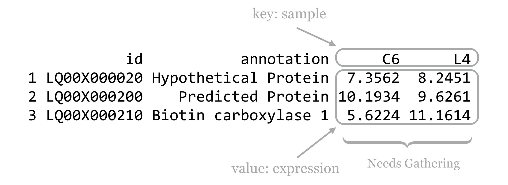
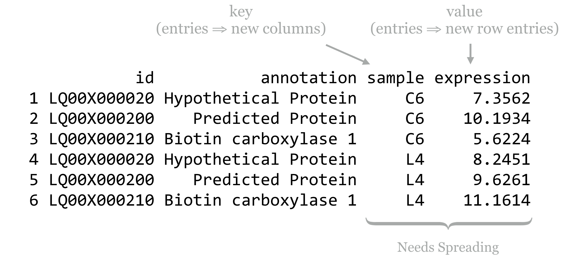

# Reshaping and Joining Data Frames

Looking back at the split-apply-combine analysis for the gene expression data, it's clear that the organization of the data worked in our favor (after we split the `sample` column into `genotype`, `treatment`, and other columns, at least). In particular, each row of the data frame represented a single measurement, and each column represented a variable (values that vary across measurements). This allowed us to easily group measurements by the ID column. It also worked well when building the linear model, as `lm()` uses a formula describing the relationship of equal-length vectors or columns (e.g., `expr$expression ~ expr$treatment + expr$genotype`), which are directly accessible as columns of the data frame.

Data are often not organized in this "tidy" format. This data set, for example, was originally in a file called [`expr_wide.txt`](data/expr_wide.txt) with the following format:

<pre id=part3-09-data_wide
     class="language-txt
            line-numbers
            linkable-line-numbers">
<code>
         id C6_chemical_A1 C6_chemical_A3 C6_chemical_B1 C6_chemical_B2 ...
LQ00X000020       4.831259       4.784184       5.577741       5.143742 ...
LQ00X000200      14.046963      14.045607      14.448088      14.927930 ...
LQ00X000210      12.546436      12.410848      12.566147      12.638267 ...
LQ00X000280      10.002939      10.162578       9.425349       9.774258 ...
LQ00X000290      11.930745      10.757338      11.769187      12.391130 ...
LQ00X000300       5.146014       5.386916       6.048761       5.263776 ...
...
</code></pre>

Data formats like this are frequently more convenient for human readers than machines. Here, the `id` and `annotation` columns (the latter not shown) are variables as before, but the other column names each encode a variety of variables, and each row represents a large number of measurements. Data in this "shape" would be much more difficult to analyze with the tools we've covered so far.

Converting between this format and the preferred format (and back) is the primary goal of the `tidyr` package. As usual, this package can be installed in the interactive interpreter with `install.packages("tidyr")`. The older `reshape2` package also handles this sort of data reorganization, and while the functions provided there are more flexible and powerful, `tidyr` covers the majority of needs while being easier to use.

### Gathering for Tidiness {-}

The `gather()` function in the `tidyr` package makes most untidy data frames tidier. The first parameter taken is the data frame to fix up, and the second and third are the "key" and "value" names for the newly created columns, respectively (without quotes). The remaining parameters specify the column names that need to be tidied (again, without quotes). Suppose we had a small, untidy data frame called `expr_small`, with columns for `id`, `annotation`, and columns for expression in the `C6` and `L4` genotypes.

  

In this case, we would run the `gather()` function as follows, where `sample` and `expression` are the new column names to create, and `C6` and `L4` are the columns that need tidying. (Notice the lack of quotation marks on all column names; this is common to both the `tidyr` and `dplyr` packages' syntactic sugar.)

<pre id=part3-09-gather_small
     class="language-r
            line-numbers
            linkable-line-numbers">
<code>
library(tidyr)

expr_gathered_small <- gather(expr_small, sample, expression, C6, L4)
print(expr_gathered_small)
</code></pre>

<pre id=part3-09-gather_small_out
     class="language-txt
            line-numbers
            linkable-line-numbers">
<code>
           id           annotation sample expression
1 LQ00X000020 Hypothetical Protein     C6     7.3562
2 LQ00X000200    Predicted Protein     C6    10.1934
3 LQ00X000210 Biotin carboxylase 1     C6     5.6224
4 LQ00X000020 Hypothetical Protein     L4     8.2451
5 LQ00X000200    Predicted Protein     L4     9.6261
6 LQ00X000210 Biotin carboxylase 1     L4    11.1614
</code></pre>

Notice that the data in the nongathered, nontidied columns (`id` and `annotation`) have been repeated as necessary. If no columns to tidy have been specified (`C6` and `L4` in this case), the `gather()` assumes that all columns need to be reorganized, resulting in only two output columns (`sample` and `expression`). This would be obviously incorrect in this case.

Listing all of the column names that need tidying presents a challenge when working with wide data frames like the full expression data set. To gather this table, we'd need to run `gather(expr_wide, sample, expression, C6_chemical_A1, C6_chemical_A3, C6_chemical_B1,` and so on, listing each of the 35 column names. Fortunately, `gather()` accepts an additional bit of syntactic sugar: using `-` and specifying the columns that don't need to be gathered. We could thus gather the full data set with

<pre id=part3-09-gather_full_minus
     class="language-r
            line-numbers
            linkable-line-numbers">
<code>
expr_gathered <- gather(expr_wide, sample, expression, -id, -annotation)
</code></pre>

The `gather()` function takes a few other optional parameters, for example, for removing rows with `NA` values. See `help("gather")` in the interactive interpreter for more information.

### Ungathering with `spread()` {-}

While this organization of the data — with each row being an observation and each column being a variable — is usually most convenient for analysis in R, sharing data with others often isn't. People have an affinity for reading data tables where many measurements are listed in a single row, whereas "tidy" versions of data tables are often long with many repeated entries. Even when programmatically analyzing data tables, sometimes it helps to have multiple measurements in a single row. If we wanted to compute the difference between the `C6` and `L4` genotype expressions for each treatment condition, we might wish to have `C6_expression` and `L4_expression` columns, so that we can later use vectorized subtraction to compute a `C6_L4_difference` column.

The `spread()` function in the `tidyr` provides this, and in fact is the complement to the `gather()` function. The three important parameters are (1) the data frame to spread, (2) the column to use as the "key," and (3) the column to use as the "values." Consider the `expr_gathered_small` data frame from above.

  

Converting this data frame back into the "wide" version is as simple as:

<pre id=part3-09-spread
     class="language-r
            line-numbers
            linkable-line-numbers">
<code>
expr_small <- spread(expr_gathered_small, sample, expression)
print(expr_small)
</code></pre>

<pre id=part3-09-spread_out
     class="language-txt
            line-numbers
            linkable-line-numbers">
<code>
           id           annotation      C6      L4
1 LQ00X000020 Hypothetical Protein  7.3562  8.2451
2 LQ00X000200    Predicted Protein 10.1934  9.6261
3 LQ00X000210 Biotin carboxylase 1  5.6224 11.1614
</code></pre>

Because the entries in the "key" column name become new column names, it would usually be a mistake to use a numeric column here. In particular, if we were to mix up the order and instead run `spread(expr_gathered_small, expression, sample)`, we'd end up with a column for each unique value in the `expression` column, which could easily number in the hundreds of thousands and would likely crash the interpreter.

In combination with `group_by()`, `do()`, and `summarize()` from the `dplyr` package, `gather()` and `spread()` can be used to aggregate and analyze tabular data in an almost limitless number of ways. Both the `dplyr` and `tidyr` packages include a number of other functions for working with data frames, including filtering rows or columns by selection criteria and organizing rows and columns.

### Splitting Columns {-}

In chapter 35, "[Character and Categorical Data](#character-and-categorical-data)," we learned how to work with character vectors using functions like `str_split_fixed()` to split them into pieces based on a pattern, and `str_detect()` to produce a logical vector indicating which elements matched a pattern. The `tidyr` package also includes some specialized functions for these types of operations. Consider a small data frame `expr_sample` with columns for `id`, `expression`, and `sample`, like the precleaned data frame considered in previous chapters.

<pre id=part3-09-expr_sample
     class="language-txt
            line-numbers
            linkable-line-numbers">
<code>
           id expression        sample
1 LQ00X000020   5.024142 C6_control_A1
2 LQ00X000020   4.646697 C6_control_A3
3 LQ00X000020   4.986592 C6_control_B1
4 LQ00X000020   5.164292 C6_control_B2
5 LQ00X000020   5.348810 C6_control_B3
6 LQ00X000020   5.519393 C6_control_C1
</code></pre>

The `tidyr` function `separate()` can be used to quickly split a (character or factor) column into multiple columns based on a pattern. The first parameter is the data frame to work on, the second is the column to split within that data frame, the third specifies a character vector of newly split column names, and the fourth optional `sep =` parameter specifies the pattern ([regular expression](#regular-expressions)) to split on.

<pre id=part3-09-expr_sample_separate
     class="language-r
            line-numbers
            linkable-line-numbers">
<code>
expr_sample_separated <- separate(expr_sample,
                                 sample,
                                 c("genotype", "treatment", "tissuerep"),
                                 sep = "_")
print(expr_sample_separated)
</code></pre>

<pre id=part3-09-expr_sample_separate_out
     class="language-txt
            line-numbers
            linkable-line-numbers">
<code>
           id expression genotype treatment tissuerep
1 LQ00X000020   5.024142       C6   control        A1
2 LQ00X000020   4.646697       C6   control        A3
3 LQ00X000020   4.986592       C6   control        B1
4 LQ00X000020   5.164292       C6   control        B2
5 LQ00X000020   5.348810       C6   control        B3
6 LQ00X000020   5.519393       C6   control        C1
</code></pre>

Similarly, the `extract()` function splits a column into multiple columns based on a pattern (regular expression), but the pattern is more general and requires an understanding of regular expressions and [back-referencing](#back-referencing) using `()` capture groups. Here, we'll use the regular expression pattern `"([A-Z])([0-9])"` to match any single capital letter followed by a single digit, each of which get captured by a pair of parentheses. These values will become the entries for the newly created columns.

<pre id=part3-09-expr_sample_extract
     class="language-r
            line-numbers
            linkable-line-numbers">
<code>
expr_sample_extracted <- extract(expr_sample_separated,
                                 tissuerep,
                                 c("tissue", "rep"),
                                 regex = "([A-Z])([0-9])")
print(expr_sample_extracted)
</code></pre>

<pre id=part3-09-expr_sample_extract_out
     class="language-txt
            line-numbers
            linkable-line-numbers">
<code>
           id expression genotype treatment tissue rep
1 LQ00X000020   5.024142       C6   control      A   1
2 LQ00X000020   4.646697       C6   control      A   3
3 LQ00X000020   4.986592       C6   control      B   1
4 LQ00X000020   5.164292       C6   control      B   2
5 LQ00X000020   5.348810       C6   control      B   3
6 LQ00X000020   5.519393       C6   control      C   1
</code></pre>

Although we covered regular expressions in earlier chapters, for entries like `C6_control_b3` where we assume the encoding is well-described, we could use a regular expression like `"(C6|L4)_(control|chemical)_(A|B|C)(1|2|3)"`.

While these functions are convenient for working with columns of data frames, an understanding of `str_split_fixed()` and `str_detect()` is nevertheless useful for working with character data in general.

### Joining/Merging Data Frames, `cbind()` and `rbind()` {-}

Even after data frames have been reshaped and otherwise massaged to make analyses easy, occasionally similar or related data are present in two different data frames. Perhaps the annotations for a set of gene IDs are present in one data frame, while the p values from statistical results are present in another. Usually, such tables have one or more columns in common, perhaps an `id` column.

Sometimes, each entry in one of the tables has a corresponding entry in the other, and vice versa. More often, some entries are shared, but others are not. Here's an example of two small data frames where this is the case, called `heights` and `ages`.

<pre id=part3-09-height_age
     class="language-txt
            line-numbers
            linkable-line-numbers">
<code>
<b>heights</b>
     first     last           height
1    Joe       Withermore     5.5
2    Mary      O'Leary        5.2
3    Brent     Liston         6.1
4    Karen     Streeter       5.3

<b>ages</b>
     first     last      age
1    Brent     Liston    27
2    Joe       Jones     19
3    Karen     Streeter  22
4    Chris     Peterson  34
</code></pre>

The `merge()` function (which comes with the basic installation of R) can quickly join these two data frames into one. By default, it finds all columns that have common names, and uses all entries that match in all of those columns. Here's the result of `merge(heights, ages)`:

<pre id=part3-09-merge_height_age
     class="language-txt
            line-numbers
            linkable-line-numbers">
<code>
  first     last height age
1 Brent   Liston    6.1  27
2 Karen Streeter    5.3  22
</code></pre>

This is much easier to use than the command line [join](#join) program: it can join on multiple columns, and the rows do not need to be in any common order. If we like, we can optionally specify a `by =` parameter, to specify which column names to join by as a character vector of column names. Here's `merge(heights, ages, by = c("first"))`:

<pre id=part3-09-merge_heights_ages_by_first
     class="language-txt
            line-numbers
            linkable-line-numbers">
<code>
  first   last.x height   last.y age
1 Brent   Liston    6.1   Liston  27
2   Joe Withmore    5.5    Jones  19
3 Karen Streeter    5.3 Streeter  22
</code></pre>

Because we specified that the joining should only happen by the first column, `merge()` assumed that the two columns named `last` could contain different data and thus should be represented by two different columns in the output.

By default, `merge()` produces an "inner join," meaning that rows are present in the output only if entries are present for both the left (`heights`) and right (`ages`) inputs. We can specify `all = TRUE` to perform a full "outer join." Here's `merge(heights, ages, all = TRUE)`.

<pre id=part3-09-merge_heights_ages_all
     class="language-txt
            line-numbers
            linkable-line-numbers">
<code>
  first     last height age
1 Brent   Liston    6.1  27
2   Joe Withmore    5.5  NA
3   Joe    Jones     NA  19
4 Karen Streeter    5.3  22
5  Mary  O'Leary    5.2  NA
6 Chris Peterson     NA  34
</code></pre>

In this example, `NA` values have been placed for entries that are unspecified. From here, rows with `NA` entries in either the `height` or `age` column can be removed with row-based selection and `is.na()`, or a "left outer join" or "right outer join," can be performed with `all.x = TRUE` or `all.y = TRUE`, respectively.

In [chapter 35](#character-and-categorical-data), we also looked at `cbind()` after splitting character vectors into multicolumn data frames. This function binds two data frames into a single one on a column basis. It won't work if the two data frames don't have the same number of rows, but it will work if the two data frames have column names that are identical, in which case the output data frame might confusingly have multiple columns of the same name. This function will also leave the data frame rows in their original order, so be careful that the order of rows is consistent before binding. Generally, using `merge()` to join data frames by column is preferred to `cbind()`, even if it means ensuring some identifier column is always present to serve as a binding column.

The `rbind()` function combines two data frames that may have different numbers of rows but have the same number of columns. Further, the column names of the two data frames must be identical. If the types of data are different, then after being combined with `rbind()`, columns of different types will be converted to the most general type using the same rules when [mixing](#type_mixing) types within vectors.

Using `rbind()` requires that the data from each input vector be copied to produce the output data frame, even if the variable name is to be reused as in `df <- rbind(df, df2)`. Wherever possible, data frames should be generated with a split-apply-combine strategy (such as with `group_by()` and `do()`) or a reshaping technique, rather than with many repeated applications of `rbind()`.

#### Exercises {-}

1. As discussed in exercises in Chapter 36, [Split, Apply, Combine](#split-apply-combine), the built-in `CO2` data frame contains measurements of CO2 uptake rates for different plants in different locations under different ambient CO2 concentrations.

     Use the `spread()` function in the `tidyr` library to produce a `CO2_spread` data frame that looks like so:
     
     <pre id=part3-09-ex1
     class="language-txt
            line-numbers
            linkable-line-numbers">
<code>
   Plant        Type  Treatment   95  175  250  350  500  675 1000
1    Qn1      Quebec nonchilled 16.0 30.4 34.8 37.2 35.3 39.2 39.7
2    Qn2      Quebec nonchilled 13.6 27.3 37.1 41.8 40.6 41.4 44.3
3    Qn3      Quebec nonchilled 16.2 32.4 40.3 42.1 42.9 43.9 45.5
4    Qc1      Quebec    chilled 14.2 24.1 30.3 34.6 32.5 35.4 38.7
5    Qc3      Quebec    chilled 15.1 21.0 38.1 34.0 38.9 39.6 41.4
...
</code></pre>

     Next, undo this operation with a `gather()`, re-creating the `CO2` data frame as `CO2_recreated`.

2. Occasionally, we want to "reshape" a data frame while simultaneously computing summaries of the data. The `reshape2` package provides some sophisticated functions for this type of computation (specifically `melt()` and `cast()`), but we can also accomplish these sorts of tasks with `group_by()` and `do()` (or `summarize()`) from the `dplyr` package in combination with `gather()` and `spread()` from `tidyr`.

     From the `CO2` data frame, generate a data frame like the following, where the last two columns report mean uptake for each `Type`/`conc` combination:

     <pre id=part3-09-ex2
     class="language-txt
            line-numbers
            linkable-line-numbers">
<code>
          Type conc nonchilled_mean_uptake chilled_mean_uptake
1       Quebec   95               15.26667            12.86667
2       Quebec  175               30.03333            24.13333
3       Quebec  250               37.40000            34.46667
4       Quebec  350               40.36667            35.80000
5       Quebec  500               39.60000            36.66667
6       Quebec  675               41.50000            37.50000
7       Quebec 1000               43.16667            40.83333
8  Mississippi   95               11.30000             9.60000
9  Mississippi  175               20.20000            14.76667
10 Mississippi  250               27.53333            16.10000
...
</code></pre>

     You'll likely want to start by computing appropriate group-wise means from the original `CO2` data.

3. The built-in data frames `beaver1` and `beaver2` describe body temperature and activity observations of two beavers. Merge these two data frames into a single one that contains all the data and looks like so:

     <pre id=part3-09-ex3
     class="language-txt
            line-numbers
            linkable-line-numbers">
<code>
    day time  temp activ    name
1   307  930 36.58     0 beaver2
2   307  940 36.73     0 beaver2
3   307  950 36.93     0 beaver2
4   307 1000 37.15     0 beaver2
5   307 1010 37.23     0 beaver2
...
</code></pre>

     Notice the column for `name` — be sure to include this column so it is clear to which beaver each measurement corresponds!

