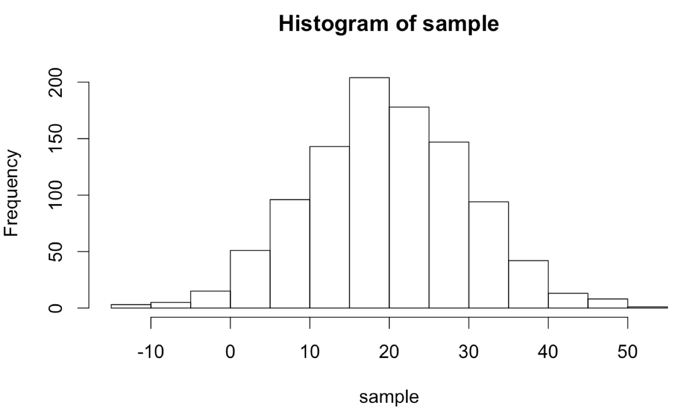
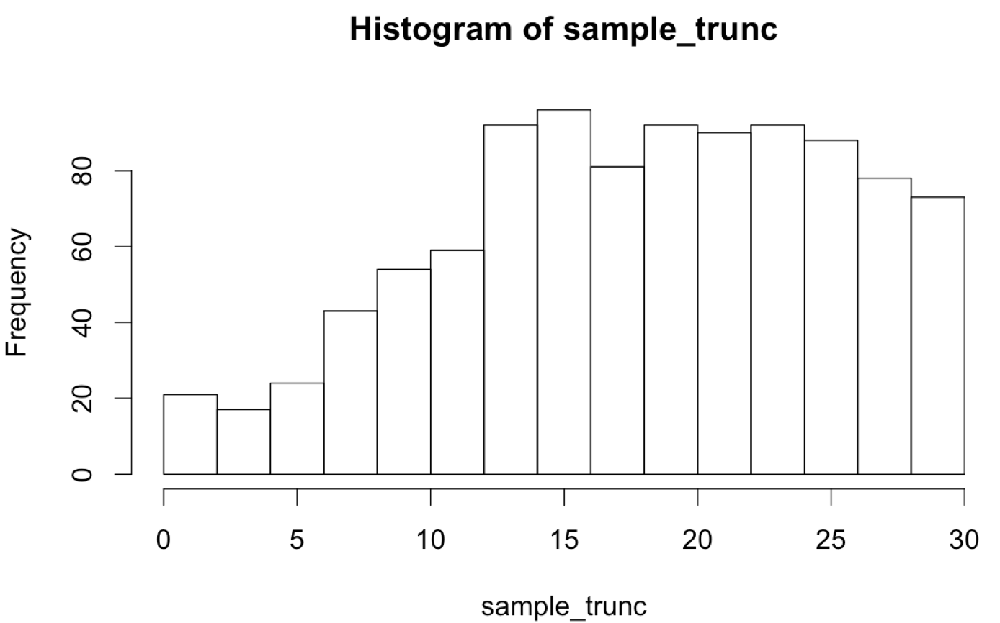
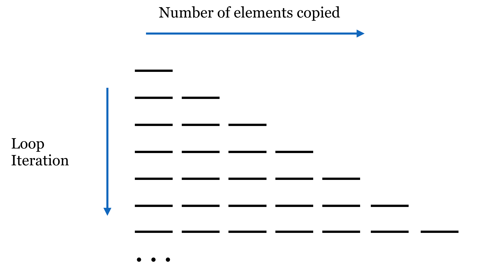
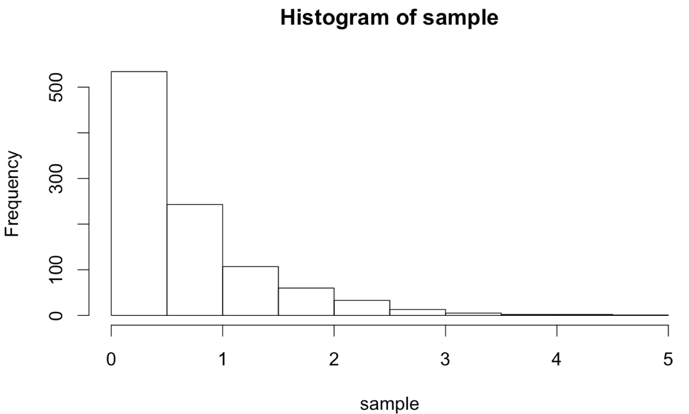
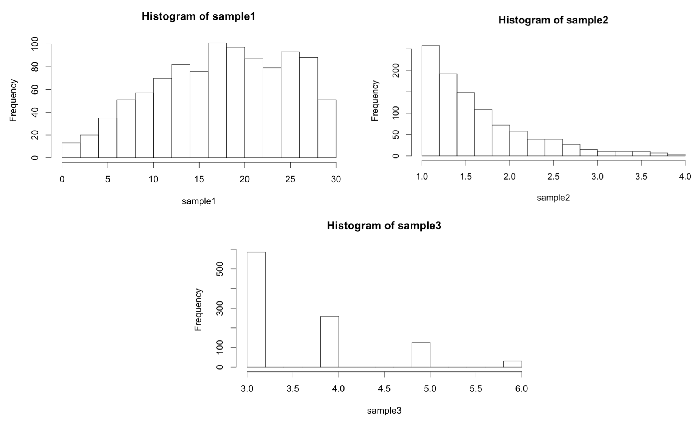

# Procedural Programming

For many (perhaps most) languages, control-flow structures like `for`-loops and `if`-statements are fundamental building blocks for writing useful programs. By contrast, in R, we can accomplish a lot by making use of vectorized operations, vector recycling, logical indexing, split-apply-combine, and so on. In general, R heavily emphasizes vectorized and functional operations, and these approaches should be used when possible; they are also usually optimized for speed. Still, R provides the standard repertoire of loops and conditional structures (which form the basis of the "procedural programming" paradigm) that can be used when other methods are clumsy or difficult to design. We've already seen functions, of course, which are incredibly important in the vast majority of programming languages.

### Conditional Looping with While-Loops {-}

A while-loop executes a [block](#block) of code over and over again, testing a given condition (which should be or return a logical vector) before each execution. In R, blocks are delineated with a pair of curly brackets. Standard practice is to place the first opening bracket on the line, defining the loop and the closing bracket on a line by itself, with the enclosing block indented by two spaces.

<pre id=part3-10-while
     class="language-r
            line-numbers
            linkable-line-numbers">
<code>
count <- 1

while(count < 4) {
  print("Count is: ")
  print(count)
  count <- count + 1
}

print("Done!")
</code></pre>

In the execution of the above, when the `while(count < 4)` line is reached, `count < 4` is run and returns the single-element logical vector `TRUE`, resulting in the block being run and printing `"Count is: "` and `1`, and then incrementing `count` by 1. Then the loop returns to the check; `count` being 2 is still less than 4, so the printing happens and `count` is incremented again to 3. The loop starts over, the check is executed, output is printed, and count is incremented to 4. The loop returns back to the top, but this time `count < 4` results in `FALSE`, so the block is skipped, and finally execution moves on to print `"Done!"`.

<pre id=part3-10-while_out
     class="language-txt
            line-numbers
            linkable-line-numbers">
<code>
[1] "Count is: "
[1] 1
[1] "Count is: "
[1] 2
[1] "Count is: "
[1] 3
[1] "Done!"
</code></pre>

Because the check happens at the start, if `count` were to start at some larger number like `5`, then the loop block would be skipped entirely and only `"Done!"` would be printed.

Because no "naked data" exist in R and vectors are the most basic unit, the logical check inside the `while()` works with a logical vector. In the above, that vector just happened to have only a single element. What if the comparison returned a longer vector? In that case, only the first element of the logical vector will be considered by the `while()`, and a warning will be issued to the effect of `condition has length > 1`. This can have some strange consequences. Consider if instead of `count <- 1`, we had `count <- c(1, 100)`. Because of the vectorized nature of addition, the output would be:

<pre id=part3-10-while2_out
     class="language-txt
            line-numbers
            linkable-line-numbers">
<code>
[1] "Count is: "
[1]   1 100
[1] "Count is: "
[1]   2 101
[1] "Count is: "
[1]   3 102
Warning messages:
1: In while (count < 4) { :
  the condition has length > 1 and only the first element will be used
2: In while (count < 4) { :
  the condition has length > 1 and only the first element will be used
3: In while (count < 4) { :
  the condition has length > 1 and only the first element will be used
4: In while (count < 4) { :
  the condition has length > 1 and only the first element will be used
[1] "Done!"
</code></pre>

Two handy functions can provide a measure of safety from such errors when used with simple conditionals: `any()` and `all()`. Given a logical vector, these functions return a single-element logical vector indicating whether any, or all, of the elements in the input vector are `TRUE`. Thus our `while`-loop conditional above might better be coded as `while(any(count < 4))`. (Can you tell the difference between this and `while(any(count) < 4)`?)

### Generating Truncated Random Data, Part I {-}

The unique statistical features of R can be combined with control-flow structures like `while`-loops in interesting ways. R excels at generating random data from a given distribution; for example, `rnorm(1000, mean = 20, sd = 10)` returns a 100-element numeric vector with values sampled from a normal distribution with mean 20 and standard deviation 10.

<pre id=part3-10-rnorm_hist
     class="language-r
            line-numbers
            linkable-line-numbers">
<code>
sample <- rnorm(1000, mean = 20, sd = 10)
hist(sample)
</code></pre>

Although we'll cover plotting in more detail later, the `hist()` function allows us to produce a basic histogram from a numeric vector. (Doing so requires a graphical interface like Rstudio for easily displaying the output. See chapter 40, "[Plotting Data and `ggplot2`](#plotting-data-and-ggplot2)," for details on plotting in R.)

  

What if we wanted to sample numbers originally from this distribution, but limited to the range 0 to 30? One way to do this is by "resampling" any values that fall outside of this range. This will effectively truncate the distribution at these values, producing a new distribution with altered mean and standard deviation. (These sorts of "truncated by resampling" distributions are sometimes needed for simulation purposes.)

Ideally, we'd like a function that encapsulates this idea, so we can say `sample <- rnorm_trunc(0, 30, 1000, mean = 20, sd = 10)`. We'll start by defining our function, and inside the function we'll first produce an initial sample.

<pre id=part3-10-rnorm_trunc_1
     class="language-r
            line-numbers
            linkable-line-numbers">
<code>
rnorm_trunc <- function(lower, upper, count, mean, sd) { 
  sample <- rnorm(count, mean = mean, sd = sd)
  
  return(sample)
}
</code></pre>

Note the usage of `mean = mean` in the call to `rnorm()`. The right-hand side refers to the parameter passed to the `rnorm_trunc()` function, the left-hand side refers to the parameter taken by `rnorm()`, and the interpreter has no problem with this usage.

Now, we'll need to "fix" the sample so long as any of the values are less than `lower` or greater than `upper`. We'll check as many times as needed using a `while`-loop.

<pre id=part3-10-rnorm_trunc_2
     class="language-r
            line-numbers
            linkable-line-numbers">
<code>
rnorm_trunc <- function(lower, upper, count, mean, sd) {
  sample <- rnorm(count, mean = mean, sd = sd)

  while(any(sample < lower | sample > upper)) {
    # fix the sample
  
  }

  return(sample)
}
</code></pre>

If any values are outside the desired range, we don't want to just try an entirely new sample set, because the probability of generating just the right sample (within the range) is incredibly small, and we'd be looping for quite a while. Rather, we'll only resample those values that need it, by first generating a logical vector of "bad" elements. After that, we can generate a resample of the needed size and use [selective replacement](#selective_replacement) to replace the bad elements.

<pre id=part3-10-rnorm_trunc_3
     class="language-r
            line-numbers
            linkable-line-numbers">
<code>
rnorm_trunc <- function(lower, upper, count, mean, sd) {
  sample <- rnorm(count, mean = mean, sd = sd)

  while(any(sample < lower | sample > upper)) {
    # fix the sample
    bad <- sample < lower | sample > upper # logical
    bad_values <- sample[bad]
    count_bad <- length(bad_values)

    new_vals <- rnorm(count_bad, mean = mean, sd = sd)
    sample[bad] <- new_vals
  }

  return(sample)
}
</code></pre>

Let's try it:

<pre id=part3-10-rnorm_trunc_3_run
     class="language-r
            line-numbers
            linkable-line-numbers">
<code>
sample_trunc <- rnorm_trunc(0, 30, 1000, mean = 20, sd = 10)
hist(sample_trunc)
</code></pre>

The plotted histogram reflects the truncated nature of the data set:

  

### If-Statements {-}

An if-statement executes a block of code based on a conditional (like a while-loop, but the block can only be executed once). Like the check for `while`, only the first element of a logical vector is checked, so using `any()` and `all()` is suggested for safety unless we are sure the comparison will result in a single-element logical vector.

<pre id=part3-10-if_basic
     class="language-r
            line-numbers
            linkable-line-numbers">
<code>
# a single random number between 1 and 50
rand <- runif(1, min = 1, max = 50)

if(rand < 10) {
  print("The random number is less than 10")
} else if(rand < 20) {
  print("The random number is 10 or higher")
  print("But it's also less than 20")
} else if(rand < 30) {
  print("The random number is 20 or higher")
  print("And it's less than 30")
} else {
  print("The random number is 30 or higher")
}
</code></pre>

Like [if-statements in Python](#conditional-control-flow), each conditional is checked in turn. As soon as one evaluates to `TRUE`, that block is executed and all the rest are skipped. Only one block of an if/else chain will be executed, and perhaps none will be. The `if`-controlled block is required to start the chain, but one or more `else if`-controlled blocks and the final `else`-controlled block are optional.

In R, if we want to include one or more `else if` blocks or a single `else` block, the `else if()` or `else` keywords must appear on the same line as the previous closing curly bracket. This differs slightly from other languages and is a result of the way the R interpreter parses the code.

### Generating Truncated Random Data, Part II {-}

One of the issues with our `rnorm_trunc()` function is that if the desired range is small, it might still require many resampling efforts to produce a result. For example, calling `sample_trunc <- rnorm_trunc(15, 15.01, 1000, 20, 10)` will take a long time to finish, because it is rare to randomly generate values between 15 and 15.01 from the given distribution. Instead, what we might like is for the function to give up after some number of resamplings (say, 100,000) and return a vector containing `NA`, indicating a failed computation. Later, we can check the returned result with `is.na()`.

<pre id=part3-10-rnorm_trunc_na
     class="language-r
            line-numbers
            linkable-line-numbers">
<code>
rnorm_trunc <- function(lower, upper, count, mean, sd) {
  sample <- rnorm(count, mean = mean, sd = sd)
  looped <- 0

  while(any(sample < lower | sample > upper)) {
    # fix the sample
    bad <- sample < lower | sample > upper # logical
    bad_values <- sample[bad]
    count_bad <- length(bad_values)

    new_vals <- rnorm(count_bad, mean = mean, sd = sd)
    sample[bad] <- new_vals

    if(looped > 100000) {
      return(NA)
    }
    looped <- looped + 1
  }
  return(sample)
}

sample_trunc <- rnorm_trunc(0, 30, 1000, mean = 20, sd = 10)
if(!is.na(sample_trunc)) {
  hist(sample_trunc)
}
</code></pre>

The example so far illustrates a few different things:

1. `NA` can act as a placeholder in our own functions, much like `mean()` will return `NA` if any of the input elements are themselves `NA`.
2. If-statements may use `else if` and `else`, but they don't have to.
3. Functions may return from more than one point; when this happens, the function execution stops even if it's inside of a loop.^[Some programmers believe that functions should have only one return point, and it should always go at the end of a function. This can be accomplished by initializing the variable to return at the start of the function, modifying it as needed in the body, and finally returning at the end. This pattern is more difficult to implement in this type of function, though, where execution of the function needs to be broken out of from a loop.]
4. Blocks of code, such as those used by while-loops, if-statements, and functions, may be nested. It's important to increase the indentation level for all lines within each nested block; otherwise, the code would be difficult to read.

### For-Loops {-}

For-loops are the last control-flow structure we'll study for R. Much like while-loops, they repeat a block of code. For-loops, however, repeat a block of code once for each element of a vector (or list), setting a given variable name to each element of the vector (or list) in turn.

<pre id=part3-10-for_loop_basic
     class="language-r
            line-numbers
            linkable-line-numbers">
<code>
ids <- c("CYP6B", "CATB", "AGP4")

for(id_el in ids) {
  print("id_el is now: ")
  print(id_el)
}

print("Done!")
</code></pre>

<pre id=part3-10-for_loop_basic_out
     class="language-txt
            line-numbers
            linkable-line-numbers">
<code>
[1] "id_el is now: "
[1] "CYP6B"
[1] "id_el is now: "
[1] "CATB"
[1] "id_el is now: "
[1] "AGP4"
[1] "Done!"
</code></pre>

While for-loops are important in many other languages, they are not as crucial in R. The reason is that many operations are vectorized, and functions like `lapply()` and `do()` provide for repeated computation in an entirely different way.

There's a bit of lore holding that for-loops are slower in R than in other languages. One way to determine whether this is true (and to what extent) is to write a quick loop that iterates one million times, perhaps printing on every 1,000th iteration. (We accomplish this by keeping a loop counter and using the modulus operator `%%` to check whether the remainder of `counter` divided by `1000` is `0`.)

<pre id=part3-10-for_one_million
     class="language-r
            line-numbers
            linkable-line-numbers">
<code>
counter <- 1
for(i in seq(1, 1000000)) {
  if(counter%%1000 == 0) {
    print("Counter is now")
    print(counter)
  }
  counter <- counter + 1
}
</code></pre>

When we run this operation we find that, while not quite instantaneous, this loop doesn't take long at all. Here's a quick comparison measuring the time to execute similar code for a few different languages (without printing, which itself takes some time) on a 2013 MacBook Pro.

| Language | Loop 1 Million | Loop 100 Million |
|:---|:---|:---|
| R (version 3.1) | 0.39 seconds | ~30 seconds |
| Python (version 3.2) | 0.16 seconds | ~12 seconds |
| Perl (version 5.16) | 0.14 seconds | ~13 seconds |
| C (g++ version 4.2.1) | 0.0006 seconds | 0.2 seconds |

While R is the slowest of the bunch, it is "merely" twice as slow as the other interpreted languages, Python and Perl.

The trouble with R is not that for-loops are slow, but that one of the most common uses for them — iteratively lengthening a vector with `c()` or a data frame with `rbind()` — is very slow. If we wanted to illustrate this problem, we could modify the loop above such that, instead of adding one to `counter`, we increase the length of the `counter` vector by one with `counter <- c(counter, 1)`. We'll also modify the printing to reflect the interest in the length of the counter vector rather than its contents.

<pre id=part3-10-for_one_million_append
     class="language-r
            line-numbers
            linkable-line-numbers">
<code>
counter <- 1
for(i in seq(1, 1000000)) {
  if(length(counter)%%1000 == 0) {
    print("Length of counter is now")
    print(length(counter))
  }
  counter <- c(counter, 1)
}
</code></pre>

In this case, we find that the loop starts just as fast as before, but as the `counter` vector gets longer, the time between printouts grows. And it continues to grow and grow, because the time it takes to do a single iteration of the loop is depending on the length of the `counter` vector (which is growing).

To understand why this is the case, we have to inspect the line `counter <- c(counter, 1)`, which appends a new element to the `counter` vector. Let's consider a related set of lines, wherein two vectors are concatenated to produce a third.

<pre id=part3-10-concat_slow
     class="language-r
            line-numbers
            linkable-line-numbers">
<code>
first_names <- c("Joseph", "Robert")
last_names <- c("Anderson", "Wilson")
names <- c(first_names, last_names)

print(names)          # [1] "Joseph" "Robert" "Anderson" "Wilson"
print(first_names)    # [1] "Joseph" "Robert"
print(last_names)     # [1] "Anderson" "Wilson"
</code></pre>

In the above, `names` will be the expected four-element vector, but the `first_names` and `last_names` have not been removed or altered by this operation — they persist and can still be printed or otherwise accessed later. In order to remove or alter items, the R interpreter copies information from each smaller vector into a new vector that is associated with the variable `names`.

Now, we can return to `counter <- c(counter, 1)`. The right-hand side copies information from both inputs to produce a new vector; this is then assigned to the variable `counter`. It makes little difference to the interpreter that the variable name is being reused and the original vector will no longer be accessible: the `c()` function (almost) always creates a new vector in RAM. The amount of time it takes to do this copying thus grows along with the length of the `counter` vector.

  

The total amount of time taken to append n elements to a vector in a for-loop this way is roughly $n^2/2$, meaning the time taken to grow a list of n elements grows quadratically in its final length! This problem is exacerbated when using `rbind()` inside of a for-loop to grow a data frame row by row (as in something like `df <- rbind(df, c(val1, val2, val3))`), as data frame columns are usually vectors, making `rbind()` a repeated application of `c()`.

One solution to this problem in R is to "preallocate" a vector (or data frame) of the appropriate size, and use replacement to assign to the elements in order using a carefully constructed loop.

<pre id=part3-10-prealloc
     class="language-r
            line-numbers
            linkable-line-numbers">
<code>
# pre-allocate a counter vector of length 1 million
counter <- rep(0, 1000000)
for(i in seq(1, 1000000)) {
  counter[i] <- 1
}
</code></pre>

(Here we're simply placing values of `1` into the vector, but more sophisticated examples are certainly possible.) This code runs much faster but has the downside of requiring that the programmer know in advance how large the data set will need to be.^[Another way to lengthen a vector or list in R is to assign to the index just off of the end of it, as in `counter[length(counter) + 1] <- val`. One might be tempted to use such a construction in a for-loop, thinking that the result will be the `counter` vector being modified "in place" and avoiding the expensive copying. One would be wrong, at least as of the time of this writing, because this line is actually syntactic sugar for a function call and assignment: ``counter <- `[<-`(counter, length(counter) + 1, val)``, which suffers the same problem as the `c()` function call.]

Does this mean we should never use loops in R? Certainly not! Sometimes looping is a natural fit for a problem, especially when it doesn't involve dynamically growing a vector, list, or data frame.

#### Exercises {-}

1. Using a for-loop and a preallocated vector, generate a vector of the first 100 Fibonacci numbers, 1, 1, 2, 3, 5, 8, and so on (the first two Fibonacci numbers are 1; otherwise, each is the sum of the previous two).

2. A line like `result <- readline(prompt = "What is your name?")` will prompt the user to enter their name, and store the result as a character vector in `result`. Using this, a while-loop, and an if-statement, we can create a simple number-guessing game.

    Start by setting `input <- 0` and `rand` to a random integer between 1 and 100 with `rand <- sample(seq(1,100), size = 1)`. Next, while `input != rand`: Read a guess from the user and convert it to an integer, storing the result in `input`. If `input < rand`, print `"Higher!"`, otherwise if `input > rand`, print `"Lower!"`, and otherwise report `"You got it!"`.

###### {- #wilcox_vs_test}

3. A paired student's *t*-test assesses whether two vectors reveal a significant mean element-wise difference. For example, we might have a list of student scores before a training session and after.

    <pre id=part3-10-ttest_paired
     class="language-r
            line-numbers
            linkable-line-numbers">
<code>
scores <- c(50, 35, 56, 36, 90)
scores_after <- c(70, 45, 50, 42, 91)
improvement_test <- t.test(scores, scores_after, paired = TRUE)
print(improvement_test)
</code></pre>

    But the paired *t*-test should only be used when the differences (which in this case could be computed with `scores_after - scores`) are normally distributed. If they aren't, a better test is the Wilcoxon signed-rank test:

    <pre id=part3-10-wilcoxon_paired
     class="language-r
            line-numbers
            linkable-line-numbers">
<code>
improvement_test <- wilcox.test(scores, scores_after, paired = TRUE)
print(improvement_test)
</code></pre>

    (While the *t*-test checks to determine whether the mean difference is significantly different from `0`, the Wilcoxon signed-rank test checks to determine whether the median difference is significantly different from `0`.)

    The process of determining whether data are normally distributed is not an easy one. But a function known as the Shapiro test is available in R, and it tests the null hypothesis that a numeric vector is not normally distributed. Thus the *p* value is small when data are not normal. The downside to a Shapiro test is that it and similar tests tend to be oversensitive to non-normality when given large samples. The `shapiro.test()` function can be explored by running `print(shapiro.test(rnorm(100, mean = 10, sd = 4)))` and `print(shapiro.test(rexp(100, rate = 2.0)))`.

    Write a function called `wilcox_or_ttest()` that takes two equal-length numeric vectors as parameters and returns a *p* value. If the `shapiro.test()` reports a *p* value of less than 0.05 on the difference of the vectors, the returned *p* value should be the result of a Wilcoxon rank-signed test. Otherwise, the returned *p* value should be the result of a `t.test()`. The function should also print information about which test is being run. Test your function with random data generated from `rexp()` and `rnorm()`.

### A Functional Extension {-}

Having reviewed the procedural control-flow structures `if`, `while`, and `for`, let's expand on our truncated random sampling example to explore more "functional" features of R and how they might be used. The function we designed, `rnorm_trunc()`, returns a random sample that is normally distributed but limited to a given range via resampling. The original sampling distribution is specified by the `mean =` and `sd =` parameters, which are passed to the call to `rnorm()` within `rnorm_trunc()`.

<pre id=part3-10-rnorm_trunc_review
     class="language-r
            line-numbers
            linkable-line-numbers">
<code>
rnorm_trunc <- function(lower, upper, count, mean, sd) {
  sample <- rnorm(count, mean = mean, sd = sd)
  looped <- 0

  while(any(sample < lower | sample > upper)) {
    # fix the sample
    bad <- sample < lower | sample > upper # logical
    bad_values <- sample[bad]
    count_bad <- length(bad_values)

    new_vals <- rnorm(count_bad, mean = mean, sd = sd)
    sample[bad] <- new_vals

    if(looped > 100000) {
      return(NA)
    }
    looped <- looped + 1
  }
  return(sample)
}
</code></pre>

What if we wanted to do the same thing, but for `rexp()`, which samples from an exponential distribution taking a `rate =` parameter?

<pre id=part3-10-rexp
     class="language-r
            line-numbers
            linkable-line-numbers">
<code>
sample <- rexp(1000, rate = 1.5)
hist(sample)
</code></pre>

The distribution normally ranges from 0 to infinity, but we might want to resample to, say, 1 to 4.

  

One possibility would be to write an `rexp_trunc()` function that operates similarly to the `rnorm_trunc()` function, with changes specific for sampling from the exponential distribution.

<pre id=part3-10-rexp_trunc
     class="language-r
            line-numbers
            linkable-line-numbers">
<code>
rexp_trunc <- function(lower, upper, count, rate) {
  sample <- rexp(count, rate = rate)
  looped <- 0

  while(any(sample < lower | sample > upper)) {
    # fix the sample
    bad <- sample < lower | sample > upper # logical
    bad_values <- sample[bad]
    count_bad <- length(bad_values)

    new_vals <- rexp(count_bad, rate = rate)
    sample[bad] <- new_vals

    if(looped > 100000) {
      return(NA)
    }
    looped <- looped + 1
  }
  return(sample)
}
</code></pre>

The two functions `rnorm_trunc()` and `rexp_trunc()` are incredibly similar — they differ only in the sampling function used and the parameters passed to them. Can we write a single function to do both jobs? We can, if we remember two important facts we've learned about functions and parameters in R.

1. Functions like `rnorm()` and `rexp()` are a type of data like any other and so can be passed as parameters to other functions (as in the split-apply-combine strategy).
2. The special parameter `...` "collects" parameters so that functions can take arbitrary parameters.

Here, we'll use `...` to collect an arbitrary set of parameters and pass them on to internal function calls. When defining a function to take `...`, it is usually specified last. So, we'll write a function called `sample_trunc()` that takes five parameters:

1. The lower limit, `lower`.
2. The upper limit, `upper`.
3. The sample size to generate, `count`.
4. The function to call to generate samples, `sample_func`.
5. Additional parameters to pass on to `sample_func`, `...`.

<pre id=part3-10-sample_trunc
     class="language-r
            line-numbers
            linkable-line-numbers">
<code>
sample_trunc <- function(lower, upper, count, sample_func, ...) {
  sample <- sample_func(count, ...)
  looped <- 0

  while(any(sample < lower | sample > upper)) {
    # fix the sample
    bad <- sample < lower | sample > upper # logical
    bad_values <- sample[bad]
    count_bad <- length(bad_values)

    new_vals <- sample_func(count_bad, ...)
    sample[bad] <- new_vals

    if(looped > 100000) {
      return(NA)
    }
    looped <- looped + 1
  }
  return(sample)
}
</code></pre>

We can call our `sample_trunc()` function using any number of sampling functions. We've seen `rnorm()`, which takes `mean =` and `sd =` parameters, and `rexp()`, which takes a `rate =` parameter, but there are many others, like `dpois()`, which generates Poisson distributions and takes a `lambda =` parameter.

<pre id=part3-10-sample_trunc_use
     class="language-r
            line-numbers
            linkable-line-numbers">
<code>
sample1 <- sample_trunc(0, 30, 1000, rnorm, mean = 20, sd = 10)
sample2 <- sample_trunc(1, 4, 1000, rexp, rate = 1.5)
sample3 <- sample_trunc(3, 6, 1000, rpois, lambda = 2)

if(!is.na(sample1)) {
  hist(sample1)
}

if(!is.na(sample2)) {
  hist(sample2)
}

if(!is.na(sample3)) {
  hist(sample3)
}
</code></pre>

In the first example above, `mean = 20, sd = 10` is collated into `...` in the call to `sample_trunc()`, as is `rate = 1.5` in the second example and `lambda = 2` in the third example.

  

#### Exercises {-}

1. As discussed in a [previous exercise](#wilcox_vs_test), the `t.test()` and `wilcox.test()` functions both take two numeric vectors as their first parameters, and return a list with a `$p.value` entry. Write a function `pval_from_test()` that takes four parameters: the first two should be two numeric vectors (as in the `t.test()` and `wilcox.test()` functions), the third should be a test function (either `t.test` or `wilcox.test`), and the fourth should be any optional parameters to pass on (`...`). It should return the *p* value of the test run.

    We should then be able to run the test like so:

    <pre id=part3-10-functional_ttest_wilcox_test
     class="language-r
            line-numbers
            linkable-line-numbers">
<code>
sample1 <- rnorm(20, mean = 10, sd = 3)
sample2 <- rnorm(20, mean = 20, sd = 3)

pval1 <- pval_from_test(sample1, sample2, t.test)
pval2 <- pval_from_test(sample1, sample2, wilcox.test)
pval3 <- pval_from_test(sample1, sample2, t.test, paired = TRUE)
pval4 <- pval_from_test(sample1, sample2, wilcox.test, paired = TRUE)
</code></pre>

    The four values `pval1`, `pval2`, `pval3`, and `pval4` should contain simple *p* values.

