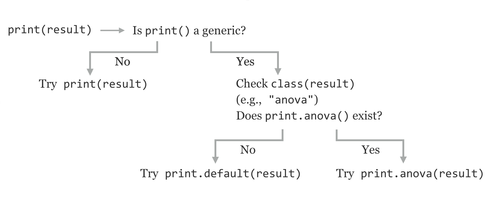

# Objects and Classes in R

In the chapters covering Python, we spent a fair amount of time discussing [objects](#object) and their blueprints, known as classes. Generally speaking, an object is a collection of data along with functions (called "methods" in this context) designed specifically to work on that data. Classes comprise the definitions of those methods and data.

As it turns out, while functions are the major focus in R, objects are also an important part of the language. (By no means are any of these concepts mutually exclusive.) While class definitions are nicely encapsulated in Python, in R, the pieces are more distributed, at least for the oldest and most commonly used "S3" system we'll discuss here.^[Modern versions of R have not one, not two, but *three* different systems for creating and working with objects. We'll be discussing only the oldest and still most heavily used, known as S3. The other two are called S4 and Reference Classes, the latter of which is most similar to the class/object system used by Python. For more information on these and other object systems (and many other advanced R topics), see Norman Matloff, *The Art of R Programming* (San Francisco: No Starch Press, 2011), and Hadley Wickham, *Advanced R* (London: Chapman and Hall/CRC, 2014).] With this in mind, it is best to examine some existing objects and methods before attempting to design our own. Let's consider the creation of a small, linear model for some sample data.

<pre id=part3-11-small_lm_anova
     class="language-r
            line-numbers
            linkable-line-numbers">
<code>
treatments <- c("w", "w", "p", "p")
heights <- c(4.2, 5.4, 2.1, 3.2)
lm_result <- lm(heights ~ treatments)
anova_result <- anova(lm_result)
</code></pre>

In chapter 33, "[Lists and Attributes](#lists-and-attributes)," we learned that functions like `lm()` and `anova()` generally return a list (or a data frame, which is a type of list), and we can inspect the structure with `str()`.

<pre id=part3-11-small_lm_anova_str
     class="language-r
            line-numbers
            linkable-line-numbers">
<code>
print("Structure of lm_result:")
str(lm_result)
print("Structure of anova_result:")
str(anova_result)
</code></pre>

Here's a sampling of the output lines for each call (there are quite a few pieces of data contained in the `lm_result` list):

<pre id=part3-11-small_lm_anova_str_out
     class="language-txt
            line-numbers
            linkable-line-numbers">
<code>
[1] "Structure of lm_result:"
List of 13
 $ coefficients : Named num [1:2] 2.65 2.15
  ..- attr(*, "names")= chr [1:2] "(Intercept)" "treatmentsw"
...
  .. .. .. ..- attr(*, "names")= chr [1:2] "heights" "treatments"
 - attr(*, "class")= chr "lm"
[1] "Structure of anova_result:"
Classes ‘anova’ and 'data.frame': 2 obs. of  5 variables:
 $ Df     : int  1 2
 $ Sum Sq : num  4.62 1.33
 $ Mean Sq: num  4.622 0.663
 $ F value: num  6.98 NA
 $ Pr(>F) : num  0.118 NA
 - attr(*, "heading")= chr  "Analysis of Variance Table\n" "Response: heights"
</code></pre>

If these two results are so similar—both types of lists—then why are the outputs so different when we call `print(lm_result)`

<pre id=part3-11-print_lm
     class="language-txt
            line-numbers
            linkable-line-numbers">
<code>
Call:
lm(formula = heights ~ treatments)

Coefficients:
(Intercept)  treatmentsw  
       2.65         2.15
</code></pre>

and `print(anova_result)`?

<pre id=part3-11-print_anova
     class="language-txt
            line-numbers
            linkable-line-numbers">
<code>
Analysis of Variance Table

Response: heights
           Df Sum Sq Mean Sq F value Pr(>F)
treatments  1 4.6225  4.6225  6.9774 0.1184
Residuals   2 1.3250  0.6625
</code></pre>

How these printouts are produced is dictated by the `"class"` attribute of these lists, `"lm"` for `lm_result` and `"anova"` for `anova_result`. If we were to remove this attribute, we would get a default printed output similar to the result of `str()`. There are several ways to modify or remove the class attribute of a piece of data: using the `attr()` accessor function with `attr(lm_result, "class") <- NULL`, setting it using the more preferred `class()` accessor, as in `class(lm_result) <- NULL`, or using the even more specialized `unclass()` function, as in `lm_result <- unclass(lm_result)`. In any case, running `print(lm_result)` after one of these three options will result in `str()`-like default printout.

Now, how does R produce different output based on this class attribute? When we call `print(lm_result)`, the interpreter notices that the `"class"` attribute is set to `"lm"`, and searches for another function with a different name to actually run: `print.lm()`. Similarly, `print(anova_result)` calls `print.anova()` on the basis of the class of the input. These specialized functions assume that the input list will have certain elements and produce an output specific to that data. We can see this by trying to confuse R by setting the class attribute incorrectly with `class(anova_result) <- "lm"` and then `print(anova_result)`:

<pre id=part3-11-print_anova_broken_class
     class="language-txt
            line-numbers
            linkable-line-numbers">
<code>
Call:
NULL

No coefficients
</code></pre>

###### {- #generic_function}

Notice that the class names are part of the function names. This is R's way of creating methods, stating that objects with class `"x"` should be printed with `print.x()`; this is known as dispatching and the general `print()` function is known as a *generic function*, whose purpose is to dispatch to an appropriate method (class-specific function) based on the class attribute of the input.

In summary, when we call `print(result)` in R, because `print()` is a generic function, the interpreter checks the `"class"` attribute of `result`; suppose the class is `"x"`. If a `print.x()` exists, that function will be called; otherwise, the print will fall back to `print.default()`, which produces output similar to `str()`.

  

There are many different `"print."` methods; we can see them with `methods("print")`.

<pre id=part3-11-print_methods
     class="language-txt
            line-numbers
            linkable-line-numbers">
<code>
  [1] print.acf*                                   
  [2] print.anova*                                 
  [3] print.aov*                                   
  [4] print.aovlist*                               
  [5] print.ar*                                    
  [6] print.Arima*                                 
...
</code></pre>

Similarly, there are a variety of `".lm"` methods specializing in dealing with data that have a `"class"` attribute of `"lm"`. We can view these with `methods(class = "lm")`.

<pre id=part3-11-lm_methods
     class="language-txt
            line-numbers
            linkable-line-numbers">
<code>
 [1] add1.lm*           alias.lm*          anova.lm*          case.names.lm*    
 [5] confint.lm         cooks.distance.lm* deviance.lm*       dfbeta.lm*        
 [9] dfbetas.lm*        drop1.lm*          dummy.coef.lm      effects.lm*       
[13] extractAIC.lm*     family.lm*         formula.lm*        hatvalues.lm*     
[17] influence.lm*      kappa.lm           labels.lm*         logLik.lm*        
[21] model.frame.lm*    model.matrix.lm    nobs.lm*           plot.lm*          
[25] predict.lm         print.lm*          proj.lm*           qr.lm*            
[29] residuals.lm       rstandard.lm*      rstudent.lm*       simulate.lm*      
[33] summary.lm         variable.names.lm* vcov.lm*          

   Non-visible functions are asterisked
</code></pre>

The message about nonvisible functions being asterisked indicates that, while these functions exist, we can't call them directly as in `print.lm(lm_result)`; we must use the generic `print()`. Many functions that we've dealt with are actually generics, including `length()`, `mean()`, `hist()`, and even `str()`.

So, in its own way R, is also quite "object oriented." A list (or other type, like a vector or data frame) with a given class attribute constitutes an object, and the various specialized methods are part of the class definition.

### Creating Our Own Classes {-}

Creating novel object types and methods is not something beginning R programmers are likely to do often. Still, an example will uncover more of the inner workings of R and might well be useful.

First, we'll need some type of data that we wish to represent with an object. For illustrative purposes, we'll use the data returned by the `nrorm_trunc()` function defined in chapter 38, "[Procedural Programming](#procedural-programming)." Rather than producing a vector of samples, we might also want to store with that vector the original sampling mean and standard deviation (because the truncated data will have a different actual mean and standard deviation). We might also wish to store in this object the requested upper and lower limits. Because all of these pieces of data are of different types, it makes sense to store them in a list.

<pre id=part3-11-trunc_sample_constructor
     class="language-r
            line-numbers
            linkable-line-numbers">
<code>
truncated_normal_sample <- function(lower, upper, count, mean, sd) {
  obj <- list()
  obj$sample <- rnorm_trunc(lower, upper, count, mean, sd)
  obj$lower <- lower
  obj$upper <- upper
  obj$original_mean <- mean
  obj$original_sd <- sd
  class(obj) <- "truncated_normal_sample"
  return(obj)
} 
</code></pre>

###### {- #constructor}

The function above returns a list with the various elements, including the sample itself. It also sets the class attribute of the list to `truncated_normal_sample` — by convention, this class attribute is the same as the name of the function. Such a function that creates and returns an object with a defined class is called a *constructor*.

Now, we can create an instance of a `"truncated_normal_sample"` object and print it.

<pre id=part3-11-trunc_norm_print
     class="language-r
            line-numbers
            linkable-line-numbers">
<code>
trsamp <- truncated_normal_sample(0, 30, 25, 20, 10)
print(trsamp)
</code></pre>

Because there is no `print.truncated_normal_sample()` function, however, the generic `print()` dispatches to `print.default()`, and the output is not pleasant.

<pre id=part3-11-trunc_norm_print_out
     class="language-txt
            line-numbers
            linkable-line-numbers">
<code>
$sample
 [1] 18.570116 28.058587 18.988116 23.923216 21.362590 27.071478  9.017976
 [8] 13.627638 14.859320  2.023175  1.335886 24.238769 19.714821  8.070529
[15]  5.084282 13.383528 22.007093  8.546593 11.442850 17.214193 17.037683
[22] 13.786232  7.832597 16.553821 17.877895

$lower
[1] 0

$upper
[1] 30

$original_mean
[1] 20

$original_sd
[1] 10

attr(,"class")
[1] "truncated_normal_sample"
</code></pre>

If we want to stylize the printout, we need to create the customized method. We might also want to create a customized `mean()` function that returns the mean of the stored sample.

<pre id=part3-11-trunc_norm_methods
     class="language-r
            line-numbers
            linkable-line-numbers">
<code>
print.truncated_normal_sample <- function(obj) {
  print("Truncated normal sample, limited to:")
  print(c(obj$lower, obj$upper))
  print("Original sampling mean and sd:")
  print(c(obj$original_mean, obj$original_sd))
  print("First 10 elements:")
  print(head(obj$sample, n = 10))
}

mean.truncated_normal_sample <- function(obj) {
  answer = mean(obj$sample)
  return(answer)
}

print("Printing trsamp")
print(trsamp)
print("Calling mean(trsamp)")
</code></pre>

The output:

<pre id=part3-11-trunc_norm_methods_out
     class="language-txt
            line-numbers
            linkable-line-numbers">
<code>
[1] "Printing trsamp"
[1] "Truncated normal sample, limited to:"
[1]  0 30
[1] "Original sampling mean and sd:"
[1] 20 10
[1] "First 10 elements:"
 [1] 15.21184 26.31239 11.38106 19.10591 24.98551 14.89133 23.83144 15.57210
 [9] 29.12310 20.32704
[1] "Calling mean(trsamp)"
[1] 19.20806
</code></pre>

This customized print function is rather crude; more sophisticated printing techniques (like `cat()` and `paste()`) could be used to produce friendlier output.

So far, we've defined a custom `mean.truncated_normal_sample()` method, which returns the mean of the sample when we call the generic function `mean()`. This works because the generic function `mean()` already exists in R. What if we wanted to call a generic called `originalmean()`, which returns the object's `original_mean`? In this case, we need to create our own specialized method as well as the generic function that dispatches to that method. Here's how that looks:

<pre id=part3-11-originalmean
     class="language-r
            line-numbers
            linkable-line-numbers">
<code>
# generic function, will dispatch based on class of obj
originalmean <- function(obj) {
  UseMethod("originalmean", obj)
}

# method, dispatched to for objects of class "truncated_normal_sample"
originalmean.truncated_normal_sample <- function(obj) {
  answer = obj$original_mean
  return(answer)
}

print(originalmean(trsamp))            # [1] 20
</code></pre>

These functions — the constructor, specialized methods, and generic functions that don't already exist in R — need to be defined only once, but they can be called as many times as we like. In fact, packages in R that are installed using `install.packages()` are often just such a collection of functions, along with documentation and other materials.

Object-oriented programming is a large topic, and we've only scratched the surface. In particular, we haven't covered topics like polymorphism, where an object may have multiple classes listed in the `"class"` attribute. In R, the topic of polymorphism isn't difficult to describe in a technical sense, though making effective use of it is a challenge in software engineering. If an object has multiple classes, like `"anova"` and `"data.frame"`, and a generic like `print()` is called on it, the interpreter will first look for `print.anova()`, and if that fails, it will try `print.data.frame()`, and failing that will fall back on `print.default()`. This allows objects to capture "is a type of" relationships, so methods that work with data frames don't have to be rewritten for objects of class anova.

#### Exercises {-}

1. Many functions in R are generic, including (as we'll explore in chapter 40, "[Plotting Data and ggplot2](#plotting-data-and-ggplot2)") the `plot()` function, which produces graphical output. What are all of the different classes that can be plotted with the generic `plot()`? An example is `plot.lm()`; use `help("plot.lm")` to determine what is plotted when given an input with class attribute of `"lm"`.

2. What methods are available for data with a class attribute of `"matrix"`? (For example, is there a `plot.matrix()` or `lm.matrix()`? What others are there?)

3. Create your own class of some kind, complete with a constructor returning a list with its class attribute set, a specialized method for `print()`, and a new generic and associated method.

4. Explore, using other resources, the difference between R's S3 object system and its S4 object system.

