# Plotting Data and ggplot2

R provides some of the most powerful and sophisticated data visualization tools of any program or programming language (Python is catching up with increasingly powerful libraries like `matplotlib`). A basic installation of R provides an entire set of tools for plotting, and there are many libraries available for installation that extend or supplement this core set. One of these is `ggplot2`, which differs from many other data visualization packages in that it is designed around a well-conceived "grammar" of graphics.^[The idea of a grammar of graphics was first introduced in 1967 by Jacques Bertin in his book *Semiologie Graphique* (Paris: Gauthier-Villars, 1967) and later expanded upon in 2005 by Leland Wilkinson et al. in *The Grammar of Graphics* (New York: Springer, 2005). Hadley Wickham, "A Layered Grammar of Graphics," *Journal of Computational and Graphical Statistics* 19 (2010): 3–28, originally described the R implementation.]

The `ggplot2` package is not the most powerful or flexible — the graphics provided by default with R may take that title. Neither is `ggplot2` the easiest — simpler programs like Microsoft Excel are much easier to use. What `ggplot2` provides is a remarkable balance of power and ease of use. As a bonus, the results are usually professional looking with little tweaking, and the integration into R makes data visualization a natural extension of data analysis.

### A Brief Introduction to Base-R Graphics {-}

Although this chapter focuses on the `ggplot2` package, it is worth having at least passing familiarity with some of the basic plotting tools included with R. First, how plots are generated depends on whether we are running R through a graphical user interface (like RStudio) or on the command line via the interactive R console or executable script. Although writing a noninteractive program for producing plots might seem counterintuitive, it is beneficial as a written record of how the plot was produced for future reference. Further, plotting is often the end result of a complex analysis, so it makes sense to think of graphical output much like any other program output that needs to be reproducible.

When working with a graphical interface like RStudio, plots are by default shown in a pop-up window or in a special plotting panel for review. Alternatively, or if we are producing plots via a remote command line login, each plot will be saved to a PDF file called `Rplots.pdf`. The name of this file can be changed by calling the `pdf()` function, giving a file name to write to. To finish writing the PDF file, a call to `dev.off()` is required (it takes no parameters).

The most basic plotting function (other than `hist()`, which we've already seen) is `plot()`. Like `hist()`, `plot()` is a [generic function](#generic_function) that determines what the plot should look like on the basis of class attributes of the data given to it. For example, given two numeric vectors of equal length, it produces a dotplot.

<pre id=part3-11-base_r_dotplot
     class="language-r
            line-numbers
            linkable-line-numbers">
<code>
vecx <- rnorm(20, mean = 5, sd = 2)
vecy <- rnorm(20, mean = 10, sd = 1)


pdf("dotplot.pdf")  # not necessary if using a graphical interface
plot(vecx, vecy)
dev.off()           # not necessary if using a graphical interface
</code></pre>

The contents of `dotplot.pdf`:

<div class="fig center" style="width: 100%">
  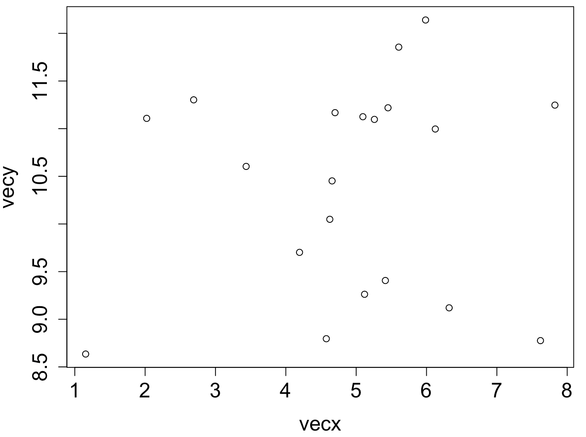
</div>

For the rest of this chapter, the `pdf()` and `dev.off()` calls are not specified in code examples.

We can give the `plot()` function a hint about the type of plot we want by using the `type =` parameter, setting it to `"p"` for points, `"l"` for lines, `"b"` for both, and so on. For basic vector plotting like the above, `plot()` respects the order in which the data appear. Here's the output of `plot(vecx, vecy, type = "l")`:

<div class="fig center" style="width: 100%">
  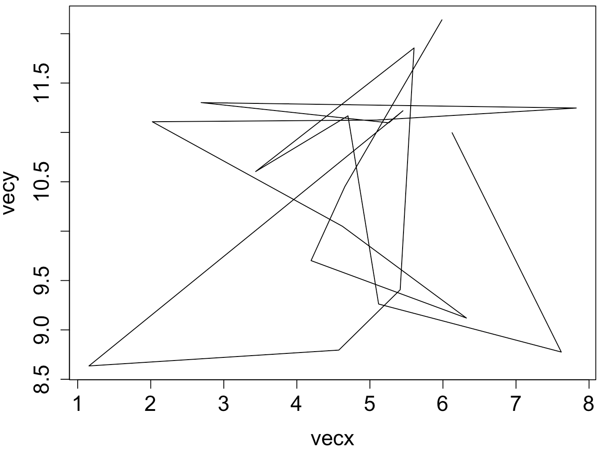
</div>

We would have had to sort one or both input vectors to get something more reasonable, if that makes sense for the data.

Other plotting functions like `hist()`, `curve()`, and `boxplot()` can be used to produce other plot types. Some plot types (though not all) can be added to previously plotted results as an additional layer by setting `add = TRUE`. For example, we can produce a dotplot of two random vectors, along with a histogram with normalized bar heights by using `hist()` with `probability = TRUE` and `add = TRUE`.

<pre id=part3-11-base_r_dotplot_hist_add
     class="language-r
            line-numbers
            linkable-line-numbers">
<code>
vecx <- rnorm(100, mean = 5, sd = 2)
vecy <- rnorm(100, mean = 0.5, sd = 0.2)
plot(vecx, vecy)
hist(vecx, probability = TRUE, add = TRUE)
</code></pre>

<div class="fig center" style="width: 100%">
  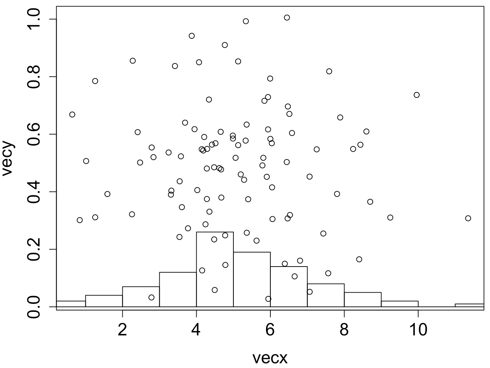
</div>

A plot like this will only look reasonable if the axes ranges are appropriate for both layers, which we must ensure ourselves. We do this by specifying ranges with the `xlim =` and `ylim =` parameters in the call to `plot()`, specifying length-two vectors.

<pre id=part3-11-base_r_dotplot_hist_add_limits
     class="language-r
            line-numbers
            linkable-line-numbers">
<code>
vecx <- rnorm(100, mean = 5, sd = 2)
vecy <- rnorm(100, mean = 0.5, sd = 0.2)
plot(vecx, vecy, xlim = c(-4, 14), ylim = c(0, 1))
hist(vecx, probability = TRUE, add = TRUE)
</code></pre>

<div class="fig center" style="width: 100%">
  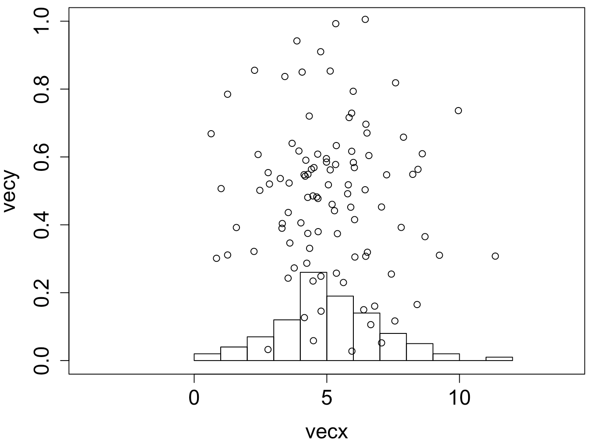
</div>

There are a number of hidden rules here. For example, `plot()` must be called before `hist()`, as `add = TRUE` isn't accepted by the `plot()` function. Although `hist()` accepts `xlim` and `ylim` parameters, they are ignored when `hist()` is used with `add = TRUE`, so they must be specified in the `plot()` call in this example. There are many individual plotting functions like `plot()` and `hist()`, and each takes dozens of parameters with names like `"las"`, `"cex"`, `"pch"`, and `"tck"` (these control the orientation of y-axis labels, font size, dot shapes, and tick-mark size, respectively). Unfortunately, the documentation of all of these functions and parameters oscillates between sparse and confusingly complex, though there are a number of books dedicated solely to the topic of plotting in R.

Despite its complexities, one of the premier benefits of using `plot()` is that, as a generic, the plotted output is often customized for the type of input. As an example, let's quickly create some linearly dependent data and run them through the `lm()` linear modeling function.

<pre id=part3-11-base_r_plot_lm
     class="language-r
            line-numbers
            linkable-line-numbers">
<code>
vecx <- rnorm(100, mean = 10, sd = 2)
vecy <- 2 * vecx + rnorm(100, mean = 1, sd = 1)
lm_result <- lm(vecy ~ vecx)
plot(vecx, vecy)
plot(lm_result)
</code></pre>

If we give the `lm_result` (a list with class attribute `"lm"`) to `plot()`, the call will be dispatched to `plot.lm()`, producing a number of plots appropriate for linear model parameters and data. The first of the five plots below was produced by the call to `plot(vecx, vecy)`, while the remaining four are plots specific to linear models and were produced by the single call to `plot(lm_result)` as a multipage PDF file.

<div class="fig center" style="width: 100%">
  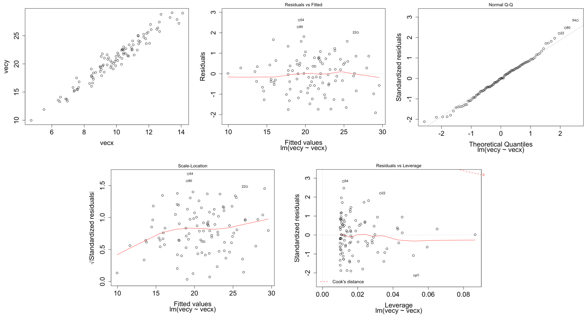
</div>

### Overview of ggplot2 and Layers {-}

As mentioned previously, the `ggplot2` package seeks to simplify the process of plotting while still providing a large amount of flexibility and power by implementing a "grammar" of graphical construction. Given this structure, we're going to have to start by learning some (more) specialized vocabulary, followed by some (more) specialized syntax. There are several ways of interacting with `ggplot2` of various complexity. We'll start with the most complex first, to understand the structure of the grammar, and then move on to simpler methods that are easier to use (once framed in terms of the grammar).

Unlike the generic `plot()` function, which can plot many different types of data (such as in the linear model example above), `ggplot2` specializes in plotting data stored in data frames.

A "plot" in `ggplot2` is made up of the following components:

###### {- #layers}

1. One or more *layers*, each representing how some data should be plotted. Plot layers are the most important pieces, and they consist of five subparts:

    a. The `data` (a data frame), which contains the data to plot.
    b. A `stat`, which stands for "statistical mapping." By default, this is the `"identity"` stat (for no modification) but could be some other mapping that processes the `data` data frame and produces a new data set that is actually plotted.
    c. A `geom`, short for "geometric object," which specifies the shape to be drawn. For example, `"point"` specifies that data should be plotted with points (as in a dotplot), `"line"` specifies that data should be plotted with lines (as in a line plot), and `"bar"` specifies that data should be plotted with bars (as in a histogram).
    d. A `mapping` of "aesthetics," describing how properties of the `geom` (e.g., `x` and `y` position of points, or their `color`, `size`, and so on) relate to columns of the `stat`-transformed data. Each `geom` type cares about a specific set of aesthetics, though many are common.
    e. A `position` for the `geom`; usually, this is `"identity"` to suggest that the position of the `geom` should not be altered. Alternatives include `"jitter"`, which adds some random noise to the location (so overlapping `geom` shapes are more easily viewable).
2. One `scale` for each aesthetic used in layers. For example, each point's `x` value occurs on a horizontal scale that we might wish to limit to a given range, and each point's `color` value occurs on a color scale that we might wish to range from purple to orange, or black to blue.
3. A `facet` specification, describing how paneling data across multiple similar plots should occur.

<div class="fig right" style="width: 30%; margin-left: 20px">
  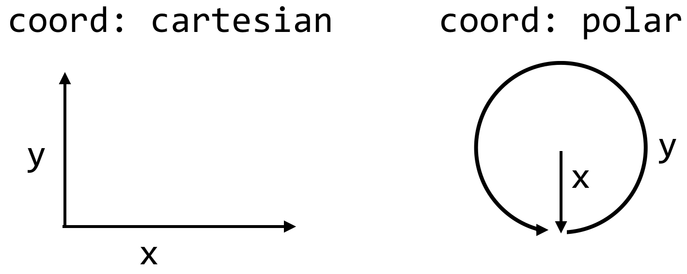
</div>

4. A `coordinate` system to which to apply some scales. Usually, we won't modify these from the defaults. For example, the default for `x` and `y` is to use a `cartesian` coordinate system, though `polar` is an option.
5. Some `theme` information, such as font sizes and rotations, axis ticks, aspect ratios, background colors, and the like.
6. A set of defaults. Defaults are an odd thing to list as a specific part of a plot, as these are the properties we *don't* specify, but `ggplot2` makes heavy use of them, so they are worth mentioning.

When installed with `install.packages("ggplot2")` (in the interactive console) and loaded with `library(ggplot2)`, the package comes with a data frame called `diamonds`. Each row of this data frame specifies some information about a single diamond; with about 54,000 rows and many types of columns (including numeric and categorical), it is an excellent data set with which to explore plotting.

<pre id=part3-11-head_diamonds
     class="language-r
            line-numbers
            linkable-line-numbers">
<code>
library(ggplot2)
print(head(diamonds))
</code></pre>

<pre id=part3-11-head_diamonds_out
     class="language-txt
            line-numbers
            linkable-line-numbers">
<code>
  carat       cut color clarity depth table price    x    y    z
1  0.23     Ideal     E     SI2  61.5    55   326 3.95 3.98 2.43
2  0.21   Premium     E     SI1  59.8    61   326 3.89 3.84 2.31
3  0.23      Good     E     VS1  56.9    65   327 4.05 4.07 2.31
4  0.29   Premium     I     VS2  62.4    58   334 4.20 4.23 2.63
5  0.31      Good     J     SI2  63.3    58   335 4.34 4.35 2.75
6  0.24 Very Good     J    VVS2  62.8    57   336 3.94 3.96 2.48
</code></pre>

Let's start by exploring the most important concept in the list of definitions above: the layer and its five components. To create a layer, we can start by creating an "empty" `gg` object by calling `ggplot()` with no parameters. To this we'll add a layer with `+` and calling the `layer()` function, specifying the five components we want.^[Given the information in previous chapters on objects, you might have guessed that the type of object returned by `ggplot()` is a list with class attribute set, where the class is set to `"gg"` and `"ggplot"`. Further, a specialized ```+.gg`()`` method is defined for objects of the `"gg"` class, and `+` is not just syntactic sugar for `` `+`()``, but also a generic function that is dispatched!] Because these plotting commands become fairly long, we break them up over multiple lines (ending broken lines with `+` or `,` to let the interpreter know the command isn't finished) and indent them to help indicate where different pieces are contributing.

<pre id=part3-11-first_layer
     class="language-r
            line-numbers
            linkable-line-numbers">
<code>
p <- ggplot() +
     layer(data = diamonds, 
           stat = "identity",
           geom = "point",
           mapping = aes(x = carat, y = price, color = cut),
           position = "identity")
plot(p)
</code></pre>

<div class="fig center" style="width: 100%">
  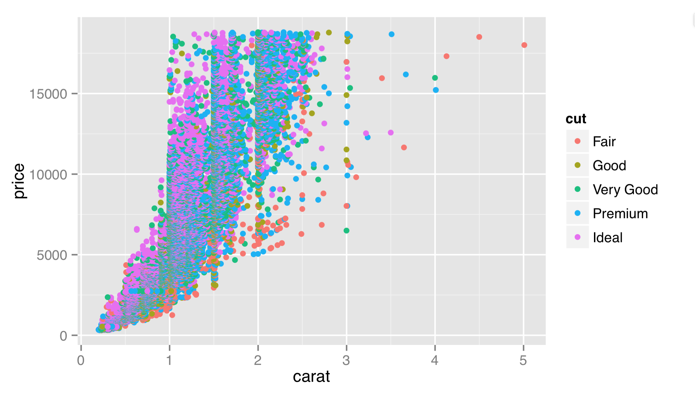
</div>

Here, we've specified each of the five layer components described above. For the `mapping` of aesthetics, there is an internal call to an `aes()` function that describes how aesthetics of the geoms (`x`, `y`, and `color` in this case) relate to columns of the `stat`-adjusted `data` (in this case, the output columns from the stat are identical to the input columns).^[If you are reading this in black-and-white, then you'll have to trust that the colors differentiate the points. Later we'll discuss the importance of choosing color schemes that work in both grayscale and for colorblind readers, though we haven't covered the code concepts yet to do so.] Finally, we note that `ggplot2` has seamlessly handled the categorical column of `cut`.

To save the result to a file or when not working in a graphical interface, we can use the `pdf()` function before the call to `plot()` followed by `dev.off()`, as we did for the Base-R graphics. Alternatively, we can use the specialized `ggsave()` function, which also allows us to specify the overall size of the plot (in inches at 300 dpi by default for PDFs).

<pre id=part3-11-ggsave
     class="language-r
            line-numbers
            linkable-line-numbers">
<code>
ggsave("diamond_layer1.pdf", p, width = 7, height = 4)
</code></pre>

Let's add a layer to our plot that will also plot points on the `x` and `y` axes, by `carat` and `price`. This additional layer, however, will use a `"smooth"` stat, and we won't color the points. (In recent versions of `ggplot2`, this layer example also requires a `params = list(method = "auto")` which sets the stat's smoothing method. Below we'll see how to write more compact code with this and other parameters set automatically.)

<pre id=part3-11-ggplot_layer_2smooth
     class="language-r
            line-numbers
            linkable-line-numbers">
<code>
p <- ggplot() +
     layer(data = diamonds, 
           stat = "identity",
           geom = "point",
           mapping = aes(x = carat, y = price, color = cut),
           position = "identity") +
     layer(data = diamonds,
           stat = "smooth",
           geom = "point",
           mapping = aes(x = carat, y = price),
           position = "identity")
</code></pre>

<div class="fig center" style="width: 100%">
  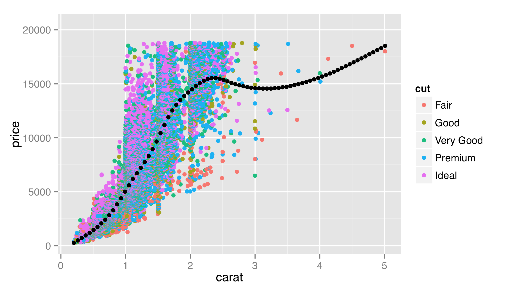
</div>

In this case, the original data have been transformed by the `"smooth"` stat, so `x = carat, y = price` now specifies the columns in the stat-transformed data frame. If we were to switch this layer's `geom` to `"line"`, we would get a plot like below on the left, and if we add a `color = cut` in the `aes()` call, we would get a plot like below on the right.

<div class="fig center" style="width: 100%">
  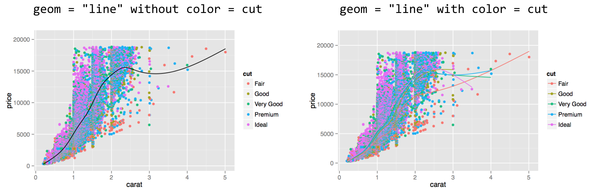
</div>

In the right plot above, multiple lines have been created; they are a bit difficult to see, but we'll see how to fix that in a bit. Note that the order of the layers matters: the second layer was plotted on *top* of the first.

This second layer illustrates one of the more confusing aspects of `ggplot2`, namely, that aesthetic mappings (properties of geoms) and stat mappings interact. In the second layer above, we specified `aes(x = carat, y = price)`, but we also specified the `"smooth"` stat. As a consequence, the underlying data representing `carat` and `price` were modified by the stat, and the stat knew which variables to smooth on the basis of this aesthetic mapping.

For a second example, let's look at the `"bin"` stat and the `"bar"` geom, which together create a histogram. The `"bin"` stat checks the `x` aesthetic mapping to determine which column to bin into discrete counts, and also creates some entirely new columns in the stat-transformed data, including one called `..count..`. The extra dots indicate to the user that the column produced by the stat is novel. The `"bar"` geom pays attention to the `x` aesthetic (to determine each bar's location on the horizontal axis) and the `y` aesthetic (to determine each bar's height).

<pre id=part3-11-ggplot_bin_bar
     class="language-r
            line-numbers
            linkable-line-numbers">
<code>
p <- ggplot() +
     layer(data = diamonds,
           stat = "bin",
           geom = "bar",
           mapping = aes(x = carat, y = ..count..),
           position = "identity")
</code></pre>

The result of plotting the above is shown below on the left. To complete the example, below on the right shows the same plot with `geom = "point"`. We can easily see that the stat-transformed data contain only about 30 rows, with columns for bin centers (`carat` mapped on `x`) and counts (`..count..`). The `"bin"` stat also generates a `..density..` column you can explore.

<div class="fig center" style="width: 100%">
  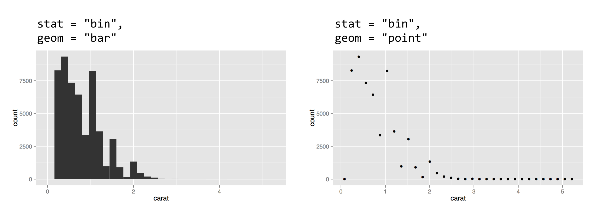
</div>

### Smart Defaults, Specialized Layer Functions {-}

Most of us are probably familiar with the standard plot types: histograms, fitted-line plots, scatterplots, and so on. Usually, the statistical mapping used will determine the common plot type and the geom to use. For example, a binning statistic likely goes with a bar geom to produce a histogram, and the point geom is most commonly paired with the identity statistic. (In fact, in older versions of `ggplot2`, if a stat or `geom` was unspecified in the call to `layer()`, a default was used on the basis of the other. Newer versions require both `geom =` and `stat =` to be specified when calling `layer()`.) Similarly, when a binning statistic is used, the `y` aesthetic mapping defaults to `..count..` if unspecified.

Because it is so common to specify a plot by specifying the statistical mapping to use, `ggplot2()` provides specialized layer functions that effectively move the specification of the stat to the function name and use the default geom (though it can still be changed). Similarly, we often wish to specify a plot by the geom type and accept the default stat for that geom (though, again, this can be changed by adding a `stat =` parameter.) Here are two more ways to plot the left histogram above:

<pre id=part3-11-ggplot_hist_bar_bin
     class="language-r
            line-numbers
            linkable-line-numbers">
<code>
p <- ggplot() + stat_bin(data = diamonds, mapping = aes(x = carat))
p <- ggplot() + geom_histogram(data = diamonds, mapping = aes(x = carat))
</code></pre>

(There is a `geom_bar()` layer function, but its default is not the binning statistic; hence the alternative `geom_histogram()`.) To reproduce the plot above on the right, we could use `stat_bin(data = diamonds, mapping = aes(x = carat), geom = "point")`.

With so many defaults being set, the plotting commands can become quite small. These specialized layer functions represent the most commonly used methods for plotting in `ggplot2`, being both flexible and quick.

Another example of defaults being set is the `geom_boxplot()` layer function, which uses a `"boxplot"` geom (a box with whiskers) and a default `"boxplot"` stat. The boxplot geom recognizes a number of aesthetics for the various pieces that position the box and whiskers, including `x`, `y`, `middle`, `upper`, `lower`, `ymin`, and `ymax`. Fortunately, most of these required values are created by the boxplot stat and set accordingly (much like the `y` aesthetic defaults to `..count..` for histograms); only the `x` and `y` aesthetics are required to determine the others.

<pre id=part3-11-ggplot_boxplot
     class="language-r
            line-numbers
            linkable-line-numbers">
<code>
# default stat chosen by geom, many aesthetics autoset accordingly
p <- ggplot() + geom_boxplot(data = diamonds,
                             mapping = aes(x = color, y = price))
</code></pre>

<div class="fig center" style="width: 100%">
  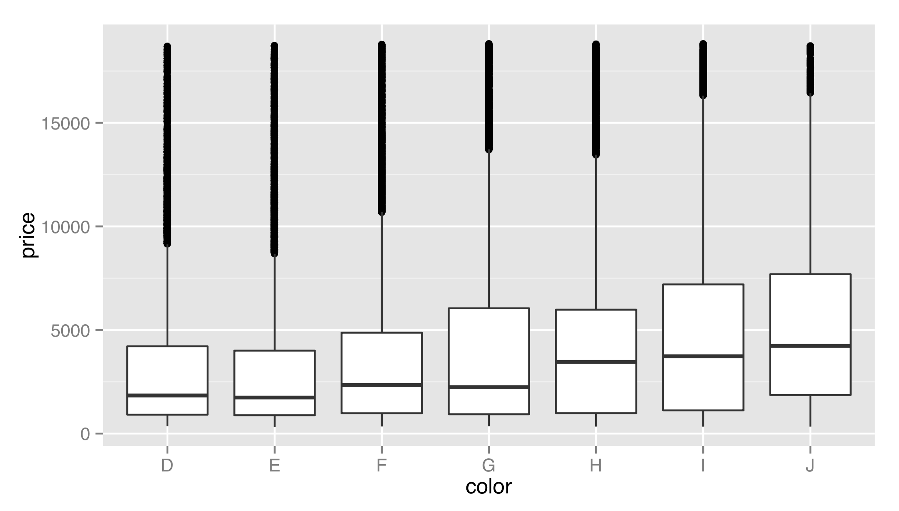
</div>

We've mapped a discrete variable to `x` and a continuous variable to `y` — a boxplot would make considerably less sense the other way around! There is also a corresponding `stat_boxplot()` layer function, which specifies the stat and uses the default corresponding geom (boxplot).

So far, we've been individually specifying the `data =` and `mapping =` parameters for each layer. It is common to see them set only once in the call to `ggplot()`, in which case they are inherited for all subsequent layers. We can also leave off the `data =` and `mapping =` names if we first specify the data.

<pre id=part3-11-ggplot_more_defaults
     class="language-r
            line-numbers
            linkable-line-numbers">
<code>
# data and default mappings set in call to ggplot()
p <- ggplot(diamonds, aes(x = carat, y = price)) +
     geom_point(aes(color = cut)) +
     geom_smooth()
</code></pre>

<div class="fig center" style="width: 100%">
  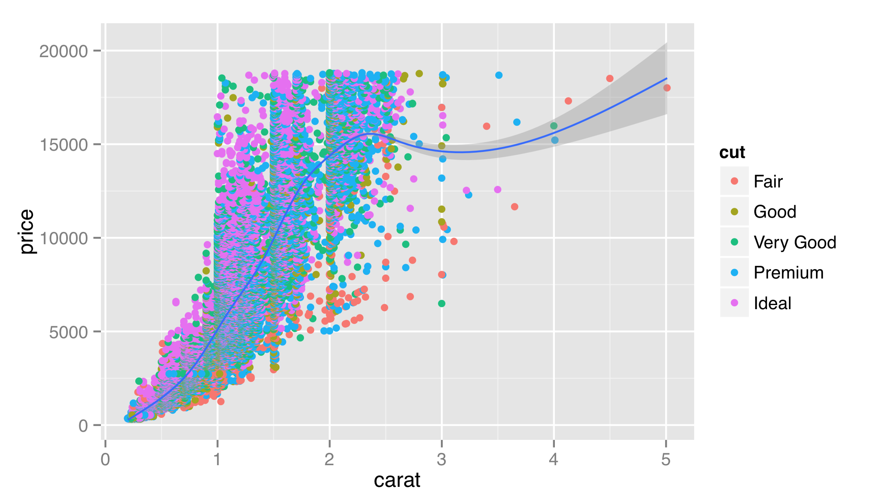
</div>

Most users of `ggplot2` prefer to utilize many of these "fall-through" settings and defaults, though we'll specify all data and mappings for each layer for clarity. (And yes, different layers can use different data frames for their `data =` parameter.)

There are many specialized layer functions for specific stats and geoms. Documentation for them and other features of `ggplot2` can be found at [https://ggplot2.tidyverse.org/](https://ggplot2.tidyverse.org/).

<div class="exercises">

#### Exercises {-}

1. Use the Base-R `plot()` function to produce a PDF plot that looks like the following:

    <div class="fig center" style="width: 100%">
    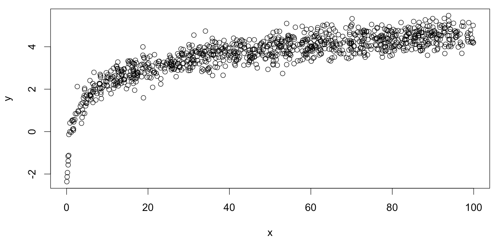
    </div>

    There are 1,000 *x* values randomly (and uniformly) distributed between 0 and 100, and the *y* values follow a curve defined by the `log()` of *x* plus some random noise.

2. R's `hist()` function is a convenient way to produce a quick histogram. Try running `hist(rnorm(1000, mean = 0, sd = 3))`. Read the help for `hist()` to determine how to increase the number of "bins."

3. Use the `layer()` function in `ggplot2` to produce a histogram of diamond prices. Next, try using `geom_histogram()` and `stat_bin()`. For these latter plots, try changing the number of bins from the default of 30.

4. Try creating a dotplot of diamonds (point geom, identity stat) using `layer()` with `x` mapped to `color` and `y` mapped to `price`. What happens when you change the `position` to `"jitter"`? Next, add a boxplot layer on top of this dotplot layer.

</div>

### More Aesthetics and Mathematical Expressions {-}

The `geom_point()` layer function deserves some special attention, not only because scatterplots are a particularly useful plot type for data exploration, but also because we can use it to illustrate more features of the `ggplot2` package. Unfortunately, scatterplots tend to suffer from "overplotting" issues when the number of data points is large, as in previous examples. For now, we'll get around this issue by generating a random subset of 1,000 diamonds for plotting, placing the sample in a data frame called `dd`.

<pre id=part3-11-ggplot_diamonds_subsample
     class="language-r
            line-numbers
            linkable-line-numbers">
<code>
dd <- diamonds[sample(seq(1, nrow(diamonds)), 1000), ]
</code></pre>

First, the `geom_point()` layer accepts a number of aesthetics that might be useful in other situations as well.

<pre id=part3-11-ggplot_points_too_many_aesthetics
     class="language-r
            line-numbers
            linkable-line-numbers">
<code>
p <- ggplot() +
     geom_point(data = dd, 
                mapping = aes(x = carat,
                              y = depth,
                              color = price/carat,
                              size = table,
                              alpha = cut))
</code></pre>

<div class="fig center" style="width: 100%">
  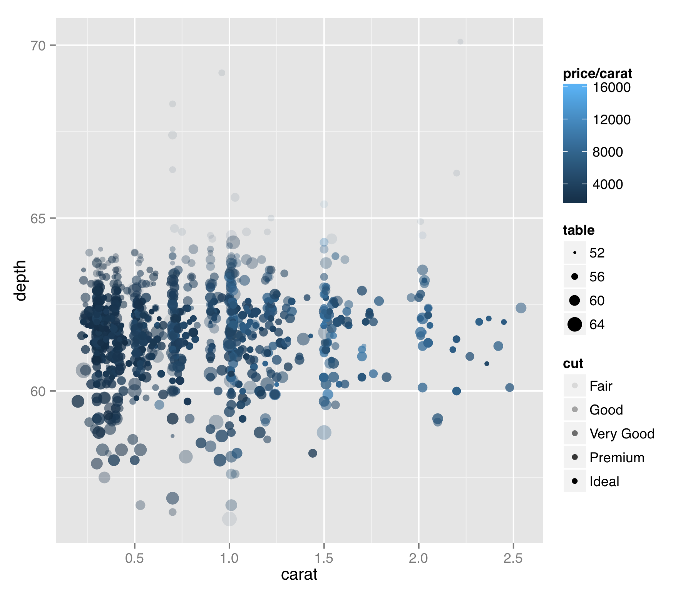
</div>

The result is probably too many aesthetics to map to values from the data, but sometimes for exploratory purposes (rather than publication), this isn't a bad thing. In this plot we can see a few interesting features of the data:
1. Diamonds are usually cut to carat sizes that are round numbers (0.25, 0.5, 1.0, etc.).
2. The price per carat (mapped to color) is generally higher for larger diamonds. This means that not only are larger diamonds more expensive, but they are also more expensive on a per carat basis (they are rarer, after all).
3. Although it's a bit difficult to see in this plot, it appears that points with the best cut (mapped to alpha, or "transparency") are also of intermediate depth (mapped to the *y* axis). Or, at the very least, outliers in depth tend to have poorer "cut" values.

This plot also illustrates that aesthetics can generally be mapped to continuous or discrete data, and `ggplot2` will handle the data with grace. Further, we can specify the data as mathematical expressions of the columns in the input data frame (or even other data), as we did with `color = price/carat`. Doing so allows us to explore data sets in a powerful and flexible way. We could quickly discretize the price per carat by setting `color = price/carat > 5000`, for example, or we could reduce the range of these values by plotting with `color = log(price/carat)`. In the subsection on scales, however, we'll see that `ggplot2` contains some friendly features for plotting data on log-adjusted and similar scales.

Because this plot is far too busy, let's fix it by removing the alpha and size mapping, remembering the possibility of a relationship between cut and depth for future exploration. We'll also add a layer for a smoothed fit line.

<pre id=part3-11-ggplot_diamonds_carat_depth
     class="language-r
            line-numbers
            linkable-line-numbers">
<code>
p <- ggplot() +
     geom_point(data = dd,
                mapping = aes(x = carat,
                              y = depth,
                              color = price/carat)) +
     stat_smooth(data = dd, 
                 mapping = aes(x = carat,
                               y = depth))
</code></pre>

<div class="fig center" style="width: 100%">
  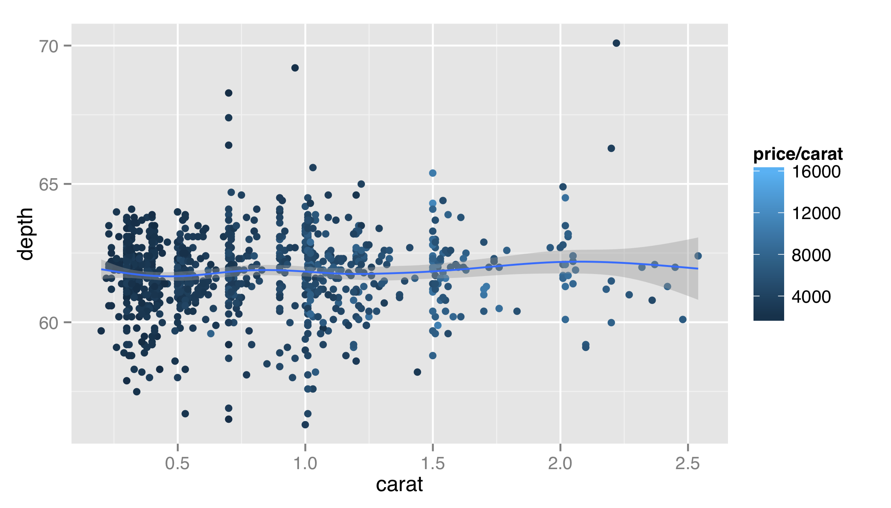
</div>

Layer functions like `layer()` and `geom_point()` accept additional options on top of `data`, `stat`, `geom`, and `mapping`. In this example, the first layer would look better if it were partially transparent, so that the top layer could stand out. But we don't want to map the alpha aesthetic to a property of the data — we just want it to set it to a constant for all the geoms in the layer. Thus we can set `alpha = 0.2` outside the `aes()` mapping as an option for the layer itself. Similarly, we might want our fit line to be red, and we note from the documentation that the `stat_smooth()` layer takes a method argument that can be set; `"auto"` is the default for a non-linear smooth and `"lm"` will produce a linear fit.

<pre id=part3-11-ggplot_diamonds_carat_depth_mod_layers
     class="language-r
            line-numbers
            linkable-line-numbers">
<code>
p <- ggplot() +
     geom_point(data = dd,
                mapping = aes(x = carat,
                              y = depth,
                              color = price/carat),
                alpha = 0.2) +
     stat_smooth(data = dd,
                 mapping = aes(x = carat,
                               y = depth),
                 color = "red",
                 method = "lm")
</code></pre>

<div class="fig center" style="width: 100%">
  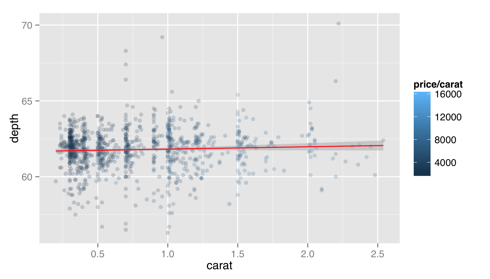
</div>

As a general note, `ggplot2` enforces that all layers share the same scales. For this reason, we would not want to plot in one layer `x = carat, y = depth` and in another `x = carat, y = price`; all of the `y` values will be forced into a single scale, and because depth ranges up to ~70 while prices range up to ~18,000, the depth values would be indiscernible. This also applies to color mappings, if multiple layers utilize them.

The `ggplot2` package enforces these rules for ease of understanding of plots that use multiple layers. For the same reasons, `ggplot2` doesn't support multiple *y* axes (i.e., a "left" *y* axis and "right" *y* axis), nor does it natively support three-dimensional plots that are difficult to read on a two-dimensional surface, like paper or a computer monitor.^[Yet we can quickly explore multidimensional data by using additional aesthetics like color, size, shape, alpha, and so on. If multiple *y* axes or three-dimensional plots are required, some other R packages can provide these features.]

### Faceting {-}

Faceting is one of the techniques that can be fairly difficult to do in other graphics packages, but is easy in `ggplot2`. Facets implement the idea of "small multiples" championed by Edward Tufte.^[Many in the data visualization community consider Tufte's books, especially *The Visual Display of Quantitative Information* (Cheshire, CT: Graphics Press, 1983), to be staples. These volumes are beautiful in their own right as examples of information presentation.] Different subsets of the data are plotted in independent panels, but each panel uses the same axes (scales), allowing for easy comparisons across panels. In `ggplot2()`, we can add a facet specification by adding another function call to the "chain" of layer functions defining the plot. Faceting is almost always done on discrete columns of the input data frame, though below are some techniques for discretizing continuous columns.

The first facet-specification function is `facet_wrap()`. It takes one required parameter, three less often used but occasionally helpful parameters, and a few more that we won't discuss here.

1. The first parameter is a formula specifying the columns of the input data frame to facet by. For `facet_wrap()`, this formula is usually of the form `~ <column>`, with no "variable" specified to the left of the `~`. If we wish to facet on all combinations of multiple input columns, we can use `~ <column_1> + <column_2> + ...`.
2. The `nrow =` parameter controls the number of rows of panels that should appear in the output.
3. The `ncol =` parameter controls the number of columns of panels that should appear in the output. (The `nrow` times `ncol` parameters should be large enough to hold all of the needed panels. By default, `nrow` and `ncol` are determined automatically.)
4. The `scales =` parameter can be set to `"fixed"` (the default), which specifies that all axes should be similarly scaled across panels. Setting this parameter to `"free_x"` allows the *x* axes to vary across panels, `"free_y"` allows the *y* axes to vary, and `"free"` allows both scales to vary. Because facets are usually designed to allow comparisons between panels, settings other than `"fixed"` should be avoided in most situations.

Returning to the dotplots of the diamonds data, recall that there appeared to be some relationship between the "cut" and "depth" of diamonds, but in the previous plots, this relationship was difficult to see. Let's plot the same thing as above, but this time facet on the cut column.

<pre id=part3-11-ggplot_diamonds_carat_depth_mod_layers_facet
     class="language-r
            line-numbers
            linkable-line-numbers">
<code>
p <- ggplot() +
     geom_point(data = dd,
                mapping = aes(x = carat,
                              y = depth,
                              color = price/carat),
                alpha = 0.2) +
     stat_smooth(data = dd,
                 mapping = aes(x = carat,
                               y = depth),
                 color = "red",
                 method = "lm") +
     facet_wrap(~ cut)
</code></pre>

<div class="fig center" style="width: 100%">
  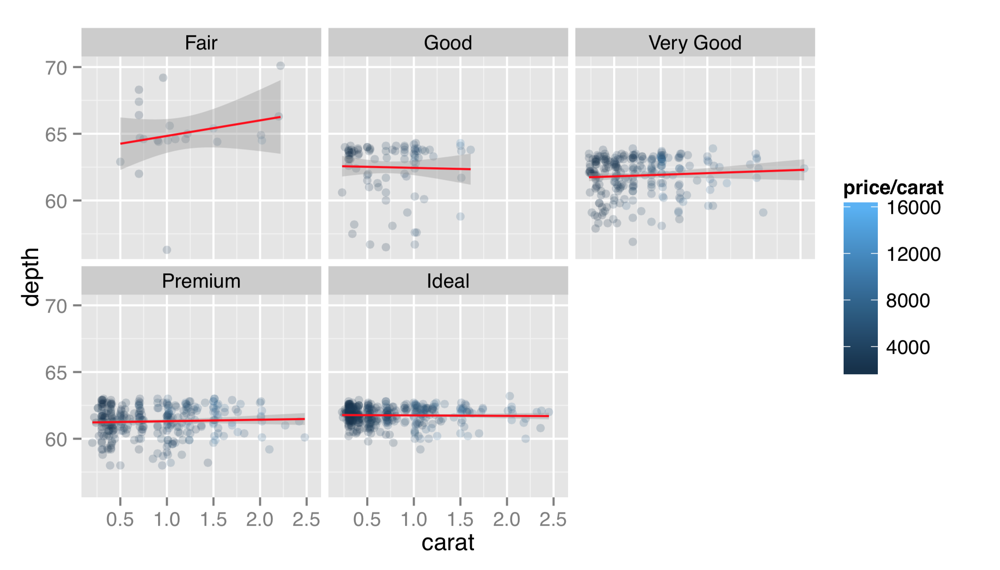
</div>

Faceting this way produces a separate panel for each cut type, all on the same axes, but anything plot-specific (such as the fit lines) are computed independently. This reveals that "ideal" cut diamonds tend to have a depth of around 62, whereas lower-quality cuts deviate from this value. To facet on cut and color, the formula would be `~ cut + color`, and a panel would be created for each cut/color combination.

The `facet_grid()` function works much like `facet_wrap()` but allows us to facet according to not one but two variables (or two combinations of multiple variables) simultaneously. One of the variables will vary across rows of panels, and the other will vary across columns. The first parameter is still a formula, but usually of the form `<column_1> ~ <column_2>`. Let's replace the `facet_wrap(~ cut)` with `facet_grid(cut ~ color)`:

<pre id=part3-11-ggplot_diamonds_carat_depth_mod_layers_facet2
     class="language-r
            line-numbers
            linkable-line-numbers">
<code>
p <- ggplot() +
     geom_point(data = dd,
                mapping = aes(x = carat,
                              y = depth,
                              color = price/carat),
                alpha = 0.2) +
     stat_smooth(data = dd,
                 mapping = aes(x = carat,
                               y = depth),
                 color = "red",
                 method = "lm") +
     facet_grid(cut ~ color)
</code></pre>

<div class="fig center" style="width: 100%">
  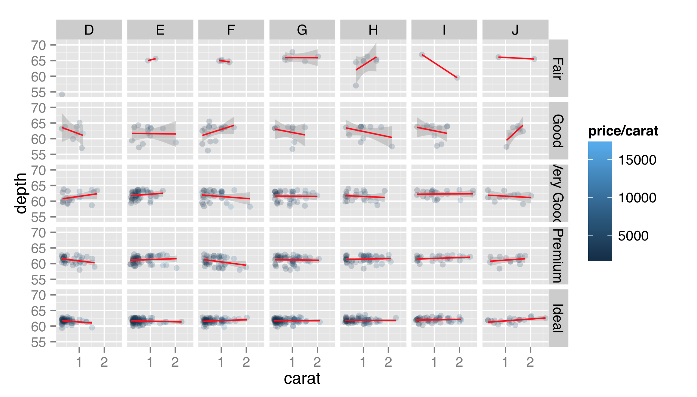
</div>

As the number of facets increases, readability can decrease, but having cut along the rows and color along the columns certainly helps reveal trends. In this facet specification, we see that "fair" diamonds are relatively rare in the data set, and the largest diamonds tend to be premium or ideal cuts in poor colors (I and J). Producing PDFs with larger dimensions in `ggsave()` can make plots with many features more readable.

Like `facet_wrap()`, `facet_grid()` can take a `scales =` parameter to allow panel *x* and *y* axes to vary, though again this isn't generally recommended, as it makes panels difficult to compare visually. The `facet_grid()` function includes another optional parameter, `margins =`, which when set to `TRUE` adds "aggregate" panels for each column and row of panels. Here's the plot with `facet_grid(cut ~ color, margins = TRUE)`:

<div class="fig center" style="width: 100%">
  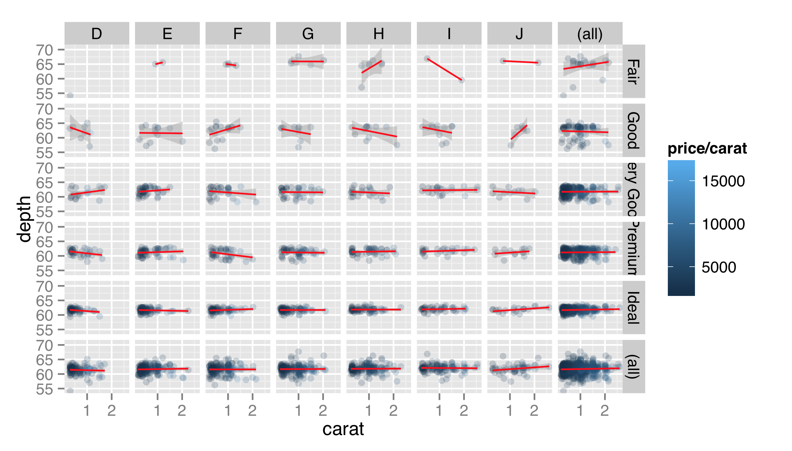
</div>

When plotting a grid of facets, we can also use a period in the specification to indicate that the grid should consist of only a single row or column of panels. While `facet_wrap()` can also produce only a single row or grid, the `margins = TRUE` option can be used with `facet_grid()` to produce a row or column while simultaneously producing an aggregate panel. Here's the same plot with `facet_grid(. ~ cut, margins = TRUE)`.

<div class="fig center" style="width: 100%">
  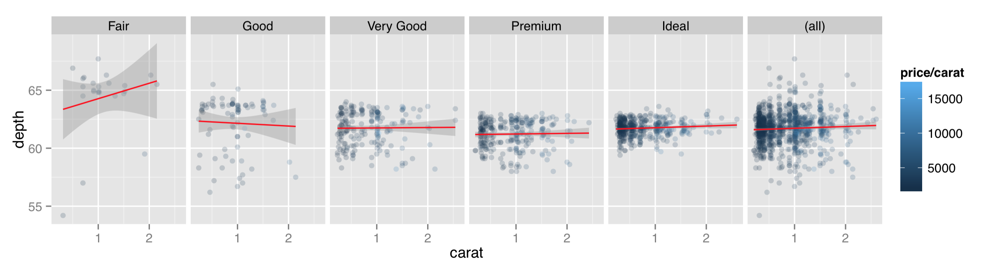
</div>

Facets are usually created for different values of categorical data. An attempt to facet over all the different values in a continuous column could result in millions of panels! (Or, more likely, a crashed instance of R.) Still, occasionally we do want to facet over continuous data by producing individual discretized "bins" for values. Consider if we wanted to facet on diamond price/carat, categorized as "high" (at least $10,000) or "low" (less than $10,000). Unfortunately, the formulas taken by `facet_wrap()` and `facet_grid()` do not allow for vectorized expressions, so `facet_wrap(~ price/carat < 10000)` won't work.

The solution is to first create a new column of the data frame before plotting, as in `dd$price_carat_low <- dd$price/dd$carat < 10000`, to create a new logical column, and then facet on the newly created column with `facet_wrap(~ price_carat_low)`.

R also includes a function called `cut()` specifically for discretizing continuous vectors into factors. The first parameter is the vector to discretize, and the second parameter is either a number of (equal-sized) bins to break the input into, or a vector of breakpoints for the bins.

<pre id=part3-11-ggplot_diamonds_carat_depth_cut
     class="language-r
            line-numbers
            linkable-line-numbers">
<code>
dd$price_per_carat_category <- cut(dd$price/dd$carat, breaks = 6)
p <- ggplot() +
     geom_point(data = dd,
                mapping = aes(x = carat,
                              y = depth,
                              color = price/carat)) +
     facet_wrap(~ price_per_carat_category)
</code></pre>

<div class="fig center" style="width: 100%">
  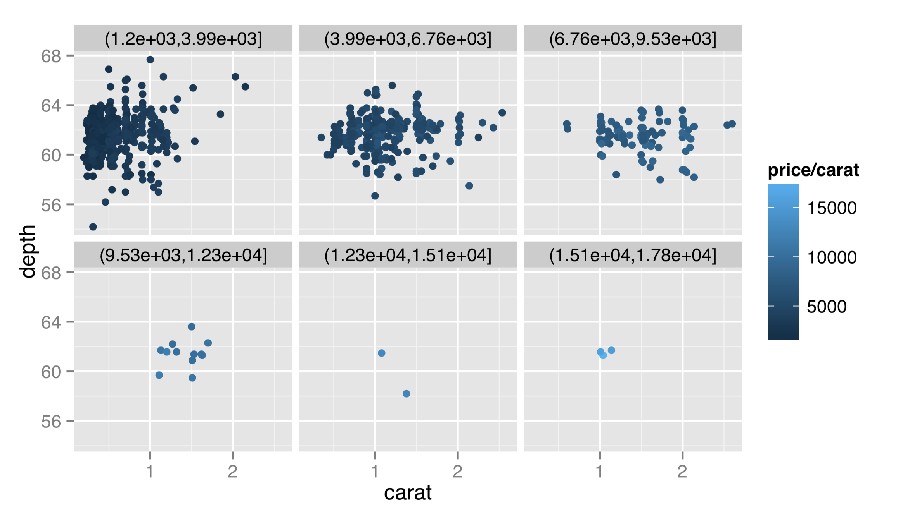
</div>

The `cut()` can take a `labels =` parameter as well, for cases when the default labels aren't sufficient.

### Scales {-}

Each aesthetic used in a plot is associated with a scale, whether it be the `x` and `y` or even `color` or `size`. For faceted plots, usually any scale adjustments are shared across facets, and for each layer in a plot, all scale properties must be shared as well. The different types of scales — continuous for `x` and `y`, color values for `color`, sizes for `size` — can all be modified to change the scale name, range, locations of breaks (or tick-marks) and labels of the breaks. There's more to say about scales than can be covered in this book, but we'll try to hit the high points.

Rather than continue plotting the diamonds data set, let's load up a data frame more biologically relevant. This table, stored in a file called [`contig_stats.txt`](data/contig_stats.txt), summarizes sequence statistics from a *de novo* genome assembly. Each row represents a "contig" from the assembly (a single sequence meant to represent a contiguous piece of the genome sequence produced from many overlapping sequenced pieces).

<div class="fig center" style="width: 100%">
  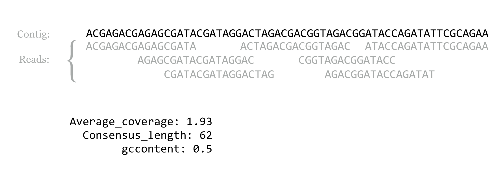
</div>

Each contig has an `Average_coverage` value, representing the average number of sequence reads covering each base in the assembled contig. These values can vary widely, potentially because of duplicated regions of the genome that were erroneously assembled into a single contig. The `Consensus_length` column indicates the length of the contig (in base pairs), and the `gccontent` column shows the percentage of G or C bases of the contig.

<pre id=part3-11-ggplot_contig_stats_table
     class="language-r
            line-numbers
            linkable-line-numbers">
<code>
ctg_stats <- read.table("contig_stats.txt",
                        header = TRUE,
                        stringsAsFactors = FALSE)
print(head(ctg_stats))
</code></pre>

<pre id=part3-11-ggplot_contig_stats_table_print
     class="language-txt
            line-numbers
            linkable-line-numbers">
<code>
      ID Average_coverage Consensus_length gccontent
1 NODE_2       49011.9000              604  0.206954
2 NODE_3         319.4400              298  0.251678
3 NODE_4         194.6960             8141  0.148508
4 NODE_5         166.2010              338  0.248521
5 NODE_6       15913.8000             2184  0.459249
6 NODE_7          76.3737             5023  0.227752
</code></pre>

Let's produce a dotplot for this data with `Average_coverage` on the `x` axis and `Consensus_length` on the `y`.

<pre id=part3-11-ggplot_contig_stats_plot1
     class="language-r
            line-numbers
            linkable-line-numbers">
<code>
p <- ggplot() +
     geom_point(data = ctg_stats, 
                mapping = aes(x = Average_coverage,
                              y = Consensus_length))
</code></pre>

<div class="fig center" style="width: 100%">
  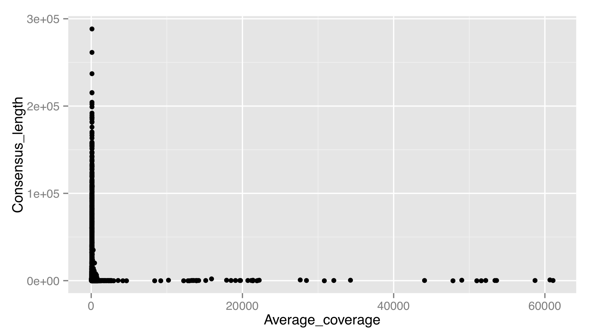
</div>

The result isn't very good. There are outliers on both axes, preventing us from seeing any trends in the data. Let's adjust the `x` scale by adding a `scale_x_continuous()`, setting `name =` to fix up the name of the scale, and using `limits =` to set the limits of the scale to `c(0, 1000)`. We'll also use the corresponding `scale_y_continuous()` to set a proper name for the *y* axis. (For discrete scales, such as in the boxplot example above, the corresponding functions are `scale_x_discrete()` and `scale_y_discrete()`.)

<pre id=part3-11-ggplot_contig_stats_plot2
     class="language-r
            line-numbers
            linkable-line-numbers">
<code>
p <- ggplot() +
     geom_point(data = ctg_stats, 
                mapping = aes(x = Average_coverage,
                              y = Consensus_length)) +
     scale_x_continuous(name = "Coverage", limits = c(0, 1000)) +
     scale_y_continuous(name = "Length")
</code></pre>

<div class="fig center" style="width: 100%">
  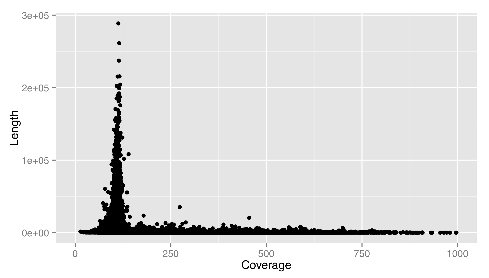
</div>

This is much better. It appears that most of the longer contigs have a coverage of about 100X. Sadly, this strategy leaves out many large data points to show the trends in the small majority. Instead, we should either log-adjust the data by plotting `aes(x = log(Average_coverage), y = Consensus_length)`, or log-adjust the scale. If we log-adjusted the data, we'd have to remember that the values are adjusted. It makes better sense to modify the scale itself, and plot the original data on the nonlinear scale. This can be done by supplying a `trans =` parameter to the scale, and specifying the name of a supported transformation function to apply to the scale as a single-element character vector. In fact, let's make both the `x` and `y` scales log-adjusted. While we're at it, we'll specify explicit break marks for the scales, as well as custom labels for those break marks.

<pre id=part3-11-ggplot_contig_stats_plot3
     class="language-r
            line-numbers
            linkable-line-numbers">
<code>
p <- ggplot() +
     geom_point(data = ctg_stats, 
                mapping = aes(x = Average_coverage,
                              y = Consensus_length)) +
     scale_x_continuous(name = "Coverage",
                        trans = "log10",
                        breaks = c(100, 1000, 10000, 100000),
                        labels = c("100", "1K", "10K", "100K")) +
     scale_y_continuous(name = "Length",
                        trans = "log10",
                        breaks = c(100, 1000, 10000, 100000),
                        labels = c("100", "1K", "10K", "100K"))
</code></pre>

The result is below left, and it looks quite good. For a flourish, we can add an `annotation_logticks(base = 10)` to get logarithmically scaled tick-marks, shown below right.

<div class="fig center" style="width: 100%">
  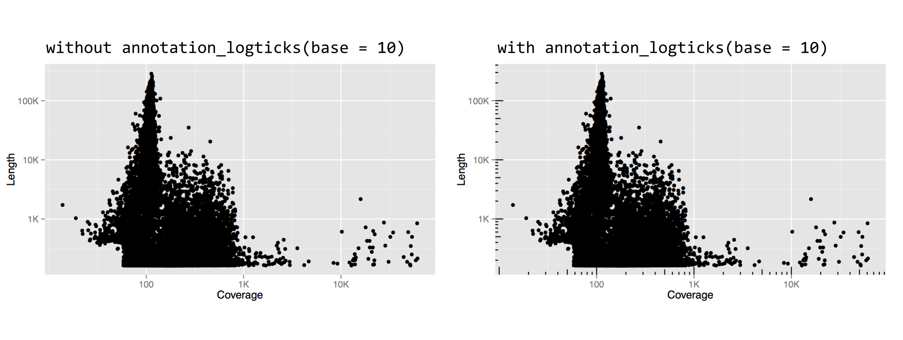
</div>

Other adjustment functions we could have used for the `trans =` parameter include `"log2"` or `"sqrt"`, though `"log10"` is a common choice with which most viewers will be familiar.

One of the issues left with our plot is that there are far too many data points to fit into this small space; this plot has an "overplotting" problem. There are a variety of solutions for overplotting, including random sampling, setting transparency of points, or using a different plot type altogether. We'll turn this plot into a type of heat map, where points near each other will be grouped into a single "cell," the color of which will represent some statistic of the points in that cell.^[These functions can be used to create heat maps, but generally the rows and columns of a heat map are orderable in different ways. Many packages are available for plotting heat maps of various sorts in R, perhaps one of the more interesting is the `NeatMap` package, which is based on `ggplot2`.]

There are two layer functions we can use for such a heat map, `stat_summary_2d()` and `stat_summary_hex()`. The former produces square cells, and the latter hexagons. (The `stat_summary_hex()` layer requires that we have the `"binhex"` package installed via `install.packages("binhex")` in the interactive console.) We'll use `stat_summary_hex()`, as it's a bit more fun. This layer function requires more than the usual number of parameters and aesthetics:

1. The `data =` data frame to plot (as usual).
2. The `mapping =` aesthetics to set via `aes()` (as usual), requiring `x`, the variable to bin by on the *x* axis; `y`, the variable to bin by on the *y* axis; and `z`, the variable to color cells by.
3. A `fun =` parameter, specifying the function to apply to the `z` values for each cell to determine the color.

This might be a bit confusing without an example, so let's replace the dotplot layer with a `stat_summary_hex()` layer plotting `x` and `y` the same way, but coloring cells by the mean `gccontent` of dots within that cell.

<pre id=part3-11-ggplot_contig_stats_plot4
     class="language-r
            line-numbers
            linkable-line-numbers">
<code>
p <- ggplot() +
     stat_summary_hex(data = ctg_stats,
                      mapping = aes(x = Average_coverage,
                                    y = Consensus_length,
                                    z = gccontent),
                      fun = mean) +
     scale_x_continuous(name = "Coverage",
                        trans = "log10",
                        breaks = c(100, 1000, 10000, 100000),
                        labels = c("100", "1K", "10K", "100K")) +
     scale_y_continuous(name = "Length",
                        trans = "log10",
                        breaks = c(100, 1000, 10000, 100000),
                        labels = c("100", "1K", "10K", "100K")) +
     annotation_logticks(base = 10)
</code></pre>

The result, below left, has cells colored by the `mean` function applied to all of the `gccontent` values (from the `z` aesthetic), but it doesn't reveal how many points are present in each cell. For this, we can use `fun = length`, which returns the number of elements in a vector rather than the mean, resulting in the plot below right.

<div class="fig center" style="width: 100%">
  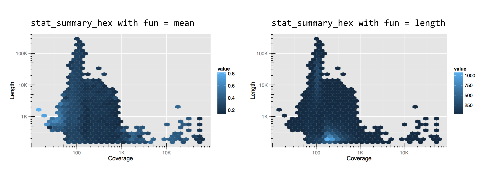
</div>

Like the `x` and `y` locations on the scales, the colors of the cells also exist on a scale. In this case, we can control it with the modifier `scale_fill_gradient()`. (Lines and other unfilled colors are controlled with `scale_color_gradient()`, and discrete color scales are controlled with `scale_fill_descrete()` and `scale_color_discrete()`.) This means that color scales can be named, transformed, and be given limits, breaks, and labels. Below, the string `"#BFBCFF"` specifies the light purple color at the top of the scale, based on the RGB color-coding scheme.

<pre id=part3-11-ggplot_contig_stats_plot5
     class="language-r
            line-numbers
            linkable-line-numbers">
<code>
p <- ggplot() +
     stat_summary_hex(data = ctg_stats,
                      mapping = aes(x = Average_coverage,
                                    y = Consensus_length,
                                    z = gccontent),
                      fun = length) +
     scale_x_continuous(name = "Coverage",
                        trans = "log10",
                        breaks = c(100, 1000, 10000, 100000),
                        labels = c("100", "1K", "10K", "100K")) +
     scale_y_continuous(name = "Length",
                        trans = "log10",
                        breaks = c(100, 1000, 10000, 100000),
                        labels = c("100", "1K", "10K", "100K")) +
     scale_fill_gradient(name = "Count",
                         trans = "log10",
                         breaks = c(1, 10, 100, 1000),
                         low = "black",
                         high = "#BFBCFF") +
     annotation_logticks(base = 10)
</code></pre>

<div class="fig center" style="width: 100%">
  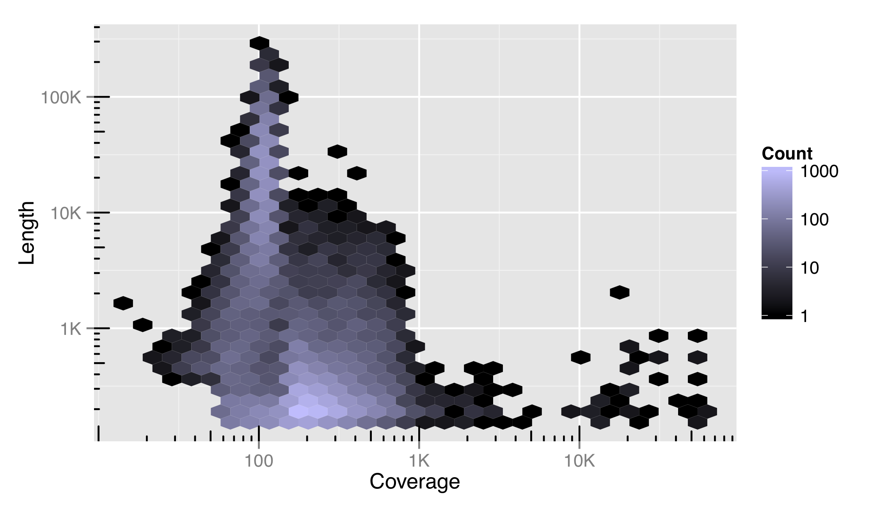
</div>

We've also included a `trans = "log10"` adjustment in this color scale, indicating that it can be transformed just as other continuous scales. Using a `log10` adjustment on a color scale may or may not be a good idea. For this data set, it more clearly illustrates the distribution of contigs in the plotted space, but makes comparisons between cells and to the legend more difficult.

<div class="callout-box">

#### The RGB Color System {-}

RBG stands for red, green, blue. Computer monitors and other digital devices display colors by the varying intensities of tiny red, green, and blue light-emitting devices. A triplet of these makes up a single pixel in the display. The RGB scheme encodes a color as `#<RR><GG><BB>`, where `<RR>` encodes the amount of red light, `<GG>` the amount of green, and `<BB>` the amount of blue. These values can range from `00` (off) to `FF` (fully on); these are numbers encoded in hexadecimal format, meaning that after `9`, the next digit is `A`, then `B`, and so on, up to `F`. (Counting from `49`, for example, the next numbers are `4A`, `4B`, . . . `4F`, `50`, `51`, etc.) Why red, green, and blue? Most humans have three types of cone cells in their eyes, and each is most responsive to either red, green, or blue light! An RGB scheme can thus represent nearly all colors that humans can see, though in the end we are limited by the gradations (`#<RR><GG><BB>` format can only take about 16.7 million different values) and the quality of the light-emitting devices (many of which can't produce very bright light or be fully turned off in operation). Color blindness is a genetic anomaly caused by having only one or two of the three cone types, and a few rare but lucky individuals possess four cone types along with greater acuity in color vision (tetrachromacy).

</div>

Something to consider when devising color scales is that not all of them are created equally—a fair percentage of viewers will have some form of color blindness, and another fair percentage of viewers will prefer to print a plot on a black-and-white printer. The `scale_color_brewer()` function helps the user select good color palettes; it is based on the work found at [colorbrewer2.org](colorbrewer2.org). Other scale types can be similarly adjusted, including alpha (transparency), and the sizes of points and lines.

### Coordinates {-}

In addition to modifying properties of the scales, we can also modify how those scales are interpreted in the overall plot and in relation to each other. Some of the coordinate modifications are less common, but others (like `coord_equal()`, below) are handy. Often, coordinate adjustments are illustrated by considering a dotplot or barplot in polar coordinates.

<pre id=part3-11-ggplot_diamonds_polar
     class="language-r
            line-numbers
            linkable-line-numbers">
<code>
p <- ggplot() +
     geom_point(data = diamonds,
                mapping = aes(x = carat,
                              y = price,
                              color = cut)) +
     coord_polar(theta = "x")
</code></pre>

<div class="fig center" style="width: 100%">
  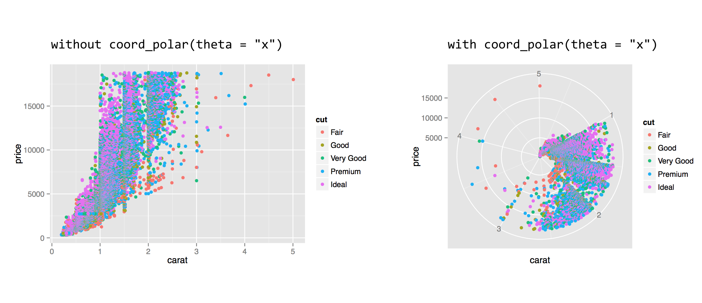
</div>

The `coord_polar()` function requires a `theta =` parameter to indicate which axis (`x` or `y`) should be mapped to the rotation angle; the remaining axis is mapped to the radius. This coordinate modification can be used to produce interesting plots, especially when the geom used is `"bar"` or `"line"`.

The `coord_flip()` function can be used to flip the `x` and `y` axes. This feature is especially useful when the desire is to produce a horizontal histogram or boxplot.

<pre id=part3-11-ggplot_diamonds_flip
     class="language-r
            line-numbers
            linkable-line-numbers">
<code>
p <- ggplot() +
     geom_bar(data = diamonds,
              mapping = aes(x = cut, fill = clarity)) +
     coord_flip()
</code></pre>

<div class="fig center" style="width: 100%">
  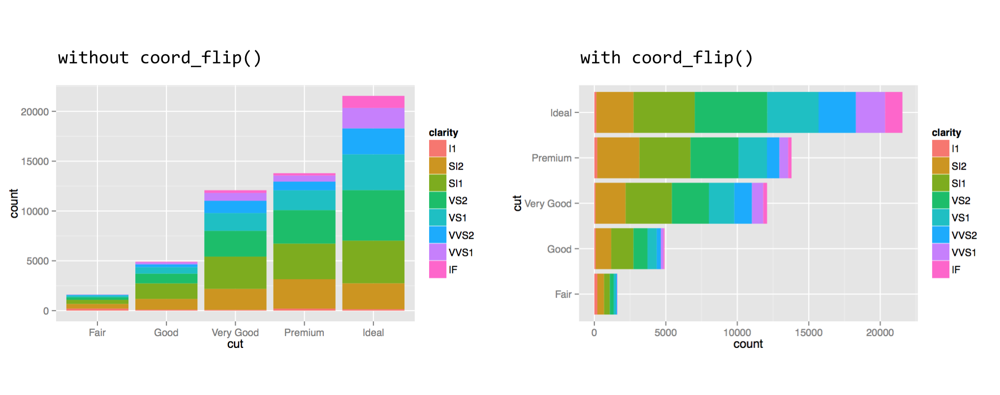
</div>

When setting the `fill` aesthetic, the subbars are stacked, which is the default. For a plot with bars presented side by side, one can add the `position = "dodge"` argument to the `geom_bar()` layer call.

For one last coordinate adjustment, the values mapped to the horizontal and vertical axes are sometimes directly comparable, but the range is different. In our random subsample of diamonds `dd`, for example, the `x` and `z` columns are both measured in millimeters (representing the "width" and "height" of the diamond), but the `z` values are generally smaller. For illustration, a single unit on the horizontal axis should be the same size as a single unit on the vertical axis, but `ggplot2` doesn't ensure such sizing by default. We can specify the size by adding a `coord_equal()` coordinate adjustment.

<pre id=part3-11-ggplot_diamonds_equal
     class="language-r
            line-numbers
            linkable-line-numbers">
<code>
p <- ggplot() +
     geom_point(data = dd,
                mapping = aes(x = x, y = z)) +
     coord_equal()
</code></pre>

<div class="fig center" style="width: 100%">
  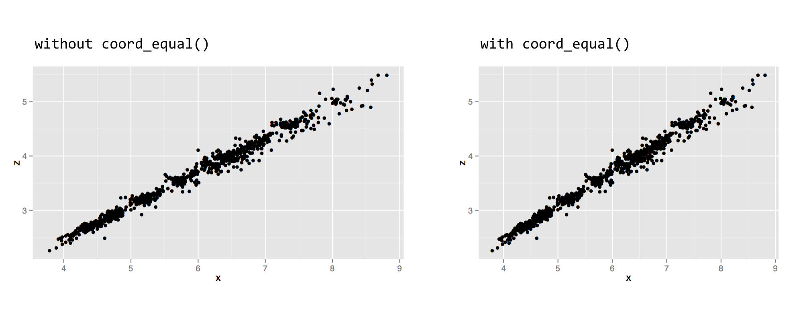
</div>

Notice that without `coord_equal()` in the above left, the axes sizes aren't quite comparable, but the grid marks are perfect squares in the above right. The `coord_equal()` adjustment can also be made with log-adjusted plots, and can sometimes produce nicer output even if the two axes aren't in the same units. Here's a comparison with and without `coord_equal()` applied to the final version of the contig length-versus-coverage plot above.

<div class="fig center" style="width: 100%">
  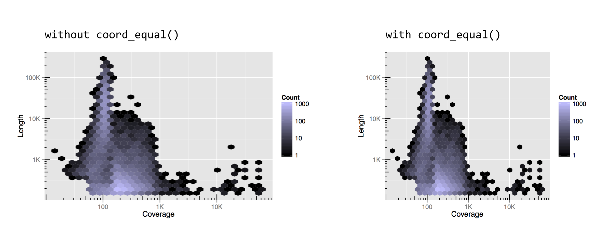
</div>

As always, there are a number of other coordinate adjustments that are possible, and we've only covered some of the most useful or interesting. See https://ggplot2.tidyverse.org/reference/index.html for the full documentation.

### Theming, Annotations, Text, and Jitter {-}

So far, we've covered customizing how data are plotted and axes/coordinates are represented, but we haven't touched on "ancillary" properties of the plot like titles, background colors, and font sizes. These are part of the "theme" of the plot, and many aspects of the theme are adjusted by the `theme()` function. The exception is the addition of a title to a plot, which is accomplished with the `ggtitle()` function.

The text-based parts of a plot are organized hierarchically (see the documentation for `theme()` for the full list). For example, modifying the `text =` parameter will modify all text elements, while modifying `axis.text =` adjusts the tick labels along both axes, and `axis.text.x =` specifies properties of only the *x*-axis tick labels. Other text-theme elements include `legend.text`, `axis.title` (for axis names), `plot.title`, and `strip.text` (for facet labels).

To adjust properties of these elements, we use a call to `element_text()` within the call to `theme()`. We can produce a quick plot counting diamonds by their cut and clarity, for example, setting a plot title and changing the overall text size to `16`, and just the title size to `20`. Shrinking text can be especially helpful for cases when facet labels or theme labels are too large to fit their respective boxes.

<pre id=part3-11-ggplot_count_theme
     class="language-r
            line-numbers
            linkable-line-numbers">
<code>
p <- ggplot() +
     geom_bar(data = dd, mapping = aes(x = clarity, fill = cut)) +
     ggtitle("Diamond Counts by Clarity and Cut") +
     theme(text = element_text(size = 16)) +
     theme(plot.title = element_text(size = 20))
</code></pre>

<div class="fig center" style="width: 100%">
  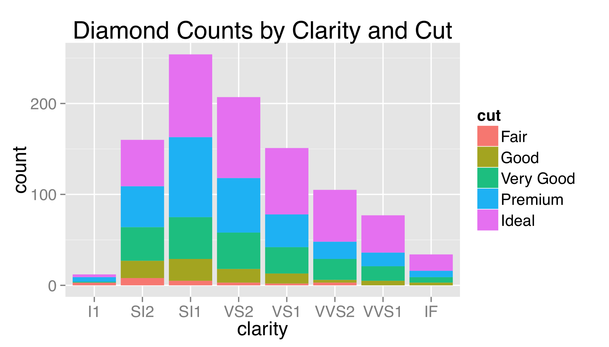
</div>

The labels used for breaks are sometimes longer than will comfortably fit on the axes. Aside from changing their size, it sometimes helps to angle them by 30 or 45 degrees. When doing so, it also looks best to set `hjust = 1` to right-justify the labels.

<pre id=part3-11-ggplot_count_theme_angle
     class="language-r
            line-numbers
            linkable-line-numbers">
<code>
p <- ggplot() +
     geom_bar(data = dd, mapping = aes(x = clarity, fill = cut)) +
     ggtitle("Diamond Counts by Clarity and Cut") +
     theme(text = element_text(size = 16)) +
     theme(plot.title = element_text(size = 20)) +
     theme(axis.text.x = element_text(angle = 45, hjust = 1))
</code></pre>

<div class="fig center" style="width: 100%">
  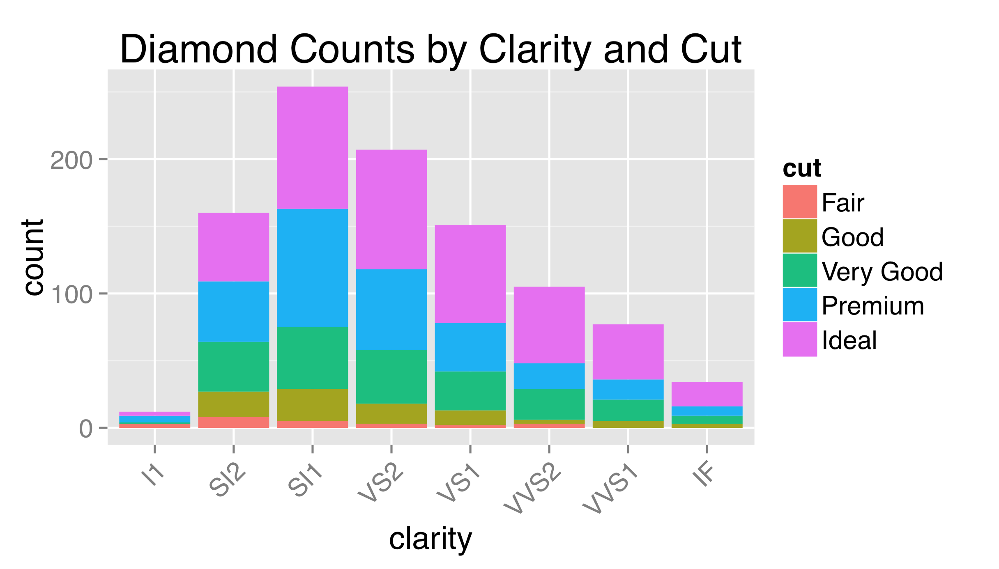
</div>

As this example might suggest, theming is itself a complex topic within `ggplot2`, and there are many options and special internal functions modifying nearly all aspects of a plot.

Although `ggsave()` accepts `width =` and `height =` parameters specifying the overall size of the output file, because these parameters include the legend and axis labels, the plotting region has its aspect ratio determined automatically. Indicating that the plotting region should take a specific aspect ratio (defined as the height of the region over the width) also occurs within a `theme()` call.

<pre id=part3-11-ggplot_count_theme_aspect
     class="language-r
            line-numbers
            linkable-line-numbers">
<code>
p <- ggplot() +
     geom_bar(data = dd, mapping = aes(x = clarity, fill = cut)) +
     ggtitle("Diamond Counts by Clarity and Cut") +
     theme(text = element_text(size = 16)) +
     theme(plot.title = element_text(size = 20)) +
     theme(axis.text.x = element_text(angle = 45, hjust = 1)) +
     theme(aspect.ratio = 1.5)
</code></pre>

<div class="fig center" style="width: 100%">
  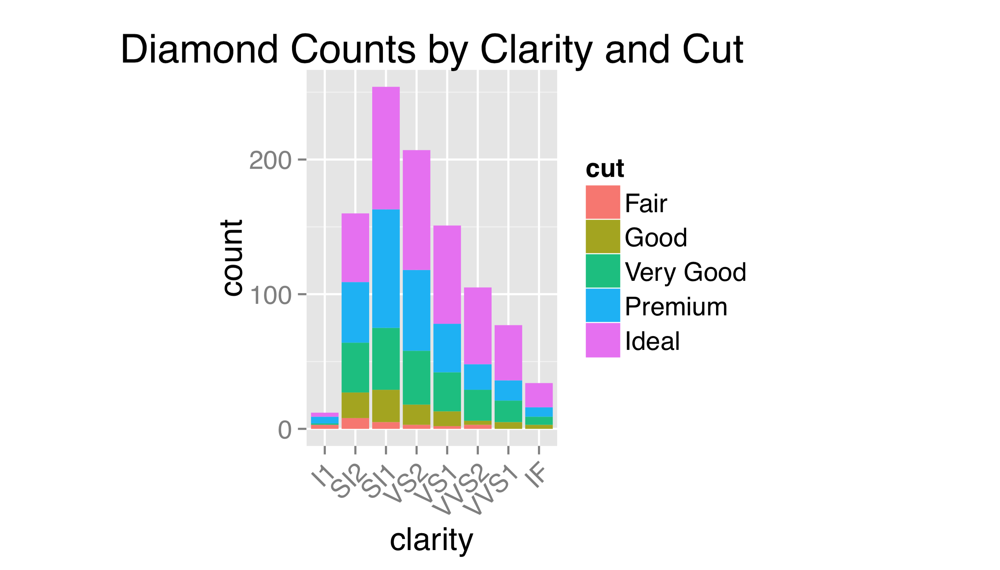
</div>

The observant reader might have noticed that, by default, all plotting regions in `ggplot2` use a light gray background. This is intentional: the idea is that a plot with a white background, when embedded into a manuscript, will leave a visual "hole," interrupting the flow of the text. The shade of gray chosen for the default background is meant to blend in with the overall shade of a column of text.

Some users prefer to use a more traditional white background, but doing so requires adjusting multiple elements, including the background itself, grid lines, and so on. So, `ggplot2` includes a number of functions that can change the overall theme, such as `theme_bw()`.

<pre id=part3-11-ggplot_points_theme_bw
     class="language-r
            line-numbers
            linkable-line-numbers">
<code>
p <- ggplot() +
     geom_point(data = dd, mapping = aes(x = price, 
                                         y = carat, color = clarity)) +
     facet_wrap(~ cut) +
     theme_bw()
</code></pre>

<div class="fig center" style="width: 100%">
  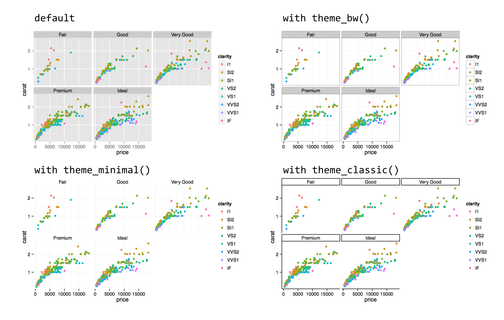
</div>

Because calls to `theme_bw()` et al. modify all theme elements, if we wish to also modify individual theme elements with `theme()`, those must be added to the chain after the call to `theme_bw()`.

One feature of `ggplot2` not yet covered is the use of text within plots, which are not theme adjustments but rather special types of plot layers. The `geom_text()` layer function makes it easy to create "dotplots" where each point is represented by a text label rather than a point. Here's an example plotting the first 30 diamonds by carat and price, labeled by their cut.

<pre id=part3-11-ggplot_geom_text
     class="language-r
            line-numbers
            linkable-line-numbers">
<code>
p <- ggplot() +
     geom_text(data = diamonds[1:30, ], 
               mapping = aes(x = carat, y = price, label = cut))
</code></pre>

In the result (below left), it's difficult to see that multiple diamonds are plotted in the same location in some cases. This type of overplotting can happen with points as well; adding a `position = "jitter"` option to the `geom_text()` layer slightly modifies the location of all the geoms so that they stand out (below right).

<div class="fig center" style="width: 100%">
  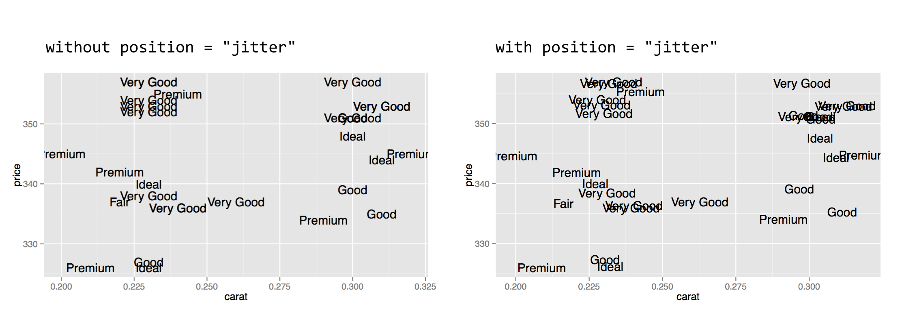
</div>

Various aesthetics of the text can be mapped to values of the data, including `size`, `angle`, `color`, and `alpha`. As with other layers, to change the font size (or other property) for all points to a constant value, the instruction should be given outside of the `aes()` call.

Individual text labels — as well as individual line segments, rectangles, points, and other geoms — can be added with an `annotate()` layer. Such a layer takes as its first argument the name of the geom that will be added, and subsequently any aesthetics that should be set for that geom (without a call to `aes()`). Here's an illustration, finishing out the previous length/coverage plot example. (The `hjust = 0` in the text annotation indicates that the text should be left-justified with respect to the reference `x` and `y`.)

<pre id=part3-11-ggplot_contigs_annotated
     class="language-r
            line-numbers
            linkable-line-numbers">
<code>
p <- ggplot() +
  stat_summary_hex(data = ctg_stats,
                   mapping = aes(x = Average_coverage,
                                 y = Consensus_length,
                                 z = gccontent),
                   fun = length) +
  scale_x_continuous(name = "Coverage",
                     trans = "log10",
                     breaks = c(100, 1000, 10000, 100000),
                     labels = c("100", "1K", "10K", "100K")) +
  scale_y_continuous(name = "Length",
                     trans = "log10",
                     breaks = c(100, 1000, 10000, 100000),
                     labels = c("100", "1K", "10K", "100K")) +
  scale_fill_gradient(name = "Count",
                      trans = "log10",
                      breaks = c(1, 10, 100, 1000),
                      low = "black",
                      high = "#BFBCFF") +
  annotation_logticks(base = 10) +
  coord_equal() +
  theme_bw() +
  annotate("rect", xmin = 80, xmax = 150,
                   ymin = 1000, ymax = 400000,
                   alpha = 0.2, fill = "red") +
  annotate("text", x = 200, y = 100000,
                   color = "darkred",
                   label = "Main Assembly Contigs", hjust = 0)
</code></pre>

<div class="fig center" style="width: 100%">
  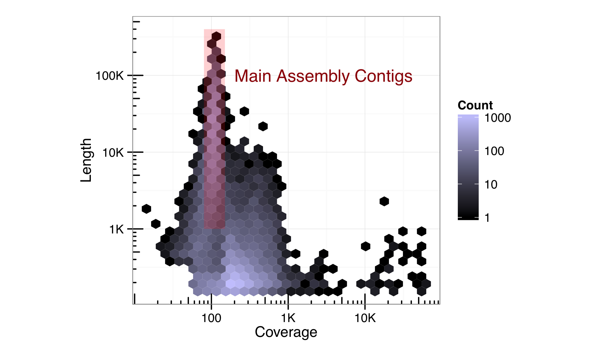
</div>

Ideally, we would strive to produce publication-ready graphics with well-documented and easily editable code. In some cases, however, adjustments or annotations are more easily added in graphical editing programs like Adobe Photoshop or Illustrator (or open-source alternatives like Inkscape), so long as the interpretation and meaning of the data are not altered.

<div class="exercises">

#### Exercises {-}

1. Use `ggplot2` to explore the [`trio.sample.vcf`](data/trio.sample.vcf) we analyzed in previous chapters. Can you effectively visualize the distribution of SNP locations across the chromosomes?

2. Running the `data()` function (with no parameters) in the interactive R console will list the built-in data sets that are available. For example, `USArrests` describes arrest statistics in US states in 1973, with columns for per-capita rates of murder, rape, and assault, and also one for percentage of state residents in urban areas (see `help(USArrests)` for details).

    First, see if you can reproduce this plot, where there is a facet for each state, and a bar for each crime type:
    
    <div class="fig center" style="width: 100%">
    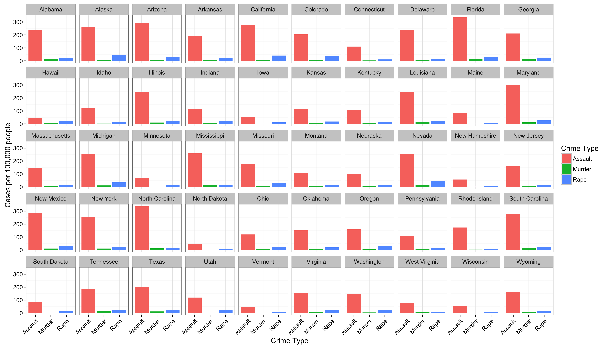
    </div>
    
    You might need to first manipulate the data by creating a column for state names (rather than using the row names) and "gathering" some of the columns with `tidyr`.

    Next, see if you can reproduce the plot, but in such a way that the panels are ordered by the overall crime rate (Murder + Rape + Assault).

3. Find at least one other way to illustrate the same data. Then, find a way to incorporate each state's percentage of population in urban areas in the visualization.

4. Generate a data set by using observation or experimentation, and visualize it!

</div>